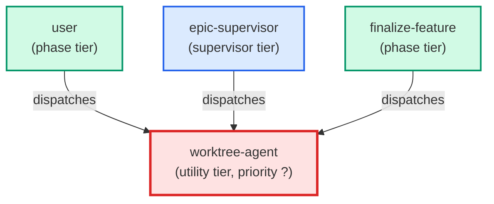

# worktree-agent

**Manages git worktree lifecycle — creates a new worktree for a feature branch
or reuses the existing epic worktree for an in-flight epic ticket; removes a
worktree after a branch merges. Create is non-destructive (no confirmation
required). Remove is destructive and requires an explicit "yes" after
displaying the safety-check report.
Use when: user types /worktree; asks to create a worktree for a branch or
ticket; asks to remove or close a worktree after a PR merges.**

| Field | Value |
|-------|-------|
| Model | haiku |
| Tier | utility |
| Priority | — |
| Portable | Yes |
| Sign-off capable | Yes |

---

## When to Use

### Spawned By

- `user`
- `epic-supervisor`
- `finalize-feature`
---

## Knowledge Flow

*No knowledge channels declared.*

---

## Spawn and Dependency

---

## Input / Output Contract

*No structured I/O contract declared.*
---

## Tools Available

| Tool |
|------|
| `Bash` |
| `Read` |
---

## Skills Used

*No skills declared.*
---

## Configuration

*No configuration keys declared.*
---

## Contributor Notes

No conditional behaviors — this agent follows a single fixed execution path
