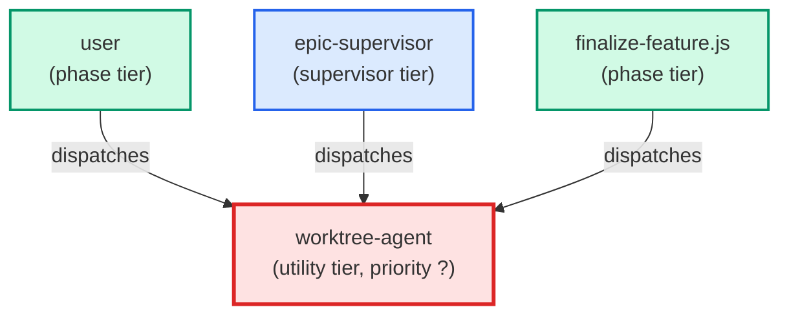

# worktree-agent

**Manages git worktree lifecycle — creates a new worktree for a feature branch
or reuses the existing epic worktree for an in-flight epic ticket; removes a
worktree after a branch merges. Create is non-destructive (no confirmation
required). Remove is destructive and requires an explicit "yes" after
displaying the safety-check report.
Use when: user types /worktree; asks to create a worktree for a branch or
ticket; asks to remove or close a worktree after a PR merges.**

| Field | Value |
|-------|-------|
| Model | haiku |
| Tier | utility |
| Priority | — |
| Portable | Yes |
| Sign-off capable | Yes |

---

## When to Use

### Spawned By

- `user`
- `epic-supervisor`
- `finalize-feature.js`
---

## Knowledge Flow

| Channel | Source | Injection Mode | Description |
|---------|--------|----------------|-------------|
| 1 | template description field | — | — |
| 3 | ticket_path from ticket-supervisor | — | — |
| 6 | project files read during execution | — | — |
| 7 | bash command output (git, build, tests) | — | — |
| 9 | agent memory store | — | — |
---

## Spawn and Dependency

---

## Input / Output Contract

### Inputs

| Name | Type | Description |
|------|------|-------------|
| `ticket_path` | file_path | Absolute path to the ticket markdown file |

### Outputs

| Name | Type | Description |
|------|------|-------------|
| `sign_off_comment` | sign_off_comment | Sign-off comment with status: ok | blocker | handoff |

### Mutates (Side Effects)

| Name | Type | Description |
|------|------|-------------|
| `ticket_frontmatter_agents_status` | — | Sets agents.worktree-agent to signed_off or failed |
| `sign_offs_checklist` | — | Checks the worktree-agent checkbox with timestamp |
---

## Tools Available

| Tool |
|------|
| `Bash` |
| `Read` |
---

## Skills Used

| Skill | Mode | Condition |
|-------|------|-----------|
| `feature` | conditional | — |
| `signoff` | always | — |
---

## Configuration

*No configuration keys declared.*
---

## Contributor Notes

### Key Behavioral Patterns

| Pattern | Trigger | Behavior | Related Agent |
|---------|---------|----------|---------------|
| Stop-and-Ask | condition requiring user decision or out-of-scope action | Do not proceed to Phase 4. | `None` |
| Conditional Behavior | the script exits non-zero | surface stderr verbatim and abort | `None` |
| Conditional Behavior | an existing epic worktree is reused (Epic Workflow branch) | report which worktree was reused and the branch it is on | `None` |
| Pre-commit Bootstrap Verification | bootstrap step completes (build.py returns, exit 0 or non-zero) | After bootstrap, probe that <worktree>/.pre-commit-config.yaml exists and resolves (is not a dangling symlink). If the probe fails, emit a structured BOOTSTRAP ERROR (AC-5) message — distinguish "build.py ran but config missing" from "build.py not found" — and do NOT claim the worktree is ready or that hooks are active. Do NOT silently continue with PRE_COMMIT_ALLOW_NO_CONFIG=1 as the default; that env-var is a last-resort documented fallback only.
 | `None` |
