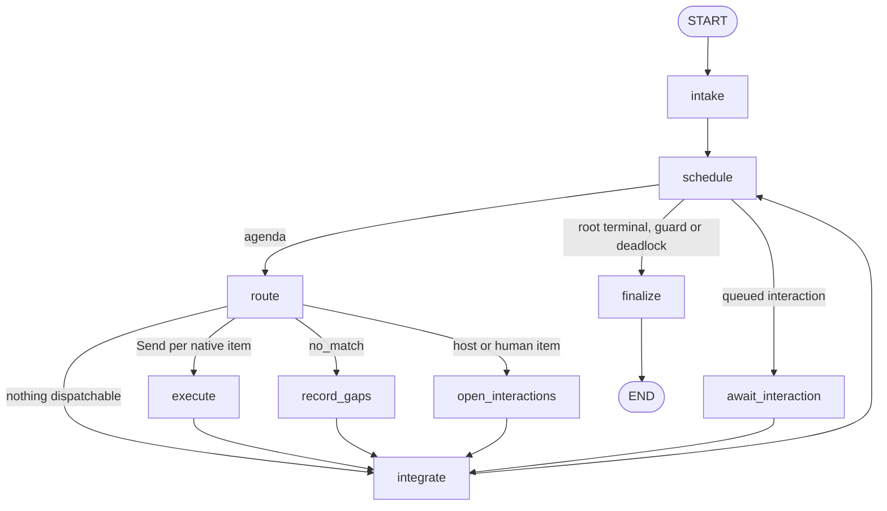

# Decision Kernel V0 Design — Part 3 of 6: Kernel scheduler

Owners: **P4** (state, graph, routing, execution, integration, finalize, guards), **P2**
(persistence), **P6** (interaction nodes), **P9** (gap node, cancellation hardening).
Spec: §8 and §13 ([spec part 4](2026-09-30-leafcutter-kernel-spec-rev3-4-scheduler-jev-capabilities.md),
[spec part 5](2026-09-30-leafcutter-kernel-spec-rev3-5-client-observability-safeguards.md)).
Back to [part 1](2026-09-30-decision-kernel-design.md).

## Installed LangGraph primitives used (verified against 1.2.12)

The design uses these LangGraph APIs:

- `StateGraph(KernelState, context_schema=KernelRuntime)`. Nodes take `runtime: Runtime[KernelRuntime]`, and the graph is invoked with `context=KernelRuntime(...)`. Runtime dependencies are therefore **never serialized** into state (spec §5.1).
- `add_conditional_edges(src, fn)`. `fn` may return a list that mixes node names and `Send(node, packet)`.
- `Command(goto=…, update=…)` for re-entering a node.
- `interrupt(value, response_schema=…)` / `Command(resume=…)`.
- `ainvoke(input, config, context=…, version="v2", durability="sync")`, which returns `GraphOutput(value, interrupts)`.
- `AsyncSqliteSaver(conn, serde=JsonPlusSerializer(allowed_msgpack_modules=ALL_MODELS))`.
- `aget_state`, `aupdate_state`.
- `config={"configurable": {"thread_id": run_id}, "recursion_limit": limits.langgraph_recursion_limit, "callbacks": tracer.langchain_callbacks(corr)}`.

## KernelState (`scheduler/state.py`)

`TypedDict(total=False)`. Every value is a contract model from part 2, or a scalar.
Map reducers merge by id and apply keys in sorted order, so a merge is deterministic whatever
order the parallel workers finish in. Only the kernel nodes write lifecycle fields
(spec §7.10).

| Key | Type | Reducer | Written by |
|---|---|---|---|
| `run_id`, `root_task_id` | str | replace | intake |
| `task` | Task | replace | intake |
| `registry` | RegistrySnapshot | replace (pinned once) | intake |
| `requests` | dict[str, Request] | merge_by_id | intake, integrate, interaction |
| `work_items` | dict[str, WorkItem] | merge_by_id (newer `updated_revision` wins) | all kernel nodes |
| `agenda` | list[str] | replace | schedule |
| `task_input`, `permissions` | TaskInput, list[str] | replace | graph input, intake (added: the run permissions are not in `Task`; constraints are read from `task_input`) |
| `dispatch` | dict | replace | route (plan for the dispatch edge: native invocation ids, interaction and gap items, worker budget shares; integrate clears it) |
| `halt_reason` | str \| None | replace | schedule (why the run stops: guard name, cancelled or deadlock) |
| `events_flushed` | int | replace | intake, schedule, finalize (events already mirrored to the run store) |
| `invocations` | dict[str, CapabilityInvocation] | merge_by_id | route/dispatch |
| `results` | dict[str, CapabilityResult] | merge_by_id | execute (Send worker), interaction |
| `routing` | dict[str, RoutingAssessment] | merge_by_id | route |
| `evidence`, `findings`, `decisions` | dict[str, …] | merge_by_id | integrate |
| `interactions` | dict[str, HostWorkRequest \| HumanQuestion] | merge_by_id | open_interactions, await_interaction |
| `interaction_queue` | list[str] | replace | open_interactions, await_interaction |
| `gaps` | dict[str, CapabilityGap] | merge_by_id | record_gaps |
| `budgets` | Budgets | replace | schedule, integrate |
| `fingerprints` | dict[str, int] | sum per key | integrate |
| `events` | list[RunEvent] | append; **`seq` is assigned in the reducer** (nodes emit seq 0), so parallel writers cannot collide | all |
| `state_revision` | int | replace (monotonic) | integrate, interaction, finalize |
| `status` | RunStatus | replace | schedule, await_interaction, finalize |
| `outcome` | RunOutcome \| None | replace | finalize |
| `trace` | TraceState (`trace_id`, `root_observation_id`) | replace | intake |

`Budgets` holds these counters:

- `work_items_created`, `jev_calls`, `host_operations`
- `active_seconds` (time spent waiting on a human or host is excluded)
- `cost_usd_known`, `cost_unknown_calls`
- `retries: dict[work_item_id, int]`
- `no_progress_streak`

`KernelRuntime` (`scheduler/context.py`, a frozen dataclass):

- `config`, `secrets`, `bindings`, `jev: JevPort`, `tracer`
- `run_store`, `gap_store`, `artifacts`
- `clock` (injectable for tests)
- `cancel_probe: Callable[[], bool]`
- `max_scheduler_iterations: int | None` (None uses `limits.max_scheduler_iterations`, then a value derived from `langgraph_recursion_limit`)

## Graph topology (`scheduler/graph.py`)



| Node | Owner | Behaviour |
|---|---|---|
| `intake` | P4 | **Idempotent**: it does nothing if `task` is set. It normalizes TaskInput into a Task and builds the root Request. The payload is `input_payload` if supplied; otherwise it is `goal_request.v1`, with kind `capability` and `requested_output_schema` taken from TaskInput. It creates the root WorkItem (status ready, depth 0), pins the registry snapshot, initializes budgets, sets `trace`, and records events. |
| `schedule` | P4 | Checks guards (below) and `cancel_probe()`. It puts ready items with satisfied dependencies on the `agenda`, sorted by (priority, created_seq), and trims the list to free capacity. Routes to `route` if the agenda is non-empty, to `await_interaction` if the queue is non-empty, otherwise to `finalize`. |
| `route` | P4 | For each agenda item without a binding: runs the eligibility filter (part 2), then makes **one** batched Jev call covering every `needs_semantic` item (part 4), then records a RoutingAssessment. Items with a binding (continuations or retries) skip routing and keep the pinned binding. Builds a `CapabilityInvocation` (input fingerprint, attempt, trace context) for every native item it dispatches. |
| dispatch edge | P4 | Returns `[Send("execute", ExecutePacket)…]` for native items, plus `"open_interactions"` for host_handoff or human items and `"record_gaps"` for `no_match` items. Outcome `unavailable` blocks the item with its reason (never a gap of type unsupported). Outcome `insufficient_context` creates a human clarification request when `routing.on_insufficient_context="human"`. |
| `execute` | P4 | **Send worker.** Resolves `bindings.resolve(binding, version)` and awaits `executor.ainvoke(invocation, ExecutionContext)` under `asyncio.wait_for(capability_timeout_seconds)`. Any exception becomes `CapabilityResult(status=failed, error{code, retryable})`. It writes **only** `results[invocation_id]`. |
| `integrate` | P4 | Validates and merges every new result in `sorted(invocation_id)` order (see below), resumes parents, updates fingerprints and `state_revision`. |
| `record_gaps` | P4 basic, P9 | Deterministic housekeeping (part 4). P4 records the gap through the `GapStorePort` and blocks the item. P9 adds rebinding to an approved `host.*` capability, drafts and dedup hardening. |
| `open_interactions` | P4 basic, P6 | Creates a HostWorkRequest or HumanQuestion, writes the packet artifact, and appends to `interaction_queue`. The item becomes waiting. The step is checkpointed before the CLI exits (§12.4). |
| `await_interaction` | P4 basic, P6 | Has no side effects before `interrupt(packet)` (§13.1). After resume it re-validates the submission; if invalid it returns `Command(goto="await_interaction")`. It converts the submission into a CapabilityResult for the owning work item and dequeues it. Only the queue head is served, so there is one host interaction at a time. |
| `finalize` | P4 | Root completion check, RunOutcome, report artifact (`report.json` + `report.md` from a template), terminal status. |

## Scheduling algorithm (spec §8.1)

| §8.1 step | Implementation |
|---|---|
| 1 | `intake` persists initial evidence (`Evidence` with category `task_context`, source kind `task_input`) and creates the root request and work item with its requested output. |
| 2 | `schedule` reserves capacity before dispatch: native items up to `max_concurrent_native`, host items up to `max_concurrent_host`. Capacity comes from `Budgets` counters. Reserving a Jev call decrements before the call. |
| 3 | `route`: eligibility filter, then Jev only for `needs_semantic`, then the binding is validated against the pinned snapshot **and** `BindingTable`. |
| 4 | Continuations and retries reuse `WorkItem.binding` and `continuation`. They are never re-routed. |
| 5 | `execute` receives only `ExecutePacket` (`invocation`, `descriptor`) plus read-only runtime dependencies. Evidence the capability needs is resolved through `ExecutionContext.evidence(ids)`. |
| 6 | `integrate` validation: output schema through the catalog; the `CapabilityResult` invariants; every cited evidence or finding id exists or is included; each proposal's kind and schemas are known; its depth is at most `max_depth`; the work-item cap holds; the result's `work_item_id` equals the invocation's. |
| 7 | Merge. Evidence is deduplicated by `(locator, content_hash)`. Request proposals get `dedup_key = fingerprint(proposal)`. An equivalent open or completed request is **linked** as a dependency instead of being duplicated. |
| 8 | `waiting`: the parent becomes waiting, stores the `Continuation`, gets `child_ids` and `dependency_ids`, and new children become ready (independent children are siblings with no mutual dependencies). |
| 9 | Resume: when every required child is terminal, the parent becomes ready with `resume_reason=children_done`. The kernel attaches `child_outcomes` to the next invocation. Supporting children are awaited but may fail. |
| 10 | Failure of a required child is passed in `child_outcomes`. A `completed` parent result is **rejected** if it cites a failed required child's output, and the item then becomes blocked. The parent may instead return `partial` or `blocked`. |
| 11 | `finalize` accepts completion only if the root item is completed, `output_schema_id == task.requested_output_schema`, no required work item is non-terminal, and the root's output passes semantic validation. A completed child never completes the root. |

A `failed` result with `error.retryable` and `retries[item] < max_retries` sets the item back to
ready with the same binding (§13.2). The retry does not count as progress.

## Guards (`scheduler/guards.py`, pure functions; P4, hardened in P9)

| Guard | Algorithm | Outcome |
|---|---|---|
| Work items | `work_items_created + len(new) > max_work_items` | The proposal is rejected; the parent gets diagnostic `work_item_cap` and becomes partial or blocked. |
| Depth | `child.depth = parent.depth + 1 > max_depth` | The proposal is rejected (`max_depth`). |
| Duplicate | `dedup_key = sha256(canonical_json({kind, normalize(goal), normalize(question), payload_schema, canonical(payload minus ids), requested_output_schema, sorted(needs.category+normalize(question)), scope.revision}))`. `normalize` lowercases, collapses whitespace, strips edge punctuation, and sorts the token set of equivalent summaries. | Link to the existing request. Never re-run the same unresolved work. |
| Cycle | Walk `origin_work_item_id` ancestors. If a proposal's `dedup_key` equals an ancestor's request key, the dependency would form a cycle. | The proposal is rejected (`cycle`) and the parent blocked with the unresolved question. |
| No progress | `attempt_fp = sha256(dedup_key + output schema + scope.revision + evidence_revision + option/criterion versions)`, where `evidence_revision` is the hash of the sorted evidence content hashes visible to the item. `fingerprints[attempt_fp] += 1`. The run-level streak counts `integrate` passes that added no new evidence, finding, decision status or terminal item. | Per item: `fingerprints[fp] > no_progress_limit` → blocked (`no_progress`). Per run: `no_progress_streak >= no_progress_limit` with an empty queue → finalize partial. |
| Time | `active_seconds` accumulates node wall time from `runtime.clock`. Waiting on a human or host is excluded. | Above `max_active_seconds`: finalize partial or blocked. |
| Jev calls / cost | `route` and each capability call `ctx.budget.reserve("jev")`. The cost estimate is `input_tokens × price`, with provenance `estimated`. | Reservation fails: `budget_exhausted`, the assessment is not made, and the item is blocked. |
| Host operations | `host_operations >= max_host_operations` makes `host.*` ineligible. | Gap fallback becomes `blocked`. |
| LangGraph recursion | `recursion_limit` is set separately and large. It is **not** the semantic guard (§8.2). | `GraphRecursionError` is caught in the service and reported as failed with diagnostics. |

Every trip emits a `guard.tripped` event and a Langfuse event (part 5).

## Parallelism and deterministic merge (spec §8.3)

- Independent children (for example two `retrieve.repository` requests for `internal_principles` and `prior_decisions`) are dispatched in the same superstep by separate `Send("execute", …)` packets. Probe 2026-09-30: two workers overlapped.
- Workers return only `results`. `integrate` runs once per superstep.
- Every map is merged in sorted-key order, and presentation always sorts by `(created_seq, id)`.
- Host work is sequential (`max_concurrent_host=1`). The spec forbids calling cooperative host operations parallel workers.

## As built: deviations from the tables above (P4 and integration)

- **Topology.** Every `route` branch ends in `integrate`, including "nothing dispatchable". Integrate is where parents of items that were blocked while routing are resumed. `record_gaps` and `open_interactions` both lead to `integrate`; P9 adds the gap to interaction chain for host fallback.
- **Event numbering.** Nodes emit events with `seq` 0. The `events` reducer numbers them after the existing ones, so the log order is the order LangGraph applies updates in. `flush_events` mirrors the unsaved tail to the run store and stops at the first write failure.
- **Worker budget shares.** `route` splits the remaining Jev calls and work-item slots evenly over the native workers it dispatches (`dispatch.shares`). A worker reserves only from its own share (`ShareBudget`), so concurrent workers cannot overspend and the split is deterministic. Workers get no host share. Reserved Jev calls and elapsed time return in `CapabilityResult.diagnostics` and `integrate` adds them to `budgets`.
- **Child results.** `WorkItem.result_ref` is the invocation id (the key of `results`). `integrate` also stores every validated result as the run artifact `result-<invocation_id>.json` (full `CapabilityResult` JSON, payload under `output_payload`), and `ChildOutcome.result_ref` is that artifact name, so a resumed parent reads it with `ctx.artifacts.read_artifact(ctx.run_id, result_ref)`. A failed artifact write is logged; the parent then records the child output as unreadable.
- **Evidence lookup.** The worker packet holds a snapshot of `state["evidence"]`; `ExecutionContext.evidence(ids)` resolves from it, so evidence a child added is visible to the resumed parent.
- **Research routing.** A `research_request.v1` child of kind `evidence` is the only eligible shape for `research`, so it binds deterministically without Jev.
- **No-progress rules.**
  - The per-item fingerprint counts only `waiting` attempts. A completed result ends the work, and a retried transient failure is not a new attempt.
  - Transient retries are neutral for the run-level streak (they neither reset nor add to it); `max_retries` bounds them.
  - The run streak resets on new evidence, a finding, a decision status change, a terminal item or a newly created work item. Counting new work items keeps a healthy root, child, grandchild chain from tripping the guard before evidence exists.
  - Once the root is terminal, guard trips are suppressed: finishing work is never turned into a guard stop by a late counter.
  - A required child proposal rejected by a guard blocks the parent before any child is created.
- **Completion.** A parent's `completed` result is rejected whenever any required child failed or was blocked (results carry no citation list, so this over-approximates "cites a failed child").

## Persistence layout (`persistence/`, P2)

`run_root` defaults to `<repo>/.leafcutter/kernel/`. It is gitignored through `.leafcutter/` and
survives build clean, following the `pause_store.py` precedent. Override it with
`paths.run_root` or `LEAFCUTTER_KERNEL_HOME`. Every path is built from validated IDs; host
input never names a path.

```text
.leafcutter/kernel/
  checkpoints.sqlite                 AsyncSqliteSaver; thread_id = run_id
  runs/<run_id>/run.json             RunRecord: status, state_revision, trace, cancel, timestamps (atomic tmp + os.replace)
  runs/<run_id>/events.jsonl         append-only RunEvent log (authoritative for diagnosis)
  runs/<run_id>/artifacts/           evidence snapshots, bundles, report.json, report.md
  runs/<run_id>/interactions/<id>.json   packet exactly as delivered to the host
  runs/<run_id>/submissions/<id>.json    accepted submission + sha256 (idempotency ledger)
  gaps/observations.jsonl            append-only CapabilityGap observations (P9)
  gaps/drafts/<gap_key>.md           backlog-ready draft, author "template" (P9)
  telemetry_spool.jsonl              observations that failed to export (P2)
```

- **Checkpointer.** `persistence/checkpointer.py` builds the serializer: `JsonPlusSerializer(allowed_msgpack_modules=contracts.ALL_MODELS)`.
- **Durability.** Runs use `durability="sync"`, so every superstep is on disk before a handoff returns.
- **Testing.** Unit tests may use `InMemorySaver`. The restart tests (P6) must use sqlite in a temp directory, with `LANGGRAPH_STRICT_MSGPACK=true`.

## Resume, idempotency and restart points (P6)

`RunService.resume_run` (part 5) validates **before** it touches the graph:

1. `run.json.status == cancelled`: reject with `run_cancelled`.
2. `aget_state` gives the queue head. If there is no pending interaction, look up the submissions ledger: an identical hash returns the current envelope (idempotent replay); anything else is rejected as `stale_submission`.
3. Check that the `interaction_id` matches the head and `expected_state_revision == state_revision`. Otherwise reject as `stale_submission`.
4. The kind must match. A `human` interaction accepts only `leafcutter.human_answer.v1` with `actor.kind="human"`. A `host_work` interaction accepts only its `output_schema_id` with `actor.kind="host"`. A generative result can therefore never answer a human question, and a cross-kind submission is rejected as `kind_mismatch`.
5. Validate the schema through the catalog, then the semantic checks. An invalid submission is rejected without changing state; the pending interaction stays pending. Host repairs are tracked against `max_repair_attempts`.
6. Write the ledger entry (`sha256` of the canonical submission), then run `ainvoke(Command(resume=submission.model_dump(mode="json")), …)`. On restart, a ledger entry whose interaction is still pending is simply resumed.

The restart tests must cover a restart immediately before and immediately after step 6
(spec §13.1).

## Cancellation (P9)

- **`cancel_run(run_id, actor)`:**
  1. Writes `cancel: {by, at}` and `status=cancelled` to `run.json`.
  2. Appends a `run.cancelled` event.
  3. Calls `aupdate_state(config, {"status": cancelled, "events": [...]}, as_node="finalize")`.
- **Effect on the graph:** a paused graph has no further next nodes. P9 must verify this against 1.2.12 and fall back to relying on `run.json` if a pending interrupt survives the update.
- **Effect on a running process:** `schedule` polls `cancel_probe()` (which reads `run.json`) between supersteps.
- **Later resumes** are rejected at step 1 above, and the cancellation provenance is preserved.

## As built (P9 and integration)

- **Gap types and key.** `nodes_gaps.py` records `unsupported` (routing `no_match`), `permission` (every candidate excluded for `permission_denied` or `side_effect_forbidden`; never rebound to a host), `ambiguous` (`insufficient_context`) and `host_only` (an executed host operation). `provider_failure` is not recorded: an unavailable provider is a diagnostic, never a gap. The dedup key is `compute_gap_key` = sha256 of `{gap_type, request_kind, input_schema, output_schema, normalized_need, sorted component ids}`; the store keeps one observation per occurrence and `load_gaps()` aggregates by key.
- **Fallback rebinding.** `fallback_candidate` picks an enabled, available, bound `host_handoff` descriptor that accepts the request kind, produces the requested output schema, needs only granted permissions, has no forbidden side effect, fits the scope and leaves host-operation budget (never for `human` requests, never when `host.fallback_on_no_match` is off). The item is rebound to READY with a pinned host binding, `gap.fallback_started` is emitted, and the next route pass dispatches it. The `unsupported` gap is stored once, when its outcome is known (`host_completed`, `host_failed`, or `none` if the run halts first); a blocked item stores `blocked`.
- **`host_only` observation.** `record_host_only` returns the gap and its `gap.recorded` events; `await_interaction` calls it on an accepted host answer (`host_completed`) and on an exhausted repair budget (`host_failed`), after the interrupt resumed, so a re-executed node records once. `settle_gap_outcomes` skips items that already carry a `gap.recorded` or `gap.fallback_started` event. A fallback item and a human question are never recorded as `host_only`.
- **Cancel.** The service commits a cancellation to `run.json` with `compare_and_update` (now part of `RunStorePort`; the first actor wins, the revision is bumped so a stale writer fails its compare) and writes `run.cancelled` into the reserved service sequence range (>= 1e9). **Risk 5 verified** on LangGraph 1.2.12: `aupdate_state(as_node="finalize")` on a thread paused at `await_interaction` drops the interrupt, applies the reducers, and a later `Command(resume=...)` returns the cancelled state without running a node. A graph running in another process is never updated from the service; it stops by itself.
- **Safe points.** `schedule` consults `cancel_probe()` each pass; the `execute` worker consults it before it starts each invocation (first attempts and retries both pass through it) and returns a blocked `cancelled` result instead of calling the capability.
- **Guard hardening.** Duplicate keys are Unicode-stable, a reworded repeated question ends blocked or partial, ancestor walks are cycle-safe, Jev and host caps are run-level, the capability timeout is per call, human wait never counts as active time, and a trip names the unresolved work.

## As built (intake intent)

- **Answer-kind classification.** When `TaskInput.requested_output_schema` is not set (it is optional now; an explicit value or a typed `input_payload` always wins), the first `route` pass asks Jev one choice question (`kernel.intent`, `intent.answer_kind`) over `decision`, `evidence`, `ideas`, `change`, `out_of_domain` plus `__NEEDS_CONTEXT__`. Thresholds are `config.intent.min_selected_probability` and `min_confidence`; the assessment (distribution, confidence, thresholds) is a `RoutingAssessment` with template `kernel.intent`, an `intent.assessed` event and tracer event. `Task.intent` records how the root contract was resolved (`decision|evidence|ideas|change|out_of_domain|explicit|default`).
- **Roots.** `decision` and `evidence` stay `capability` requests over a goal payload (output `decision_report.v1` / `evidence_bundle.v1`); `ideas` becomes an `options` request with an `options_request.v1` payload, bound deterministically to `host.generate_options` (options stay `proposed`). A classified root with one eligible candidate is selected without a second Jev question (`intent_bound`).
- **Declines.** `change` is blocked with `out_of_scope_write` (a `permission` observation, no clarification, never rebound to a host fallback); `out_of_domain` is blocked with `out_of_domain` and recorded under the new `GapType.OUT_OF_DOMAIN`. Neither is a build opportunity.
- **Clarification.** Questions are built in `kernel/intent/questions.py`: plain wording, answer kinds (or the eligible abilities) as choices, free text allowed. No `ambiguous` gap is recorded before the human answered. The answer is the primary statement of intent (effective goal = answer, then the original request) and is classified again; one improved follow-up is allowed (`intent.max_clarifications` answers in total), then the item ends with `unclear_request` and the gap is recorded.
- **Module split.** New logic lives in `kernel/intent/` (the scheduler folder is at its file limit); `IntentStep` is a mixin of the route node's `_Router`.

## As built (grounding)

- **One decision record.** The decision id is derived from the owning work item (`dec-` plus 16 hex of its sha256), so every pause of one decision reports the same record; `merge_payload_items` updates it in place when anything but the clock changed and keeps its first `created_at`. Human questions the decision emits carry that id (`HumanQuestion.decision_id`), which was `null` before.
- **Gap records.** `aggregate_gaps` keeps the goal and `need_title` of the first observation per gap key (the key merges different goals of one need). A draft is titled from the need (`need_phrase`: `evidence retrieval (<category>)`, `option generation`, `evidence synthesis`), not the root goal that triggered it. Every build opportunity gets a draft: a `host_only` gap with a native twin says so in its purpose and asks the reader to check the twin first. A decline records output schema `none`, and the write decline says the kernel is read-only by design (granting `write_repo` would change nothing).
- **Usage rows.** `Budgets.usage_rows` holds one `UsageRow` per (provider, model); `account_usage` folds every result's usage into it. The envelope shows a row per provider and model with the model id, summed tokens and the known cost. A cost is shown only when every folded call had one (reported or estimated); otherwise it stays `null` with provenance `unavailable`, never 0.
- **Report.** `report.md` has a `- Trace: <url>` line when tracing exported a Langfuse trace URL (the envelope carries it in `trace_refs.trace_url`).
