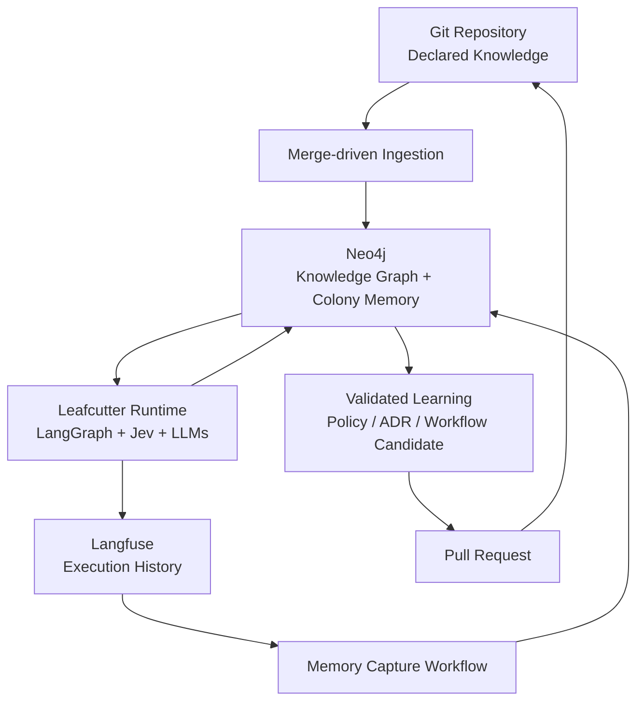
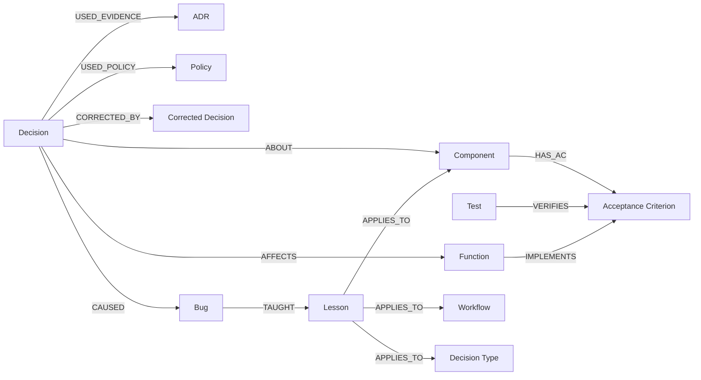
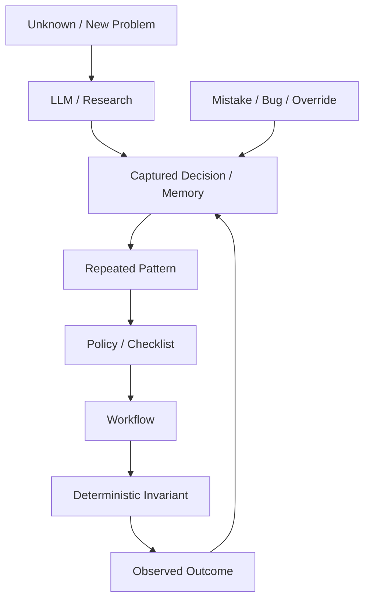

> The user's concept, verbatim. Source: workspace file `leafcutter_neo4j_colony_memory_concept.md` (2,096 lines, 2026-10-01). Part 6 of 9 ([previous part](2026-10-01-neo4j-colony-memory-concept-5-reinforcement-and-gaps.md) | [next part](2026-10-01-neo4j-colony-memory-concept-7-roadmap-and-l0-acs.md)); split only at top-level headings for the 300-line doc limit, text unchanged. Stage 0 review: [delta design](2026-10-01-colony-memory-stage0-delta.md).

# 25. Commercial / deployment model

The Neo4j backend must be abstracted behind a Leafcutter memory interface.

Conceptually:

```python
class ColonyMemory:
    async def record_decision(...): ...
    async def find_similar_decisions(...): ...
    async def record_lesson(...): ...
    async def record_capability_outcome(...): ...
    async def get_capability_context(...): ...
    async def record_capability_gap(...): ...
```

Possible implementations:

```text
NullColonyMemory
Neo4jColonyMemory
FutureManagedLeafcutterMemory
```

## Deployment modes

### Mode 0 — No Neo4j

```text
Leafcutter works
persistent Colony Memory disabled
```

### Mode 1 — User-managed Neo4j

User provides connection credentials.

```text
LEAFCUTTER_NEO4J_URI=
LEAFCUTTER_NEO4J_USERNAME=
LEAFCUTTER_NEO4J_PASSWORD=
```

This may point to:

- local Neo4j;
- company-managed Neo4j;
- Neo4j Aura;
- another compatible managed deployment.

### Mode 2 — Leafcutter Managed Colony Memory

A future commercial Leafcutter service can hide Neo4j completely behind a managed API.

Customer experience:

```text
Enable Leafcutter Memory
→ authenticate
→ no Neo4j installation
→ no schema / index / upgrade management
```

Internally Leafcutter operates a managed, isolated Neo4j-backed memory service.

This creates a natural paid feature:

- hosted Colony Memory;
- backups;
- upgrades;
- tenant isolation;
- memory analytics;
- organization-wide shared learning;
- historical decision retrieval;
- dashboards;
- potentially advanced cross-repository learning.

> [!IMPORTANT]
> The open/core Leafcutter runtime must **not** depend on the commercial service.
>
> The backend abstraction should make user-managed Neo4j and managed Leafcutter Memory interchangeable from the kernel's perspective.

---

# 26. Architecture diagram



---

# 27. Knowledge model diagram



---

# 28. Learning / crystallization diagram




# 29. MVP

The MVP must be deliberately smaller than the final vision.

## Stage 0 — Current-design assessment — mandatory

Before implementation:

1. Inspect Leafcutter's existing capability registry.
2. Inspect all current component / knowledge representations.
3. Map existing AC storage and test linkage.
4. Map current ADR / policy storage.
5. Map existing IDs and references.
6. Map existing repository indexing / code graph functionality.
7. Map existing persistence interfaces.
8. Map existing PO / documentation / architecture / QA workflows.
9. Identify what already behaves like a knowledge graph.
10. Produce a short delta design describing:
    - reuse as-is;
    - adapt;
    - replace;
    - add.

**No Neo4j schema should be finalized before this assessment.**

## MVP implementation scope

After Stage 0:

### A. Optional memory backend abstraction

Implement / reuse a backend abstraction so Leafcutter can run with:

```text
NullColonyMemory
Neo4jColonyMemory
```

No Neo4j credentials must mean:

```text
Leafcutter works normally
persistent learning disabled
```

### B. Merge-driven ingestion of a minimal declared graph

Initially index only the highest-value stable entities that already exist cleanly in Leafcutter.

Likely candidates:

- Component
- AcceptanceCriterion
- ADR
- Policy
- Workflow / Capability if already represented
- Test ↔ AC links if already available

Do **not** index every function/class in V0 unless Leafcutter already has that indexing.

### C. Provenance + IDs

Every ingested entity must have:

- stable ID;
- source repository;
- source path;
- commit SHA;
- schema / parser version.

### D. Basic Neo4j retrieval

Implement a small set of parameterized queries, such as:

```text
get_component_context
get_component_acceptance_criteria
get_tests_for_acceptance_criteria
get_policies_for_component
get_adrs_for_component
```

### E. Persist decisions

Store the first learned object:

```text
Decision
```

with:

- question;
- decision type;
- selected answer;
- confidence;
- evidence references;
- affected component(s);
- repository revision;
- Langfuse trace ID.

### F. Persist capability gaps

Store recurring `NO_CAPABILITY` outcomes.

### G. Langfuse stays mandatory for detailed execution

Neo4j must link back to Langfuse traces rather than duplicate them.

### Explicitly not MVP

Do not require initially:

- automatic PR overlays;
- local dirty-worktree overlays;
- full code-function graph;
- automatic memory promotion into policies;
- self-modifying routing based on historical success;
- pheromone decay;
- structural graph similarity;
- automatic policy updates;
- cross-customer learning;
- managed commercial memory service.

The MVP proves that:

> Git-native knowledge can be compiled into Neo4j, queried efficiently, connected to real decisions, and used as persistent context without making Leafcutter dependent on Neo4j.

---

