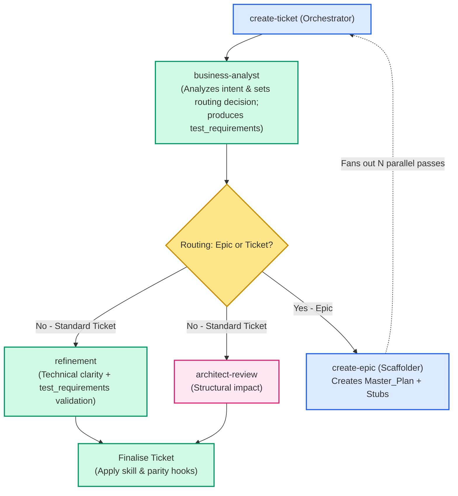
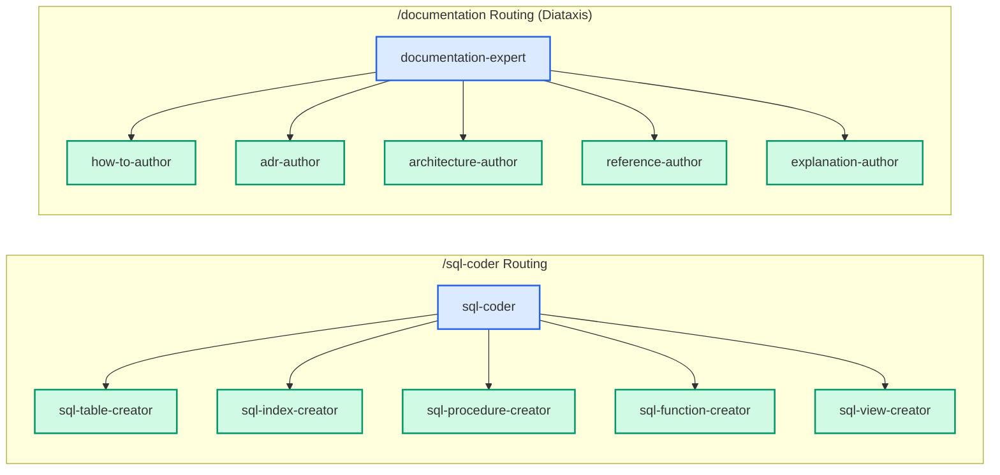
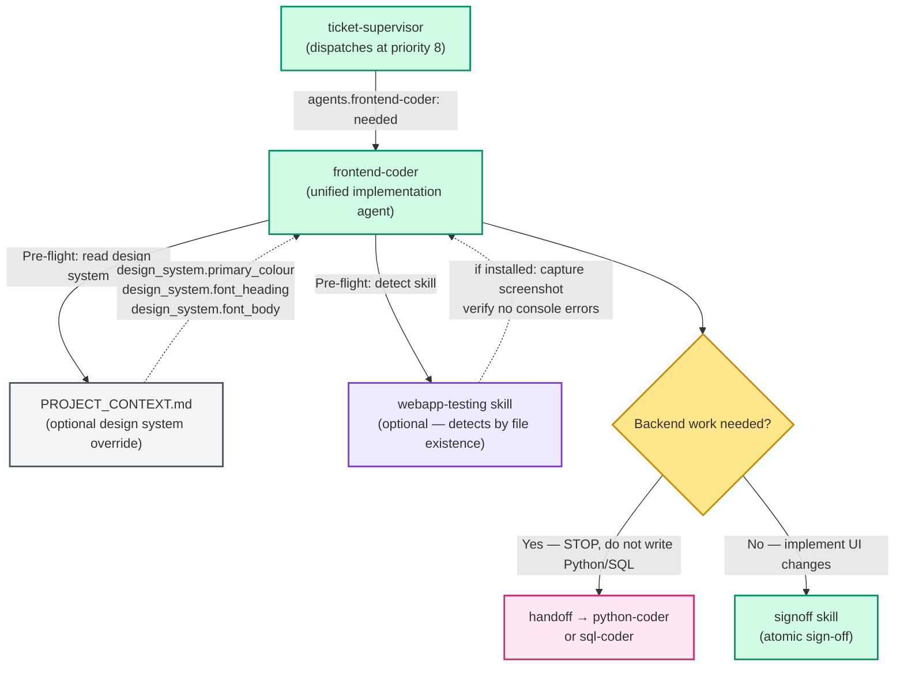
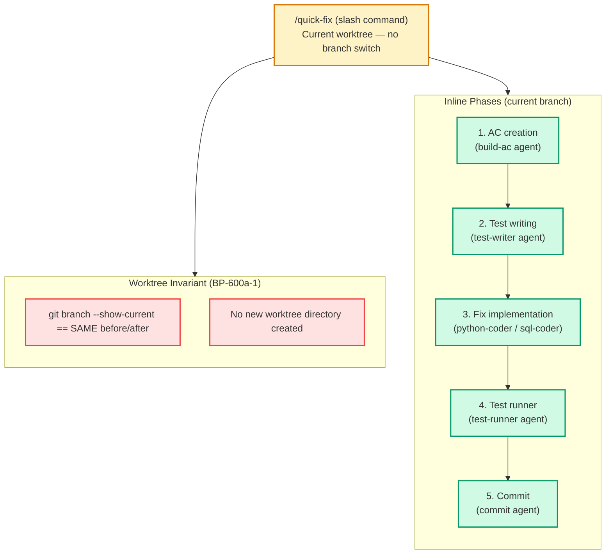
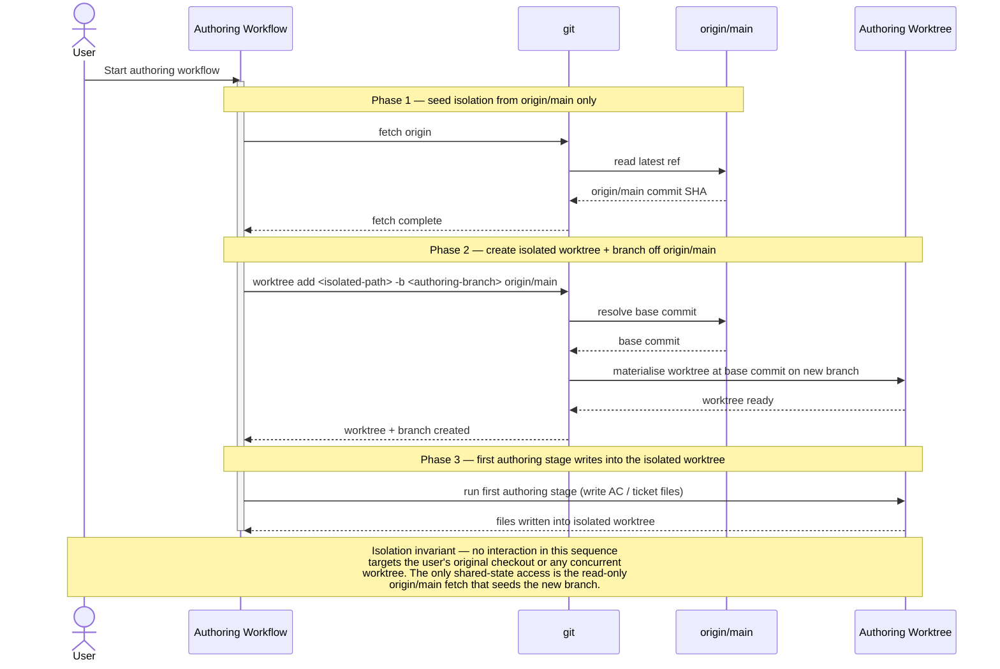
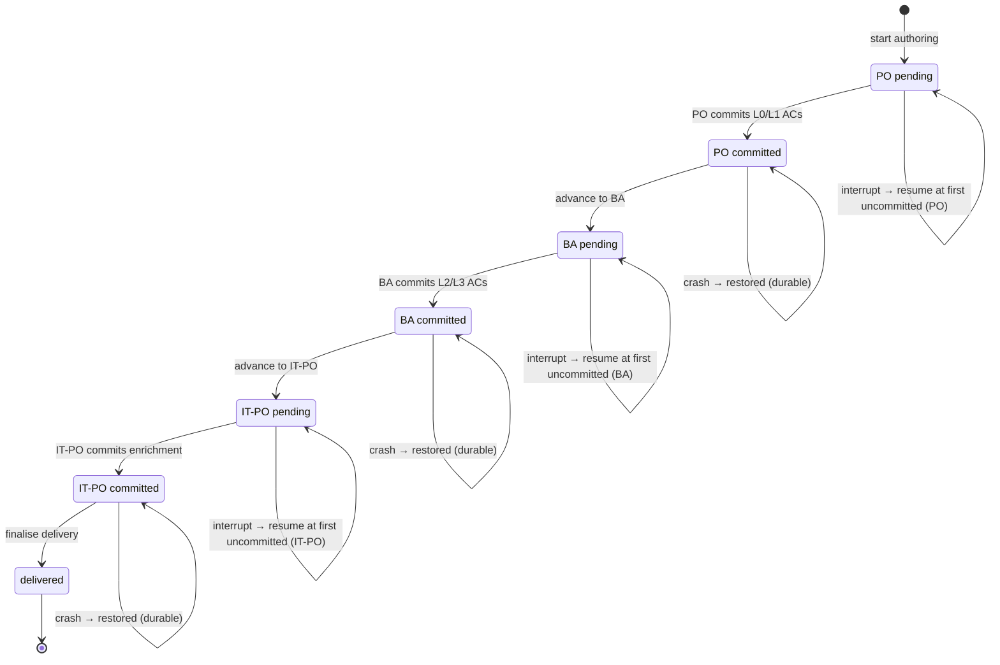
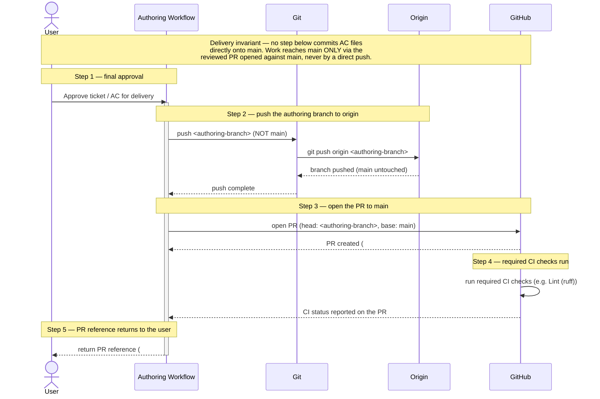
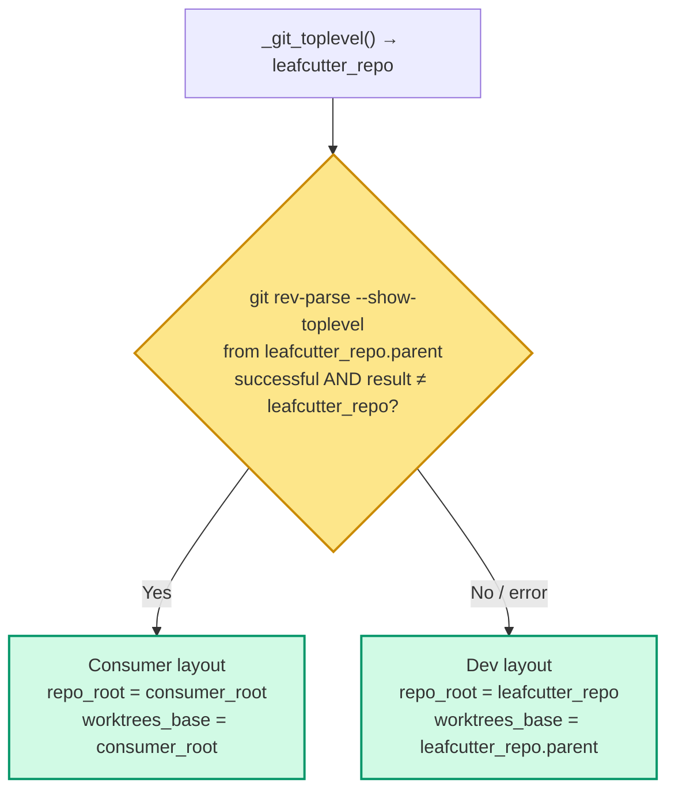

# Agent Code Delivery Workflows

## Purpose

This document visualises how the Brain Trader agent ecosystem orchestrates code delivery. It uses a layered abstraction approach: starting with a high-level mapping of slash commands to their primary agents, followed by detailed "drill-down" views showing how orchestrators and supervisors distribute work to specialised sub-agents. 

> [!TIP]
> For the authoritative rules on how these agents are grouped into model tiers (Haiku, Sonnet, Opus), see [ADR-006](ADR-006-agent-model-tiers.md). For the underlying supervisor architecture and sign-off status mechanics, see [ADR-010](ADR-010-agent-supervisor-signoff-pattern.md).

---

## Diagram Legend

All diagrams in this document use a consistent color-coding scheme to distinguish agent roles and system components:

| Color | Role | Description |
|---|---|---|
| **Yellow/Orange** | **User Interface (UI)** | Slash commands directly invoked by the human user. |
| **Blue** | **Orchestrator** | Supervisory agents that delegate tasks to sub-agents and never write the final code themselves (e.g., `epic-supervisor`, `sql-coder`). |
| **Green** | **Worker** | Implementation agents that execute specific technical tasks (e.g., `python-coder`, `sql-table-creator`). |
| **Pink** | **Gatekeeper** | Agents that enforce quality controls, review code, or escalate issues to Opus (e.g., `pr-reviewer`, `architect-review`). |
| **Grey** | **Input** | Static data files or configuration (e.g., `Master_Plan.md`). |
| **Red** | **Halt / Error** | Terminal states where execution halts and requests human intervention. |

---

## 1. High-Level Overview: Entry Points

This diagram maps user-facing slash commands to their **top-level agents**. Internal specialist sub-agents are omitted here to focus on the primary interfaces.

```mermaid
flowchart TD
    classDef ui fill:#fef3c7,stroke:#d97706,stroke-width:2px;
    classDef orchestrator fill:#dbeafe,stroke:#2563eb,stroke-width:2px;
    classDef worker fill:#d1fae5,stroke:#059669,stroke-width:2px;
    classDef gatekeeper fill:#fce7f3,stroke:#db2777,stroke-width:2px;

    %% Slash Commands
    subgraph Commands ["User Slash Commands"]
        cmdBuild["/build-feature"]:::ui
        cmdTicket["/create-ticket"]:::ui
        cmdQuickFix["/quick-fix"]:::ui
        cmdPy["/python-coder"]:::ui
        cmdSql["/sql-coder"]:::ui
        cmdDoc["/documentation"]:::ui
        cmdCommit["/commit"]:::ui
        cmdPR["/pull-request"]:::ui
        cmdReview["/pr-review"]:::ui
        cmdDeploy["/prod-deploy"]:::ui
        cmdOther["/test, /database, /status, /worktree"]:::ui
    end

    %% Top-Level Agents
    subgraph Primary_Agents ["Top-Level Agents"]
        epicSup["epic-supervisor"]:::orchestrator
        createTick["create-ticket"]:::orchestrator
        quickFixAgt["ticket-supervisor (inline,<br/>current worktree — no branch switch)"]:::orchestrator
        pyCoder["python-coder"]:::worker
        sqlCoder["sql-coder"]:::orchestrator
        docExp["documentation-expert"]:::orchestrator
        commitAgt["commit"]:::worker
        prAgt["pull-request"]:::worker
        prRev["pr-reviewer"]:::gatekeeper
        prodDep["prod-deploy"]:::gatekeeper
        otherAgts["test-runner, database-agent, status-checker, worktree-agent"]:::worker
    end

    %% Mappings
    cmdBuild --> epicSup
    cmdTicket --> createTick
    cmdQuickFix --> quickFixAgt
    cmdPy --> pyCoder
    cmdSql --> sqlCoder
    cmdDoc --> docExp
    cmdCommit --> commitAgt
    cmdPR --> prAgt
    cmdReview --> prRev
    cmdDeploy --> prodDep
    cmdOther --> otherAgts
```



---

## 2. Detail View: Ticket Creation Orchestration (`/create-ticket`)

This view shows how the `create-ticket` orchestrator delegates ticket formulation to specialists, and how it handles fan-out for large requests by escalating to `create-epic`. `business-analyst` produces the `test_requirements` block as part of its payload before returning to the orchestrator.



---

## 3. Detail View: Implementation Orchestrators (`/sql-coder` & `/documentation`)

> [!IMPORTANT]
> **Strict Delegation Rule:** Orchestrator agents (like `sql-coder` or `documentation-expert`) never write the final code themselves. They assess the user intent, gather architectural context, and route to the correct specialist worker, ensuring quality enforcement and context isolation.



---

## 4. Detail View: Epic & Ticket Supervisor Flow (`/build-feature`)

This flow illustrates how `epic-supervisor` automates parallel delivery by calculating physical dependencies (`files_touched`), and how `ticket-supervisor` distributes work to phase agents based on the ticket's frontmatter. It also outlines the adjudication ladder for blockers.

The canonical phase-agent dispatch order is:
`architect-review → python-coder → sql-coder → frontend-coder → test-writer → test-runner → documentation-expert → pr-reviewer → commit → pull-request`

`frontend-coder` occupies **priority 8** (after `sql-coder` at 7, before `test-runner` at 9). It is a unified implementation agent: design principles and optional-skill detection are embedded in the template. The `frontend-design` skill is no longer a separate node in the dispatch topology — `frontend-coder` ignores it even if it is present on disk.

`test-writer` is dispatched when the ticket has a non-empty `test_requirements.tests` array (produced by `business-analyst` during ticket creation). If the array is empty (docs-only or config-only tickets), `ticket-wiring` sets `test-writer: not_needed` and the phase is skipped.


---

## 5. Detail View: `frontend-coder` Dispatch Topology (Priority 8)

`frontend-coder` is a unified implementation agent: a single node in the dispatch topology that handles all frontend work. The `frontend-design` skill has been inlined into the agent template (AC BP-700a-1) and is no longer a separate box.



> [!NOTE]
> **Embedded design principles**: `frontend-coder` no longer loads the `frontend-design` skill file. Design principles (negative space, accessibility contrast, interactive states, component structure, performance) are embedded directly in the agent template. If `.claude/skills/frontend-design/SKILL.md` exists on disk from a prior install, `frontend-coder` ignores it. Project-specific brand overrides are applied via `PROJECT_CONTEXT.md` (see ADR-005).
>
> **`webapp-testing` detection**: if `.claude/skills/webapp-testing/SKILL.md` exists, `frontend-coder` invokes it after making UI changes to capture a screenshot and verify no console errors. No other configuration is required.

> [!TIP]
> The **Blocker Adjudication Ladder** is designed to shield the user from trivial issues. Only open-ended design questions (which escalate through the `brainstorm-lead` tier) or completely exhausted retries will interrupt the user.

---

### 4.1 Supervisor Dispatch — Gated-Agent Confirmation-Gate Deadlock

#### Observed failure

Gated agents (`commit`, `worktree-agent`, `finalize-feature`) require a direct user-turn
confirmation before executing any destructive action (git commit, PR merge, worktree removal).
When `ticket-supervisor` or any coordinator dispatches one of these agents as a **subagent**,
no interactive user-turn channel exists. Any confirmation relayed from the coordinator via
`SendMessage` is rejected by the gated agent ("coordinator message carries no user authority").
The agent dead-ends at its gate and the ticket is permanently blocked until a human intervenes
out-of-band.

This failure mode was confirmed during the EPIC-PrecommitSafetyNet finalization run, where
every attempt to relay a confirmation through a coordinator subagent failed.

#### Interim workaround (in effect now)

Pass the sanction in the **initial dispatch payload**, before the gated agent issues its
confirmation prompt. The established markers:

- `commit`: `COMMIT_AGENT_MODE=1` — this is already encoded by `ticket-supervisor` auto-authorization
  (see `building-epics` §5.0). External callers must replicate it.
- `finalize-feature`, `worktree-agent`: include an authorized-dispatch marker such as
  `via: /build-feature` in the Agent-tool input so the agent can confirm the caller chain
  holds user authority.

If the gate still fires after the marker is present, the coordinator may complete the
destructive step directly (raw `git` / `gh`) and MUST record the bypass reason immediately
in the ticket's `## Comments` section. Silent gate bypasses are prohibited.

The full operational protocol (re-dispatch recipe, bypass-and-log procedure) is in
`building-epics` §5.7.

#### Proposed permanent fix (not yet implemented)

Introduce a structured `authorization:` token in the dispatch payload that gated agents
accept as user-sanctioned without an interactive turn, generalizing the existing
`COMMIT_AGENT_MODE=1` pattern:

```yaml
authorization:
  granted_by: "/build-feature"
  action: "commit"
  ticket: "<ticket_path>"
```

A gated agent receiving a valid `authorization:` block would skip its interactive
confirmation gate and record the token in its sign-off comment instead. This requires
changes to the `commit`, `worktree-agent`, and `finalize-feature` agent templates and is
tracked as a future ticket. Until implemented, the interim protocol in `building-epics` §5.7
applies.

---

## 5. Detail View: Quick-Fix Workflow (`/quick-fix`)

The `/quick-fix` command is a **current-worktree-only** workflow. Unlike `/build-feature`, it
never creates a new worktree or switches branches. The user invokes it from an existing
worktree (e.g. `EPIC-SomeFeature`) and all operations — AC creation, test writing, fix, and
commit — complete on the **same branch** the user was already on.

### AC BP-600a-1 — Worktree invariant

```
Given a user is on branch "EPIC-SomeFeature" in an existing worktree,
When they invoke /quick-fix with a diagnosis specifying a file and root cause,
Then the workflow performs all operations (AC creation, test writing, fix, commit)
  in the current worktree,
And git branch --show-current returns the same branch name both before and after
  the workflow completes,
And no new worktree directory is created during execution.
```

### Contrast with `/build-feature`

| Aspect | `/build-feature` | `/quick-fix` |
|--------|-----------------|-------------|
| Worktree | Creates a new isolated worktree per epic/ticket | Stays in the **current** worktree |
| Branch | Creates and switches to a new feature branch | Stays on the **current** branch |
| Entry point | `build-ticket.js` (JS workflow) or `build-single-ticket` skill | `quick-fix.js` (JS workflow, inline) |
| Depth model | `ticket-supervisor` at depth 0; phase agents at depth 1 (ADR-006) | Same depth model — `ticket-supervisor` inline at depth 0 |
| Ticket lifecycle | Full inbox → todo → done lifecycle | Lightweight — single-shot fix; ticket created inline and driven to commit in one pass |

### Flow



### AC BP-600a-1 constraint: no `git worktree add`, no `setup_ticket_worktree.py`

The `quick-fix.js` workflow script MUST NOT call `setup_ticket_worktree.py` or any equivalent
command that creates a new worktree directory. All phases run in the directory where `/quick-fix`
was invoked. This is enforced by the AC store entry `BP-600a-1` and checked by
`git branch --show-current` before and after the workflow completes.

### AC BP-600a-2 — No isolation infrastructure

Beyond the worktree invariant, `/quick-fix` must use **no isolation infrastructure** from
the full build pipeline. Specifically, the following are unconditionally prohibited in
`quick-fix.js` and in any agent dispatched by it:

| Prohibited item | Why |
|---|---|
| `worktree-agent` dispatch | Creates/manages isolated git worktrees — the opposite of stay-in-place |
| `feature` skill invocation | Calls `git worktree add`; creates branch isolation — violates BP-600a-1 |
| `git worktree add` | Direct worktree creation command — prohibited by BP-600a-1 |
| `setup_ticket_worktree.py` | Bootstrap script for new isolated worktrees — not needed in existing worktree |
| Any branch-switching command | `git checkout -b`, `git switch -c`, etc. |

The phase agents dispatched by `/quick-fix` (`build-ac`, `test-writer`, `python-coder`,
`test-runner`, `commit`) are worktree-agnostic — they operate on files in the current
directory and do not require an isolated branch context.

**Rationale:** `/quick-fix` is designed for rapid, in-place fixes to known bugs. Isolation
infrastructure adds 30–60 seconds of overhead and introduces branch-switch race conditions
when the user is mid-work on an active epic branch. The invariant is verifiable:
`git branch --show-current` must return the same branch name before and after the workflow.

### AC BP-600a-3 — Uncommitted changes guard

Before executing any phase, `/quick-fix` MUST check whether the target file has
uncommitted changes in the working tree. The Gherkin contract:

```gherkin
Given the user's worktree has unstaged changes in the file
  "scripts/build_helpers.py",
When the user invokes /quick-fix with a diagnosis targeting
  "scripts/build_helpers.py",
Then the workflow halts before any AC creation or code changes,
And it reports the conflicting uncommitted changes in the target file,
And it suggests the user commit or stash before retrying.
```

**Implementation contract:**

The guard runs as the **first step** of `/quick-fix`, immediately after parsing the
diagnosis input and resolving the target file path. Before any AC creation, test writing,
or code modification:

1. Run `git status --porcelain <target_file>`.
2. If the output is non-empty (the file has unstaged or staged changes):
   a. Print a structured halt message identifying the target file and the conflicting
      change (modified `M`, untracked `??`, staged `A`, etc.).
   b. Print the suggested remediation: `git commit` the current changes or
      `git stash push <target_file>` before retrying.
   c. Exit the workflow immediately — no AC file is written, no test is created, no
      code is changed.
3. If the output is empty, the target file is clean — proceed normally.

**Why this guard is necessary:**

Without it, `/quick-fix` could write a new failing test and apply a code fix to a file
that already contains in-progress work. The subsequent commit would bundle both the
user's uncommitted work and the quick-fix changes into a single commit, obscuring the
audit trail and potentially corrupting in-progress feature work. The guard enforces a
clean-slate assumption: `/quick-fix` is a rapid-fix tool, not a merge tool.

**Output format (halt message):**

```
/quick-fix halted: target file has uncommitted changes.

  File:    scripts/build_helpers.py
  Status:  M  (modified, unstaged)

  The quick-fix workflow requires a clean working tree for the target file.
  Please resolve the uncommitted changes before retrying:

    Option A — commit the changes:
      git add scripts/build_helpers.py
      git commit -m "wip: save in-progress changes before quick-fix"

    Option B — stash the changes:
      git stash push scripts/build_helpers.py

  Then re-invoke: /quick-fix <your-diagnosis>
```

### AC BP-600c-1 — Test-writer dispatch with AC input (test before fix)

After creating the AC YAML file (AC BP-600b-1), the quick-fix workflow MUST dispatch the
`test-writer` agent before applying any fix code. The Gherkin contract:

```gherkin
Given the quick-fix workflow has created an AC YAML file for the
  diagnosed bug,
When the workflow reaches the test-writing phase,
Then it dispatches the test-writer agent with the AC as input,
And the test-writer produces a test that reproduces the diagnosed bug,
And the test includes a "# covers: <AC-ID>" tag referencing the
  newly created AC,
And the test is written to the appropriate test directory before any
  fix code is applied.
```

**Dispatch contract (Agent-tool input to `test-writer` at depth 1):**

The test-writer agent is dispatched with the following structured inputs:

| Input field | Value | Source |
|---|---|---|
| `ticket_path` | Absolute path to the quick-fix workflow's internal ticket file | Workflow context at depth 0 |
| `ac_path` | Absolute path to the newly created AC YAML file (from BP-600b-1) | AC creation phase output |
| `target_file` | Absolute path to the buggy source file (from diagnosis parsing) | BP-600d-1 parsed struct |
| `location_hint` | Line number or function name (optional) | BP-600d-1 parsed struct |
| `symptom` | Observable incorrect behaviour | BP-600d-1 parsed struct |

**Test file requirements:**

1. **`# covers: <AC-ID>` tag** — every test function written by the test-writer for this
   quick-fix MUST include the tag `# covers: <AC-ID>` (where `<AC-ID>` is the ID from the
   newly created AC YAML file, e.g. `# covers: BP-600c`). The tag must appear on the line
   above `def test_*`, on the first body line, or in the docstring — matching the format
   required by `check_test_ac_tags.py`.

2. **Test directory** — the test file is written to the project's canonical test directory
   (e.g. `unit_tests/`) before any fix code is applied. The test-writer MUST NOT write to
   `src/` or any source directory.

3. **Red-phase assertion** — the test is expected to FAIL against the unfixed code. It
   asserts the correct behaviour (`Then` clause of the AC), which the buggy code does not
   yet satisfy. The test-runner phase (BP-600c-2) verifies this red state.

4. **Ordering invariant** — the test file write and the `covered_by` update to the AC YAML
   file (see AC Schema §test-writer integration) MUST both complete before the fix-implementation
   phase (`python-coder` / `sql-coder`) is dispatched. This ordering is enforced by the
   sequential phase chain in `quick-fix.js`.

**`covered_by` update (AC store integration):**

After writing the test file, the test-writer MUST append the new test path to the `covered_by`
list in the AC YAML file created during the AC creation phase:

```yaml
# After test-writer runs — BP-600c-1 AC YAML excerpt:
covered_by:
  - "unit_tests/test_<component>_<bug-id>.py::test_<function_name>"
```

This update is part of the same agent turn as the test file write — both the test file and
the `covered_by` update are committed together (see `docs/reference/ac-schema.md` §test-writer
for the full integration protocol).

---

### AC BP-600c-3 — Test-runner confirms green phase after fix is applied

After the python-coder has applied the fix to the diagnosed file (AC BP-600d-2), the quick-fix
workflow MUST dispatch the `test-runner` agent a second time to verify that the fix actually
resolves the failing test. The Gherkin contract:

```gherkin
Given the python-coder has applied the fix to the diagnosed file,
When the workflow reaches the green-phase verification step,
Then it dispatches the test-runner agent targeting the same test file
  from the red phase,
And the test-runner reports all tests PASSED,
And if the test still fails the workflow halts with a warning:
  "The fix did not resolve the failing test -- the root cause may be
  different than diagnosed."
```

**Dispatch contract (Agent-tool input to `test-runner` at depth 1 — green phase):**

| Input field | Value | Source |
|---|---|---|
| `ticket_path` | Absolute path to the quick-fix workflow's internal ticket file | Workflow context at depth 0 |
| `test_file` | Absolute path to the test file written by test-writer (from BP-600c-1) | test-writer phase output (same file as red phase) |
| `expected_outcome` | `"green"` — the test must pass after the fix | Hardcoded in quick-fix.js for the green-phase step |

**Green-phase outcome routing:**

| test-runner result | Workflow action |
|---|---|
| All tests **PASSED** | Proceed to commit phase — the fix is confirmed correct |
| Any test **FAILED** (fix did not resolve) | Halt the workflow immediately with the structured warning below |
| Test file not found / runner error | Halt the workflow with a structured error; do not proceed to commit |

**Halt message for persistent failure (fix did not resolve):**

```
/quick-fix halted: green-phase verification failed.

  Test file: <absolute path to test file>
  Result:    FAILED (at least one test still fails after the fix)

  Warning: The fix did not resolve the failing test -- the root cause may be
  different than diagnosed.

  Possible causes:
    1. The fix targeted the wrong location in the file (check location_hint).
    2. The root cause is in a different file than diagnosed.
    3. The fix is incomplete -- the logic branch requires additional changes.

  Suggested next steps:
    - Review the failing test output and the python-coder's diff.
    - Re-invoke /quick-fix with a refined diagnosis targeting the actual root
      cause, or fix the target file manually and commit.
```

**Ordering invariant:**

The green-phase test-runner invocation MUST run after the python-coder completes
(BP-600d-2) and BEFORE the commit phase starts. This sequencing is enforced by the
phase chain in `quick-fix.js`:

```
build-ac (depth 1) → test-writer (depth 1) → test-runner/red-phase (depth 1)
  → python-coder/fix (depth 1) → test-runner/green-phase (depth 1) → commit (depth 1)
```

The depth-0 executing context controls the ordering: `test-runner/green-phase` is
dispatched only after the `python-coder` Agent-tool call returns with a successful
sign-off. The `commit` phase is dispatched only after the green-phase `test-runner`
reports all tests PASSED. Any other outcome halts the workflow before commit is
ever invoked.

**Why this guard is necessary:**

Without the green-phase verification step, the quick-fix workflow could commit a
"fix" that does not actually resolve the diagnosed bug. The commit would record a
passing test suite (because the test from BP-600c-1 is the only new test), giving
a false green signal. The green-phase check enforces that:

1. The fix genuinely resolves the diagnosed defect (the test transitions from red to green).
2. The commit records a meaningful state transition — the bug is actually fixed.
3. The audit trail is trustworthy: test-red before fix, test-green after fix, then commit.

**Contrast with red-phase (BP-600c-2):**

| Phase | `expected_outcome` | Halt condition |
|---|---|---|
| Red (BP-600c-2) | `"red"` — test must FAIL | Halt if test unexpectedly passes |
| Green (BP-600c-3) | `"green"` — test must PASS | Halt if test still fails |

Both phases dispatch the same `test-runner` agent targeting the same `test_file`;
only the `expected_outcome` field and the halt-message copy differ.

---

### AC BP-600d-1 — Structured diagnosis input parsing

Before any phase runs, `/quick-fix` MUST parse the user-provided diagnosis text and extract
four structured fields. The Gherkin contract:

```gherkin
Given the user invokes /quick-fix with text containing "In
  scripts/build_helpers.py line 42, _resolve_precommit_cmd() returns
  a non-executable path because the executability probe is skipped
  when shutil.which returns None",
When the workflow parses the input,
Then it extracts the target file path ("scripts/build_helpers.py"),
  the location hint ("line 42"), the symptom ("returns a
  non-executable path"), and the root cause ("executability probe
  is skipped"),
And it uses these fields to drive AC creation, test writing, and
  fix application in subsequent phases.
```

**Parsed fields and their downstream consumers:**

| Field | Example value | Consumed by |
|---|---|---|
| `target_file` | `scripts/build_helpers.py` | Uncommitted changes guard (BP-600a-3), python-coder, test-writer |
| `location_hint` | `line 42` | python-coder (narrows the fix scope), test-writer (anchors the failing assertion) |
| `symptom` | `returns a non-executable path` | AC creation (describes observable failure), test-writer (names the expected vs actual) |
| `root_cause` | `executability probe is skipped` | AC creation (names the cause), python-coder (targets the exact logic branch to fix) |

**Parsing contract:**

The workflow accepts two input forms:

1. **Natural-language sentence** — the canonical form. The parser uses the following
   structural markers to identify fields:
   - `In <path>` or `In <path> line <N>` → `target_file` + optional `location_hint`
   - `<function>() returns ...` or similar verb phrase → `symptom`
   - `because ...` or `when ...` → `root_cause`

2. **Structured JSON** — an alternative form for programmatic invocation:
   ```json
   {
     "target_file": "scripts/build_helpers.py",
     "location_hint": "line 42",
     "symptom": "returns a non-executable path",
     "root_cause": "executability probe is skipped when shutil.which returns None"
   }
   ```

**Validation rules:**

- `target_file` MUST resolve to an existing file in the current worktree. If the file
  does not exist, the workflow halts with:
  ```
  /quick-fix halted: target file not found.
    File: <target_file>
    The diagnosis references a file that does not exist in the current worktree.
  ```
- `symptom` and `root_cause` MUST be non-empty strings. If either is absent after
  parsing, the workflow halts and asks the user to clarify:
  ```
  /quick-fix needs clarification: could not extract symptom and root cause from diagnosis.
    Parsed so far: target_file=<value>, location_hint=<value or (none)>
    Please rephrase: "In <file> [line N], <function>() <symptom> because <root_cause>."
  ```
- `location_hint` is optional. If absent, the downstream agents receive `null` for
  this field and must handle it gracefully (i.e. they do not require a line number to
  proceed; they use the symptom and root cause alone).

**How the parsed fields drive downstream phases:**

1. **AC creation** (`build-ac` agent) — receives `target_file`, `symptom`, and
   `root_cause` as structured inputs. Uses them to populate the AC Gherkin template:
   - Given: the target file exists and the buggy function is present
   - When: the triggering condition (derived from `root_cause`)
   - Then: the expected correct behaviour (derived from `symptom` negation)

2. **Test writing** (`test-writer` agent) — receives all four fields. Uses
   `target_file` and `location_hint` to locate the test anchor, and `symptom` to
   name the assertion (`assert result != <symptom-value>`).

3. **Fix implementation** (`python-coder` agent) — receives all four fields. Uses
   `location_hint` to narrow the edit scope and `root_cause` to identify the logic
   branch to repair.

### AC BP-600c-2 — Test-runner confirms red phase before fix code is applied

After the test-writer has produced the failing test (AC BP-600c-1), the quick-fix workflow
MUST dispatch the `test-runner` agent to verify that the new test actually fails against the
unfixed codebase. The Gherkin contract:

```gherkin
Given the test-writer has produced a test file for the diagnosed bug,
When the workflow reaches the red-phase verification step,
Then it dispatches the test-runner agent targeting the new test file,
And the test-runner reports at least one FAILED result for the new test,
And if the test unexpectedly passes the workflow halts with a warning:
  "The test passes before the fix was applied -- the diagnosis may be
  incorrect or the bug is already fixed."
```

**Dispatch contract (Agent-tool input to `test-runner` at depth 1):**

The test-runner agent is dispatched with the following structured inputs:

| Input field | Value | Source |
|---|---|---|
| `ticket_path` | Absolute path to the quick-fix workflow's internal ticket file | Workflow context at depth 0 |
| `test_file` | Absolute path to the test file written by test-writer (from BP-600c-1) | test-writer phase output |
| `expected_outcome` | `"red"` — the test must fail | Hardcoded in quick-fix.js for the red-phase step |

**Red-phase outcome routing:**

| test-runner result | Workflow action |
|---|---|
| At least one test **FAILED** | Proceed to fix-implementation phase (`python-coder` / `sql-coder`) — this is the expected red state |
| All tests **PASSED** (unexpected green) | Halt the workflow immediately with the structured warning below |
| Test file not found / runner error | Halt the workflow with a structured error; do not proceed to fix |

**Halt message for unexpected green (test passes before fix):**

```
/quick-fix halted: red-phase verification failed.

  Test file: <absolute path to test file>
  Result:    PASSED (all assertions green before fix was applied)

  Warning: The test passes before the fix was applied -- the diagnosis may be
  incorrect or the bug is already fixed.

  Possible causes:
    1. The diagnosed bug has already been fixed in a prior commit.
    2. The test assertion does not correctly reproduce the diagnosed symptom.
    3. The target file path or location hint was mis-parsed (see BP-600d-1 output).

  Suggested next steps:
    - Review the test file at <test_file> and confirm it asserts the diagnosed
      failure condition.
    - Run git log <target_file> to check for recent fixes.
    - Re-invoke /quick-fix with a more precise diagnosis, or mark the bug as
      already-fixed.
```

**Ordering invariant:**

The red-phase test-runner invocation MUST run after the test-writer completes
(BP-600c-1) and BEFORE the fix-implementation phase starts (AC for fix phase). This
sequencing is enforced by the phase chain in `quick-fix.js`:

```
build-ac (depth 1) → test-writer (depth 1) → test-runner/red-phase (depth 1) → fix-coder (depth 1) → commit (depth 1)
```

The depth-0 executing context controls the ordering: `test-runner` is dispatched only
after the `test-writer` Agent-tool call returns with a successful sign-off. The fix-coder
is dispatched only after the `test-runner` reports at least one FAILED result. Any other
outcome halts the workflow before the fix-coder is ever invoked.

**Why this guard is necessary:**

Without the red-phase verification step, the quick-fix workflow could silently skip the
TDD contract — writing a test that happens to pass against the current code, applying
a "fix" that changes nothing meaningful, and committing a green test suite that never
actually reproduced the bug. The red-phase check enforces that:

1. The test genuinely targets the diagnosed defect (it fails against unfixed code).
2. The subsequent green-phase (after the fix) is meaningful — a real state transition
   from red to green.
3. The audit trail is valid: the commit history shows test-red before fix, test-green
   after fix.

### AC BP-600d-2 — python-coder dispatched with diagnosis after red-phase confirmation

After the red-phase test-runner has confirmed the bug is reproducible (AC BP-600c-2), the
quick-fix workflow MUST dispatch the `python-coder` agent to apply the fix. The Gherkin
contract:

```gherkin
Given the red-phase test has confirmed the bug is reproducible
  (test fails as expected),
When the workflow reaches the fix-application phase,
Then it dispatches the python-coder agent with the diagnosis,
  the failing test file, and the target file path,
And the python-coder modifies only the target file specified in
  the diagnosis,
And no other source files are modified by the python-coder in
  this phase.
```

**Dispatch contract (Agent-tool input to `python-coder` at depth 1):**

The python-coder agent is dispatched with the following structured inputs:

| Input field | Value | Source |
|---|---|---|
| `ticket_path` | Absolute path to the quick-fix workflow's internal ticket file | Workflow context at depth 0 |
| `target_file` | Absolute path to the buggy source file (from diagnosis parsing) | BP-600d-1 parsed struct |
| `test_file` | Absolute path to the failing test file produced by test-writer | BP-600c-1 output |
| `location_hint` | Line number or function name (optional) | BP-600d-1 parsed struct |
| `symptom` | Observable incorrect behaviour | BP-600d-1 parsed struct |
| `root_cause` | Root cause of the bug | BP-600d-1 parsed struct |

**Scope constraint (single-file modification):**

The python-coder MUST modify only the `target_file` supplied in the Agent-tool input.
No other source files may be created or modified during this phase:

| Constraint | Rule |
|---|---|
| Only `target_file` modified | The python-coder edit must be scoped to the single file named in the diagnosis. Changes to any other source file are unconditionally prohibited in this phase. |
| No test file edits | The test file written by test-writer (BP-600c-1) MUST NOT be modified by the python-coder. The test is the acceptance gate — editing it during the fix phase would invalidate the TDD contract. |
| No new source files | The python-coder MUST NOT create new source files as part of the fix. If the fix genuinely requires a new module, the workflow halts and surfaces to the user for a scoped re-diagnosis. |

**Ordering invariant:**

The python-coder dispatch occurs ONLY after both:
1. The test-writer has produced the failing test (BP-600c-1), AND
2. The red-phase test-runner has confirmed the test fails (BP-600c-2).

If either prior phase did not complete successfully, the fix-application phase MUST NOT
start. The ordering is enforced by the sequential phase chain in `quick-fix.js`:

```
build-ac (depth 1) → test-writer (depth 1) → test-runner/red-phase (depth 1)
  → python-coder/fix (depth 1) → test-runner/green-phase (depth 1) → commit (depth 1)
```

**Why single-file scope is enforced:**

The quick-fix workflow is a rapid-fix tool for known, localised bugs. A single-file
modification constraint ensures:

1. **Audit clarity** — the commit shows exactly which file was changed and why. A
   multi-file python-coder edit would obscure causality.
2. **Minimal blast radius** — the fix applies the smallest possible change to restore
   correct behaviour. Collateral edits to unrelated files introduce regression risk.
3. **AC traceability** — the single-file constraint makes it straightforward to verify
   that the committed change satisfies exactly the diagnosed AC (BP-600d-2). A
   multi-file change would require cross-file AC coverage analysis.

---

### AC BP-600e-1 — Multi-file warning before green-phase test

After the python-coder has returned from the fix-application phase (AC BP-600d-2), the
quick-fix workflow MUST inspect the diff before proceeding to the green-phase test-runner
invocation. If the coder touched 2 or more source files (excluding the test file and the
AC YAML), the workflow MUST pause and display a structured warning to the user before
continuing. The Gherkin contract:

```gherkin
Given the python-coder has been dispatched to apply the fix,
When the coder's changes touch 2 or more source files (excluding
  the test file and AC YAML),
Then the workflow pauses before proceeding to the green-phase test,
And it displays a warning: "This fix modified N files (expected 1).
  Files changed: [list]. Continue with quick-fix or escalate to
  /build-feature?",
And it waits for user confirmation before proceeding.
```

**When the check runs:**

This check fires at the depth-0 executing context, immediately after the
`python-coder` Agent-tool call returns with a successful sign-off. The depth-0
context runs `git diff --name-only HEAD` and filters the result to exclude:

1. The test file written by test-writer (BP-600c-1) — identified by the path
   stored from that phase's output.
2. Any AC YAML file (files matching `docs/acceptance-criteria/*.yaml` or the
   path returned by `build-ac`).

Files remaining after this exclusion are counted as **source files modified**.

**Trigger condition:**

The warning is triggered when the filtered source-file count is **≥ 2**. A
single-file modification (count = 1) proceeds to the green-phase test-runner
without any pause or user confirmation.

**Warning message format:**

```
/quick-fix warning: multi-file modification detected.

  This fix modified N files (expected 1).
  Files changed:
    - <source_file_1>
    - <source_file_2>
    [... additional files ...]

  The quick-fix workflow is designed for single-file fixes.
  A multi-file change may indicate the root cause spans more than
  one module.

  Options:
    C — Continue with quick-fix (proceed to green-phase test)
    E — Escalate to /build-feature (abort quick-fix; plan as a ticket)

  Enter C or E:
```

**User confirmation routing:**

| User input | Workflow action |
|---|---|
| `C` (continue) | Proceed to green-phase test-runner (BP-600c-3) with the multi-file diff in place |
| `E` (escalate) | Halt the workflow. Print escalation message (see below). Do NOT proceed to green-phase test, commit, or any subsequent phase |
| Any other input | Re-display the prompt — wait for `C` or `E` |

**Escalation halt message (user chose E):**

```
/quick-fix escalated: fix scope exceeds single-file boundary.

  Modified files:
    - <source_file_1>
    - <source_file_2>
    [...]

  The changes above have been left uncommitted in your working tree.
  To proceed, re-plan this fix as a full ticket via:

    /build-feature

  The test file written by test-writer is at:
    <test_file_path>
  You may keep or delete it before starting /build-feature.
```

**Relationship to the depth model (this ADR):**

This check runs entirely at depth 0 (the executing context). No additional
Agent-tool dispatch is needed — the `git diff --name-only` call is a
direct Bash invocation at depth 0. The result gates whether the green-phase
`test-runner` dispatch (depth 1) occurs. This is consistent with the ADR-006
pattern: all phase-chain control logic lives at depth 0; phase agents are
dispatched at depth 1 and receive structured inputs.

**Relationship to BP-600d-2 single-file scope constraint:**

AC BP-600d-2 instructs the python-coder to modify only the target file.
AC BP-600e-1 is the **depth-0 enforcement layer** for that constraint: even
if the python-coder violated the scope (by editing additional files), the
executing context detects this and pauses before committing the multi-file
change. The two ACs are complementary:

| Layer | AC | What it enforces |
|---|---|---|
| Agent-level | BP-600d-2 | python-coder receives a hard scope boundary in its Agent-tool input |
| Workflow-level | BP-600e-1 | executing context (depth 0) detects scope violations and pauses before green-phase |

**Ordering invariant:**

```
python-coder/fix (depth 1) → [BP-600e-1 multi-file check at depth 0]
  → test-runner/green-phase (depth 1) → commit (depth 1)
```

The multi-file check occurs synchronously between the python-coder phase return
and the green-phase test-runner dispatch. It is never skipped, even if only one
file is modified (in that case it is a no-op — count = 1, no pause needed).

### AC BP-600e-2 — Warning when red-phase test reveals a deeper root cause

After the test-runner has returned a FAILED result from the red-phase check (AC BP-600c-2),
the quick-fix workflow MUST inspect the failure message before proceeding to the fix-application
phase. If the failure message indicates a **different root cause** than the one the user diagnosed
— specifically, the test fails at a different assertion point or with an unexpected exception
type — the workflow MUST pause and present a structured warning before dispatching `python-coder`.
The Gherkin contract:

```gherkin
Given the test-writer has produced a test based on the diagnosis,
When the red-phase test fails but the failure message indicates a
  different root cause than what was diagnosed (the test fails at
  a different assertion point or with an unexpected exception type),
Then the workflow pauses and reports: "The test failure suggests the
  root cause may differ from your diagnosis. Diagnosed: [root cause].
  Observed: [actual failure]. Continue or re-diagnose?",
And it waits for user confirmation before proceeding to the fix phase.
```

**When the check runs:**

This check fires at the depth-0 executing context, immediately after the red-phase
`test-runner` Agent-tool call returns with at least one FAILED result. The depth-0
context inspects the test-runner's failure output to classify the failure:

1. **Expected failure** — the failure message aligns with the diagnosed root cause:
   the same function, the same assertion, or the same exception type the diagnosis
   predicted. The workflow proceeds normally to the fix-implementation phase.

2. **Unexpected failure** — the failure message indicates a **different root cause**:
   - The test fails at an assertion that is unrelated to the diagnosed symptom.
   - The exception type raised is unexpected (e.g. `AttributeError` instead of
     `ValueError`, or `FileNotFoundError` where the diagnosis predicted a logic error).
   - The stack trace points to a different file or function than the diagnosed
     location hint.

**Root-cause divergence classification:**

The depth-0 context uses a simple heuristic to classify the failure:

| Signal | Divergence indicator |
|--------|---------------------|
| `expected_exception_type` present in input AND exception type in failure does not match | Exception-type mismatch → divergence |
| `location_hint` present in input AND stack trace top-frame does not include the hinted file/line | Stack-trace mismatch → divergence |
| Test fails at an assertion labelled `# covers: <AC-ID>` with an error message that does not reference the diagnosed root cause keywords | Assertion-message mismatch → divergence |
| All assertions passed but a `Setup` or `teardown` step raised an unhandled exception | Infrastructure failure → divergence |

If any signal indicates divergence, the workflow pauses and displays the structured
warning below. If no divergence signal is detected, the workflow proceeds without
pausing.

**Warning message format:**

```
/quick-fix warning: red-phase test suggests a different root cause.

  Diagnosed root cause:  [root_cause from BP-600d-1 parsed struct]
  Observed failure:      [failure message from test-runner output, ≤ 3 lines]

  The test failure suggests the root cause may differ from your diagnosis.

  Options:
    C — Continue with quick-fix (proceed to fix phase with current diagnosis)
    R — Re-diagnose (abort quick-fix; re-invoke with a revised diagnosis)

  Enter C or R:
```

**User confirmation routing:**

| User input | Workflow action |
|------------|----------------|
| `C` (continue) | Proceed to fix-implementation phase (`python-coder` / `sql-coder`) with the original diagnosis |
| `R` (re-diagnose) | Halt the workflow. Print re-diagnosis guidance (see below). Do NOT proceed to the fix phase, commit, or any subsequent phase |
| Any other input | Re-display the prompt — wait for `C` or `R` |

**Re-diagnosis halt message (user chose R):**

```
/quick-fix paused: re-diagnose before retrying.

  Original diagnosis:
    Target file:   <target_file>
    Location hint: <location_hint or (none)>
    Symptom:       <symptom>
    Root cause:    <root_cause>

  Observed test failure:
    <failure message, up to 5 lines>

  The test failure above suggests the actual defect may be at a
  different location or have a different cause than originally diagnosed.

  To retry, re-invoke /quick-fix with a revised diagnosis that reflects
  the observed failure. Example:

    /quick-fix In <actual_file> <actual_location>, <revised_symptom>
               because <revised_root_cause>.

  The test file written by test-writer is at:
    <test_file_path>
  You may keep or delete it before retrying /quick-fix.
```

**Relationship to BP-600c-2 (red-phase verification):**

AC BP-600c-2 gates on whether the test fails at all. AC BP-600e-2 gates on **why**
it fails. Both checks occur at depth-0 before the fix-implementation phase is
dispatched:

| Check | AC | Gate condition | Halt trigger |
|-------|----|----------------|--------------|
| Fails at all? | BP-600c-2 | Test must report at least one FAILED result | Halt if all tests pass (unexpected green) |
| Fails for the right reason? | BP-600e-2 | Failure message must align with the diagnosis | Pause if failure indicates a different root cause |

The BP-600e-2 check only runs when BP-600c-2 has already confirmed the test fails
(expected red). If BP-600c-2 halts the workflow (unexpected green), BP-600e-2
never fires.

**Ordering invariant:**

```
test-writer (depth 1) → test-runner/red-phase (depth 1)
  → [BP-600c-2 gate: test must fail]
  → [BP-600e-2 gate: failure must match diagnosis]
  → python-coder/fix (depth 1) → test-runner/green-phase (depth 1) → commit (depth 1)
```

The BP-600e-2 check occurs synchronously between the red-phase test-runner return
and the python-coder dispatch. If the user chooses `R` (re-diagnose), the workflow
halts before `python-coder` is ever invoked.

**Why this check is necessary:**

Without the root-cause divergence check, the quick-fix workflow could proceed to
apply a fix that targets the wrong defect. Specifically:

1. The test-writer writes a test based on the user's diagnosis.
2. The red-phase confirms the test fails (BP-600c-2 passes).
3. BUT the test fails because of a different, deeper defect than the one diagnosed.
4. The python-coder applies a fix targeting the diagnosed root cause.
5. The green-phase test-runner confirms the fix resolves the failure.
6. The commit records a "fix" that addressed a surface symptom, leaving the
   underlying defect in place.

The BP-600e-2 check surfaces this mismatch before the fix is applied, giving
the user the choice to either:
- Accept the risk and proceed (the fix may still help, even if the failure
  message is unexpected), or
- Stop and re-diagnose with better information from the actual test output.

### AC BP-600d-4 — Quick-fix workflow pushes to origin and closes the ticket lifecycle

After the commit agent has completed successfully (AC BP-600d-3), the quick-fix workflow
MUST push the committed changes to the current branch's remote tracking branch, update any
existing PR, and close the ticket lifecycle by writing a minimal ticket file with
`status: done`. The Gherkin contract:

```gherkin
Given the commit agent has completed successfully,
When the workflow reaches the close phase,
Then it pushes the committed changes to the current branch's remote
  tracking branch,
And if a PR exists for the current branch the PR is updated with
  the new commit automatically,
And a minimal ticket file is created (or updated if one was provided)
  with "status: done" in its frontmatter and a reference to the AC ID.
```

**Push contract:**

The close phase pushes to the remote tracking branch of the current branch using:

```bash
git push origin HEAD
```

If the branch has no upstream set, the push command establishes tracking via
`git push --set-upstream origin <current-branch>`. The workflow MUST NOT use
`git push --force` — the quick-fix commit is always a fast-forward from the
remote's perspective since no other agent modifies the branch concurrently.

**PR update contract:**

After the push, the close phase checks whether a PR exists for the current branch:

```bash
gh pr list --head <current-branch> --state open --json number,url
```

If a PR exists, the newly pushed commit is automatically included in the PR by
GitHub — no additional `gh` command is needed. The close phase logs the PR URL
so the user can confirm the update:

```
/quick-fix close: pushed commit to <current-branch>.
  PR #<N> updated automatically: <PR-URL>
```

If no PR exists for the current branch, the close phase logs:

```
/quick-fix close: pushed commit to <current-branch>.
  No open PR found for this branch. Open one at:
  https://github.com/<owner>/<repo>/compare/<current-branch>
```

**Ticket lifecycle close contract:**

The close phase writes (or updates) a minimal ticket file with `status: done`
in its frontmatter and a reference to the AC ID. The minimal ticket file
captures the quick-fix artefacts as a permanent audit record.

Ticket file location: `tickets/00_inbox/<ac_id>-quickfix.md` (created by
the `/quick-fix` workflow at the start of the run if not already present).

Required frontmatter fields:

```yaml
---
status: done
source_ac: <ac_id>
title: "Quick-fix: <symptom (≤ 60 chars)>"
created: <YYYY-MM-DD of the quick-fix run>
files_touched:
  - <source_file>
  - <test_file>
  - <ac_path>
---
```

The `status: done` field is written by calling `set_ticket_status.py`:

```bash
python scripts/set_ticket_status.py --ticket <ticket_path> --status done
```

This call is idempotent: if the ticket was already `done` from a previous
close attempt, the script exits 0 with `status: done -> done (no change)`.

**Ordering invariant:**

```
commit (depth 1) → [BP-600d-3: commit succeeds]
  → git push origin HEAD (depth 0)
  → gh pr list check + log (depth 0)
  → set_ticket_status.py --status done (depth 0)
```

All three close-phase operations run inline at depth 0 (no additional Agent-tool
dispatch). They execute synchronously in the listed order: push first, PR check
second, ticket close third. If the push fails (e.g. remote rejects a
non-fast-forward), the workflow halts before the PR check or ticket close —
preserving a consistent state where the commit exists locally but has not been
falsely marked done.

**Halt message for push failure:**

```
/quick-fix halted: push to origin failed.

  Branch:  <current-branch>
  Remote:  origin
  Error:   <git push stderr output>

  The commit was applied locally (see git log). To complete the quick-fix,
  resolve the push error and run:
    git push origin HEAD
  Then mark the ticket done:
    python scripts/set_ticket_status.py --ticket <ticket_path> --status done
```

**Why the close phase runs at depth 0 (not via a phase agent):**

The push, PR check, and ticket close are all lightweight Git/GH operations that do not
require the complexity of a phase-agent dispatch. Running them inline at depth 0:

1. Keeps the close phase deterministic — no Agent-tool nesting, no sign-off protocol,
   no feedback submission.
2. Preserves the depth-1 slot budget for the commit agent itself (the last Agent-tool
   call in the phase chain).
3. Makes the ordering invariant explicit and auditable — the three close-phase steps
   are sequential inline operations, not asynchronous agent returns.

**Relationship to `build-single-ticket` skill (standalone ticket path):**

The `/quick-fix` close phase is a simplified version of `build-single-ticket` Step 4b
(changelog entry). Key differences:

| Aspect | `/quick-fix` close (BP-600d-4) | `build-single-ticket` Step 4b |
|--------|-------------------------------|-------------------------------|
| Worktree | Current worktree — no new directory | New isolated worktree |
| Push | Inline `git push origin HEAD` | Done by `pull-request` phase agent |
| PR | Checked and logged — no creation | Created by `pull-request` phase agent |
| Ticket close | `set_ticket_status.py --status done` inline | Ticket moved to `done/` by finalize-feature.js |
| Changelog | Not written — quick-fix is a single-commit fix | Written by `emit_entry.py` |

The quick-fix close phase is deliberately lighter: it does not open a new PR (the
branch may already have one), does not write a changelog entry (the commit message
and AC YAML are the audit record), and closes the ticket inline rather than deferring
to a `finalize-feature` merge step.

---

### AC BP-600d-3 — Commit agent dispatched after green-phase verification

After the green-phase test-runner has confirmed all tests pass (AC BP-600c-3), the quick-fix
workflow MUST dispatch the `commit` agent to finalise the change. The Gherkin contract:

```gherkin
Given the green-phase test verification has passed (all tests green),
When the workflow reaches the commit phase,
Then it dispatches the commit agent (never calls git commit directly),
And the commit stages only the files touched by the quick-fix
  (AC YAML file, test file, fixed source file, and minimal ticket file),
And the commit message references the AC ID created during the
  AC-creation phase.
```

**Dispatch contract (Agent-tool input to `commit` at depth 1):**

| Input field | Value | Source |
|---|---|---|
| `ticket_path` | Absolute path to the quick-fix workflow's internal ticket file | Workflow context at depth 0 |
| `ac_path` | Absolute path to the AC YAML file created by `build-ac` | AC creation phase output |
| `test_file` | Absolute path to the test file written by `test-writer` | BP-600c-1 output |
| `source_file` | Absolute path to the source file fixed by `python-coder` | BP-600d-2 output (same as `target_file`) |
| `ac_id` | The AC identifier (e.g. `BP-600d-3`) assigned during AC creation | build-ac phase output |

**Staged-files constraint (explicit path staging only):**

The commit agent MUST stage only the following files — never with `git add .` or `git add -A`:

| File | Description |
|---|---|
| AC YAML file (`ac_path`) | The traceability artefact created during AC-creation phase |
| Test file (`test_file`) | The failing-then-passing test written by test-writer |
| Fixed source file (`source_file`) | The single file modified by python-coder |
| Ticket file (`ticket_path`) | The minimal sign-off record for the quick-fix workflow |

No other files may be staged in the commit phase. If `git status --short` shows additional
modified files not in this list, the commit agent MUST surface them to the user before
committing — never sweep them in silently.

**Commit message format:**

The commit message MUST include the AC ID assigned during the AC-creation phase. The
canonical format is:

```
fix(<component>): <one-sentence description of the fix>

Resolves AC <ac_id>: <AC title or Gherkin Given clause>

Files changed:
  - <source_file>  (fix)
  - <test_file>    (test)
  - <ac_path>      (AC traceability)
```

The `Resolves AC <ac_id>:` line is the machine-readable link between the commit and the
AC YAML file. The `check_test_ac_tags.py` pre-commit hook validates this reference.

**Why the commit agent is dispatched (not called directly):**

The commit agent template enforces three properties that a raw `git commit` call would bypass:

1. **Sign-off recording** — the commit agent invokes the `signoff` skill and appends a
   `## Comments` entry to the ticket file. A direct `git commit` call skips this audit trail.
2. **Pre-commit hook failure → autofix path** — the commit agent implements the
   `precommit-autofix` skill loop: if a pre-commit hook fails, the agent attempts one
   autofix round before surfacing the failure to the user. A direct call has no retry path.
3. **Staged-files discipline** — the commit agent template instructs explicit path staging,
   never `git add .`. A depth-0 `git commit` call has no enforcement mechanism for the
   staged-files constraint above.

The depth-0 executing context (`/quick-fix`) MUST NOT call `git commit` directly. Any
direct `git commit` call inside `quick-fix.js` is a protocol violation and will be
blocked by the `enforce_commit_delegation` PreToolUse hook.

**Ordering invariant:**

```
build-ac (depth 1) → test-writer (depth 1) → test-runner/red-phase (depth 1)
  → python-coder/fix (depth 1) → test-runner/green-phase (depth 1)
  → [green-phase passes: all tests PASSED]
  → commit (depth 1)
```

The commit agent is the final phase-agent dispatch in the `/quick-fix` phase chain. It is
dispatched only after the green-phase `test-runner` has returned with all tests PASSED. Any
other outcome (any test still FAILED, test file not found, runner error) halts the workflow
before commit is ever invoked.

**Why commit is dispatched only after green-phase (not after python-coder):**

Without the green-phase gate, the commit could record a broken state: the fix was applied
but the test still fails. The commit would appear green (the test is new and was not
previously in the test suite) while leaving the diagnosed bug actually unresolved. The
green-phase verification is the contract that the commit is a genuine resolution — not
merely a change that compiles.

### AC BP-600e-3 — Quick-fix workflow preserves progress when escalating to full build pipeline

When the workflow pauses with a scope-exceeded warning (from BP-600e-1 or BP-600e-2) and
the user chooses to escalate to the full build pipeline, the quick-fix workflow MUST preserve
the artefacts already produced — the AC YAML file and the test file — so the user can
reference them when resuming via `/plan-feature` or `/build-feature`. The Gherkin contract:

```gherkin
Given the workflow has paused with a scope-exceeded warning
  (from BP-600e-1 or BP-600e-2),
When the user chooses to escalate to the full build pipeline,
Then the AC YAML file already created is preserved in the AC store,
And the test file already written is preserved in the test directory,
And the workflow outputs a summary of what was completed and what
  remains (AC ID, test file path, diagnosed file, root cause),
And it provides the AC ID so the user can reference it in
  /plan-feature or /build-feature.
```

**When this section applies:**

This preservation contract fires on **both** escalation paths:

1. **BP-600e-1 escalation** — user chooses `E` when the python-coder modified 2 or more
   source files (multi-file scope warning).
2. **BP-600e-2 escalation** — user chooses `R` when the red-phase test reveals a different
   root cause than diagnosed (re-diagnose path).

In both cases, the workflow exits before the `python-coder` has been committed (BP-600e-1:
the changes are left uncommitted; BP-600e-2: the python-coder was never dispatched). The
AC YAML file and test file already exist on disk — they MUST NOT be deleted as part of the
escalation exit.

**Preserved artefacts:**

| Artefact | Path | Preservation rule |
|----------|------|-------------------|
| AC YAML file | Path returned by `build-ac` (e.g. `docs/acceptance-criteria/<component>/<id>.yaml`) | MUST remain in place; status field stays `active` |
| Test file | Path returned by `test-writer` (e.g. `unit_tests/test_<component>_<id>.py`) | MUST remain in place; staged for the user's next commit |

The escalation exit MUST NOT call `git clean`, `git checkout`, or any other command that
removes untracked or unstaged files. The artefacts are intentionally left in the working
tree so the user's next `/build-feature` invocation can stage them as part of the first
commit on the feature branch.

**Escalation summary output (mandatory):**

When the workflow exits due to escalation, it MUST print the following structured summary.
All placeholders are resolved from the workflow's in-memory state at the time of exit:

```
/quick-fix escalated: escalating to full build pipeline.

  Progress preserved:

    AC ID:           <ac_id>                          (from build-ac phase)
    AC YAML file:    <ac_path>                        (AC store traceability artefact)
    Test file:       <test_file_path>                 (failing test — may still be red)
    Diagnosed file:  <target_file>                    (from diagnosis parsing, BP-600d-1)
    Root cause:      <root_cause>                     (from diagnosis parsing, BP-600d-1)

  What was completed:
    [x] AC created       — <ac_path>
    [x] Test written     — <test_file_path>
    [ ] Fix applied      — not committed (changes are in your working tree)

  What remains:
    - Stage and commit the AC YAML and test file as a starting commit.
    - Plan the full fix as a ticket via /build-feature or /create-ticket.
    - Reference AC ID <ac_id> in your ticket's acceptance-criteria list.

  To continue:
    /create-ticket   — create a full ticket referencing AC ID <ac_id>
    /build-feature   — drive an existing or new epic that covers the fix
```

**AC ID reference in downstream commands:**

The AC ID printed in the escalation summary (`<ac_id>`, e.g. `BP-600e-3`) is the identifier
that the user can pass to `/plan-feature` (to amend the AC) or reference in a new ticket's
`## Acceptance Criteria` section. This ID is the primary link between the quick-fix
escalation and the full-build pipeline that will complete the fix.

**Relationship to BP-600b-3 (AC YAML persistence guarantee):**

AC BP-600b-3 already guarantees the AC YAML file persists after the normal quick-fix lifecycle
closes. BP-600e-3 extends this guarantee to the **escalation exit path**: even when the workflow
exits early (before the commit phase), the AC YAML file is treated as a permanent artefact that
is not cleaned up. The escalation exit is a subset of the ticket-lifecycle-close operation from
the perspective of artefact preservation — both paths leave the AC YAML file intact.

**Relationship to BP-600e-1 (multi-file warning) and BP-600e-2 (root-cause divergence):**

| Escalation source | Artefacts available at escalation point | python-coder changes |
|---|---|---|
| BP-600e-1 (user chose `E`) | AC YAML, test file, python-coder diff (uncommitted) | In working tree — left uncommitted |
| BP-600e-2 (user chose `R`) | AC YAML, test file only | Never dispatched — working tree clean |

For BP-600e-1 escalation, the python-coder's changes are left in the working tree (not
reverted, not staged). The escalation summary informs the user that the changes exist
and directs them to the full build pipeline to plan the commit as a feature ticket.

**Ordering invariant:**

```
[BP-600e-1 gate at depth 0: user chose E] → [BP-600e-3 summary output] → workflow exits
[BP-600e-2 gate at depth 0: user chose R] → [BP-600e-3 summary output] → workflow exits
```

The BP-600e-3 summary output occurs synchronously at the depth-0 escalation exit point.
No further Agent-tool dispatches occur after the escalation decision — the workflow
terminates cleanly after printing the summary.

---

## 6. Detail View: Isolated-Authoring Worktree Lifecycle (`BO-1500a-3`)

The isolated-authoring workflow guarantees that AC/ticket authoring never mutates the
user's original checkout or any concurrent worktree. When the workflow starts, it creates a
**fresh, dedicated worktree** with its own branch cut from `origin/main`, and every authoring
stage writes exclusively into that isolated worktree. This is the architectural counterpart
to the lesson recorded in the MEMORY note "AC authoring needs isolated worktree": a shared
main checkout can be reset or branch-deleted by concurrent finalize flows mid-session, so
authoring must run in isolation.

The sequence below shows the ordered interactions from workflow start, through worktree and
branch creation off `origin/main`, to the first authoring stage writing into the isolated
worktree. The `Note over` block makes the isolation invariant explicit: **no interaction in
this sequence targets the user's original checkout or any concurrent worktree** — the only
read of shared state is the `origin/main` ref fetch that seeds the new branch.



Parent: [Agent Code Delivery Workflows](agent_delivery_workflows.md#4-detail-view-epic--ticket-supervisor-flow-build-feature)

> [!IMPORTANT]
> **Isolation invariant.** The workflow communicates with exactly five participants: the
> **User** (who starts it), the **Authoring Workflow** (the orchestrating depth-0 context),
> **git** (the tooling that performs all repository operations), **origin/main** (read only,
> to seed the new branch), and the **Authoring Worktree** (the dedicated, freshly created
> directory that all authoring stages write into). The user's original checkout and any
> concurrent worktree are deliberately absent from the topology — they are never read from
> nor written to.

---

## 7. Detail View: Resumable Per-Stage Authoring Lifecycle (`BO-1500b-4`)

The durable, resumable authoring pipeline advances through three authoring stages — **PO**
(Product Owner, L0/L1 ACs), **BA** (Business Analyst, L2/L3 decomposition), and **IT-PO**
(IT Product Owner, technical enrichment) — before reaching the terminal `delivered` state.
Each stage is modelled as a pair of states: a `pending` state (work in progress, nothing
durably persisted yet) and a `committed` state (the stage's output has been committed to the
isolated authoring worktree and is therefore durable on disk).

The state machine below makes two durability guarantees explicit:

1. **Crash durability of committed stages.** Each `committed` state carries a self-loop
   labelled `crash → restored`. A crash that occurs while the workflow is in a `committed`
   state returns to that same `committed` state on restart — the persisted output is not
   lost. The committed work survives the crash.

2. **Resume to the first not-yet-committed stage.** An interruption (crash or manual halt)
   while a stage is `pending` discards only that in-flight, uncommitted work and, on resume,
   re-enters the **first stage whose commit has not yet landed**. Because earlier stages are
   already `committed` (and durable per guarantee 1), resume never re-runs completed stages —
   it always lands on the earliest `pending` stage, which is the first not-yet-committed stage.



Parent: [Agent Code Delivery Workflows](agent_delivery_workflows.md#6-detail-view-isolated-authoring-worktree-lifecycle-bo-1500a-3)

> [!IMPORTANT]
> **Resume semantics.** On resume after any interruption, the workflow inspects which stage
> commits have landed in the isolated authoring worktree and re-enters the **first**
> `pending` stage whose `committed` state has not been reached. If PO is committed but BA is
> not, resume lands in `BA pending`; if no stage is committed, resume lands in `PO pending`.
> A `committed` stage is durable across a crash — its output persists on disk, so resume
> never re-runs a stage that already committed.

---

## 8. Detail View: Approval-to-PR Delivery Flow (`BO-1500c-5`)

Once authoring is complete inside the isolated worktree (see §6) and every stage has been
committed (see §7), the work is delivered for review through a **pull request** — never by
committing directly onto `main`. This is the safety counterpart to the isolation invariant:
isolation keeps authoring off the user's checkout, and the PR-only delivery flow keeps the
authored AC files off `main` until a reviewer (and the required CI checks) have approved them.

The sequence below shows the ordered interactions from the user's **final approval** through
to the **PR reference returning to the user**. The five participants are the **User**, the
**Authoring Workflow** (the orchestrating depth-0 context), **Git** (local repository
operations), **Origin** (the remote tracking host of the authoring branch), and **GitHub**
(which opens the PR against `main` and runs the required CI checks). The `Note over` block
makes the delivery invariant explicit: **no step commits AC files directly onto `main`** —
the authoring branch is pushed to `Origin` and a PR is opened *against* `main`, so `main`
only changes later, through a reviewed-and-merged PR that is outside this sequence.



Parent: [Agent Code Delivery Workflows](agent_delivery_workflows.md#6-detail-view-isolated-authoring-worktree-lifecycle-bo-1500a-3)

> [!IMPORTANT]
> **No direct-to-`main` commits.** Every write in this flow targets the **authoring branch**,
> not `main`. The push in Step 2 pushes `<authoring-branch>` to `Origin`; the PR in Step 3 is
> opened *against* `main` as its base but does not modify it; and the required CI checks in
> Step 4 run on the PR head. `main` changes only when a reviewer merges the PR — a step that
> lives outside this sequence. This is also enforced mechanically: `main` is PR-only (the
> branch-protection `Lint (ruff)` gate rejects a direct `git push origin main`).

---

## 9. Installed-Copy Path Resolution (`BO-1500e-2`)

When leafcutter-ai is deployed into a consumer project as a subdirectory (e.g.
`my-project/leafcutter-ai/`), the authoring workflows (`/create-ac`,
`/plan-feature`) must resolve the repository root and the AC store location from
the **actual installed layout** rather than assuming the dev workspace paths.

`setup_ticket_worktree.py` performs this detection automatically via
`_resolve_installed_layout()`. The function probes the parent directory of the
leafcutter-ai git root and returns `(repo_root, worktrees_base)`:

| Layout | Detection signal | `repo_root` | `worktrees_base` | Worktrees created at |
|--------|-----------------|-------------|-----------------|----------------------|
| **Dev** (self-hosting) | `leafcutter_repo.parent` is NOT a git repo | `leafcutter-ai/` git root | workspace parent directory | `<workspace>/worktrees/<slug>` |
| **Consumer / installed** | `leafcutter_repo.parent` IS its own git repo | Consumer project root | Consumer project root | `<consumer_root>/worktrees/<slug>` |

### Dev layout (no change to existing behaviour)

```
leafcutter/               <- workspace (NOT a git repo)
  leafcutter-ai/          <- git root  ← repo_root
  worktrees/              ← worktrees_base / "worktrees"
```

The parent (`leafcutter/`) is not a git repository, so `_resolve_installed_layout()`
returns `(leafcutter_repo, leafcutter_repo.parent)`. Worktrees go at
`leafcutter/worktrees/<slug>` — identical to the former behaviour.

### Consumer / installed layout (new)

```
my-project/               <- consumer project root  ← repo_root + worktrees_base
  leafcutter-ai/          <- leafcutter submodule
  tickets/
  worktrees/              ← worktrees_base / "worktrees"
```

The parent (`my-project/`) is its own git repository, so `_resolve_installed_layout()`
detects this (via `git rev-parse --show-toplevel` on the parent) and returns
`(consumer_root, consumer_root)`. Worktrees go at `<consumer_root>/worktrees/<slug>`.

The AC store inside the authoring worktree resolves to:

```
<consumer_root>/worktrees/<session>/docs/acceptance-criteria/
```

This path is emitted as `ac_store_path` in the `create-ac-worktree` JSON payload so
that callers (`/create-ac`, `/plan-feature`) know exactly where to write AC YAML files
regardless of the layout they are running in.

### Detection sequence



### Isolation invariant preserved

The isolation invariant from §6 applies in both layouts: the authoring worktree is
always a fresh, isolated directory created from `origin/main`. In the consumer layout
the worktree is created at `<consumer_root>/worktrees/<session>` rather than at the
workspace sibling, but the isolation guarantee — no writes to the user's original
checkout — is unchanged.

---

## Key Design Principles

1. **Self-Documenting State:** The `epic-supervisor` determines what phase a ticket is in by parsing the structured `agents:` YAML map in the ticket's frontmatter. It never reads the conversational history.
2. **Safe Parallelism:** Tickets are batched for parallel execution only if their `files_touched` sets are disjoint and logical `depends_on` constraints are met.
3. **Escalating Adjudication:** When a worker encounters a blocker, `ticket-supervisor` attempts mechanical retries before calling an Opus-level brainstormer or bothering the user.
4. **Single Source of Truth:** User-facing slash commands (`/sql-coder`, `/pr-review`) map directly to their underlying orchestration agents, decoupling UX from complex internal routing.
5. **Current-Worktree-First for Known Bugs:** The `/quick-fix` workflow stays in the current worktree and branch. Speed and quality discipline are not in tension — the same phase agents run inline without a branch switch (ADR-006; AC BP-600a-1).
6. **Layout-Aware Path Resolution:** `setup_ticket_worktree.py` detects the dev vs consumer layout at runtime and places worktrees, the AC store, and bootstrap outputs relative to the correct project root (§9; AC BO-1500e-2).

---

## Cross-References

- [Agent Inventory](../agents/README.md) — Comprehensive table of all existing agents and slash commands.
- [ADR-010 — Agent Supervisor & Ticket Sign-off Pattern](ADR-010-agent-supervisor-signoff-pattern.md) — Formal specification for the frontmatter status enum, commit-phase serialization lock, and pre-commit parity guards.
- [Agent Supervisor Design Spec](../superpowers/specs/2026-05-08-agent-supervisor-design.md) — In-depth breakdown of the supervisor execution algorithms.

<!--
====================================================================
DECISION HISTORY
====================================================================
- 2026-06-24 [EPIC-SafeAcAuthoring/18/python-coder]: Added §9 Installed-Copy Path Resolution (AC BO-1500e-2). Documents the _resolve_installed_layout() detection logic in setup_ticket_worktree.py: dev layout (parent of leafcutter-ai/ is not a git repo → worktrees at workspace/worktrees/) vs consumer layout (parent is its own git repo → worktrees at <consumer_root>/worktrees/). Includes layout comparison table, directory tree examples for both layouts, Mermaid detection-sequence flowchart, and isolation-invariant preservation note. Updated Key Design Principles to add item 6 (layout-aware path resolution).
- 2026-06-24 [architecture-diagram-author]: Added §8 approval-to-PR delivery flow sequence diagram (sequenceDiagram) showing the five participants (User, Authoring Workflow, Git, Origin, GitHub) and the ordered interactions from final approval, through pushing the authoring branch to origin, opening the PR to main, the required CI checks running, to the PR reference returning to the user, with an explicit delivery invariant note that no step commits AC files directly onto main (main changes only via the reviewed/merged PR). (#EPIC-SafeAcAuthoring/15 BO-1500c-5)
- 2026-06-24 [architecture-diagram-author]: Added §7 resumable per-stage authoring lifecycle state diagram (stateDiagram-v2) showing the seven authoring states (PO pending/committed, BA pending/committed, IT-PO pending/committed, delivered) and their transitions, crash-durability self-loops on each committed state, and interruption→resume self-loops on each pending state documenting that resume re-enters the first not-yet-committed stage. (#EPIC-SafeAcAuthoring/09 BO-1500b-4)
- 2026-06-24 [architecture-diagram-author]: Added §6 isolated-authoring worktree lifecycle sequence diagram showing the five participants (User, Authoring Workflow, git, origin/main, Authoring Worktree), the ordered interactions from workflow start through worktree+branch creation off origin/main to the first authoring stage writing into the isolated worktree, and an explicit isolation-invariant note that no interaction targets the user's original checkout or a concurrent worktree. (#EPIC-SafeAcAuthoring/04 BO-1500a-3)
- 2026-06-10 14:05 [BrainCandy]: Added §5 frontend-coder dispatch topology showing unified agent at priority 8, PROJECT_CONTEXT.md design system override relationship, and optional webapp-testing skill detection. Updated §4 phase-agent dispatch order to include frontend-coder. Removed frontend-design as a separate topology node (design principles are now embedded in the agent template per ADR-005). (#EPIC-Oneagenthandlesboththelookandthecodefor/05)
- 2026-06-08 [llm-expert]: Added AC BP-600d-4 quick-fix close phase section: Gherkin contract, push contract, PR update contract, ticket lifecycle close contract, ordering invariant, push failure halt message, depth-0 rationale, and contrast table with build-single-ticket Step 4b. (#EPIC-QuickFixWorkflow/13)
- 2026-06-08 [llm-expert]: Added AC BP-600d-3 commit-agent dispatch section: Gherkin contract, dispatch contract table, staged-files constraint table, commit message format, rationale for agent-dispatch over direct git commit, and ordering invariant. (#EPIC-QuickFixWorkflow/12)
- 2026-06-08 [llm-expert]: Added AC BP-600e-3 escalation progress-preservation section: Gherkin contract, preserved artefacts table, escalation summary output format, AC ID reference in downstream commands, relationship to BP-600b-3 and BP-600e-1/e-2, BP-600e-1 vs BP-600e-2 escalation comparison table, and ordering invariant. (#EPIC-QuickFixWorkflow/16)
- 2026-06-08 [llm-expert]: Added AC BP-600e-2 red-phase root-cause divergence warning section: Gherkin contract, divergence classification heuristics table, warning message format, user confirmation routing table, re-diagnosis halt message, relationship to BP-600c-2 contrast table, ordering invariant, and rationale. (#EPIC-QuickFixWorkflow/15)
- 2026-06-08 [llm-expert]: Added AC BP-600e-1 multi-file warning section: Gherkin contract, trigger condition, warning message format, user confirmation routing table, escalation halt message, depth-0 enforcement rationale, relationship to BP-600d-2, and ordering invariant. (#EPIC-QuickFixWorkflow/14)
- 2026-06-08 [llm-expert]: Added AC BP-600c-3 green-phase verification section to Section 5: Gherkin contract, dispatch contract table, outcome routing table, halt message for persistent failure, ordering invariant, contrast table with red-phase, and rationale. (#EPIC-QuickFixWorkflow/11)
- 2026-06-08 [llm-expert]: Added AC BP-600d-2 python-coder fix-application dispatch section to Section 5: Gherkin contract, dispatch contract table, single-file scope constraint table, ordering invariant, and rationale. (#EPIC-QuickFixWorkflow/10)
- 2026-06-08 [llm-expert]: Added AC BP-600c-2 red-phase verification section to Section 5: Gherkin contract, dispatch contract table, outcome routing table, halt message for unexpected green, ordering invariant, and rationale. (#EPIC-QuickFixWorkflow/08)
- 2026-06-08 [llm-expert]: Added AC BP-600c-1 test-writer dispatch section to Section 5: Gherkin contract, dispatch contract table, test file requirements, red-phase assertion, ordering invariant, and covered_by update protocol. (#EPIC-QuickFixWorkflow/07)
- 2026-06-08 [llm-expert]: Added AC BP-600d-1 structured diagnosis input parsing section to Section 5: Gherkin contract, four parsed fields table, two input forms, validation rules, and downstream consumer mapping. (#EPIC-QuickFixWorkflow/09)
- 2026-06-08 [llm-expert]: Added AC BP-600a-3 uncommitted changes guard section to Section 5: guard contract, implementation steps, halt message format, and rationale. (#EPIC-QuickFixWorkflow/03)
- 2026-06-08 [llm-expert]: Added AC BP-600a-2 documentation to Section 5: prohibited isolation infrastructure table, no-worktree-agent/no-feature-skill constraint, and rationale for the exclusion. (#EPIC-QuickFixWorkflow/02)
- 2026-06-08 [llm-expert]: Added /quick-fix to high-level overview (§1) and Section 5 documenting the current-worktree-only flow, worktree invariant (BP-600a-1), contrast table with /build-feature, and Mermaid flow diagram. (#EPIC-QuickFixWorkflow/01)
- 2026-05-13 [Antigravity]: Added test-planner spawn to ticket-creation diagram (§2) and test-writer to phase-agent dispatch order (§4) per ADR-018 and ticket 36 (test-expert injection).
- 2026-05-11 [Antigravity]: Refactored to feature layered abstraction, splitting a single large flow into a high-level overview and specific orchestration detail views. Removed non-coding elements like `trade-report`.
- 2026-05-11 [Antigravity]: Initial creation. Visualises slash command distribution and Epic Supervisor execution flow based on EPIC-CodingAgents and EPIC-AgentSupervisor patterns.
====================================================================
-->
