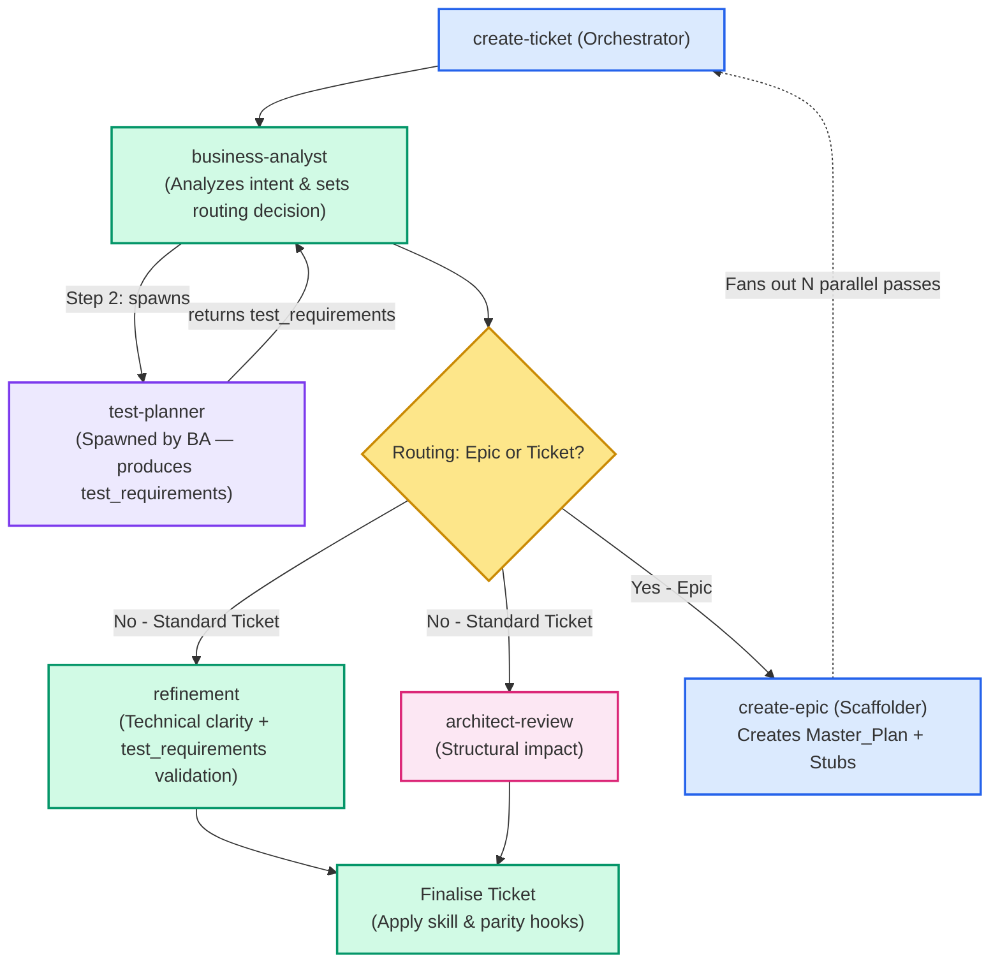
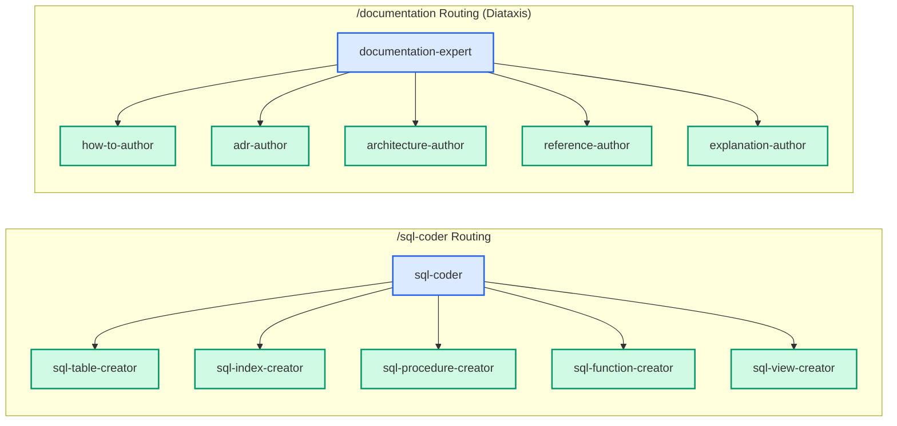
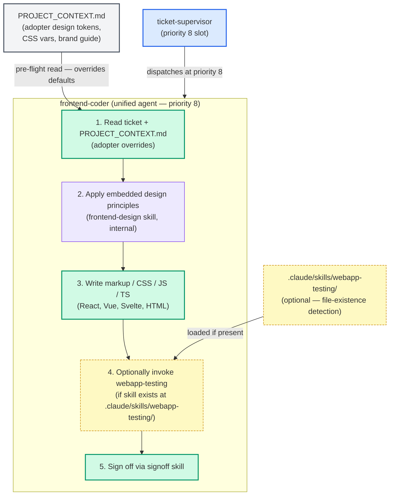

# Agent Code Delivery Workflows

## Purpose

This document visualises how the Brain Trader agent ecosystem orchestrates code delivery. It uses a layered abstraction approach: starting with a high-level mapping of slash commands to their primary agents, followed by detailed "drill-down" views showing how orchestrators and supervisors distribute work to specialised sub-agents. 

> [!TIP]
> For the authoritative rules on how these agents are grouped into model tiers (Haiku, Sonnet, Opus), see [ADR-006](ADR-006-agent-model-tiers.md). For the underlying supervisor architecture and sign-off status mechanics, see [ADR-010](ADR-010-agent-supervisor-signoff-pattern.md).

---

## Diagram Legend

All diagrams in this document use a consistent color-coding scheme to distinguish agent roles and system components:

| Color | Role | Description |
|---|---|---|
| **Yellow/Orange** | **User Interface (UI)** | Slash commands directly invoked by the human user. |
| **Blue** | **Orchestrator** | Supervisory agents that delegate tasks to sub-agents and never write the final code themselves (e.g., `epic-supervisor`, `sql-coder`). |
| **Green** | **Worker** | Implementation agents that execute specific technical tasks (e.g., `python-coder`, `sql-table-creator`). |
| **Pink** | **Gatekeeper** | Agents that enforce quality controls, review code, or escalate issues to Opus (e.g., `pr-reviewer`, `architect-review`). |
| **Grey** | **Input** | Static data files or configuration (e.g., `Master_Plan.md`). |
| **Red** | **Halt / Error** | Terminal states where execution halts and requests human intervention. |

---

## 1. High-Level Overview: Entry Points

This diagram maps user-facing slash commands to their **top-level agents**. Internal specialist sub-agents are omitted here to focus on the primary interfaces.

```mermaid
flowchart TD
    classDef ui fill:#fef3c7,stroke:#d97706,stroke-width:2px;
    classDef orchestrator fill:#dbeafe,stroke:#2563eb,stroke-width:2px;
    classDef worker fill:#d1fae5,stroke:#059669,stroke-width:2px;
    classDef gatekeeper fill:#fce7f3,stroke:#db2777,stroke-width:2px;

    %% Slash Commands
    subgraph Commands ["User Slash Commands"]
        cmdBuild["/build-feature"]:::ui
        cmdTicket["/create-ticket"]:::ui
        cmdPy["/python-coder"]:::ui
        cmdSql["/sql-coder"]:::ui
        cmdDoc["/documentation"]:::ui
        cmdCommit["/commit"]:::ui
        cmdPR["/pull-request"]:::ui
        cmdReview["/pr-review"]:::ui
        cmdDeploy["/prod-deploy"]:::ui
        cmdOther["/test, /database, /status, /worktree"]:::ui
    end

    %% Top-Level Agents
    subgraph Primary_Agents ["Top-Level Agents"]
        epicSup["epic-supervisor"]:::orchestrator
        createTick["create-ticket"]:::orchestrator
        pyCoder["python-coder"]:::worker
        sqlCoder["sql-coder"]:::orchestrator
        docExp["documentation-expert"]:::orchestrator
        commitAgt["commit"]:::worker
        prAgt["pull-request"]:::worker
        prRev["pr-reviewer"]:::gatekeeper
        prodDep["prod-deploy"]:::gatekeeper
        otherAgts["test-runner, database-agent, status-checker, worktree-agent"]:::worker
    end

    %% Mappings
    cmdBuild --> epicSup
    cmdTicket --> createTick
    cmdPy --> pyCoder
    cmdSql --> sqlCoder
    cmdDoc --> docExp
    cmdCommit --> commitAgt
    cmdPR --> prAgt
    cmdReview --> prRev
    cmdDeploy --> prodDep
    cmdOther --> otherAgts
```

---

## 2. Detail View: Ticket Creation Orchestration (`/create-ticket`)

This view shows how the `create-ticket` orchestrator delegates ticket formulation to specialists, and how it handles fan-out for large requests by escalating to `create-epic`. Note that `business-analyst` always spawns `test-planner` as a sub-agent to produce the `test_requirements` block before the BA payload is returned.

---

## 3. Detail View: Implementation Orchestrators (`/sql-coder` & `/documentation`)

> [!IMPORTANT]
> **Strict Delegation Rule:** Orchestrator agents (like `sql-coder` or `documentation-expert`) never write the final code themselves. They assess the user intent, gather architectural context, and route to the correct specialist worker, ensuring quality enforcement and context isolation.

---

## 4. Detail View: Epic & Ticket Supervisor Flow (`/build-feature`)

This flow illustrates how `epic-supervisor` automates parallel delivery by calculating physical dependencies (`files_touched`), and how `ticket-supervisor` distributes work to phase agents based on the ticket's frontmatter. It also outlines the adjudication ladder for blockers.

The canonical phase-agent dispatch order is:
`architect-review → python-coder → sql-coder → frontend-coder → test-writer → test-runner → documentation-expert → pr-reviewer → commit → pull-request`

Priority slots: `python-coder` (6), `sql-coder` (7), `frontend-coder` (8), `test-runner` (9). `frontend-coder` is a **unified** implementation agent — the `frontend-design` skill is embedded inside it (not a separate box in the dispatch topology) and the optional `webapp-testing` skill is invoked internally after UI changes.

`test-writer` is dispatched when the ticket has a non-empty `test_requirements.tests` array (produced by `test-planner` during ticket creation). If the array is empty (docs-only or config-only tickets), `ticket-wiring` sets `test-writer: not_needed` and the phase is skipped.

> [!TIP]
> The **Blocker Adjudication Ladder** is designed to shield the user from trivial issues. Only open-ended design questions (which escalate through the `brainstorm-lead` tier) or completely exhausted retries will interrupt the user.

---

## 5. Detail View: Unified `frontend-coder` at Priority 8

`frontend-coder` is a **unified** sibling implementation agent — a single box at priority 8 in the dispatch topology. It replaces the previously planned `frontend-coder + frontend-design skill` split. The `frontend-design` skill is embedded inside `frontend-coder` and is never a separate node in the dispatch graph. Optional skills (`webapp-testing`) are invoked internally based on file-existence detection.

> [!NOTE]
> `frontend-design` does NOT appear as a separate agent or skill box in the dispatch topology. It is a first-class part of `frontend-coder`'s own reasoning — its design principles are embedded in the agent template (Step 2 above). This is the key architectural difference from the legacy split design.

---

## Key Design Principles

1. **Self-Documenting State:** The `epic-supervisor` determines what phase a ticket is in by parsing the structured `agents:` YAML map in the ticket's frontmatter. It never reads the conversational history.
2. **Safe Parallelism:** Tickets are batched for parallel execution only if their `files_touched` sets are disjoint and logical `depends_on` constraints are met.
3. **Escalating Adjudication:** When a worker encounters a blocker, `ticket-supervisor` attempts mechanical retries before calling an Opus-level brainstormer or bothering the user.
4. **Single Source of Truth:** User-facing slash commands (`/sql-coder`, `/pr-review`) map directly to their underlying orchestration agents, decoupling UX from complex internal routing.

---

## Cross-References

- [Agent Inventory](../agents/README.md) — Comprehensive table of all existing agents and slash commands.
- [ADR-010 — Agent Supervisor & Ticket Sign-off Pattern](ADR-010-agent-supervisor-signoff-pattern.md) — Formal specification for the frontmatter status enum, commit-phase serialization lock, and pre-commit parity guards.
- [Agent Supervisor Design Spec](../superpowers/specs/2026-05-08-agent-supervisor-design.md) — In-depth breakdown of the supervisor execution algorithms.

<!--
====================================================================
DECISION HISTORY
====================================================================
- 2026-06-08 10:00 [BrainCandy]: Added frontend-coder at priority 8 to §4 canonical dispatch order. Added §5 diagram showing unified frontend-coder topology: embedded frontend-design, PROJECT_CONTEXT.md pre-flight, optional webapp-testing skill. No separate frontend-design box in dispatch graph. (#EPIC-Oneagenthandlesboththelookandthecodefor/05)
- 2026-05-13 [Antigravity]: Added test-planner spawn to ticket-creation diagram (§2) and test-writer to phase-agent dispatch order (§4) per ADR-018 and ticket 36 (test-expert injection).
- 2026-05-11 [Antigravity]: Refactored to feature layered abstraction, splitting a single large flow into a high-level overview and specific orchestration detail views. Removed non-coding elements like `trade-report`.
- 2026-05-11 [Antigravity]: Initial creation. Visualises slash command distribution and Epic Supervisor execution flow based on EPIC-CodingAgents and EPIC-AgentSupervisor patterns.
====================================================================
-->
