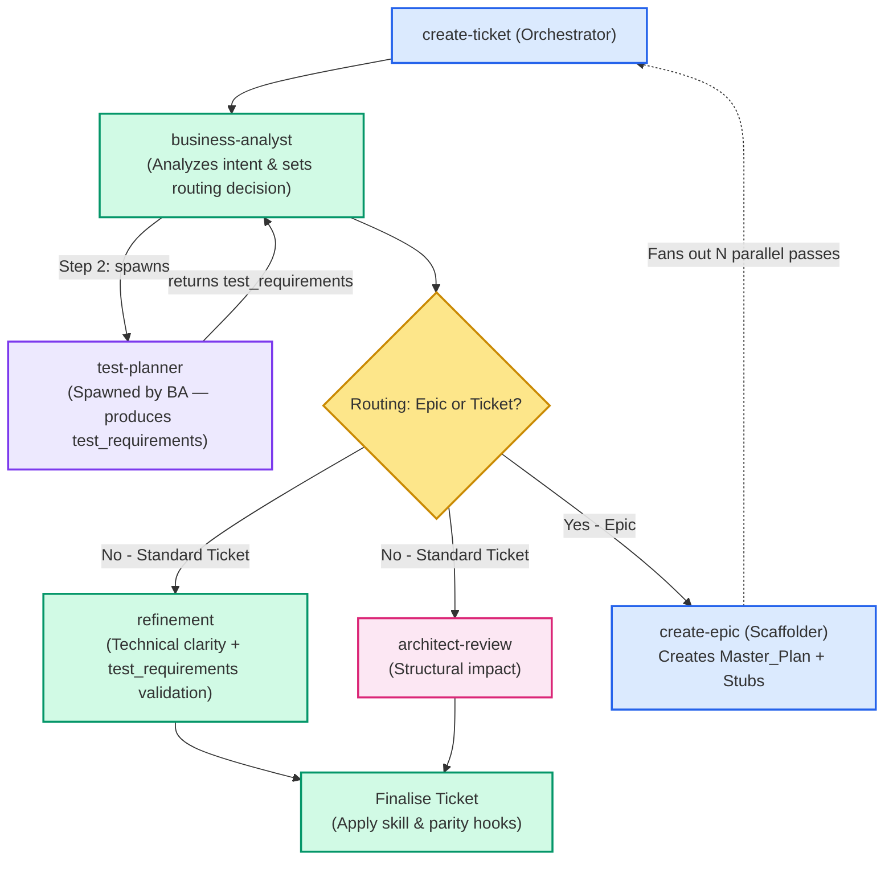
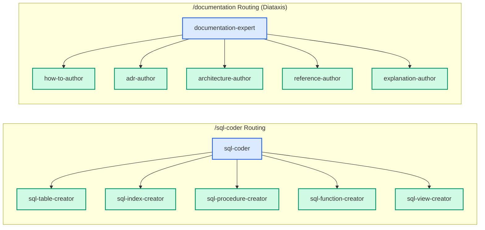
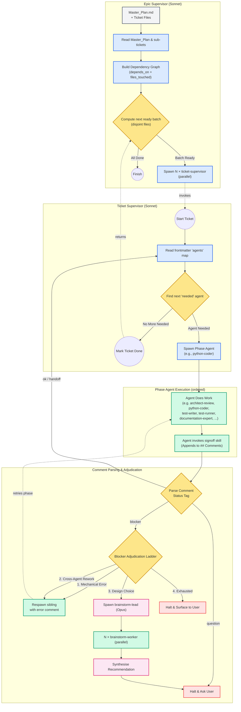
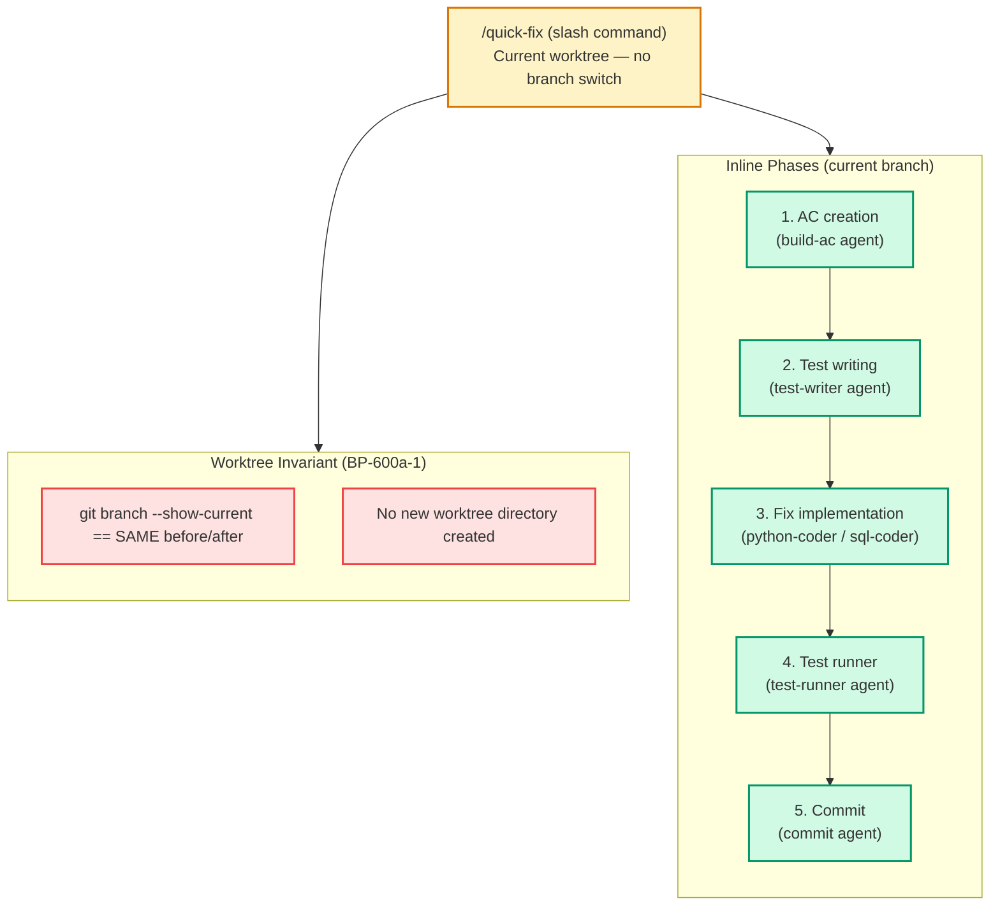

# Agent Code Delivery Workflows

## Purpose

This document visualises how the Brain Trader agent ecosystem orchestrates code delivery. It uses a layered abstraction approach: starting with a high-level mapping of slash commands to their primary agents, followed by detailed "drill-down" views showing how orchestrators and supervisors distribute work to specialised sub-agents. 

> [!TIP]
> For the authoritative rules on how these agents are grouped into model tiers (Haiku, Sonnet, Opus), see [ADR-006](ADR-006-agent-model-tiers.md). For the underlying supervisor architecture and sign-off status mechanics, see [ADR-010](ADR-010-agent-supervisor-signoff-pattern.md).

---

## Diagram Legend

All diagrams in this document use a consistent color-coding scheme to distinguish agent roles and system components:

| Color | Role | Description |
|---|---|---|
| **Yellow/Orange** | **User Interface (UI)** | Slash commands directly invoked by the human user. |
| **Blue** | **Orchestrator** | Supervisory agents that delegate tasks to sub-agents and never write the final code themselves (e.g., `epic-supervisor`, `sql-coder`). |
| **Green** | **Worker** | Implementation agents that execute specific technical tasks (e.g., `python-coder`, `sql-table-creator`). |
| **Pink** | **Gatekeeper** | Agents that enforce quality controls, review code, or escalate issues to Opus (e.g., `pr-reviewer`, `architect-review`). |
| **Grey** | **Input** | Static data files or configuration (e.g., `Master_Plan.md`). |
| **Red** | **Halt / Error** | Terminal states where execution halts and requests human intervention. |

---

## 1. High-Level Overview: Entry Points

This diagram maps user-facing slash commands to their **top-level agents**. Internal specialist sub-agents are omitted here to focus on the primary interfaces.

```mermaid
flowchart TD
    classDef ui fill:#fef3c7,stroke:#d97706,stroke-width:2px;
    classDef orchestrator fill:#dbeafe,stroke:#2563eb,stroke-width:2px;
    classDef worker fill:#d1fae5,stroke:#059669,stroke-width:2px;
    classDef gatekeeper fill:#fce7f3,stroke:#db2777,stroke-width:2px;

    %% Slash Commands
    subgraph Commands ["User Slash Commands"]
        cmdBuild["/build-feature"]:::ui
        cmdTicket["/create-ticket"]:::ui
        cmdQuickFix["/quick-fix"]:::ui
        cmdPy["/python-coder"]:::ui
        cmdSql["/sql-coder"]:::ui
        cmdDoc["/documentation"]:::ui
        cmdCommit["/commit"]:::ui
        cmdPR["/pull-request"]:::ui
        cmdReview["/pr-review"]:::ui
        cmdDeploy["/prod-deploy"]:::ui
        cmdOther["/test, /database, /status, /worktree"]:::ui
    end

    %% Top-Level Agents
    subgraph Primary_Agents ["Top-Level Agents"]
        epicSup["epic-supervisor"]:::orchestrator
        createTick["create-ticket"]:::orchestrator
        quickFixAgt["ticket-supervisor (inline,<br/>current worktree — no branch switch)"]:::orchestrator
        pyCoder["python-coder"]:::worker
        sqlCoder["sql-coder"]:::orchestrator
        docExp["documentation-expert"]:::orchestrator
        commitAgt["commit"]:::worker
        prAgt["pull-request"]:::worker
        prRev["pr-reviewer"]:::gatekeeper
        prodDep["prod-deploy"]:::gatekeeper
        otherAgts["test-runner, database-agent, status-checker, worktree-agent"]:::worker
    end

    %% Mappings
    cmdBuild --> epicSup
    cmdTicket --> createTick
    cmdQuickFix --> quickFixAgt
    cmdPy --> pyCoder
    cmdSql --> sqlCoder
    cmdDoc --> docExp
    cmdCommit --> commitAgt
    cmdPR --> prAgt
    cmdReview --> prRev
    cmdDeploy --> prodDep
    cmdOther --> otherAgts
```



---

## 2. Detail View: Ticket Creation Orchestration (`/create-ticket`)

This view shows how the `create-ticket` orchestrator delegates ticket formulation to specialists, and how it handles fan-out for large requests by escalating to `create-epic`. Note that `business-analyst` always spawns `test-planner` as a sub-agent to produce the `test_requirements` block before the BA payload is returned.



---

## 3. Detail View: Implementation Orchestrators (`/sql-coder` & `/documentation`)

> [!IMPORTANT]
> **Strict Delegation Rule:** Orchestrator agents (like `sql-coder` or `documentation-expert`) never write the final code themselves. They assess the user intent, gather architectural context, and route to the correct specialist worker, ensuring quality enforcement and context isolation.



---

## 4. Detail View: Epic & Ticket Supervisor Flow (`/build-feature`)

This flow illustrates how `epic-supervisor` automates parallel delivery by calculating physical dependencies (`files_touched`), and how `ticket-supervisor` distributes work to phase agents based on the ticket's frontmatter. It also outlines the adjudication ladder for blockers.

The canonical phase-agent dispatch order is:
`architect-review → python-coder → test-writer → test-runner → documentation-expert → pr-reviewer → commit → pull-request`

`test-writer` is dispatched when the ticket has a non-empty `test_requirements.tests` array (produced by `test-planner` during ticket creation). If the array is empty (docs-only or config-only tickets), `ticket-wiring` sets `test-writer: not_needed` and the phase is skipped.



> [!TIP]
> The **Blocker Adjudication Ladder** is designed to shield the user from trivial issues. Only open-ended design questions (which escalate through the `brainstorm-lead` tier) or completely exhausted retries will interrupt the user.

---

---

## 5. Detail View: Quick-Fix Workflow (`/quick-fix`)

The `/quick-fix` command is a **current-worktree-only** workflow. Unlike `/build-feature`, it
never creates a new worktree or switches branches. The user invokes it from an existing
worktree (e.g. `EPIC-SomeFeature`) and all operations — AC creation, test writing, fix, and
commit — complete on the **same branch** the user was already on.

### AC BP-600a-1 — Worktree invariant

```
Given a user is on branch "EPIC-SomeFeature" in an existing worktree,
When they invoke /quick-fix with a diagnosis specifying a file and root cause,
Then the workflow performs all operations (AC creation, test writing, fix, commit)
  in the current worktree,
And git branch --show-current returns the same branch name both before and after
  the workflow completes,
And no new worktree directory is created during execution.
```

### Contrast with `/build-feature`

| Aspect | `/build-feature` | `/quick-fix` |
|--------|-----------------|-------------|
| Worktree | Creates a new isolated worktree per epic/ticket | Stays in the **current** worktree |
| Branch | Creates and switches to a new feature branch | Stays on the **current** branch |
| Entry point | `build-ticket.js` (JS workflow) or `build-single-ticket` skill | `quick-fix.js` (JS workflow, inline) |
| Depth model | `ticket-supervisor` at depth 0; phase agents at depth 1 (ADR-006) | Same depth model — `ticket-supervisor` inline at depth 0 |
| Ticket lifecycle | Full inbox → todo → done lifecycle | Lightweight — single-shot fix; ticket created inline and driven to commit in one pass |

### Flow



### AC BP-600a-1 constraint: no `git worktree add`, no `setup_ticket_worktree.py`

The `quick-fix.js` workflow script MUST NOT call `setup_ticket_worktree.py` or any equivalent
command that creates a new worktree directory. All phases run in the directory where `/quick-fix`
was invoked. This is enforced by the AC store entry `BP-600a-1` and checked by
`git branch --show-current` before and after the workflow completes.

### AC BP-600a-2 — No isolation infrastructure

Beyond the worktree invariant, `/quick-fix` must use **no isolation infrastructure** from
the full build pipeline. Specifically, the following are unconditionally prohibited in
`quick-fix.js` and in any agent dispatched by it:

| Prohibited item | Why |
|---|---|
| `worktree-agent` dispatch | Creates/manages isolated git worktrees — the opposite of stay-in-place |
| `feature` skill invocation | Calls `git worktree add`; creates branch isolation — violates BP-600a-1 |
| `git worktree add` | Direct worktree creation command — prohibited by BP-600a-1 |
| `setup_ticket_worktree.py` | Bootstrap script for new isolated worktrees — not needed in existing worktree |
| Any branch-switching command | `git checkout -b`, `git switch -c`, etc. |

The phase agents dispatched by `/quick-fix` (`build-ac`, `test-writer`, `python-coder`,
`test-runner`, `commit`) are worktree-agnostic — they operate on files in the current
directory and do not require an isolated branch context.

**Rationale:** `/quick-fix` is designed for rapid, in-place fixes to known bugs. Isolation
infrastructure adds 30–60 seconds of overhead and introduces branch-switch race conditions
when the user is mid-work on an active epic branch. The invariant is verifiable:
`git branch --show-current` must return the same branch name before and after the workflow.

### AC BP-600a-3 — Uncommitted changes guard

Before executing any phase, `/quick-fix` MUST check whether the target file has
uncommitted changes in the working tree. The Gherkin contract:

```gherkin
Given the user's worktree has unstaged changes in the file
  "scripts/build_helpers.py",
When the user invokes /quick-fix with a diagnosis targeting
  "scripts/build_helpers.py",
Then the workflow halts before any AC creation or code changes,
And it reports the conflicting uncommitted changes in the target file,
And it suggests the user commit or stash before retrying.
```

**Implementation contract:**

The guard runs as the **first step** of `/quick-fix`, immediately after parsing the
diagnosis input and resolving the target file path. Before any AC creation, test writing,
or code modification:

1. Run `git status --porcelain <target_file>`.
2. If the output is non-empty (the file has unstaged or staged changes):
   a. Print a structured halt message identifying the target file and the conflicting
      change (modified `M`, untracked `??`, staged `A`, etc.).
   b. Print the suggested remediation: `git commit` the current changes or
      `git stash push <target_file>` before retrying.
   c. Exit the workflow immediately — no AC file is written, no test is created, no
      code is changed.
3. If the output is empty, the target file is clean — proceed normally.

**Why this guard is necessary:**

Without it, `/quick-fix` could write a new failing test and apply a code fix to a file
that already contains in-progress work. The subsequent commit would bundle both the
user's uncommitted work and the quick-fix changes into a single commit, obscuring the
audit trail and potentially corrupting in-progress feature work. The guard enforces a
clean-slate assumption: `/quick-fix` is a rapid-fix tool, not a merge tool.

**Output format (halt message):**

```
/quick-fix halted: target file has uncommitted changes.

  File:    scripts/build_helpers.py
  Status:  M  (modified, unstaged)

  The quick-fix workflow requires a clean working tree for the target file.
  Please resolve the uncommitted changes before retrying:

    Option A — commit the changes:
      git add scripts/build_helpers.py
      git commit -m "wip: save in-progress changes before quick-fix"

    Option B — stash the changes:
      git stash push scripts/build_helpers.py

  Then re-invoke: /quick-fix <your-diagnosis>
```

### AC BP-600d-1 — Structured diagnosis input parsing

Before any phase runs, `/quick-fix` MUST parse the user-provided diagnosis text and extract
four structured fields. The Gherkin contract:

```gherkin
Given the user invokes /quick-fix with text containing "In
  scripts/build_helpers.py line 42, _resolve_precommit_cmd() returns
  a non-executable path because the executability probe is skipped
  when shutil.which returns None",
When the workflow parses the input,
Then it extracts the target file path ("scripts/build_helpers.py"),
  the location hint ("line 42"), the symptom ("returns a
  non-executable path"), and the root cause ("executability probe
  is skipped"),
And it uses these fields to drive AC creation, test writing, and
  fix application in subsequent phases.
```

**Parsed fields and their downstream consumers:**

| Field | Example value | Consumed by |
|---|---|---|
| `target_file` | `scripts/build_helpers.py` | Uncommitted changes guard (BP-600a-3), python-coder, test-writer |
| `location_hint` | `line 42` | python-coder (narrows the fix scope), test-writer (anchors the failing assertion) |
| `symptom` | `returns a non-executable path` | AC creation (describes observable failure), test-writer (names the expected vs actual) |
| `root_cause` | `executability probe is skipped` | AC creation (names the cause), python-coder (targets the exact logic branch to fix) |

**Parsing contract:**

The workflow accepts two input forms:

1. **Natural-language sentence** — the canonical form. The parser uses the following
   structural markers to identify fields:
   - `In <path>` or `In <path> line <N>` → `target_file` + optional `location_hint`
   - `<function>() returns ...` or similar verb phrase → `symptom`
   - `because ...` or `when ...` → `root_cause`

2. **Structured JSON** — an alternative form for programmatic invocation:
   ```json
   {
     "target_file": "scripts/build_helpers.py",
     "location_hint": "line 42",
     "symptom": "returns a non-executable path",
     "root_cause": "executability probe is skipped when shutil.which returns None"
   }
   ```

**Validation rules:**

- `target_file` MUST resolve to an existing file in the current worktree. If the file
  does not exist, the workflow halts with:
  ```
  /quick-fix halted: target file not found.
    File: <target_file>
    The diagnosis references a file that does not exist in the current worktree.
  ```
- `symptom` and `root_cause` MUST be non-empty strings. If either is absent after
  parsing, the workflow halts and asks the user to clarify:
  ```
  /quick-fix needs clarification: could not extract symptom and root cause from diagnosis.
    Parsed so far: target_file=<value>, location_hint=<value or (none)>
    Please rephrase: "In <file> [line N], <function>() <symptom> because <root_cause>."
  ```
- `location_hint` is optional. If absent, the downstream agents receive `null` for
  this field and must handle it gracefully (i.e. they do not require a line number to
  proceed; they use the symptom and root cause alone).

**How the parsed fields drive downstream phases:**

1. **AC creation** (`build-ac` agent) — receives `target_file`, `symptom`, and
   `root_cause` as structured inputs. Uses them to populate the AC Gherkin template:
   - Given: the target file exists and the buggy function is present
   - When: the triggering condition (derived from `root_cause`)
   - Then: the expected correct behaviour (derived from `symptom` negation)

2. **Test writing** (`test-writer` agent) — receives all four fields. Uses
   `target_file` and `location_hint` to locate the test anchor, and `symptom` to
   name the assertion (`assert result != <symptom-value>`).

3. **Fix implementation** (`python-coder` agent) — receives all four fields. Uses
   `location_hint` to narrow the edit scope and `root_cause` to identify the logic
   branch to repair.

---

## Key Design Principles

1. **Self-Documenting State:** The `epic-supervisor` determines what phase a ticket is in by parsing the structured `agents:` YAML map in the ticket's frontmatter. It never reads the conversational history.
2. **Safe Parallelism:** Tickets are batched for parallel execution only if their `files_touched` sets are disjoint and logical `depends_on` constraints are met.
3. **Escalating Adjudication:** When a worker encounters a blocker, `ticket-supervisor` attempts mechanical retries before calling an Opus-level brainstormer or bothering the user.
4. **Single Source of Truth:** User-facing slash commands (`/sql-coder`, `/pr-review`) map directly to their underlying orchestration agents, decoupling UX from complex internal routing.
5. **Current-Worktree-First for Known Bugs:** The `/quick-fix` workflow stays in the current worktree and branch. Speed and quality discipline are not in tension — the same phase agents run inline without a branch switch (ADR-006; AC BP-600a-1).

---

## Cross-References

- [Agent Inventory](../agents/README.md) — Comprehensive table of all existing agents and slash commands.
- [ADR-010 — Agent Supervisor & Ticket Sign-off Pattern](ADR-010-agent-supervisor-signoff-pattern.md) — Formal specification for the frontmatter status enum, commit-phase serialization lock, and pre-commit parity guards.
- [Agent Supervisor Design Spec](../superpowers/specs/2026-05-08-agent-supervisor-design.md) — In-depth breakdown of the supervisor execution algorithms.

<!--
====================================================================
DECISION HISTORY
====================================================================
- 2026-06-08 [llm-expert]: Added AC BP-600d-1 structured diagnosis input parsing section to Section 5: Gherkin contract, four parsed fields table, two input forms, validation rules, and downstream consumer mapping. (#EPIC-QuickFixWorkflow/09)
- 2026-06-08 [llm-expert]: Added AC BP-600a-3 uncommitted changes guard section to Section 5: guard contract, implementation steps, halt message format, and rationale. (#EPIC-QuickFixWorkflow/03)
- 2026-06-08 [llm-expert]: Added AC BP-600a-2 documentation to Section 5: prohibited isolation infrastructure table, no-worktree-agent/no-feature-skill constraint, and rationale for the exclusion. (#EPIC-QuickFixWorkflow/02)
- 2026-06-08 [llm-expert]: Added /quick-fix to high-level overview (§1) and Section 5 documenting the current-worktree-only flow, worktree invariant (BP-600a-1), contrast table with /build-feature, and Mermaid flow diagram. (#EPIC-QuickFixWorkflow/01)
- 2026-05-13 [Antigravity]: Added test-planner spawn to ticket-creation diagram (§2) and test-writer to phase-agent dispatch order (§4) per ADR-018 and ticket 36 (test-expert injection).
- 2026-05-11 [Antigravity]: Refactored to feature layered abstraction, splitting a single large flow into a high-level overview and specific orchestration detail views. Removed non-coding elements like `trade-report`.
- 2026-05-11 [Antigravity]: Initial creation. Visualises slash command distribution and Epic Supervisor execution flow based on EPIC-CodingAgents and EPIC-AgentSupervisor patterns.
====================================================================
-->
