# Agent Knowledge Plane

## Purpose

This document is the canonical reference for **knowledge injection** — how
leafcutter agents receive context at invocation time. It enumerates every
channel through which information flows _into_ an agent's context window
before work begins.

This document is the injection-side complement to
[Agent Knowledge System](agent_knowledge_system.md), which covers the
capture side (how agents persist learnings _after_ work). See also
[Agent Delivery Workflows](agent_delivery_workflows.md) for the execution
topology (how agents are orchestrated and dispatched).

> **When to cite this document.** Any skill or agent template that describes
> how its instructions reach an agent at spawn time SHOULD link here rather
> than inlining the channel layout. This keeps the description in one place
> and prevents sources from drifting as new channels are added.

---

## Concept: The Knowledge Plane

An agent's effective context window is not a single file — it is the union
of many sources, each managed by a different part of the harness or the
project:

```
                  ┌────────────────────────────────────────┐
  Knowledge       │         Agent Context Window           │
  Sources   ───►  │  (assembled by Claude Code harness     │
                  │   at agent spawn / tool invocation)    │
                  └────────────────────────────────────────┘
```

The harness assembles this context from **eleven injection channels** that
differ in their writer, trigger, format, and target audience. Understanding
these channels lets future knowledge-routing skills decide _where_ to put a
new piece of information so that the right agents see it at the right time.

---

## Channels at a Glance

| # | Source | Written by | Loaded when | Format | Target agents |
|---|--------|------------|-------------|--------|---------------|
| 1 | Root `CLAUDE.md` | Human / build pipeline | Always — injected into every agent by the harness | Markdown (free-form + structured headings) | All agents |
| 2 | Per-folder `README.md` | Human / documentation-expert | When the agent's cwd overlaps the folder | Markdown | Agents whose scope touches the folder |
| 3 | `PROJECT_CONTEXT.md` | Any phase agent via `capture-learning` | When loaded alongside its sibling `SKILL.md` | Markdown (append-only sections) | Agents that load the co-located skill |
| 4 | Auto-loaded skills (`skills_config.json`) | Skill authors; harness build pipeline | Declared in `skills_config.json`, loaded at every spawn | SKILL.md front-matter + body | All agents (or agent-subset specified in config) |
| 5 | On-demand skills (Skill tool) | Skill authors | Invoked via the Skill tool during task execution | SKILL.md front-matter + body | Agent that invokes the skill |
| 6 | Agent frontmatter | Agent template authors | Parsed by harness at agent spawn | YAML front-matter (model, tools, allowed-tools, signoff, config_keys, portable, adopter_notes) | The single agent being spawned |
| 7 | `skills_config.json` + `settings.json` | Harness operators / build.py | Read by harness at startup; governs skill auto-loading and feature flags | JSON | All agents (harness-mediated) |
| 8 | Ticket frontmatter | `business-analyst` / `refinement` agents | Passed as `ticket_path` input to the spawned agent | YAML (agents map, files_touched, depends_on, acceptance criteria) | Phase agents in the ticket's `agents:` map |
| 9 | Auto-memory (`memory/*.md`) | Any agent via `route-learning` / `capture-learning` §7 | Loaded by harness from `memory/` directory at agent spawn | Markdown files (one per topic) | All agents (harness-injected) |
| 10 | MCP server prompts + tool descriptions | MCP server authors | Registered MCP servers injected by Claude Code at startup | Tool schema + system prompt fragments | All agents using the MCP server |
| 11 | Glossary injection (`docs/glossary.md`) | `glossary-triage` agent / `check-glossary-coverage` hook | Via `CLAUDE.md` reference or system-reminder injection | Markdown (term → definition table) | All agents (CLAUDE.md-mediated) |

---

## Architecture Diagrams

### Diagram 1 — Knowledge Sources → Agent Context Window

```mermaid
flowchart TD
    classDef harness fill:#dbeafe,stroke:#2563eb,stroke-width:2px;
    classDef config fill:#f3f4f6,stroke:#4b5563,stroke-width:2px;
    classDef doc fill:#d1fae5,stroke:#059669,stroke-width:2px;
    classDef memory fill:#ede9fe,stroke:#7c3aed,stroke-width:2px;
    classDef ticket fill:#fef3c7,stroke:#d97706,stroke-width:2px;
    classDef mcp fill:#fce7f3,stroke:#db2777,stroke-width:2px;
    classDef context fill:#dbeafe,stroke:#2563eb,stroke-width:3px;

    subgraph Always_Injected ["Always Injected (all agents)"]
        CH1["① Root CLAUDE.md\n(project-wide instructions)"]:::doc
        CH9["⑨ Auto-memory\n(memory/*.md)"]:::memory
        CH10["⑩ MCP server prompts\n+ tool descriptions"]:::mcp
        CH11["⑪ Glossary injection\n(docs/glossary.md)"]:::doc
        CH4["④ Auto-loaded skills\n(skills_config.json)"]:::config
    end

    subgraph Spawn_Scoped ["Spawn-Scoped (this agent only)"]
        CH6["⑥ Agent frontmatter\n(model, tools, signoff,\nconfig_keys, portable)"]:::config
        CH7["⑦ skills_config.json\n+ settings.json\n(harness config)"]:::config
    end

    subgraph Ticket_Scoped ["Ticket-Scoped (per ticket_path)"]
        CH8["⑧ Ticket frontmatter\n(agents map, files_touched,\ndepends_on, criteria)"]:::ticket
    end

    subgraph Path_Scoped ["Path-Scoped (cwd-relative)"]
        CH2["② Per-folder README.md\n(injected when cwd overlaps)"]:::doc
        CH3["③ PROJECT_CONTEXT.md\n(co-located with SKILL.md)"]:::doc
        CH5["⑤ On-demand skills\n(Skill tool invocation)"]:::config
    end

    AgentContext["Agent Context Window\n(assembled at spawn)"]:::context

    CH1 --> AgentContext
    CH9 --> AgentContext
    CH10 --> AgentContext
    CH11 --> AgentContext
    CH4 --> AgentContext
    CH6 --> AgentContext
    CH7 --> AgentContext
    CH8 --> AgentContext
    CH2 --> AgentContext
    CH3 --> AgentContext
    CH5 --> AgentContext
```



### Diagram 2 — Injection Timing by Channel

```mermaid
flowchart LR
    classDef static fill:#d1fae5,stroke:#059669,stroke-width:2px;
    classDef dynamic fill:#fef3c7,stroke:#d97706,stroke-width:2px;
    classDef ondemand fill:#ede9fe,stroke:#7c3aed,stroke-width:2px;

    subgraph T0 ["At Harness Startup"]
        A7["⑦ skills_config.json\n+ settings.json"]:::static
        A10["⑩ MCP server prompts"]:::static
    end

    subgraph T1 ["At Agent Spawn"]
        B1["① Root CLAUDE.md"]:::static
        B4["④ Auto-loaded skills"]:::static
        B6["⑥ Agent frontmatter"]:::static
        B9["⑨ Auto-memory files"]:::static
        B11["⑪ Glossary (via CLAUDE.md)"]:::static
        B2["② Per-folder README.md\n(if cwd matches)"]:::dynamic
        B3["③ PROJECT_CONTEXT.md\n(if skill loaded)"]:::dynamic
        B8["⑧ Ticket frontmatter\n(if ticket_path supplied)"]:::dynamic
    end

    subgraph T2 ["During Task Execution"]
        C5["⑤ On-demand skills\n(Skill tool)"]:::ondemand
    end

    T0 --> T1
    T1 --> T2
```



---

## Channel Details

### ① Root `CLAUDE.md`

**What it is.** The project-wide instruction file placed at the repository
root (or the consumer project root when leafcutter is installed as a
sub-directory). Claude Code automatically injects it into every conversation
and agent invocation.

**Writer.** Human developers and the build pipeline. `build.py` maintains a
`<!-- roadmap-phase -->` block and the `glossary-section` block; humans
maintain the rest.

**Format.** Free-form Markdown with structured headings. Conventions:
repository structure, SSH auth, glossary pointer, roadmap phase, pre-drive
checklist.

**Loaded when.** Always — Claude Code reads it at harness startup and injects
it as a system-level context block for every agent.

**Target agents.** All agents.

---

### ② Per-folder `README.md`

**What it is.** A Markdown file co-located with the source files in a given
directory. Explains the purpose of the folder, the files within it, and any
conventions specific to that scope.

**Writer.** Human developers; `documentation-expert` creates or updates these
as part of the documentation phase.

**Format.** Markdown.

**Loaded when.** When the agent's current working directory overlaps the
folder. The harness automatically injects the nearest `README.md` for context.

**Target agents.** Agents whose task scope includes files in that directory
(e.g. `python-coder` working in `leafcutter/scripts/`, `sql-coder` working
in `alembic/versions/`).

---

### ③ `PROJECT_CONTEXT.md` (skill companion)

**What it is.** A project-specific companion file co-located alongside a
`SKILL.md` in `.claude/skills/<name>/`. While `SKILL.md` is a portable
upstream template, `PROJECT_CONTEXT.md` captures project-specific learnings
accumulated during use of that skill.

**Writer.** Any phase agent via the `capture-learning` skill (§7 of the
`signoff` skill triggers this). Also writable by `route-learning` when Step 5
of the decision tree fires.

**Format.** Markdown, append-only sections. Naming convention: MUST be
`PROJECT_CONTEXT.md` (all caps, underscore separator).

**Loaded when.** When the skill is loaded (either auto-loaded or on-demand),
the agent is expected to also read the co-located `PROJECT_CONTEXT.md` if it
exists.

**Target agents.** Agents that load the co-located skill.

---

### ④ Auto-loaded Skills (`skills_config.json`)

**What it is.** Skills declared in `config/skills_config.json` (or
`skills_config.default.json`) with an `auto_load: true` flag. The harness
reads this config at startup and makes the listed skills available as
background context for every agent spawn.

**Writer.** Skill authors; build pipeline updates the deployed copy.

**Format.** Each skill is a `SKILL.md` file with YAML frontmatter and a
Markdown body describing procedures, constraints, and examples.

**Loaded when.** At agent spawn, as part of the harness initialization
sequence before the agent's first message.

**Target agents.** All agents (or a filtered subset if `skills_config.json`
specifies target agent IDs).

---

### ⑤ On-demand Skills (Skill tool)

**What it is.** Skills invoked explicitly during task execution via the Skill
tool (e.g. `Use skill: signoff`). The agent receives the skill's content in
its context at the point of invocation.

**Writer.** Skill authors.

**Format.** `SKILL.md` with YAML frontmatter + Markdown body.

**Loaded when.** When the agent calls the Skill tool with the skill name. The
available-skills list is provided in the agent's system reminder so the agent
knows what to ask for.

**Target agents.** The individual agent that invokes the skill.

---

### ⑥ Agent Frontmatter

**What it is.** The YAML frontmatter block at the top of each agent template
file (e.g. `leafcutter/templates/agents/python-coder.md`). It configures the
agent's runtime behavior.

**Writer.** Agent template authors; `build.py` deploys the compiled version to
`.claude/agents/`.

**Format.** YAML. Key fields:
- `model` — which Claude model to use (e.g. `claude-haiku-4-5`, `claude-sonnet-4-5`).
- `tools` (or `allowed-tools`) — the tool subset the agent may use.
- `signoff` — whether this agent performs ticket sign-off.
- `config_keys` — environment variables / settings the agent reads.
- `portable` — whether the agent is portable across consumer projects.
- `adopter_notes` — guidance for teams installing leafcutter.
- `description` — human-readable purpose statement.

**Loaded when.** At agent spawn. The harness parses the frontmatter to
configure the model, tools, and system-level constraints.

**Target agents.** The single agent being spawned.

---

### ⑦ `skills_config.json` + `settings.json`

**What it is.** Configuration files that govern harness-level behaviour:
which skills to auto-load, feature flags, model defaults, path mappings.

- `config/skills_config.default.json` — default skill auto-loading rules.
- `config/settings.json` (consumer-generated) — consumer project overrides.
- `config/paths.json` — canonical path map (repo-relative paths for all
  artifacts).

**Writer.** Build pipeline (`build.py`); harness operators.

**Format.** JSON.

**Loaded when.** At harness startup, before any agent is spawned. Governs the
entire subsequent session.

**Target agents.** All agents (harness-mediated — agents do not read these
files directly; the harness translates them into context injection decisions).

---

### ⑧ Ticket Frontmatter

**What it is.** The YAML frontmatter in a ticket's Markdown file, which
carries the `agents` map, `files_touched`, `depends_on`, `title`, `priority`,
`acceptance_criteria`, and other fields produced by `business-analyst` and
`refinement`.

**Writer.** `business-analyst` and `refinement` agents during the
`/create-ticket` workflow.

**Format.** YAML frontmatter in a Markdown ticket file, plus the structured
`## Implementation Tasks`, `## Acceptance Criteria`, and `## Sign-offs`
sections in the body.

**Loaded when.** When the supervisor spawns a phase agent with a `ticket_path`
argument. The agent reads the ticket file at `ticket_path` to understand its
scope, constraints, and acceptance criteria.

**Target agents.** All phase agents operating within the ticket-supervisor
loop (`architect-review`, `python-coder`, `sql-coder`, `pr-reviewer`,
`commit`, `pull-request`, etc.).

---

### ⑨ Auto-memory (`memory/*.md`)

**What it is.** A directory of Markdown files (one per topic) maintained by
agents and operators to persist learnings across sessions. The harness
automatically loads these files into each agent's context at spawn time.

**Writer.** Any agent via `route-learning` §7 (Steps 7 or 10 of the decision
tree). Also writable by the user via `~/.claude/projects/<hash>/memory/`.

**Format.** Markdown. Each file covers one topic (e.g.
`feedback_use_ticket_supervisor.md`, `git_remote.md`).

**Loaded when.** At agent spawn. The harness reads the `memory/` directory and
injects each file as a context block.

**Target agents.** All agents.

---

### ⑩ MCP Server Prompts + Tool Descriptions

**What it is.** When Claude Code has registered MCP (Model Context Protocol)
servers, each server contributes:
- A **system-prompt fragment** describing the server's domain and capabilities.
- **Tool schemas** for each exposed tool, injected as structured tool
  descriptions.

**Writer.** MCP server authors.

**Format.** JSON tool schemas (OpenAPI-style); Markdown system-prompt fragments.

**Loaded when.** At harness startup when the MCP server is registered in
`.claude/settings.json` (or equivalent). The tool descriptions are available
to all subsequent agents in the session.

**Target agents.** All agents that invoke tools provided by the MCP server.

---

### ⑪ Glossary Injection (`docs/glossary.md`)

**What it is.** The project-wide glossary (`docs/glossary.md`) contains
project-specific terms, abbreviations, and domain vocabulary. It is referenced
in `CLAUDE.md` so that all agents are directed to consult it when encountering
unfamiliar project jargon.

**Writer.** `glossary-triage` agent (automated, triggered by the
`check-glossary-coverage` pre-commit hook when novel terms are detected in
staged files). **Do not hand-edit** — use the triage flow.

**Format.** Markdown table (Term | Definition | Source).

**Loaded when.** Via `CLAUDE.md` reference (Channel ①) — agents are
instructed to consult it at the start of any work touching project-specific
terminology. In some configurations, a glossary summary block may be injected
directly via the system reminder.

**Target agents.** All agents (CLAUDE.md-mediated).

---

## Injection Priority and Override Rules

When the same concept appears in multiple channels, the **more specific
channel wins** at the point of decision:

1. **Ticket frontmatter (⑧)** — most specific; overrides all others for
   the current ticket scope.
2. **Agent frontmatter (⑥)** — overrides harness defaults for this agent.
3. **On-demand skills (⑤)** — overrides auto-loaded skill content for the
   invoked skill.
4. **Auto-loaded skills (④)** and **PROJECT_CONTEXT.md (③)** — loaded
   collectively; later files within a channel do not override earlier ones
   unless the skill explicitly states overriding behaviour.
5. **Per-folder README (②)** — scoped to the folder; does not override
   project-level guidance.
6. **Root CLAUDE.md (①)**, **auto-memory (⑨)**, **glossary (⑪)** — project-wide
   defaults; lowest override priority.

---

## Relationship to Sibling Docs

- **[Agent Knowledge System](agent_knowledge_system.md)** — describes the
  _capture_ side: how agents persist learnings via `route-learning` and
  `capture-learning` after task completion. The two docs are complementary:
  this doc covers injection (what enters the context window); that doc
  covers capture (what exits and is persisted for future invocations).

- **[Agent Delivery Workflows](agent_delivery_workflows.md)** — describes the
  _execution_ topology: how supervisors dispatch agents, how tickets are
  batched, and how blockers are adjudicated. Context injection (this doc) is
  a prerequisite for understanding what each dispatched agent knows when it
  starts.

---

## Design Principles

1. **Separation of concerns.** Each channel has a distinct writer and trigger.
   Mixing concerns (e.g. embedding ticket scope into CLAUDE.md) produces
   brittle, hard-to-maintain configurations.

2. **Specificity wins.** More-specific channels (ticket, agent frontmatter)
   override less-specific ones (CLAUDE.md, auto-memory). This lets the
   harness deliver accurate, scoped context without needing conditional logic
   in the project's root instructions.

3. **Portability boundary.** Channels ①, ④, and ⑥ contain portable content
   (they ship with the leafcutter package and are valid in any consumer
   project). Channels ②, ③, ⑧, ⑨, and ⑪ contain project-specific content
   (they live in the consumer project's working tree). See
   [ADR-001](adrs/ADR-001-self-hosting-boundary.md) for the self-hosting
   boundary convention.

4. **Auditability.** Every channel has a defined writer and a predictable
   injection trigger. This makes it possible to trace exactly why an agent
   behaved a certain way by checking which channels were active at invocation.

---

## Cross-References

- [Agent Knowledge System](agent_knowledge_system.md) — knowledge capture
  (post-execution persistence via `route-learning` / `capture-learning`).
- [Agent Delivery Workflows](agent_delivery_workflows.md) — agent dispatch
  topology and supervisor execution model.
- [ADR-001 — Self-Hosting Boundary](adrs/ADR-001-self-hosting-boundary.md) —
  portability boundary between package and consumer project.
- `config/skills_config.default.json` — auto-loaded skill declarations.
- `config/settings.json` — consumer-project harness overrides.
- `config/paths.json` — canonical path map consumed by the harness.
- `.claude/skills/route-learning/SKILL.md` — decision tree for routing
  learnings to the correct channel after task completion.
- `.claude/skills/capture-learning/SKILL.md` — write executor for persisting
  routed learnings.
- `.claude/skills/signoff/SKILL.md` §7 — mandatory knowledge-capture trigger
  after every phase agent sign-off.

<!-- related-code-hash:3a2a4fc1 -->

<!--
====================================================================
DECISION HISTORY
====================================================================
- 2026-05-30 [ticket-supervisor]: Initial creation. Authored per TICKET-20260526-knowledge_plane_architecture_doc. Enumerates all 11 knowledge-injection channels with writer / loader / format / target-agents table and two mermaid diagrams.
====================================================================
-->
