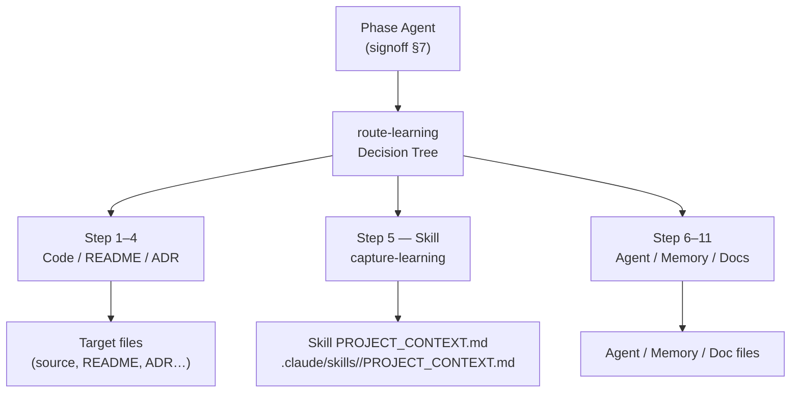

# Agent Knowledge System

This document describes how agents classify, route, and persist learnings across
sessions. It covers the two core skills that together form the knowledge pipeline:
`route-learning` (classifier) and `capture-learning` (writer).

---

## Architecture Overview



Key constraint: `SKILL.md` files are portable templates synced from upstream.
They must not receive project-specific learnings. All skill-related runtime
learnings are written to the co-located `PROJECT_CONTEXT.md` companion file.

---

## §1 route-learning

The `route-learning` skill provides an 11-step decision tree (plus a Step 0
duplicate-detection pass). Agents invoke it after discovering something worth
persisting.

The tree is ordered by specificity: code comments first (Step 1), then folder
READMEs (Step 2), cross-cutting READMEs (Step 3), ADRs (Step 4), skills (Step 5),
agent system prompts (Step 6), per-agent memory (Step 7), explanation docs
(Step 8), reference docs (Step 9), CLAUDE.md / user-memory (Step 10), and
retrospectives (Step 11).

First-match wins. The output is a routing decision `{file, section, entry_kind}`
passed directly to `capture-learning`.

---

## §2 Route and Capture Skills

### §2.1 Skill routing (Step 5)

When the learning is a repeatable procedure any agent can follow, `route-learning`
routes to:

```
file: .claude/skills/<name>/PROJECT_CONTEXT.md
```

`SKILL.md` is the portable base template; it must stay clean for upstream sync.
`PROJECT_CONTEXT.md` is the project-specific companion file for runtime learnings.
Agents loading a skill should also read `PROJECT_CONTEXT.md` if it exists
alongside `SKILL.md`, to pick up project-specific overrides or accumulated
learnings.

### §2.2 capture-learning execution

`capture-learning` receives the routing decision and executes the write. It
handles missing target files automatically: if `PROJECT_CONTEXT.md` does not
exist for the named skill, `capture-learning` creates it with a minimal section
heading before writing the entry. No manual file creation is required.

### §2.3 Per-agent memory (Step 7)

Per-agent memory (`memory/<name>.md`) is for habit corrections a specific agent
needs at every spawn. It is distinct from skill context: skill context is
procedure-level (Step 5); per-agent memory is behavior-level (Step 7).

---

## §3 Duplicate Detection (Step 0)

Before the 11-step tree runs, `route-learning` normalises the proposed learning
and searches existing knowledge stores (agent memory files, user-memory feedback
files, retrospectives, CLAUDE.md) for a Levenshtein ratio ≥ 0.85 match. A
duplicate short-circuits the pipeline and returns `{duplicate: true}` without
writing anything.

---

## §4 Knowledge Capture Trigger

The knowledge-capture step is mandatory in `signoff` §7. After a phase agent
completes its atomic sign-off write, it runs the prompt:

> "Did you discover anything during this ticket that future-you would have
> benefited from knowing at the start? (no / yes)"

On "yes", it loads `route-learning` and `capture-learning` in sequence and emits
a `knowledge_captured` telemetry event to `agent_telemetry.jsonl`.

---

## References

- `.claude/skills/route-learning/SKILL.md` — full 11-step decision tree
- `.claude/skills/capture-learning/SKILL.md` — write executor and error handling
- `.claude/skills/signoff/SKILL.md` §7 — mandatory knowledge-capture trigger
- `leafcutter/templates/skills/README.md` — `PROJECT_CONTEXT.md` pattern and **naming convention** (§Naming convention): filename MUST be `PROJECT_CONTEXT.md` (all uppercase, underscore); lowercase `project_context.md` is incorrect.
