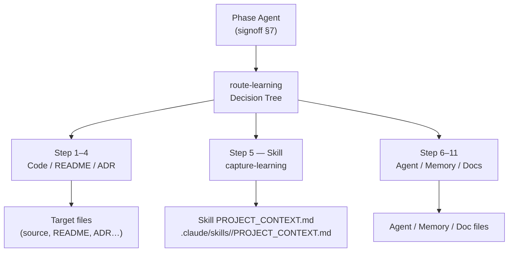

# Agent Knowledge System

This document describes how agents classify, route, and persist learnings across
sessions. It covers the two core skills that together form the knowledge pipeline:
`route-learning` (classifier) and `capture-learning` (writer).

---

## Architecture Overview



Key constraint: `SKILL.md` files are portable templates synced from upstream.
They must not receive project-specific learnings. All skill-related runtime
learnings are written to the co-located `PROJECT_CONTEXT.md` companion file.

---

## §1 route-learning

The `route-learning` skill provides an 11-step decision tree (plus a Step 0
duplicate-detection pass). Agents invoke it after discovering something worth
persisting.

The tree is ordered by specificity: code comments first (Step 1), then folder
READMEs (Step 2), cross-cutting READMEs (Step 3), ADRs (Step 4), skills (Step 5),
agent system prompts (Step 6), per-agent memory (Step 7), explanation docs
(Step 8), reference docs (Step 9), CLAUDE.md / user-memory (Step 10), and
retrospectives (Step 11).

First-match wins. The output is a routing decision `{file, section, entry_kind}`
passed directly to `capture-learning`.

---

## §2 Route and Capture Skills

### §2.1 Skill routing (Step 5)

When the learning is a repeatable procedure any agent can follow, `route-learning`
routes to:

```
file: .claude/skills/<name>/PROJECT_CONTEXT.md
```

`SKILL.md` is the portable base template; it must stay clean for upstream sync.
`PROJECT_CONTEXT.md` is the project-specific companion file for runtime learnings.
Agents loading a skill should also read `PROJECT_CONTEXT.md` if it exists
alongside `SKILL.md`, to pick up project-specific overrides or accumulated
learnings.

### §2.2 capture-learning execution

`capture-learning` receives the routing decision and executes the write. It
handles missing target files automatically: if `PROJECT_CONTEXT.md` does not
exist for the named skill, `capture-learning` creates it with a minimal section
heading before writing the entry. No manual file creation is required.

### §2.3 Per-agent memory (Step 7)

Per-agent memory (`memory/<name>.md`) is for habit corrections a specific agent
needs at every spawn. It is distinct from skill context: skill context is
procedure-level (Step 5); per-agent memory is behavior-level (Step 7).

---

## §3 Duplicate Detection (Step 0)

Before the 11-step tree runs, `route-learning` normalises the proposed learning
and searches existing knowledge stores (agent memory files, user-memory feedback
files, retrospectives, CLAUDE.md) for a Levenshtein ratio ≥ 0.85 match. A
duplicate short-circuits the pipeline and returns `{duplicate: true}` without
writing anything.

---

## §4 Knowledge Capture Trigger

The knowledge-capture step is mandatory in `signoff` §7. After a phase agent
completes its atomic sign-off write, it runs the prompt:

> "Did you discover anything during this ticket that future-you would have
> benefited from knowing at the start? (no / yes)"

On "yes", it loads `route-learning` and `capture-learning` in sequence and emits
a `knowledge_captured` telemetry event to `agent_telemetry.jsonl`.

---

## §5 Write Eligibility and the Waiting Count

### Eligibility rule

A knowledge record is eligible to be written only if it carries non-empty
`text`. A record without `text` — absent, `null`, or blank after whitespace
normalisation — is **ineligible**, not deferred, and is **not outstanding**.
This is a rule over a property of the data (`_is_no_learning_text`,
`scripts/knowledge/harvest_learnings.py`), not a named exception for one
corpus: a different textless body in a future install gets the same
treatment with no change. The check runs before `entry_kind` routing on
every harvest, so an ineligible record never lands in `skipped_unknown` on
that account. See **Disposition** below for the body this rule governs today.

### The waiting count

The waiting count ("outstanding") is the number of records carrying
non-empty `text` not yet written to their destination. Exactly two things
zero out a record's contribution: **no text** (ineligible, above), or
**already written** (hashed into the idempotency state). No floor, cap, or
exclusion by age, agent, `entry_kind`, or destination adjusts it — a record
that is unroutable but text-bearing still counts. This counts **records**,
never agent runs: do not conflate it with the capture-health report's
reached / recorded / failed figures, which count agent invocations reaching
the sign-off capture step — a different denominator, a different question.

### Exit codes (`harvest_learnings.py`)

| Code | Meaning |
|---|---|
| `0` | Clean — nothing outstanding, no write failure. |
| `1` | Sink unreadable, or the build-time sink declaration is stale. |
| `2` | State file corrupt. |
| `3` | Unroutable records remain (`skipped_unknown` > 0). |
| `4` | A destination write failed and/or state could not persist — outranks `3`. |

A run over the retained corpus below returns `0` — the steady-state form of
"nothing outstanding," not a special case coded around this corpus.

### Disposition: the 2026-08-26 retained corpus

28 `knowledge_captured` records, emitted 2026-06-16 through 2026-08-12, sit
in `debugging/logs/agent_telemetry.jsonl` (a byte-identical copy is tracked
at `tests/fixtures/harvest_learnings/agent_telemetry_33_lines.jsonl` for a
reader with no live install). Each carries exactly six fields — `event`,
`timestamp`, `agent`, `component`, `destination`, `entry_kind` — and no
`text`; under the rule above, all 28 are ineligible and none is outstanding.

The 28 name 10 distinct destinations. Nine exist, holding real content from
roughly 3.5 KB to over 23 KB at last check and still growing (one,
`docs/acceptance-criteria/ac-store/PROJECT_CONTEXT.md`, is now well past
23 KB — re-verify on read). The tenth,
`memory/feedback_itpo_bo1700_worktree_gate_parity.md`, has never existed in
git history.

Resolving the 28 wrote nothing anywhere: no destination opened, no directory
created, the stream unchanged. Nothing was moved, marked, archived, or
watermarked. Because no per-record exemption is stored, revisiting needs no
un-marking step — real `text` on one of the 28, or a rule change, makes it
outstanding again next run, with no state to reset.

**Default-sink note.** `harvest_learnings.py` leaves `--sink` unset by
default; `scripts/knowledge/sink_resolution.py`'s `resolve_default_sink()`
prefers a build-time declaration (`config/knowledge_sink.json`) and
otherwise falls back to the literal `debugging/logs/knowledge_emissions.jsonl`
— never existed in an unbuilt worktree. Do not read that literal as "the
sink"; a built install's declaration may point elsewhere. The 28 predate the
emitter-side repoint (`signoff` §7, `INF-400c-4`) and remain on the stream
they were actually written to; they are addressed by the eligibility rule
above, not by a sink repoint or recovery — no drain of this body is pending.

---

## Description Field Convention

Every structured documentation file in the leafcutter project (`docs/**/*.md`,
`docs/architecture/adrs/*.md`, `docs/architecture/components/*.md`) MUST include
a `description:` field in its YAML frontmatter. This requirement exists so that
`knowledge_query.py` and `generate_doc_index.py` can use the structured field
for all files rather than falling back to body-text parsing.

### Why this matters

`generate_doc_index.py` uses `description:` if present and falls back to the
first non-blank body line if absent. The fallback produces lower-quality
summaries — it picks up headers, preamble boilerplate, or context sentences
rather than a purpose-statement. Consistent `description:` coverage ensures
every doc surface is queryable via structured metadata.

### Enforcement

The `description:` field requirement is enforced by two mechanisms:

1. **Pre-commit hook** (`check_description_field.py`): Blocks commits that
   introduce new `.md` files in target directories without a `description:`
   field. This is the primary mechanical gate for new files. See ticket
   `02b_description_field_enforcement_hook.md` for implementation details.

2. **Backfill migration script** (`scripts/backfill_descriptions.py`): A
   one-time migration script that inserts a `description:` field into every
   existing docs/ADR/component file that lacks one. Run with `--dry-run` first
   to review candidates, then `--write` to apply.

### What to write in description:

- One sentence (or phrase), ≤ 120 characters.
- Should capture the **purpose** of the document, not its title or category.
- Written in plain prose — not metadata labels.

**Good examples:**
```yaml
description: "Enumerates all 11 channels through which agents receive context at invocation time."
description: "Operational runbook for ticket-supervisor: control flow, retry caps, and escalation ladder."
```

**Avoid:**
```yaml
description: "ADR"              # too generic — tells the reader nothing
description: "Reference"        # category label, not a purpose statement
```

### Scope

- **Included**: `docs/**/*.md`, `docs/architecture/adrs/*.md`, `docs/architecture/components/*.md`
- **Excluded**: `tickets/**/*.md` — tickets use `title:` as their primary label.
  Adding `description:` to tickets is out of scope.
- **Excluded**: `templates/agents/`, `templates/skills/` — these use their
  registry entries as the description layer and must not be modified here.

---

## Visualization

The `scripts/visualise_knowledge_graph.py` script generates a self-contained
D3.js force-directed HTML graph from all knowledge surfaces defined in
`config/paths.json`. It delegates surface traversal to `knowledge_query.py`
(sibling module, loaded via `importlib.util`) and embeds node and edge JSON
directly into an HTML template — no external build step, no files committed to
the repo.

### Output format

A single `.html` file written to `/tmp/` (default:
`/tmp/leafcutter_knowledge_graph.html`). The file is self-contained: it
references D3.js from the CDN (`https://d3js.org/d3.v7.min.js`) and contains
the full node+edge dataset as an embedded `const DATA = {...}` JSON block.
Nodes are coloured by surface type and sized proportionally to their edge
degree (min 4px, max 18px radius). Hovering a node highlights its direct
neighbours; clicking pins it in place.

### Invocation

```bash
# Write to default path and open in browser:
python scripts/visualise_knowledge_graph.py

# Write to a custom path:
python scripts/visualise_knowledge_graph.py --output /tmp/my_graph.html

# Write without opening the browser (useful in headless CI):
python scripts/visualise_knowledge_graph.py --no-open
```

The script exits with code 1 if `knowledge_query.py` is not found at the
expected sibling path and prints a clean error message (`ERROR: knowledge_query.py
not found at <path>.`) without a Python traceback.

---

## References

- **[Agent Knowledge Plane](agent_knowledge_plane.md)** — the injection-side
  complement to this document: enumerates all 11 channels through which
  agents receive context at invocation time (pre-execution knowledge injection).
- `.claude/skills/route-learning/SKILL.md` — full 11-step decision tree
- `.claude/skills/capture-learning/SKILL.md` — write executor and error handling
- `.claude/skills/signoff/SKILL.md` §7 — mandatory knowledge-capture trigger
- `leafcutter/templates/skills/README.md` — `PROJECT_CONTEXT.md` pattern and **naming convention** (§Naming convention): filename MUST be `PROJECT_CONTEXT.md` (all uppercase, underscore); lowercase `project_context.md` is incorrect.
- `scripts/backfill_descriptions.py` — one-time migration script; see `## Description Field Convention` above.
- `scripts/commit_guardian/check_description_field.py` — pre-commit hook enforcing description: presence on new files (ticket 02b).
- `docs/reference/workflow-constraints.md` §Removed Legacy Agents — canonical list of seven removed agent IDs that must not appear as dispatch targets in any workflow, skill, or command template (AC ACD-1100a-3).
- `docs/acceptance-criteria/infrastructure/INF-400-agent-learning/INF-700c-2.yaml` (and its `-i`/`-ii` children) — the eligibility rule, disposition, and waiting-count definition §5 above records.
