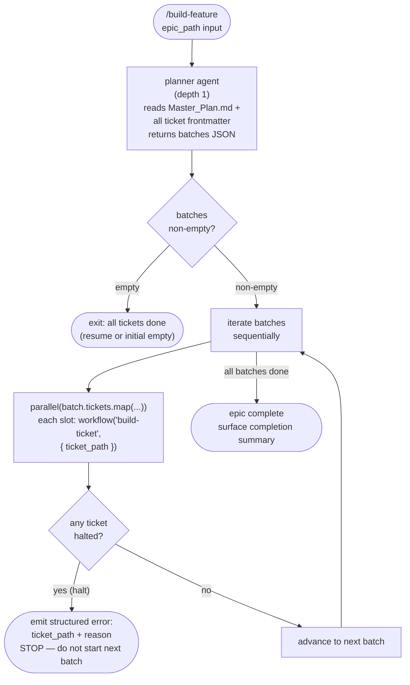

# build-epic.js Workflow Dispatch

## Overview

This diagram documents the internal agent dispatch flow inside the
`build-epic.js` Claude Code Workflow script. The script replaces the
`epic-supervisor` LLM agent and the inline batching prose from `/build-feature`,
converting the epic orchestration layer from a recursive agent call to a
deterministic JavaScript workflow.

The script implements the §1.1 epic-level algorithm from `building-epics`
SKILL.md: a planner agent reads `Master_Plan.md` plus all sub-ticket
frontmatter and returns a dependency-ordered `batches` array. The script
then iterates batches sequentially, dispatching tickets within each batch
via `parallel()` calls — each parallel slot invokes the `build-ticket`
workflow logic. Already-done tickets are omitted by the planner (resume
mechanism).

**Decision reference:** ADR-006 (Flatten the Supervisor Chain) established
the topology that this workflow implements. Because JS workflows are not
agents, `agent()` and `workflow()` calls inside them are always flat depth-1
spawns regardless of call depth.

## Dispatch Flow

## Flow Key

| Node style | Meaning |
|---|---|
| Rounded rectangle `()` | Entry/exit terminal |
| Rectangle `[]` | Agent call, workflow call, or action |
| Diamond `{}` | Decision / branch |

## Design Notes

- The planner agent reads all ticket files; the JS script itself cannot use
  filesystem tools directly.
- Tickets with `status: done` are omitted from the planner's `batches` output,
  enabling crash-resume without re-running completed work.
- Within each batch, `parallel()` dispatches all tickets simultaneously. The
  file-touch disjointness invariant (§1.2 of `building-epics`) is enforced by
  the planner — overlapping tickets are serialized into separate batches.
- A halt from any ticket in a batch stops the outer loop immediately.
  Parallel slots already in progress within the same batch are NOT rolled back.
- After `build-epic.js` ships, `/build-feature` becomes a thin wrapper: it
  detects epic vs. single-ticket path and routes to `build-epic.js` or
  `build-ticket.js` respectively.
- **Package version injection (ACD-1100e-2):** `build.py` reads
  `config/version.json` and writes a `LEAFCUTTER_VERSION` file to the target
  directory at build time. This file lets any consumer determine the installed
  leafcutter version (e.g. `"2.0.0"`) without reading the source package
  directly. The version string is also printed in the build log as
  `"Package version: X.Y.Z"`. The `build-epic.js` workflow calls `build.py`
  underneath; both side-effects (the log message and the file) apply on every
  full build run.

## Related

See also:
- [build-ticket.js Workflow Dispatch](./build-ticket-workflow-dispatch.md) —
  the per-ticket flow that each parallel slot in this diagram delegates to.
- [Supervisor Spawn Topology](./supervisor-spawn-topology.md) —
  parent diagram showing how `build-epic.js` fits into the full dispatch chain.

## Legend

| Shape | Meaning |
|---|---|
| `flowchart TD` | Top-down agent flow diagram |
| Solid arrows `-->` | Active dispatch path |
| Decision diamonds `{}` | Branching logic inside the workflow script |
