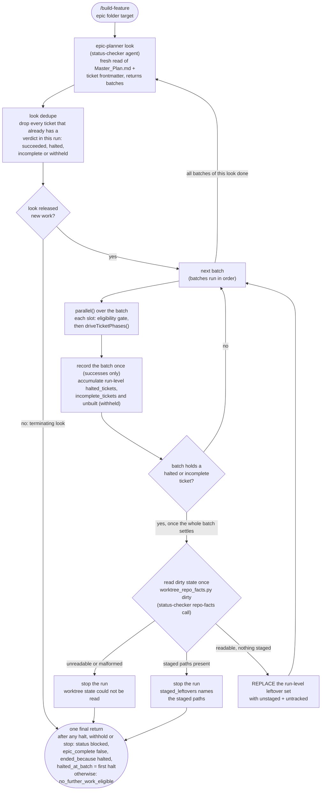
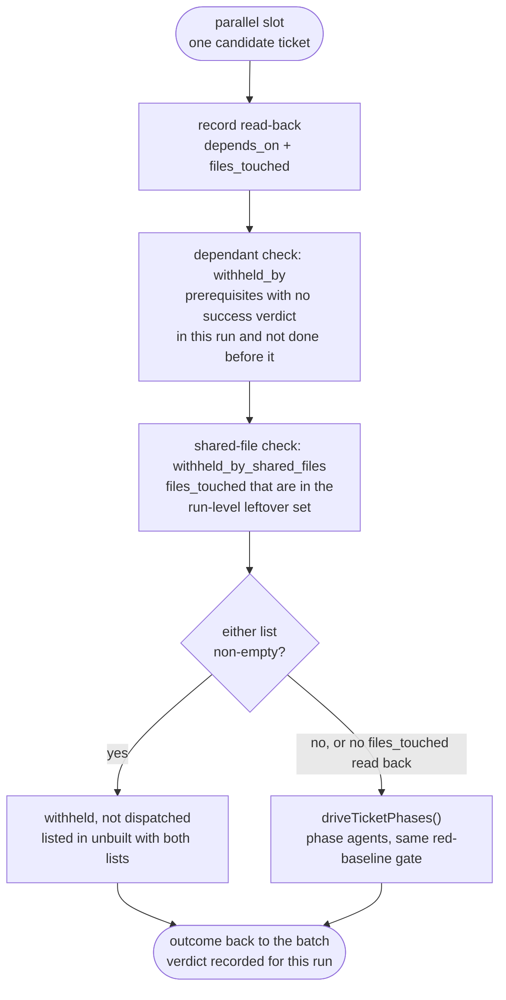

# build-feature.js Epic Loop

## Overview

This diagram shows the epic loop inside the `build-feature.js` Claude Code
Workflow script. `build-feature.js` is the live epic driver: `/build-feature`
runs it when the target is an epic folder. The loop is written inline and
makes no `workflow()` call. Each ticket is driven by `driveTicketPhases()`,
which is the inlined twin of the `build-ticket.js` phase loop.

The loop asks for repeated planner looks (BO-100e-1). In each look an
`epic-planner` agent returns a fresh, dependency-ordered `batches` array. The
script runs those batches in order and dispatches the tickets of each batch
through `parallel()`. A halted ticket does not end the run (BO-100e-4). The
loop withholds only the work behind the halt: the halted ticket's dependants,
and any later ticket that shares a file the halted ticket left modified. It
keeps building everything else until a look releases nothing new, and then
ends with one final return.

**Legacy variant.** `templates/workflows-js/build-epic.js` is the older,
standalone epic script. It still stops the whole run at the first halted
ticket (halt-all), and `/build-feature` does not route to it. This document
describes `build-feature.js` only.

**Decision reference:** ADR-006 (Flatten the Supervisor Chain) set up the
topology that this workflow implements. JS workflows are not agents, so every
`agent()` call inside them is a flat depth-1 spawn, however deep the call sits.

## Epic Loop

```mermaid
flowchart TD
    input(["/build-feature<br/>epic folder target"])
    planner["epic-planner look<br/>(status-checker agent)<br/>fresh read of Master_Plan.md +<br/>ticket frontmatter, returns batches"]
    dedupe["look dedupe<br/>drop every ticket that already has a<br/>verdict in this run: succeeded, halted,<br/>incomplete or withheld"]
    released{"look released<br/>new work?"}
    batch_loop["next batch<br/>(batches run in order)"]
    parallel_dispatch["parallel() over the batch<br/>each slot: eligibility gate,<br/>then driveTicketPhases()"]
    accumulate["record the batch once (successes only)<br/>accumulate run-level halted_tickets,<br/>incomplete_tickets and unbuilt (withheld)"]
    batch_results{"batch holds a<br/>halted or incomplete<br/>ticket?"}
    dirty_read{"read dirty state once<br/>worktree_repo_facts.py dirty<br/>(status-checker repo-facts call)"}
    stop_unreadable["stop the run<br/>worktree state could not be read"]
    stop_staged["stop the run<br/>staged_leftovers names<br/>the staged paths"]
    replace_leftovers["REPLACE the run-level leftover set<br/>with unstaged + untracked"]
    final_return(["one final return<br/>after any halt, withhold or stop: status blocked,<br/>epic_complete false, ended_because halted,<br/>halted_at_batch = first halt<br/>otherwise: no_further_work_eligible"])

    input --> planner
    planner --> dedupe
    dedupe --> released
    released -- "no: terminating look" --> final_return
    released -- "yes" --> batch_loop
    batch_loop --> parallel_dispatch
    parallel_dispatch --> accumulate
    accumulate --> batch_results
    batch_results -- "no" --> batch_loop
    batch_results -- "yes, once the whole batch settles" --> dirty_read
    dirty_read -- "unreadable or malformed" --> stop_unreadable
    dirty_read -- "staged paths present" --> stop_staged
    dirty_read -- "readable, nothing staged" --> replace_leftovers
    replace_leftovers --> batch_loop
    batch_loop -- "all batches of this look done" --> planner
    stop_unreadable --> final_return
    stop_staged --> final_return
```

Parent: [Supervisor Spawn Topology — Flattened Agent Dispatch Chain](./supervisor-spawn-topology.md)

## Eligibility Gate (one parallel slot)

```mermaid
flowchart TD
    slot(["parallel slot<br/>one candidate ticket"])
    readback["record read-back<br/>depends_on + files_touched"]
    deps["dependant check: withheld_by<br/>prerequisites with no success verdict<br/>in this run and not done before it"]
    overlap["shared-file check: withheld_by_shared_files<br/>files_touched that are in the<br/>run-level leftover set"]
    decide{"either list<br/>non-empty?"}
    withheld["withheld, not dispatched<br/>listed in unbuilt with both lists"]
    drive["driveTicketPhases()<br/>phase agents, same red-baseline gate"]
    outcome(["outcome back to the batch<br/>verdict recorded for this run"])

    slot --> readback
    readback --> deps
    deps --> overlap
    overlap --> decide
    decide -- "yes" --> withheld
    decide -- "no, or no files_touched read back" --> drive
    withheld --> outcome
    drive --> outcome
```

## Halt Handling

- **Accumulate, do not return.** A halted, incomplete or withheld ticket is
  added to a run-level set and the loop goes on. An incomplete ticket is one
  that ran but was not confirmed `ticket_completed`, without halting. It is
  treated like a halt. Each batch is recorded in `completed_batches` exactly
  once, with its successes only, and that includes batches built after a halt.
- **One dirty read per affected batch.** After a batch that holds a halted or
  incomplete ticket has fully settled, the driver reads the worktree's dirty
  state once. It does this through a status-checker repo-facts call that runs
  `worktree_repo_facts.py dirty` (label `worktree-dirty`). A batch whose only
  problem is withheld work triggers no read, because withheld tickets never ran.
- **Fail closed.** The driver accepts the read only when it reports
  `readable: true` with array-typed `staged`, `unstaged` and `untracked` lists.
  The run stops, saying the worktree state could not be read, if any of these
  happens:
  - the reply is null or cannot be parsed;
  - a key is missing, or a value is not an array;
  - no worktree path was resolved.

  A missing list is never read as an empty one.
- **Staged leftovers stop the run.** The commit agent commits whatever is
  staged, so a later ticket's commit would sweep in the halted ticket's staged
  files. The run therefore stops if any path is staged, and `staged_leftovers`
  names those paths. The driver only reads `git status`. It never stages or
  unstages anything.
- **Replace, never union.** If nothing is staged, the run-level leftover set
  is replaced by the read's `unstaged + untracked` paths. Dirty state belongs
  to the whole worktree, so the latest read is the whole truth.
- **Both checks, every candidate.** The gate always works out both lists,
  `withheld_by` and `withheld_by_shared_files`. If either list is non-empty,
  the ticket is withheld and both lists are reported.
- **Dependant withhold.** `withheld_by` names each prerequisite in the
  candidate's `depends_on` that has no success verdict in this run and was not
  already done before the run began. A withheld ticket gets a non-success
  verdict of its own, so the withhold carries through every transitive
  dependant.
- **Shared-file withhold.** `withheld_by_shared_files` names each path in the
  candidate's read-back `files_touched` that is in the leftover set. Only a
  candidate in a later batch or a later look can match. A sibling in the same
  batch is never withheld this way: the planner already puts tickets that
  share files into separate batches, and the leftover set changes only after
  a batch settles. A read-back with no `files_touched` gives nothing to
  compare, so that ticket is driven.
- **No re-drive.** The look dedupe skips any ticket that already has a verdict
  in this run, whether success, halt, incomplete or withheld. It is not limited
  to success. The planner hears only about successes, so it offers a halted
  ticket again in every look. The dedupe is what keeps the number of looks
  bounded (BO-100e-2): a look whose offers are all deduped releases nothing
  new, and that ends the search.

## Final Return

There is one final return for every path out of the loop. The table below
lists the fields it carries.

| Field | Content |
|---|---|
| `status` | `blocked` after any halted, incomplete or withheld ticket, or a stop; otherwise taken from the completion re-read |
| `epic_complete` | `false` in the same cases. The run never reports work behind a failure as finished |
| `ended_because` | `halted` in the same cases; otherwise `no_further_work_eligible` |
| `halted_at_batch` | The first batch that halted or withheld anything, kept for compatibility |
| `halted_tickets`, `incomplete_tickets` | Every halted or unconfirmed ticket across the whole run |
| `unbuilt` | Withheld tickets, each with `withheld_by` and/or `withheld_by_shared_files`. The BO-300d-1 unbuilt count equals this named set |
| `completed_batches` | Each batch once, successes only, including batches built after the halt |
| `staged_leftovers` | The staged paths, present only when staged state stopped the run |
| `dirty_state_unreadable` | `true`, present only when an unreadable worktree state stopped the run. The message says the state could not be read |

## Flow Key

| Node style | Meaning |
|---|---|
| Rounded rectangle `()` | Entry/exit terminal |
| Rectangle `[]` | Agent call, workflow call, or action |
| Diamond `{}` | Decision / branch |

## Design Notes

- The planner agent reads all ticket files, because the JS script cannot use
  filesystem tools itself. The dirty-state read follows the same rule: an
  agent runs the helper, and the script reads nothing directly.
- The planner leaves tickets with `status: done` out of its `batches` output.
  This lets a crashed run resume without repeating completed work. If look 1
  releases nothing, the run returns at once and nothing is built.
- Within a batch, `parallel()` dispatches every ticket at the same time. The
  planner enforces the file-touch disjointness invariant (§1.2 of
  `building-epics`) by putting overlapping tickets into separate batches.
- A halt does not roll back slots that are already in progress within the
  same batch. Those siblings finish, and the dirty read happens only after
  they have settled.
- `build-ticket.js` shares the record read-back schema (including the optional
  `files_touched`) with `build-feature.js`, but it has no epic loop.

## Related

See also:
- [build-ticket.js Workflow Dispatch](./build-ticket-workflow-dispatch.md):
  the per-ticket phase flow that `driveTicketPhases()` inlines for each slot
  in this diagram.
- [Supervisor Spawn Topology](./supervisor-spawn-topology.md): the parent
  diagram, showing where the epic loop fits in the full dispatch chain.

## Legend

| Shape | Meaning |
|---|---|
| `flowchart TD` | Top-down agent flow diagram |
| Solid arrows `-->` | Active dispatch path |
| Decision diamonds `{}` | Branching logic inside the workflow script |
