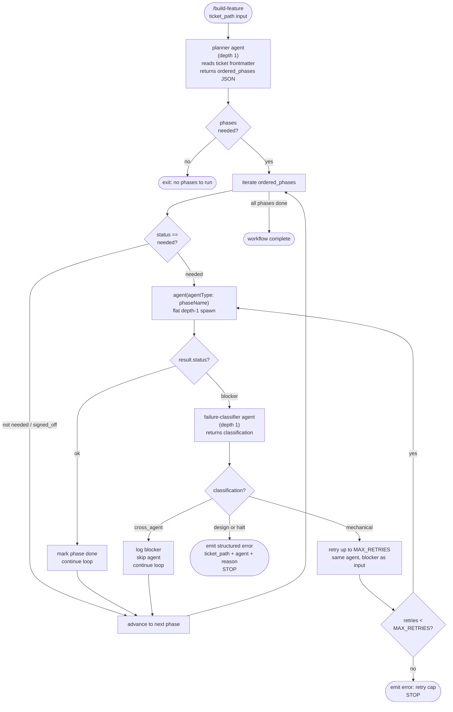

# build-ticket.js Workflow Dispatch

## Overview

This diagram documents the internal agent dispatch flow inside the
`build-ticket.js` Claude Code Workflow script. The script replaces the
`ticket-supervisor` LLM agent for the ticket-driving loop, converting it
from a recursive agent call to a deterministic JavaScript workflow that
invokes each phase agent as a flat depth-1 `agent()` call.

**Decision reference:** ADR-006 (Flatten the Supervisor Chain) established
the topology that this workflow implements. The JS workflow removes the
depth constraint entirely — the script is not an agent, so `agent()` calls
inside it are always flat depth-1 spawns regardless of call depth.

## Dispatch Flow

## Flow Key

| Node style | Meaning |
|---|---|
| Rounded rectangle `()` | Entry/exit terminal |
| Rectangle `[]` | Agent call or action |
| Diamond `{}` | Decision / branch |

## Design Notes

- The planner agent is the only agent that reads files; the JS script itself
  cannot use filesystem tools.
- `MAX_RETRIES` is a constant in the script (currently `2`). The retry cap
  prevents runaway loops on persistent mechanical failures.
- `cross_agent` classification logs the blocker and continues rather than
  halting — this allows independent phases to proceed even if one is skipped.
- `design` and `halt` classifications are terminal — the workflow surfaces
  a structured error object to the user (ticket path, blocked agent, reason).
- Phases already `signed_off` in the planner's JSON response are skipped
  without re-running, providing crash-resume behaviour.

## Produces-Trait Guardrail Integration

At dispatch time, the ticket-supervisor (or `build-ticket.js` planner agent)
reads each phase agent's `produces` field from `config/agent_registry.json`
and applies trait-driven guardrail rules before the agent is spawned:

| `produces` value | TDD guardrails? | Rationale |
|---|---|---|
| `production_code` | YES — test-writer before, test-runner after | Executable code requires TDD verification |
| `documentation` | NO | Docs produce human-readable artifacts, not executable logic |
| `prompt` | NO (TDD) — prompt-quality guardrails apply | LLM instructions are quality-checked by llm-expert's Prompt-Quality Checklist |
| `test_artifact` | NO | Circular — wrapping a test producer in test-writer/test-runner makes no sense |
| `review_verdict` | NO | Reviewers produce verdicts, not executable artifacts |
| `analysis` | NO | Analysis agents produce reports/recommendations |
| `orchestration` | NO | Orchestrators drive other agents |
| `null` | WARN + NO | Ambiguous trait — warn but do not block; treat as documentation |

**Ticket-level settings always override agent-level trait rules.** If a ticket
explicitly sets `agents.test-writer: not_needed` or has no `## Test Requirements`
block, the test-writer skip rule fires before the produces-trait check.

See `building-epics` SKILL.md §2.1.1a for the full guardrail mapping and
override priority rules. See `ticket-supervisor` template §Produces-Trait
Guardrail Dispatch for the pseudocode implementation.

## Related

See also: [Supervisor Spawn Topology](./supervisor-spawn-topology.md) — the
parent diagram showing how `build-ticket.js` fits into the full dispatch chain.

## Legend

| Shape | Meaning |
|---|---|
| `flowchart TD` | Top-down agent flow diagram |
| Solid arrows `-->` | Active dispatch path |
| Decision diamonds `{}` | Branching logic inside the workflow script |
