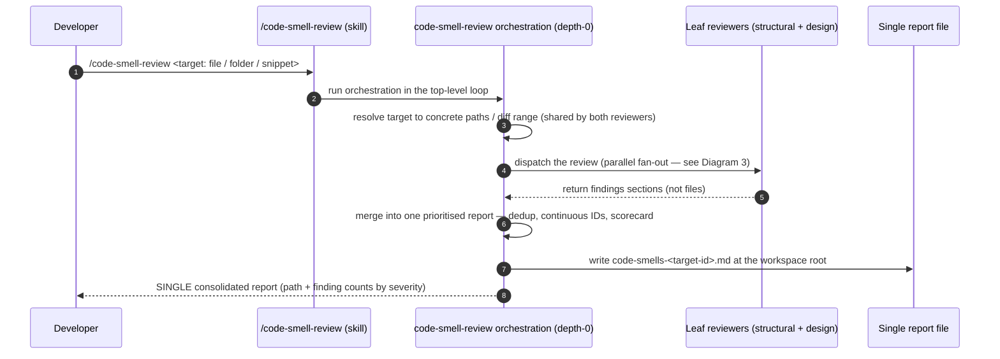
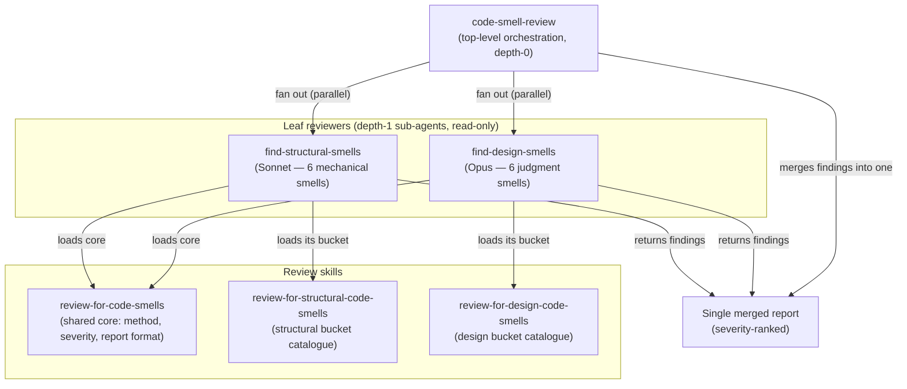
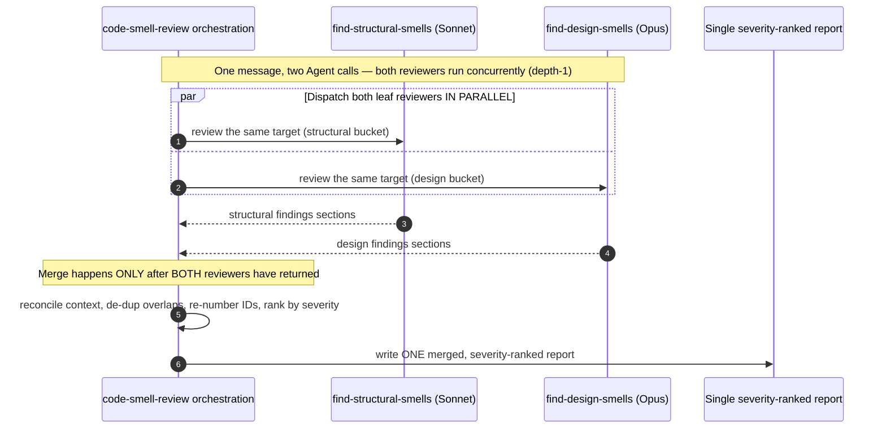

# Code-Smell Review — Fowler Refactoring Review Capability

This capability runs a full Martin Fowler *Refactoring* (2nd ed) "Bad Smells in Code"
review over a target and returns **one** prioritised report that maps every finding to
its named refactoring. It is cost-tiered and focused: a shared core method defines the
process and report format, two bucket catalogues split the Modern-12 smells by difficulty,
and two leaf reviewers each hold only their six smells. A top-level orchestration fans the
two reviewers out **in parallel** and merges their findings into a single severity-ranked
report.

## Why this shape

The Modern-12 smells split by difficulty:

- **Structural** (local / mechanical, near-lint): Mysterious Name, Duplicated Code, Long
  Function, Long Parameter List, Loops, Repeated Switches → handled by
  `find-structural-smells` on **Sonnet**.
- **Design** (cross-cutting / judgment, needs whole-target reasoning): Global Data, Mutable
  Data, Feature Envy, Data Clumps, Primitive Obsession, Shotgun Surgery → handled by
  `find-design-smells` on **Opus**.

Splitting keeps each reviewer focused on six smells (better recall than one agent juggling
twelve) and spends Opus only where judgment is needed. The fan-out lives in the **top-level
loop** (depth-0) because a spawned sub-agent cannot spawn further sub-agents (Claude Code's
depth-1 hard limit, ADR-006 "flatten the supervisor chain"); the two reviewers therefore
run at depth-1.

## Diagram 1 — Invocation to single report (CR-100e-3)

The ordered flow from the developer's `/code-smell-review` invocation, through the top-level
orchestration, to the **single** returned report. The target (a file, a folder, or a pasted
snippet) enters the flow; one consolidated report leaves it.

This capability is the root of its own architecture-doc tree; it has no parent container doc.
See also: [Agent Code Delivery Workflows](../agent_delivery_workflows.md) — the depth-1
dispatch topology the parallel fan-out below respects.

## Diagram 2 — Component structure (CR-100f-6)

The shared core method, the two bucket catalogues, the two tiered leaf reviewers, and the
top-level orchestration. Each leaf reviewer depends on the **core** method **plus** its own
bucket catalogue. The orchestration fans out to both leaf reviewers and merges their
findings into one report.

Both leaf reviewers load the **same** `review-for-code-smells` core (so the two finding
sets share one method, severity rubric, and report format) and diverge only in the bucket
catalogue they load. The core on its own defines the process, not the smells; a bucket on
its own defines smells, not the process — they are always loaded together.

## Diagram 3 — Parallel fan-out and post-return merge (CR-100f-7)

The top-level orchestration dispatches **both** leaf reviewers **in parallel** (one message,
two `Agent` calls), both reviewers return their findings, and the orchestration merges those
findings into one severity-ranked report **only after both have returned**.

If one reviewer returns nothing usable, the orchestration writes the report from the other's
findings and states plainly that only one bucket ran. For a tiny target it may skip the
fan-out and run one reviewer — but it says so; it never silently narrows coverage.

## Responsibilities

- **`code-smell-review` (orchestration):** resolve the target, fan out to both leaf reviewers
  in parallel, merge their returned findings into one report, and write/confirm that single
  file. It never reviews code itself — its job is dispatch + merge.
- **`review-for-code-smells` (core):** the shared method — gather, infer stack, scan,
  classify severity, and the finding/report format that maps each smell to a Fowler
  refactoring.
- **`review-for-structural-code-smells` / `review-for-design-code-smells` (buckets):** the
  two six-smell catalogues that build on the core.
- **`find-structural-smells` (Sonnet) / `find-design-smells` (Opus):** read-only leaf
  reviewers that load the core plus their own bucket and **return** findings sections
  (they do not write files), so the orchestration can merge them into one report.

## Cross-References

- [Agent Code Delivery Workflows](../agent_delivery_workflows.md) — the depth-1 sub-agent
  dispatch topology the parallel fan-out respects (ADR-006).
- `templates/skills/code-smell-review/SKILL.md` — the orchestration skill (fan-out, merge,
  depth-1 rule).
- `templates/skills/review-for-code-smells/SKILL.md` — the shared core method and report
  format.
- `templates/skills/review-for-structural-code-smells/SKILL.md` and
  `templates/skills/review-for-design-code-smells/SKILL.md` — the two bucket catalogues.
- `templates/agents/find-structural-smells.md` (Sonnet) and
  `templates/agents/find-design-smells.md` (Opus) — the two leaf reviewers.
