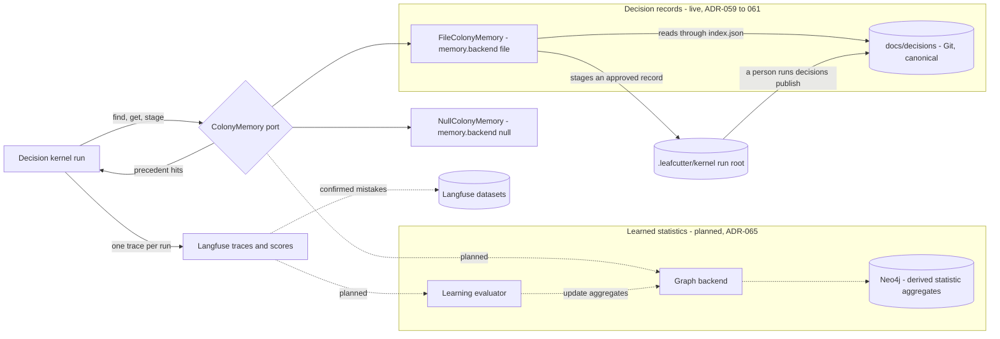
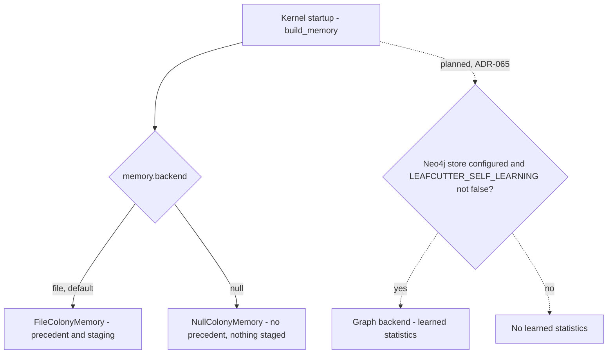

# Colony Memory — Container Overview

Colony memory is what Leafcutter keeps from one kernel run for the next. It holds two kinds of
memory with different authority, and the kernel reaches both through one `ColonyMemory` port
([ADR-059](../adrs/ADR-059-decision-store-reviewable-yaml-records-now-graph-later.md) §2).

> **Langfuse remembers what happened. The colony memory store remembers what Leafcutter learned.**

| | Approved decision records | Learned statistics |
|---|---|---|
| What | One YAML file per decision a human approved, `docs/decisions/<dec-id>.yaml`, plus the generated `index.json` | Compact derived aggregates: success rates, decision outcomes, paths, capability gaps, calibration |
| Where | Git | Neo4j, optional |
| Authority | Canonical ([ADR-060](../adrs/ADR-060-source-of-truth-and-approval-authority.md) §1) | Derived, rebuildable, never canonical and never workflow state |
| Written by | A person, with `python -m kernel decisions publish`; a run only stages (ADR-060 §2–§3) | The application, after specific actions; which actions is open |
| The kernel reads it as | Precedent: `prior_decisions` evidence for decision Jev calls (ADR-059 §5) | Routing context, from the INFLUENCE ROUTING step only |
| Changes routing scores | Never (ADR-060 §4) | Only after calibration and held-out evaluation |
| Status | **Live on main** (`kernel/memory/`, PR #978) | **Planned**, from `phase_colony_1_collect` |
| Decided in | ADR-059, ADR-060, [ADR-061](../adrs/ADR-061-identity-of-declared-and-learned-records.md) | [ADR-065](../adrs/ADR-065-colony-learned-statistics-neo4j-aggregates.md), which supersedes [ADR-057](../adrs/ADR-057-colony-memory-store-optional-postgres.md) in part |

Names in the learned-statistics sections are ILLUSTRATIVE unless an ADR decides them: aggregate
names, fields, score and dataset names and all numbers come from the 2026-09-30 discussion. The
decision-record names (port methods, config keys, CLI commands) are as built on main.



Diagram parent: none (`root: true`). The kernel side is
[Decision Kernel — Container Overview](decision-kernel.md); the run root is described in
[design part 3](../../analysis/2026-09-30-decision-kernel-design-3-kernel-scheduler.md).

## Layers

| Layer | Where | What it holds | Question it answers |
|---|---|---|---|
| **Colony history** | Langfuse traces and scores | Complete traces: model calls, Jev decisions, retrieval, graph execution, evidence, outcomes, corrections, cost, latency and evaluation scores | What actually happened? |
| **Decision records** | `docs/decisions/` in Git | Question, options, criteria, evidence references, selected option, rationale, approval, provenance, append-only corrections | What did a person decide, and why? |
| **Pheromone map** | Neo4j aggregates (planned) | Success rates, wrong decisions, preferred paths, confidence calibration, capability gaps, routing statistics | What has the colony learned? |
| **Regression memory** | Langfuse datasets | Confirmed mistakes, each with its correct outcome | Does a change repeat an old mistake? |

Langfuse stays the detailed evidence; neither store replaces it
([ADR-058](../adrs/ADR-058-langfuse-colony-history-scores-datasets.md)). New Python code uses the
Langfuse v4 / OpenTelemetry SDK.

## Containers

| Container | Responsibility | Decided in |
|---|---|---|
| Decision kernel | One trace per run. The decision capability reads precedent and stages approved records through the port. Later reads compact statistics when it routes | [decision-kernel.md](decision-kernel.md) |
| `ColonyMemory` port | `kernel/memory/port.py`, the only interface to both kinds of memory. Built once by `build_memory` in `kernel/bootstrap.py` and handed to every `ExecutionContext.memory`; the scheduler never reads or writes it | ADR-059 §2, ADR-065 |
| `FileColonyMemory` | `kernel/memory/file_store.py`: finds candidates through `index.json`, checks each file's sha256 against the index, stages into `<run_root>/runs/<run_id>/staged/decisions/` | ADR-059, ADR-060 §3 |
| `NullColonyMemory` | Remembers nothing: no precedent, nothing staged | ADR-059 §2 |
| Publication | `python -m kernel decisions validate`, `index`, `publish --run-id R [--correct OLD_ID]`; `kernel/memory/publish.py` is the only writer of `docs/decisions/` | ADR-059 §3–§4, ADR-060 §3, §5 |
| Graph backend (planned) | Holds learned statistics as derived aggregates in Neo4j, on the same port | ADR-065 |
| Learning evaluator (planned) | Updates the aggregates from finished-run outcomes, outside the hot path | ADR-057 §5, ADR-065 |
| Langfuse traces, scores, datasets | Colony history and regression memory | ADR-058 |

## The ColonyMemory port

As built on main (`kernel/memory/port.py`):

```python
class ColonyMemory(Protocol):
    def find_decisions(self, query: DecisionQuery) -> list[DecisionHit]: ...
    def get_decision(self, decision_id: str) -> DecisionRecord | None: ...
    def stage_decision(self, record: DecisionRecord) -> StagedRecord | None: ...
```

- **Synchronous and bounded.** A backend that needs IO wraps it in a worker thread at the call
  site instead of making every caller async (port decision history).
- **Chosen once.** `build_memory(cfg.memory, repo_root, run_root)` picks the backend from
  configuration. No other code branches on it, and a graph backend registers there without a
  kernel change (ADR-059 §2).
- **No statistics methods yet.** ADR-057 sketched `get_capability_stats`,
  `record_capability_outcome`, `record_decision_outcome`, `get_path_stats` and
  `record_capability_gap` (ILLUSTRATIVE). ADR-065 §3 puts statistics on this same port and leaves
  their names and signatures to the build (OP-27).
- **Identity.** Records carry `repository_id` and `kind: decision`; a decision id is `dec-` plus 16
  hex characters derived from the owning work item, so every pause of one decision shares it
  (ADR-061 §2–§3).

## Enablement

| Setting | Controls | Effect | Source |
|---|---|---|---|
| `memory.backend` in the kernel config: `file` (default) or `null` | Decision records | `file`: precedent and staging. `null`: neither | ADR-059 §2 |
| `memory.max_precedents` 3, `min_candidate_score` 0.3, `applies_threshold` 0.5, `reuse_threshold` 0.8, `repository_id` `leafcutter-ai` | Precedent lookup | Bounds and thresholds; `max_precedents: 0` switches the lookup off | `config/kernel_config.default.json` |
| `LEAFCUTTER_NEO4J_*` settings | Learned statistics (planned) | A configured store enables the graph backend | ADR-065 |
| `LEAFCUTTER_SELF_LEARNING=false` | Learned statistics | Explicit opt-out, unchanged from ADR-057 §4 | ADR-065 |
| `LEAFCUTTER_COLONY_DB_URL` | Nothing | History only: ADR-057's PostgreSQL URL, superseded by ADR-065. No code reads it | ADR-057 §4 |



ADR-065 §4 selects `NullColonyMemory` without a Neo4j store or with the opt-out; read literally,
that also switches off precedent. §3 leaves the composition to the build (OP-28). With all memory
off, the kernel, Jev, LangGraph, Claude Code handoffs and Langfuse tracing are unaffected.

## Data path: decision records (live)

1. **Lookup.** The decision graph runs `load`, `precedent`, `validate_basis`, `assess`, `combine`,
   `emit`. The `precedent` node calls `find_decisions` once per decision with the question, the
   scope's component ids and any roadmap phase named in the constraints. The file backend filters
   the index and scores the text by content-word overlap.
2. **Judge.** Jev answers one `precedent.<dec-id>` question per candidate ("does the previous
   decision apply to the current question in its context?"). With options present it rides the
   `assess` batch; with no options yet it is one `decision.precedent` call.
3. **Evidence.** At `applies_threshold` the precedent becomes `prior_decisions` evidence: source
   `memory.decisions`, locator = the record path, a title naming the approver and date, and no
   `provenance.actor`. It does not stand in for option-grounding research.
4. **Reuse question.** At `reuse_threshold`, with no options of its own and not superseded, the
   best precedent is offered: reuse it or decide anew. Only the current human's answer resolves
   anything (ADR-060 §4–§5).
5. **Stage.** A resolved decision that a human approved is staged through `stage_decision`;
   `kernel/memory/builder.py` refuses every other decision. The run's limitations name the staged
   file and the publish command.
6. **Publish.** A person runs `python -m kernel decisions publish --run-id R`. The record enters
   `docs/decisions/` and normal git review. `--correct OLD_ID` appends a correction and a
   `superseded_by` link and changes nothing else.

## Data path: learned statistics (planned)

1. **Run.** One Langfuse trace per run, with observations for routing, research, decisions, host
   handoffs and the final outcome (live).
2. **Score.** When an outcome becomes known, scores attach to the observation it concerns.
   ILLUSTRATIVE: a Jev decision "node vs subgraph → subgraph, .94" that review changed to node gets
   `decision_correct = false`, `final_choice = node`. Not built: the `Tracer` has no score call.
3. **Update.** The learning evaluator updates the derived aggregates in Neo4j after specific
   actions. Which actions is ADR-065 open question 1 (candidates: run finalized, score attached,
   decision approved or corrected).
4. **Route.** From INFLUENCE ROUTING the kernel reads compact statistics per candidate through the
   port and passes them to the routing Jev call (OP-03).
5. **Regress.** A confirmed mistake becomes a Langfuse dataset case; see
   [Regression memory](../diagrams/decision-kernel-flows-regression-memory.md).

**The hot path reads the stores, never Langfuse.** Routing keeps working when Langfuse is down,
and statistics never override the deterministic eligibility exclusions
([ADR-056 §8](../adrs/ADR-056-colony-memory-evidence-reinforcement.md)).

## Statistic kinds (ILLUSTRATIVE)

ADR-057 §6 proposed four relational tables. ADR-065 keeps the statistics as derived aggregates in
the graph and leaves the model to the build. The kinds and the source's example fields remain:

| Kind | Purpose | Example fields from the source |
|---|---|---|
| Capability statistics | Which capabilities and graphs work well in which situations | `capability_id`, `context_signature`, `usage_count`, `success_count`, `failure_count`, `fallback_count`, `override_count`, `avg_cost`, `avg_latency_ms` |
| Decision outcomes | What Jev decided and whether it was confirmed or corrected; raw material for calibration | `decision_type`, `policy_version`, `selected_option`, `confidence`, `final_option`, `correct`, `human_override` |
| Path statistics | Successful recurring graph and node sequences | `path_signature`, `context_type`, `count`, `success_rate`, `avg_cost` |
| Capability gaps | Tasks Leafcutter could not solve natively | ADR-056 §6: frequency, fallback cost and fallback success |

**Context is mandatory.** No global success rate: every statistic is scoped by at least
capability, task_type, component, repository / project and policy_version (ADR-057 §7, carried
over by ADR-065). Decision records already carry `repository_id`, components, roadmap phase,
`decision_type` and policy, template, model and kernel versions in their provenance; V0 still has
no `task_type` (OP-22).

**Usage is not evidence.** Usage alone never raises a path's standing; only verified outcomes do
(ADR-056 §2–§3). Evidence is version-scoped and decays (ADR-056 §3 rule 2).

## Staging ladder

ADR-065 carries ADR-057 §10's ladder over. It governs learned statistics, not decision records:
precedent is evidence from day one and never touches routing scores (ADR-059 §5).

| Step | What happens | Source stage |
|---|---|---|
| 1. COLLECT | Optional Neo4j store, write-only. Record graph usage, decisions, outcomes, gaps, fallback usage | After V0; statistics start only here (ADR-065 §6) |
| 2. ANALYZE | Learning evaluator; success rates, common paths, wrong decisions, calibration | Stage 4 |
| 3. SUGGEST | Show advice such as "historically this path performs better"; routing unchanged | Stage 4 |
| 4. INFLUENCE ROUTING | Feed historical evidence into Jev routing, after calibration and the held-out evaluation of [spec §19.4](../../analysis/2026-09-30-leafcutter-kernel-spec-rev3-7-later-stages.md#194-evaluate-before-activation) | Stage 4 or later |
| 5. EVOLVE | Detect recurring gaps, weak policies, candidate workflows; proposals stay reviewed: "trails may rank and propose; they may not legislate" (ADR-056 §3 rule 5) | Stage 4 proposals, then V3 |

**V0 on main and ADR-056 §9.** V0 is merged without COLLECT. Of the three recording prerequisites,
countable gap records exist (`gaps/observations.jsonl`, `python -m kernel gaps`). Version fields
are not next to `CorrelationIds`; Jev generations carry template ids and versions, and decision
records carry versions in provenance. There is no outcome event keyed to `decision_id`; record
corrections are the nearest form. Whether this meets the founding exit criterion is not recorded
(OP-26).

## Relation to the run root

| | Run root `.leafcutter/kernel/` | Decision records | Learned statistics |
|---|---|---|---|
| Scope | One checkout, per run | One repository, shared through Git | Across runs; later possibly a team |
| Holds | Checkpoints, run records, `events.jsonl`, artifacts, interaction ledger, gap observations, telemetry spool, staged decision records | Published, human-approved decisions | Derived aggregates |
| Authority | Authoritative for workflow state | Canonical for decisions (ADR-060 §1) | Derived; never workflow state |
| Required | Always | Optional (`memory.backend: null`) | Optional |

A staged record is lost if nobody publishes it before the run root is cleaned (ADR-060,
Negative). V0 does not re-export the degraded-mode telemetry spool to Langfuse, so an evaluator
that reads only Langfuse undercounts those runs (OP-19).

## Open questions

The store questions moved to ADR-065's open questions: (1) trigger actions, (2) the aggregate
model, (3) incremental update or rebuild, (4) sharing the database and credentials of the planned
knowledge-retrieval projections (ADR-062, not yet on main), (5) an unreachable store, (6) privacy
of a shared store, (7) hosting. Still open here:

1. **Retention and decay** of statistics: ADR-056 open question 1.
2. **Repository identity for statistics.** ADR-061 §3 keys records by
   `(repository_id, kind, id)` with `memory.repository_id`; whether statistics use the same
   `repository_id` across clones, forks and CI is not stated.
3. **Evaluator placement and inputs** (ADR-057 open question 4; cadence: ADR-065 question 3): OP-19.
4. **Two switches, one port**: OP-28.

ADR-056's open questions also apply, in particular ground truth for "correct".

## Decisions

| ADR | Decides |
|---|---|
| [ADR-056](../adrs/ADR-056-colony-memory-evidence-reinforcement.md) | Evidence from verified outcomes, never from usage alone. Routing reads a compact store, never Langfuse. Learned changes are reviewed proposals |
| [ADR-057](../adrs/ADR-057-colony-memory-store-optional-postgres.md) | Optional colony memory store behind a port with a Null implementation; context dimensions; staging ladder. Its PostgreSQL store, `LEAFCUTTER_COLONY_DB_URL` and relational tables are superseded by ADR-065 |
| [ADR-058](../adrs/ADR-058-langfuse-colony-history-scores-datasets.md) | Langfuse is colony history: traces, scores, and datasets as regression memory |
| [ADR-059](../adrs/ADR-059-decision-store-reviewable-yaml-records-now-graph-later.md) | Approved decisions are YAML records behind the `ColonyMemory` port; precedent is evidence from day one |
| [ADR-060](../adrs/ADR-060-source-of-truth-and-approval-authority.md) | Git is canonical; only a human approval creates a record; the kernel never writes the repository during a run |
| [ADR-061](../adrs/ADR-061-identity-of-declared-and-learned-records.md) | Existing ids stay; decisions get `dec-<16hex>`; the key is `(repository_id, kind, id)` |
| [ADR-065](../adrs/ADR-065-colony-learned-statistics-neo4j-aggregates.md) | Learned statistics are derived Neo4j aggregates on the same port, starting only with COLLECT; supersedes ADR-057 in part |

## Cross-Links

- Kernel overview: [Decision Kernel — Container Overview](decision-kernel.md)
- Flows: [Learning loop](../diagrams/decision-kernel-flows-learning-loop.md),
  [Design Map](../diagrams/decision-kernel-flows-overview.md)
- Running it and publishing records: [How to run the decision kernel](../../how-to/run-the-decision-kernel.md)
- The first record: [dec-ef8ddcb79d668a67](../../decisions/dec-ef8ddcb79d668a67.yaml)
- Controlled learning: [kernel spec Rev 3 part 7, §19](../../analysis/2026-09-30-leafcutter-kernel-spec-rev3-7-later-stages.md)
