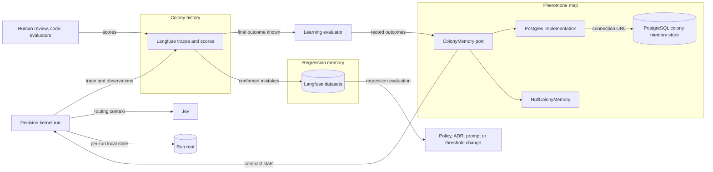
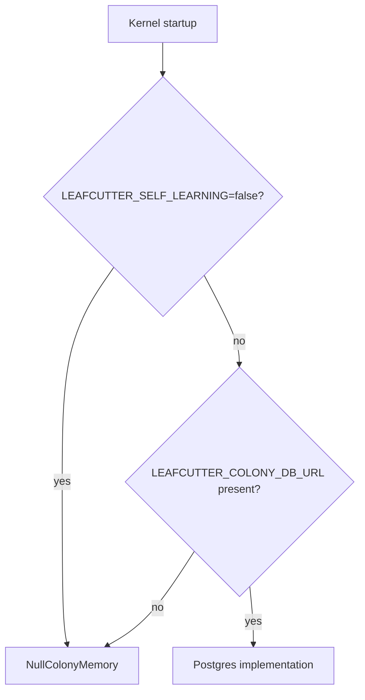

# Colony Memory — Container Overview

Colony memory is Leafcutter's optional cross-run learning layer. It turns the outcomes of
finished kernel runs into compact statistics that the kernel can read when it routes. It is the
"Leafcutter performance store" of [ADR-056 §8](../adrs/ADR-056-colony-memory-evidence-reinforcement.md),
built as an optional, plain PostgreSQL database behind a single port.

> **Langfuse remembers what happened. The colony memory store remembers what Leafcutter learned.**

**Status: planned.** No code exists yet. The component is registered as `colony_memory` in
`docs/components.json`. It is not part of kernel V0 scope (see [Staging](#staging-ladder)).

**Everything named on this page is ILLUSTRATIVE** unless an ADR decides it: table names, column
names, port method names, score names, dataset names, class names and all numbers. They come
from the 2026-09-30 design discussion and are not a decided schema or API.



Diagram parent: none (`root: true`). The kernel side is described in
[Decision Kernel — Container Overview](decision-kernel.md). The run root is
`.leafcutter/kernel/` ([design part 3](../../analysis/2026-09-30-decision-kernel-design-3-kernel-scheduler.md)).

## Three layers

| Layer | Where | What it holds | Question it answers |
|---|---|---|---|
| **Colony history** | Langfuse traces and scores | Complete traces: model calls, Jev decisions, retrieval, graph execution, evidence, outcomes, corrections, cost, latency and evaluation scores. | What actually happened? |
| **Pheromone map** | PostgreSQL colony memory store | Small derived statistics: success rates, wrong decisions, preferred paths, confidence calibration, capability gaps and routing statistics. | What has the colony learned? |
| **Regression memory** | Langfuse datasets | Historical examples of confirmed mistakes, each with its correct outcome. | Does a proposed change repeat an old mistake? |

The store does not replace Langfuse. Langfuse stays the source of detailed observational
evidence, and the store is a compact operational memory optimised for routing. New Python code
uses the Langfuse v4 / OpenTelemetry SDK, not the deprecated legacy `trace()` / `span()` API.
[ADR-058](../adrs/ADR-058-langfuse-colony-history-scores-datasets.md) records Langfuse's role as
colony history, scores and datasets.

## Containers

| Container | Responsibility | Decided in |
|---|---|---|
| Decision kernel | Emits one trace per run, with observations for routing, decisions, capability invocations and the final outcome. Reads compact statistics through the port when it routes. | [decision-kernel.md](decision-kernel.md) |
| Langfuse traces and scores | Colony history. A score attaches to a trace or to one observation. Scores can come from human review, application code, deterministic evaluators or LLM judges. | [ADR-058](../adrs/ADR-058-langfuse-colony-history-scores-datasets.md) |
| Learning evaluator | Once a run's final outcome is known, distils it into the store through the port, outside the hot path. When and where it runs is open. | [ADR-057](../adrs/ADR-057-colony-memory-store-optional-postgres.md), [ADR-058](../adrs/ADR-058-langfuse-colony-history-scores-datasets.md) |
| ColonyMemory port | The only interface between Leafcutter and the store. | [ADR-057](../adrs/ADR-057-colony-memory-store-optional-postgres.md) |
| Postgres implementation | Reads and writes a plain PostgreSQL database over a standard connection URL. | [ADR-057](../adrs/ADR-057-colony-memory-store-optional-postgres.md) |
| `NullColonyMemory` | Records nothing and returns no statistics. Used whenever self-learning is disabled. | [ADR-057](../adrs/ADR-057-colony-memory-store-optional-postgres.md) |
| PostgreSQL colony memory store | The pheromone map: compact aggregates and decision outcomes. | [ADR-057](../adrs/ADR-057-colony-memory-store-optional-postgres.md) |
| Langfuse datasets | Regression cases built from confirmed mistakes. | [ADR-058](../adrs/ADR-058-langfuse-colony-history-scores-datasets.md) |
| Run root | `.leafcutter/kernel/`: local per-run state. Unchanged by this layer. | [design part 3](../../analysis/2026-09-30-decision-kernel-design-3-kernel-scheduler.md) |

## The ColonyMemory port

One abstraction hides the database, so the rest of Leafcutter has no dependency on it. The
method names below are ILLUSTRATIVE, taken from the source:

```python
class ColonyMemory:
    async def get_capability_stats(...): ...
    async def record_capability_outcome(...): ...
    async def record_decision_outcome(...): ...
    async def get_path_stats(...): ...
    async def record_capability_gap(...): ...
```

- **Two implementations.** A Postgres-backed implementation (called "Postgres implementation"
  here; its class name is not decided) and `NullColonyMemory`. There is no
  `SupabaseColonyMemory`.
- **Chosen once, at startup.** Every other part of Leafcutter receives a `ColonyMemory` and never
  asks which one it has. No code outside the startup selection branches on the database URL.
- **Plain PostgreSQL.** Leafcutter connects with a standard Postgres connection URL. It uses no
  Supabase client (`supabase-py`), no PostgREST or other REST endpoints, and no Supabase auth or
  row-level security features.
- **Any Postgres host works.** A Supabase project's Postgres connection string is one option. A
  local Postgres, a self-hosted Postgres or any other Postgres-compatible host works the same way.

## Enablement

Two variables in the project-root `.env` control the layer:

| Variable | Effect |
|---|---|
| `LEAFCUTTER_COLONY_DB_URL` | Present: self-learning is enabled and the Postgres implementation is used. Absent: self-learning is disabled and `NullColonyMemory` is used. |
| `LEAFCUTTER_SELF_LEARNING=false` | Explicit opt-out. Self-learning stays disabled even when a database URL is configured. |

Enablement is inferred from the URL's presence. The only explicit switch is the opt-out.



With self-learning disabled, Leafcutter works normally. The kernel, Jev, LangGraph, Claude Code
handoffs and Langfuse tracing are unaffected. Only cross-run colony memory is missing. The
kernel's existing credential loader is `kernel/secrets.py`; how it picks up these two variables
is left to the build.

## Data path

1. **Run.** A kernel run emits one Langfuse trace, with child observations for every important
   node and not only for model calls: routing, research, decisions, host handoffs, verification
   and the final outcome.
2. **Score.** When an outcome becomes known, scores attach to the observation it concerns.
   ILLUSTRATIVE: a Jev decision "node vs subgraph → subgraph, confidence .94" that a later review
   changed to node gets `decision_correct = false`, `final_choice = node` and
   `reason = "No independent lifecycle"`. A routing decision can get `routing_success`,
   `required_fallback`, `required_rework` and `human_override`. A capability gap handled by
   fallback can get `capability_gap`, `fallback`, `fallback_success` and its cost.
3. **Evaluate.** The learning evaluator reads the finished outcome from Langfuse and records
   compact aggregates through the port. Whether it runs right after each completed run or
   periodically, and where it runs, is an open question.
4. **Store.** The PostgreSQL store keeps the aggregates and decision outcomes.
5. **Route.** At routing time the kernel reads compact statistics for the candidates through the
   port and passes them to Jev as routing context. ILLUSTRATIVE: each candidate carries its
   historical success for similar requests, average cost and average latency. This step
   influences routing only from the INFLUENCE ROUTING stage onward.
6. **Regress.** A confirmed mistake becomes a Langfuse dataset case. ILLUSTRATIVE: input is the
   feature description and the ADR, expected result is node, and the previous Jev result was
   subgraph, in a dataset such as `node_vs_subgraph_decisions`. Before a change to an ADR, Jev's
   instructions, evidence retrieval or confidence thresholds is deployed, the decision system is
   run against these cases.

```text
kernel run → Langfuse trace and scores → learning evaluator → PostgreSQL colony store
           → compact stats → routing context for Jev

production mistake → Langfuse trace → confirmed outcome → score → dataset case
           → improved decision policy → offline regression evaluation → deploy
```

**The hot path reads the store, never Langfuse.** The kernel does not query raw traces before a
Jev call. Routing keeps working when Langfuse is unavailable, and statistics never override the
deterministic eligibility exclusions that run before Jev
([ADR-056 §8](../adrs/ADR-056-colony-memory-evidence-reinforcement.md)).

## Starting tables (ILLUSTRATIVE)

| Table | Purpose | Example columns from the source |
|---|---|---|
| `capability_stats` | Which capabilities and graphs work well in which situations. | `capability_id`, `context_signature`, `usage_count`, `success_count`, `failure_count`, `fallback_count`, `override_count`, `avg_cost`, `avg_latency_ms`, `updated_at` |
| `decision_outcomes` | What Jev decided and whether it was later confirmed or corrected. The raw material for calibration. | `decision_type`, `policy_version`, `selected_option`, `confidence`, `final_option`, `correct`, `human_override`, `context_signature`, `created_at` |
| `path_stats` | Successful recurring graph and node sequences. | `path_signature`, `context_type`, `count`, `success_rate`, `avg_cost`, `avg_latency` |
| `capability_gaps` | Tasks Leafcutter could not solve natively. | None proposed. ADR-056 §6 names frequency, fallback cost and fallback success as the pressure signal. |

**Context is mandatory.** A statistic without context makes a misleading pheromone trail, so the
store never holds a global success rate such as "decision_research success = 96%". Every
statistic is scoped by at least these dimensions:

- capability
- task_type
- component
- repository / project
- policy_version

Later dimensions are framework, language and decision_type, combined through a context signature
(the ILLUSTRATIVE `context_signature` column). A useful statement is scoped. ILLUSTRATIVE:
"decision_research has a 97% success rate for architectural decisions involving LangGraph in this
repository".

**Usage is not evidence.** A column such as `usage_count` may be recorded, but usage alone never
raises a path's standing. Only verified outcomes do
([ADR-056 §2, §3](../adrs/ADR-056-colony-memory-evidence-reinforcement.md)). Evidence is
version-scoped and decays (ADR-056 §3 rule 2), which is one reason `policy_version` is mandatory.

## Staging ladder

Historical statistics must not change routing automatically at first. Early accidental successes
would otherwise reinforce themselves into bad behaviour.

| Step | What happens | Source stage |
|---|---|---|
| 1. COLLECT | The store is optional. Record graph usage, decisions, outcomes, capability gaps and fallback usage. No influence on behaviour. | Phase 1, MVP |
| 2. ANALYZE | Derive statistics: success rates, common paths, wrong decisions, confidence calibration. | Phase 2, V1 |
| 3. SUGGEST | Show advice such as "historically this path performs better". Routing itself does not change. | Phase 3 |
| 4. INFLUENCE ROUTING | Feed historical evidence into Jev routing. Only after calibration and after the held-out evaluation of [spec §19.4](../../analysis/2026-09-30-leafcutter-kernel-spec-rev3-7-later-stages.md#194-evaluate-before-activation). | Phase 4, V2 |
| 5. EVOLVE | Detect recurring capability gaps, weak policies, candidate workflows and repeated LLM reasoning, and propose improvements. Proposals stay reviewed: "trails may rank and propose; they may not legislate" (ADR-056 §3 rule 5). | V3 and final state |

**V0 scope.** The ladder is not part of kernel V0 scope unless the V0 build decides that COLLECT
is in; ADR-057 puts COLLECT's earliest start right after V0. Until then, V0 carries only the recording prerequisites that ADR-056 §9 recommends:
version fields beside `CorrelationIds`, an outcome event keyed to `decision_id`, and countable gap
records. A stage is reported as strengthening the colony only when a colony-health measure shows
it (ADR-056 §9).

## Relation to the run root

The colony memory store does not replace the V0 run root `.leafcutter/kernel/`. The two hold
different things.

| | Run root `.leafcutter/kernel/` | Colony memory store |
|---|---|---|
| Scope | One repository checkout, per run | Across runs; later possibly shared by a team |
| Holds | Checkpoints, run records, `events.jsonl`, artifacts, the interaction ledger, gap observations and the telemetry spool | Compact statistics and decision outcomes |
| Authority | Authoritative for workflow state ([spec §12.2](../../analysis/2026-09-30-leafcutter-kernel-spec-rev3-5-client-observability-safeguards.md#122-trace-continuity-across-process-restarts)) | Derived. Never workflow state. |
| Required | Always | Optional |

`gaps/observations.jsonl` remains the V0 record of capability gaps. V0 does not re-export its
degraded-mode telemetry spool to Langfuse, so an evaluator that reads only Langfuse undercounts
those runs. Whether the evaluator also reads the local `events.jsonl` records is ADR-056 open
question 5.

**Shared colony learning (later).** A team can point every developer and CI at the same
database. Evidence one person discovers, such as a well-performing path or a wrong decision, then
improves routing and calibration for everyone. This raises the privacy and identity questions
below.

## Open questions

1. **Privacy and data minimisation for a shared database.** What a shared store may hold when it
   spans developers and CI. `decision_outcomes` holds one row per decision, not only aggregates.
2. **Migrations and schema versioning.** How the schema is created and upgraded on an adopter's
   database, and how a Leafcutter version recognises a schema it cannot read.
3. **Retention and decay.** How long rows are kept, and the decay function that ADR-056 §3
   rule 2 requires but leaves open (ADR-056 open question 1).
4. **Evaluator cadence and location.** Whether the learning evaluator runs right after each
   completed run or periodically, and where it runs.
5. **Multi-repository identity.** How the repository / project dimension identifies one
   repository across clones, forks, worktrees and CI runners that share a database.

ADR-057 adds further questions, such as behaviour when a configured store is unreachable.
ADR-056's open questions also apply, in particular ground truth for "correct".

## Decisions

| ADR | Decides |
|---|---|
| [ADR-056](../adrs/ADR-056-colony-memory-evidence-reinforcement.md) | Colony memory: evidence from verified outcomes, never from usage alone. Runtime routing reads a compact store, never Langfuse. Learned changes are reviewed proposals. |
| [ADR-057](../adrs/ADR-057-colony-memory-store-optional-postgres.md) | The colony memory store is optional plain PostgreSQL behind the ColonyMemory port, with Postgres and Null implementations. |
| [ADR-058](../adrs/ADR-058-langfuse-colony-history-scores-datasets.md) | Langfuse is colony history: traces, scores, and datasets as regression memory. |

## Cross-Links

- Kernel overview: [Decision Kernel — Container Overview](decision-kernel.md)
- Run root layout: [kernel design part 3](../../analysis/2026-09-30-decision-kernel-design-3-kernel-scheduler.md)
- Observability rules: [kernel spec Rev 3 part 5, §12](../../analysis/2026-09-30-leafcutter-kernel-spec-rev3-5-client-observability-safeguards.md)
- Controlled learning: [kernel spec Rev 3 part 7, §19](../../analysis/2026-09-30-leafcutter-kernel-spec-rev3-7-later-stages.md)
