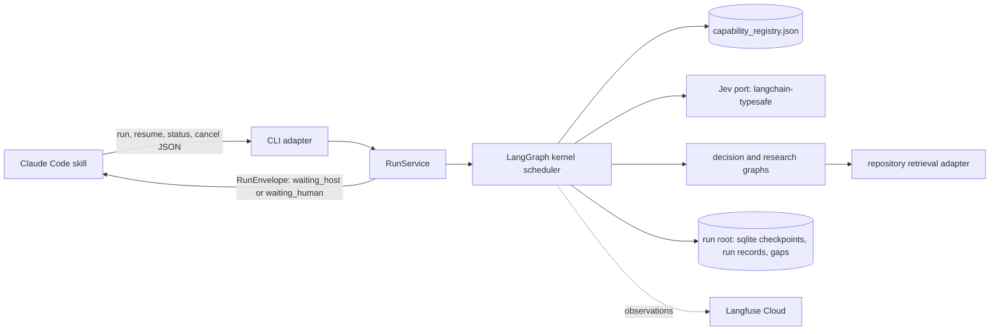

# Decision Kernel — Container Overview

The decision kernel is a small, resumable runtime. It takes a free-form engineering goal and
routes it to a registered capability using Jev's bounded judgments. It gathers evidence through
native decision and research capabilities. Generative or human work goes out as explicit,
checkpointed handoffs. Every run ends in a typed terminal state with evidence and a Langfuse
trace.

It lives only in leafcutter-ai, as the top-level package `kernel/`. It is **not**
shipped to adopter projects.

**Status: planned.** Phase 0 is complete: dependencies are pinned, the Stage 0 mapping and live
smoke evidence are recorded, and the design is written. Implementation proceeds in phases P1–P10.

Diagram parent: none (`root: true`). This overview is the entry point. The detailed design is
in [Decision Kernel V0 Design — Part 1](../../analysis/2026-09-30-decision-kernel-design.md).

## Containers

| Container | Responsibility | Design |
|---|---|---|
| Claude Code skill + CLI | Transport only. It forwards the goal, presents questions and results, and does exactly the host work requested. | [part 5](../../analysis/2026-09-30-decision-kernel-design-5-client-observability.md) |
| RunService | Client-independent API: `start_run`, `resume_run`, `get_run`, `cancel_run`. Validates submissions and keeps resume idempotent. | [part 5](../../analysis/2026-09-30-decision-kernel-design-5-client-observability.md) |
| Kernel scheduler | A fixed LangGraph with dynamic work items: routing, dispatch, validation, continuation, guards, finalization. | [part 3](../../analysis/2026-09-30-decision-kernel-design-3-kernel-scheduler.md) |
| Capability registry | New `config/capability_registry.json`, empty at start. Legacy agent and skill registries are never routed. | [part 2](../../analysis/2026-09-30-decision-kernel-design-2-contracts-registry-config.md) |
| Jev port | Bounded, batched classification through `langchain-typesafe`. Uncertainty is treated as data. | [part 4](../../analysis/2026-09-30-decision-kernel-design-4-jev-and-capabilities.md) |
| Capabilities | Native `decision` and `research` graphs, the `retrieve.repository` adapter, and `host.*` handoffs. | [part 4](../../analysis/2026-09-30-decision-kernel-design-4-jev-and-capabilities.md) |
| Run root | `.leafcutter/kernel/`: checkpoints, run records, artifacts, interaction ledger, capability gaps. | [part 3](../../analysis/2026-09-30-decision-kernel-design-3-kernel-scheduler.md) |
| Observability | Langfuse v4 traces that stay continuous across process restarts, correlation IDs on every observation, and redaction. | [part 5](../../analysis/2026-09-30-decision-kernel-design-5-client-observability.md) |

## Specification

Revision 3 (30 September 2026), in-tree copy:
[part 1](../../analysis/2026-09-30-leafcutter-kernel-spec-rev3.md) (goal and MVP boundary)
through [part 8](../../analysis/2026-09-30-leafcutter-kernel-spec-rev3-8-audit-links-handoff.md).
