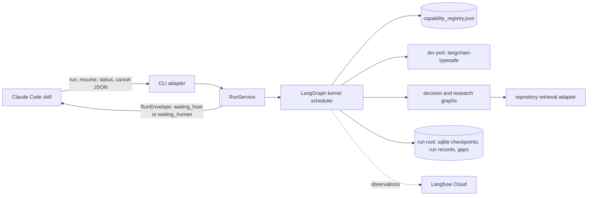

# Decision Kernel — Container Overview

The decision kernel is a small, resumable runtime. It takes a free-form engineering goal and
routes it to a registered capability using Jev's bounded judgments. It gathers evidence through
native decision and research capabilities. Generative or human work goes out as explicit,
checkpointed handoffs. Every run ends in a typed terminal state with evidence and a Langfuse
trace.

It lives only in leafcutter-ai, as the top-level package `kernel/`. It is **not**
shipped to adopter projects.

**Status: active.** Stage 1 (the MVP) is built: phases P0-P10 are complete. The exit gate of
spec Rev 3 section 16 is proven by offline tests and one live run; the checklist, the live trace
references and the deferred work are in the
[V0 demo and run report](../../analysis/2026-10-01-decision-kernel-v0-demo-report.md). Stages 2-5
(later capabilities, a policy store, native replacements for host operations, colony memory) are
deferred and listed there.

Run it with [How to run the decision kernel](../../how-to/run-the-decision-kernel.md) and inspect
its traces with
[How to inspect kernel traces with the Langfuse MCP server](../../how-to/inspect-kernel-traces-with-langfuse-mcp.md).

Diagram parent: none (`root: true`). This overview is the entry point. The detailed design is
in [Decision Kernel V0 Design — Part 1](../../analysis/2026-09-30-decision-kernel-design.md).
The end-to-end flows, the context map (where Jev, the host LLM, workers and humans get their
context) and the learning loop are in
[Decision Kernel — Flows and Context](../diagrams/decision-kernel-flows-overview.md). The
colony memory layer is in [Colony Memory](colony-memory.md).

## Exposed interfaces

Registered in `docs/components.json` under `decision_kernel.exposed_interfaces`:

| Interface | Where | Contract |
|---|---|---|
| CLI | `python -m kernel <run\|resume\|status\|cancel\|gaps\|decisions\|install-skill>` | One JSON document on stdout; exit 0 envelope, 2 usage, 3 rejected, 4 unknown run, 5 internal |
| RunService API | `kernel/service.py` | `start_run`, `resume_run`, `get_run`, `cancel_run`, `list_gaps` |
| `/leafcutter` skill | `kernel/adapters/claude_code/SKILL.md` | Transport-only Claude Code skill installed by `install-skill` |

## Containers

| Container | Responsibility | Design |
|---|---|---|
| Claude Code skill + CLI | Transport only. It forwards the goal, presents questions and results, and does exactly the host work requested. | [part 5](../../analysis/2026-09-30-decision-kernel-design-5-client-observability.md) |
| RunService | Client-independent API: `start_run`, `resume_run`, `get_run`, `cancel_run`. Validates submissions and keeps resume idempotent. | [part 5](../../analysis/2026-09-30-decision-kernel-design-5-client-observability.md) |
| Kernel scheduler | A fixed LangGraph with dynamic work items: routing, dispatch, validation, continuation, guards, finalization. | [part 3](../../analysis/2026-09-30-decision-kernel-design-3-kernel-scheduler.md) |
| Capability registry | New `config/capability_registry.json`, empty at start. Legacy agent and skill registries are never routed ([ADR-055](../adrs/ADR-055-capability-registry-starts-empty.md)). | [part 2](../../analysis/2026-09-30-decision-kernel-design-2-contracts-registry-config.md) |
| Jev port | Bounded, batched classification through `langchain-typesafe`. Uncertainty is treated as data. | [part 4](../../analysis/2026-09-30-decision-kernel-design-4-jev-and-capabilities.md) |
| Capabilities | Native `decision` and `research` graphs, the `retrieve.repository` adapter, and `host.*` handoffs. | [part 4](../../analysis/2026-09-30-decision-kernel-design-4-jev-and-capabilities.md) |
| Decision store | `kernel/memory/`: the `ColonyMemory` port, file and null backends, the decision record, validation, the generated index and `decisions publish`. Approved decisions are filed under `docs/decisions/` and reused as precedent. | [ADR-059](../adrs/ADR-059-decision-store-reviewable-yaml-records-now-graph-later.md) |
| Run root | `.leafcutter/kernel/`: checkpoints, run records, artifacts, interaction ledger, capability gaps. | [part 3](../../analysis/2026-09-30-decision-kernel-design-3-kernel-scheduler.md) |
| Observability | Langfuse v4 traces that stay continuous across process restarts, correlation IDs on every observation, and redaction. | [part 5](../../analysis/2026-09-30-decision-kernel-design-5-client-observability.md) |

## Decisions

| ADR | Decides |
|---|---|
| [ADR-052](../adrs/ADR-052-capabilities-replace-agents-prompts-are-compiled.md) | The contract-driven capability, not the agent, is the unit of work. Prompts are compiled outputs of a deterministic invocation compiler. |
| [ADR-053](../adrs/ADR-053-intelligence-selection-deterministic-jev-llm-human.md) | Which mechanism answers each check: deterministic code, Jev, an LLM or a human. |
| [ADR-054](../adrs/ADR-054-process-representation-and-maturity-model.md) | How process knowledge is held (workflow, policy/checklist or LLM-guided) and how it matures. |
| [ADR-055](../adrs/ADR-055-capability-registry-starts-empty.md) | The capability registry starts empty. Legacy agents and skills enter only by recorded decision. |
| [ADR-056](../adrs/ADR-056-colony-memory-evidence-reinforcement.md) | Colony memory: paths gain evidence from verified outcomes, never from usage alone. Decisions carry outcomes, and capability gaps drive what gets built next. V0 records the prerequisites only. |
| [ADR-057](../adrs/ADR-057-colony-memory-store-optional-postgres.md) | The colony memory store is optional plain PostgreSQL behind a `ColonyMemory` port with a Null implementation. Enabled by `LEAFCUTTER_COLONY_DB_URL`. See [colony-memory.md](colony-memory.md). |
| [ADR-058](../adrs/ADR-058-langfuse-colony-history-scores-datasets.md) | Langfuse is the colony history: every node traced, decisions scored, datasets as regression memory. |
| [ADR-059](../adrs/ADR-059-decision-store-reviewable-yaml-records-now-graph-later.md) | Decision store: human-approved decisions are filed as YAML records under `docs/decisions/` behind a `ColonyMemory` port and reused as precedent; a graph backend can replace the files later. |
| [ADR-060](../adrs/ADR-060-source-of-truth-and-approval-authority.md) | Git is canonical for published records; only a human approval creates a record; the kernel never writes the repository during a run; precedent is evidence, not authority. |
| [ADR-061](../adrs/ADR-061-identity-of-declared-and-learned-records.md) | Existing ids stay; decisions get a kernel-minted `dec-<16hex>` id; a record is keyed by (repository_id, kind, id). |

## Specification

Revision 3 (30 September 2026), in-tree copy:
[part 1](../../analysis/2026-09-30-leafcutter-kernel-spec-rev3.md) (goal and MVP boundary)
through [part 8](../../analysis/2026-09-30-leafcutter-kernel-spec-rev3-8-audit-links-handoff.md).
