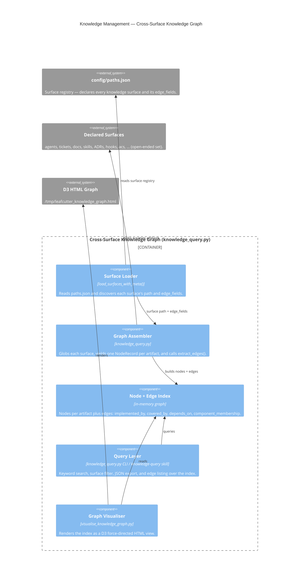

# Knowledge Management

## Overview

Knowledge Management is the cross-surface knowledge graph itself: the capability that
turns every knowledge surface declared in `config/paths.json` into a single, queryable
graph of nodes and edges. It is assembled by `scripts/knowledge_query.py`, which discovers
each surface from configuration, indexes one node per artifact, derives the relationship
edges an artifact carries, and exposes the result through a query CLI and a D3 graph
visualisation. This component is distinct from the [Knowledge System](./knowledge-system.md),
which handles post-execution learning *capture*; Knowledge Management owns the graph,
traceability, query, and visualisation *of* those surfaces.

## Component Diagram

The diagram below shows the graph-assembly pipeline: the surface registry in
`config/paths.json` drives `knowledge_query.py`, which globs each declared surface into a
node/edge index. That index is then consumed by the query CLI (surfaced through the
`knowledge-query` skill) and by the visualiser, which renders a self-contained D3
force-directed HTML graph.

Parent: [Agent Knowledge System](../agent_knowledge_system.md)

## Responsibilities

- Ingest every knowledge surface declared in `config/paths.json` — the surface set is read
  from configuration, not a fixed list, so new surfaces are picked up automatically.
- Derive one graph node per artifact and the relationship edges it carries
  (`implemented_by`, `covered_by`, `depends_on`, `component_membership`).
- Provide AC-to-code traceability: resolve an acceptance criterion to the source files that
  implement it and the tests that cover it via its edges.
- Expose a query layer for keyword search, surface-scoped filtering, JSON export, and edge
  listing across all surfaces.
- Render the assembled graph as a self-contained D3 force-directed HTML visualisation.

## Entry Points

- `scripts/knowledge_query.py` — cross-surface graph assembly and query CLI.
- `scripts/visualise_knowledge_graph.py` — D3 force-directed HTML visualisation (writes to
  `/tmp/leafcutter_knowledge_graph.html` with `--no-open`).
- `templates/skills/knowledge-query/SKILL.md` — the `knowledge-query` skill wrapping the CLI.
- `config/paths.json` — the surface registry the graph is built from.

## Integration

The graph is built against whatever surfaces `config/paths.json` declares, so it grows as
surfaces are added — no code change is required to onboard a new surface. The
acceptance-criteria store (the `acs` surface) is one such surface, and its
`component_membership` edges create synthetic component hub nodes (including
`knowledge-management` itself) that transitively connect surfaces. `implemented_by` and
`covered_by` targets are file paths rather than graph node IDs and are exempt from the
phantom-edge filter, so AC-to-code traceability edges are never silently dropped.

## Cross-Links

- Parent: [Agent Knowledge System](../agent_knowledge_system.md) — the L2 container view of how learnings are classified, routed, and persisted.
- [Knowledge System](./knowledge-system.md) — the sibling component covering post-execution knowledge *capture* (harvesting learnings, context-file maintenance).
- [Knowledge Query skill](../../../templates/skills/knowledge-query/SKILL.md) — the cross-surface query skill that reads the surfaces feeding this graph.

## Legend

| Element | Meaning |
|---|---|
| `Container_Boundary` | The cross-surface knowledge graph assembled by `knowledge_query.py` |
| `Component` (Surface Loader) | Reads `config/paths.json` to discover surfaces and their `edge_fields` |
| `Component` (Graph Assembler) | Globs each surface and derives nodes and edges |
| `Component` (Node + Edge Index) | The in-memory graph of nodes and the four relationship-edge kinds |
| `Component` (Query Layer) | The query CLI / `knowledge-query` skill over the index |
| `Component` (Graph Visualiser) | Renders the index as a D3 force-directed HTML graph |
| `System_Ext` | External inputs/outputs: the surface registry, the declared surfaces, and the generated HTML graph |
| `Rel` labels | The data flow through the assembly pipeline |
