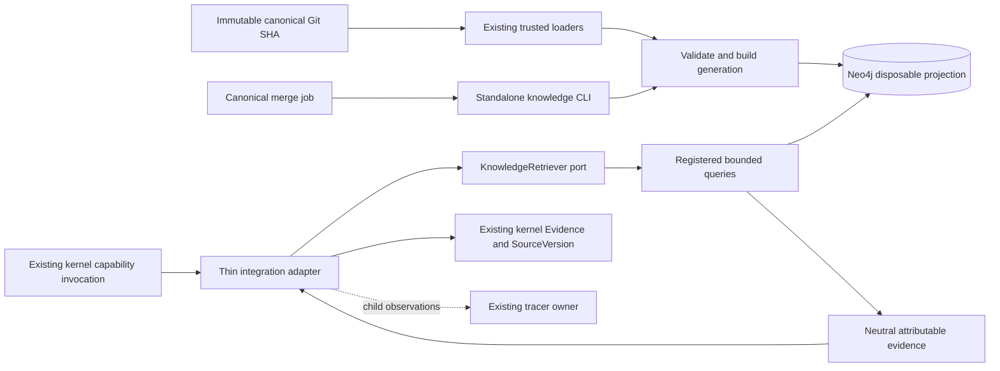
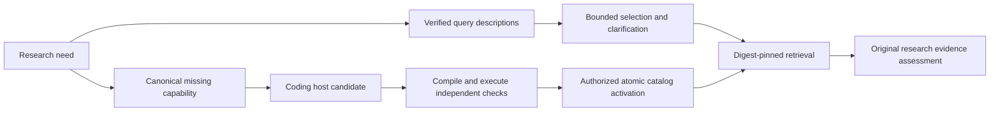

---

title: 'Knowledge Retrieval: standalone projection and kernel adapter'
description: 'Dependency and ownership boundary for immutable Neo4j projection and attributable retrieval.'
type: reference
status: active
flight_level: L3-Component
diagram_type: component
created: '2026-10-01'
last_updated: '2026-10-09'
components: [knowledge_management, decision_kernel]
related_docs:
  - docs/architecture/adrs/ADR-062-standalone-knowledge-retrieval.md
  - docs/how-to/run-knowledge-retrieval.md
  - docs/reference/knowledge-retrieval-answers.md
---
# Knowledge Retrieval

<!-- Domain graph presentation, KM-400a-3-i, 2026-10-02 -->

Aura's physical graph uses native domain labels (`AC`, `ADR`, `Component`,
`SourceFile`, `Test`) and allowlisted uppercase relationship types. Readable
identity, title, provenance and direct `components` values are projected as
ordinary properties. `current` is updated in the same transaction as the active
snapshot pointer. The canonical entity/relationship payload contracts are unchanged.
Diagnostic metadata uses `Repository` and `Snapshot`; the saved component search
excludes it. Aura's **In Scene** legend shows only the categories in the result.

The application reads and writes the current native graph format. Retired legacy
compatibility does not translate old persisted query pins at runtime. An obsolete
query catalog requires the separately verified replacement described in the
[native saved-query contract](../../reference/neo4j-native-queries.md#saved-native-queries);
retrieval does not silently migrate or publish graph data.

Knowledge owns projection, generation publication, query catalog, ranking, vector eligibility, progressive disclosure and source resolution. Neo4j adapters own driver lifecycle and database APIs. The composition root selects the optional backend. The kernel owns authorization, execution lifecycle, overall task budget and evidence sufficiency; it consumes a port and canonical evidence.

ACs, components, ADRs and declared file/test references reuse existing identity and field semantics. Unsupported surfaces and unresolved references are explicit diagnostics. The graph is a projection of one source SHA, never an alternative canonical authoring store. Historical memory fixtures do not imply an approved runtime persistence scheme.

The finite native reader registry adds Agent, Skill, Ticket, Document, RoadmapPhase,
GlossaryTerm, Flow, Mockup, MockData, ChangelogEntry, Capability and approved
Decision source contracts. Each reader returns complete authored metadata plus
separately identified template/body/context data. New identities are kind-qualified;
existing canonical IDs and references remain unchanged. Generated mirrors are
excluded, while referenced SourceFile/Test nodes keep their explicit source scope.

Native scalar fields are ordinary Neo4j properties. Nested fields use JSON Pointer
property names with a shape manifest preserving container order, nulls, empty
values and temporal types. Reserved graph names cannot overwrite source fields.
The writer reads back every node batch before publication. An explicit native
refresh at the currently published Git SHA creates a new generation and verifies
that all retained canonical payloads and relationship endpoints remain unchanged.
These storage fields do not enlarge the retrieval disclosure allowlist.

The kernel adapter binds configured repository identity/root, validates results, records request/execution metadata and obtains selected source detail within cumulative limits. It delegates ordinary file retrieval unchanged and adds no driver, query language, scheduler or checkpoint model to the kernel. Configuration and payload schemas are generated from existing model conventions; schema parity tests cover the added fields.

## Information needs before query selection

For authorized configured graph-source research without explicit caller
`answer_requirements`, the research LangGraph first dispatches the registered
`host.retrieval_needs` operation. The host LLM proposes all information dimensions
in one packet; System validates the pending request identity and offered labels,
then retains `retrieval_needs` and derives `answer_requirements` for retrieval
children. Jev continues to own finite evidence-category and operation choices.

The integration adapter owns repository catalog meanings and the projection to
answer fields/population. The kernel owns host/human continuations, accepted
submission records, permissions and cumulative budgets. Explicit answer contracts
and native-only research retain their existing compatible paths. A missing user
choice can resume the same research after clarification. Unsupported meaning or
failed prerequisites remain partial; a successful host submission is not answer
correctness or classifier approval.

See [the public run/resume guide](../../how-to/kernel-query-growth.md#interpret-a-question-before-selecting-its-query)
and [the current Product Truth flow](../../product-truth/flows/leafcutter/retrieval-current-baseline.flow.json).
The Oct3 experiment remains frozen evidence, and the wider search/traversal/learning
strategy remains proposed.

This route currently projects fields and supported single relationships. Whole-document
or combined-relationship needs remain explicit unresolved outcomes. Generic query
creation retains its existing component-scoped contract. Retrieval limits still
apply: the default top_k of 6 cannot prove an exhaustive fifteen-record population.
The returned typed-needs assessment remains attributable to its actual source and
never treats a missing final answerability judgment as success.

Requested `test_spec` is an additive source disclosure at level 3, not a new graph
mapping. `knowledge/requested_fields.py` reads its exact span from the pinned
file. Neutral evidence retains `field_contents` and field locators; the integration
emits a separate public source citation while preserving `/criteria`. Both source
and caller budgets still apply. [The answer contract reference](../../reference/knowledge-retrieval-evidence.md#field-provenance-and-availability)
specifies these fields and their unavailable/truncated outcomes.

The executable needs handoff currently accepts `detail_mode: fields` and one
supported entity/document pair: ac/ac_yaml, adr/adr, ticket/ticket,
component/component, flow/flow or decision/decision. Multiple pairs,
`bounded_context`, `full_document` and unsupported document kinds are unresolved
before query execution. Returned entity kinds must match. The standalone
interpreter can describe broader needs; that does not make them executable here.

## Entity-guided operation selection

The built-in selection path is specified by `DK-300d-4` and `DK-300d-5`.
After intent, a natural-language evidence need can offer the existing executable
read operations for permitted recognized IDs and trusted component scope. Jev
chooses a finite operation or target; deterministic code binds and validates the
arguments. It does not accept model-authored argument JSON or Cypher. Repository
identity, root, selected sources, source revision and remaining budgets stay pinned.
The entity-guided selector applies with and without the separate query catalog.
A configured catalog retains its governed construction/admission fallback only
for a supported missing operation; it does not restore component-only selection.

Natural AC descendant requests use a Python-bound recipe covering levels L0
through L3 and excluding the selected root. Discovery precedes authorization of
each source disclosure. Limits, denied detail and truncated populations remain
visible, so a bounded result cannot silently become an exhaustive population claim.

An offered repository fallback is executable only where both the current request
and run source policy admit native retrieval. A graph-only child cannot widen its
sources; an existing native research sibling remains a separate permitted path.
Explicit operation requests retain their existing deterministic behavior. Ticket
nodes and stored priority fields do not imply support for listing every ticket
with high or critical priority; that exhaustive filtered query is outside this
extension. Bounded sibling repository evidence does not remove its completeness
limitation, which survives durable research and synthesis resume. Ordinary
unsupported selection can still leave a useful permitted repository sibling.
No result ordering is required. Independent deterministic tests cover the registered
binding, real knowledge service, research continuation and synthesis resume;
the verification record is `reports/entity-graph-selection-evaluation.md`.
Live Jev selection quality and publication readiness remain separate operational
checks rather than claims established by controlled-port tests.

Optional Neo4j activation belongs in an explicitly selected local configuration;
the shared default continues to support backend-off repository retrieval.

## Authored query growth

The optional persistent query catalog belongs to knowledge retrieval, separate from the kernel capability registry. A coding host returns a typed candidate artifact; a separately authorized native activation capability uses the trusted admission port. Jev selects catalog identities and arguments, never executable Cypher. Existing canonical gap records, task continuations, evidence and source identities remain authoritative.

The compiler supports new compositions of up to two directed declared relations and typed property filters; it is not an alias registry. Its generated Cypher and descriptor hash are stored together. Serving reads retain historical digest versions. Atomic catalog publication uses an exclusive writer lock and compare-and-swap pointer, while admission receipts report the actual current verification SHA even when a query was already present. Database query work remains read-only. Catalog mutation is a distinct governed filesystem effect.

## Cross-links

- [Research answer reference](../../reference/knowledge-retrieval-answers.md) - Shared field meanings, population rules, proof labels and evaluation contracts.
