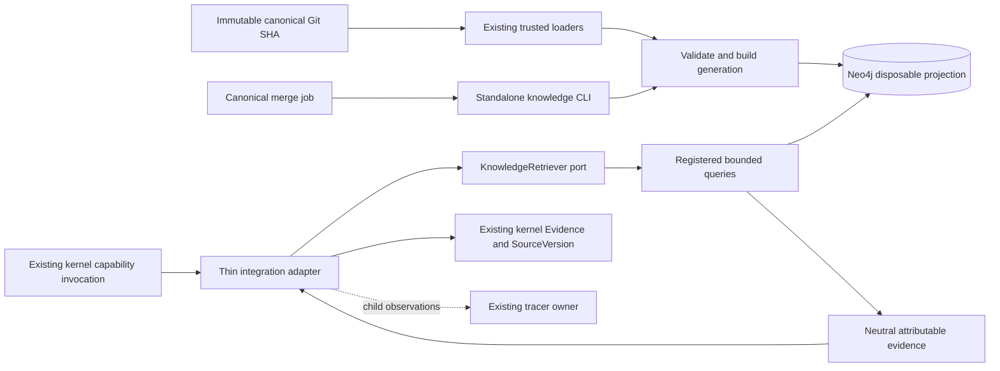
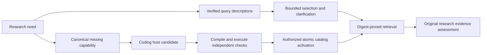

# Knowledge Retrieval

Knowledge owns projection, generation publication, query catalog, ranking, vector eligibility, progressive disclosure and source resolution. Neo4j adapters own driver lifecycle and database APIs. The composition root selects the optional backend. The kernel owns authorization, execution lifecycle, overall task budget and evidence sufficiency; it consumes a port and canonical evidence.

ACs, components, ADRs and declared file/test references reuse existing identity and field semantics. Unsupported surfaces and unresolved references are explicit diagnostics. The graph is a projection of one source SHA, never an alternative canonical authoring store. Historical memory fixtures do not imply an approved runtime persistence scheme.

The kernel adapter binds configured repository identity/root, validates results, records request/execution metadata and obtains selected source detail within cumulative limits. It delegates ordinary file retrieval unchanged and adds no driver, query language, scheduler or checkpoint model to the kernel. Configuration and payload schemas are generated from existing model conventions; schema parity tests cover the added fields.

## Authored query growth

The optional persistent query catalog belongs to knowledge retrieval, separate from the kernel capability registry. A coding host returns a typed candidate artifact; a separately authorized native activation capability uses the trusted admission port. Jev selects catalog identities and arguments, never executable Cypher. Existing canonical gap records, task continuations, evidence and source identities remain authoritative.

The compiler supports new compositions of up to two directed declared relations and typed property filters; it is not an alias registry. Its generated Cypher and descriptor hash are stored together. Serving reads retain historical digest versions. Atomic catalog publication uses an exclusive writer lock and compare-and-swap pointer, while admission receipts report the actual current verification SHA even when a query was already present. Database query work remains read-only. Catalog mutation is a distinct governed filesystem effect.
