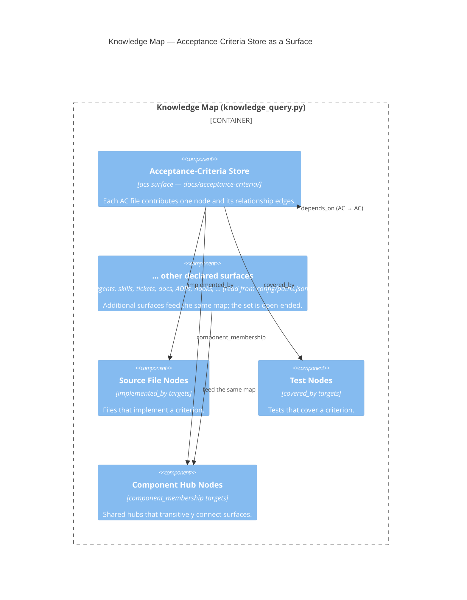
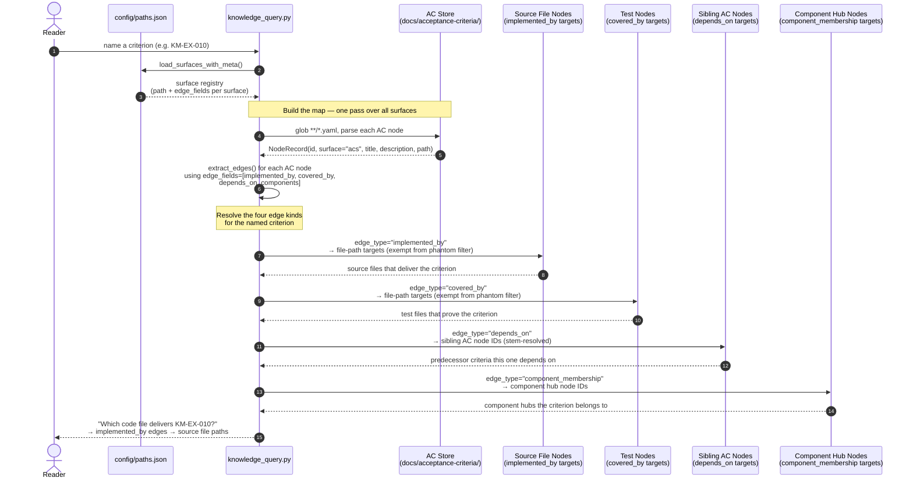

# Knowledge System

## Overview

The Knowledge System captures learnings discovered during ticket execution and routes them to persistent storage so future agent invocations benefit from prior experience. It is the implementation of the post-execution knowledge capture described in the Agent Knowledge System architecture.

## Knowledge-Map Surfaces

The knowledge map is the cross-surface knowledge graph assembled by
`scripts/knowledge_query.py` from every surface declared in
`config/paths.json`. Each declared surface contributes nodes and edges to the
map. The **acceptance-criteria store** (`docs/acceptance-criteria/`, declared as
the `acs` surface) is one such surface, feeding the map alongside the other
declared surfaces (agents, skills, tickets, docs, ADRs, hooks, and any further
surfaces added to `paths.json`). New surfaces are picked up from configuration —
the map is not built against a fixed surface count.

The diagram below focuses on the acceptance-criteria store's contribution. An
acceptance criterion contributes four kinds of relationship edge into the map:

- **`implemented_by`** → the source files that implement the criterion.
- **`covered_by`** → the tests that cover the criterion.
- **`depends_on`** → the other acceptance criteria it depends on.
- **`component_membership`** (from its `components` field) → the component hub
  nodes it belongs to.

Parent: [Agent Knowledge System](../agent_knowledge_system.md)

## Requirement-to-Code Traversal

The sequence diagram below shows how a reader follows a single acceptance
criterion from its identifier to the source files and tests that deliver it.
The traversal is driven by `knowledge_query.py`, which reads `config/paths.json`
to discover all surfaces, indexes their nodes and edges in one pass, and then
resolves the four outbound edge kinds an AC node can carry.

### Reading the diagram

| Step | What happens |
|------|--------------|
| 1–2 | The reader names a criterion; `knowledge_query.py` loads `config/paths.json` to discover all surfaces and their `edge_fields`. |
| 3–5 | `knowledge_query.py` traverses the `acs` surface (`docs/acceptance-criteria/`), yields one `NodeRecord` per `.yaml` file, and calls `extract_edges()` with the four declared edge fields. |
| 6–7 | `implemented_by` edges are emitted; targets are file paths (not graph node IDs) and are therefore **exempt from the phantom-edge filter** — they are never silently dropped even when the path is not itself a knowledge-graph node. |
| 8–9 | `covered_by` edges are emitted; same phantom-filter exemption applies. |
| 10–11 | `depends_on` edges are emitted; path values are stem-resolved to bare AC IDs before becoming `target_id` values. |
| 12–13 | `component_membership` edges are emitted; `components` field values become hub node IDs (synthetic hub nodes are created for any component that has no existing node). |
| 14 | The reader's question — "which code file delivers this criterion?" — is answered by reading the `implemented_by` edge targets from the indexed graph. |

## Responsibilities

- Harvest learnings from agent sign-off sessions via `harvest_learnings.py`
- Maintain context files that agents receive at invocation time
- Route new learnings to the appropriate knowledge surface

## Entry Points

- `scripts/knowledge/harvest_learnings.py` — learning harvester
- `scripts/knowledge/context_file_maintenance.py` — context file updater
- `scripts/knowledge/init_component_readme.py` — component README seeder

## Integration

The signoff skill §7 Knowledge Capture Step invokes the `route-learning` and `capture-learning` skills, which ultimately persist entries that `harvest_learnings.py` consolidates across sessions.

The acceptance-criteria store feeds the knowledge map via the `acs` surface declared in `config/paths.json`; surface declaration is implemented in ticket `KM-KGS-100a-1` and the four relationship-edge kinds in `KM-KGS-100a-3`.

## Cross-Links

- Parent: [Agent Knowledge System](../agent_knowledge_system.md) — the L2 container view of how learnings are classified, routed, and persisted.
- [Knowledge Query skill](../../../templates/skills/knowledge-query/SKILL.md) — the cross-surface query/skill that reads the surfaces feeding the knowledge map.

## Legend

| Element | Meaning |
|---|---|
| `Container_Boundary` | The knowledge map assembled by `knowledge_query.py` |
| `Component` (acs surface) | The acceptance-criteria store feeding the map |
| `Component` (other surfaces) | Any further surface declared in `config/paths.json`; the set is open-ended |
| `Rel` labels (`implemented_by`, `covered_by`, `depends_on`, `component_membership`) | The four relationship-edge kinds an acceptance criterion contributes |
| Self-loop `depends_on (AC → AC)` | An edge from one acceptance criterion to another |
