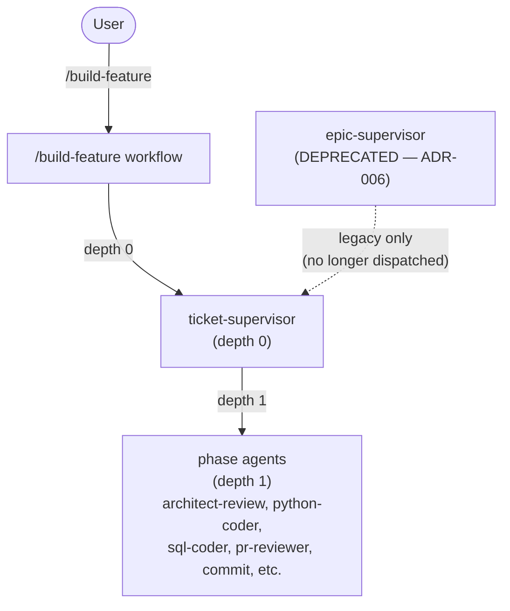

# Supervisor Spawn Topology

## Overview

This diagram documents the agent spawn topology after the supervisor chain was
flattened per [ADR-006](../adrs/ADR-006-flatten-supervisor-chain.md). The old
three-tier chain (`/build-feature → epic-supervisor → ticket-supervisor →
phase agents`) has been replaced by a two-tier flat chain where
`ticket-supervisor` runs at depth 0, dispatched directly by `/build-feature`.

**Decision reference:** ADR-006 (Flatten the Supervisor Chain — ticket-supervisor
at Depth 0) formally records the rationale, trade-offs, and accepted status of
this topology change.

## Spawn Topology Diagram



## Topology Key

| Arrow style | Meaning |
|---|---|
| `-->` solid arrow | Active dispatch path in the current implementation |
| `-.->` dashed arrow | Legacy/deprecated path — no longer in active use |

## Old vs New Topology

### Old topology (pre-ADR-006)

```
user
  └── epic-supervisor   (depth 0)
        └── ticket-supervisor  (depth 1)
              └── phase agents  (depth 2)
```

Claude Code's Agent tool hard-limits sub-agent nesting to depth 1. With
`epic-supervisor` at depth 0, `ticket-supervisor` at depth 1, and phase agents
at depth 2, every phase agent dispatch was silently swallowed — the agent tool
call appeared to succeed but produced no output, no file changes, and no
sign-offs.

### New topology (post-ADR-006)

```
user
  └── /build-feature  (depth 0 — epic orchestration inlined)
        └── ticket-supervisor  (depth 0 — dispatched directly)
              └── phase agents  (depth 1)
```

`ticket-supervisor` is now called at depth 0, keeping phase agents at depth 1
— within the hard limit. Epic-level batching and dependency resolution that
was previously owned by `epic-supervisor` is now inlined in `/build-feature`.

## References

- [ADR-006: Flatten the Supervisor Chain](../adrs/ADR-006-flatten-supervisor-chain.md)
- [EPIC-FlattenSupervisorChain Master Plan](../../../tickets/00_inbox/epics/EPIC-FlattenSupervisorChain/Master_Plan.md)
- [building-epics SKILL](../../../.claude/skills/building-epics/SKILL.md) — §1 documents the current epic-level algorithm now inlined in `/build-feature`
