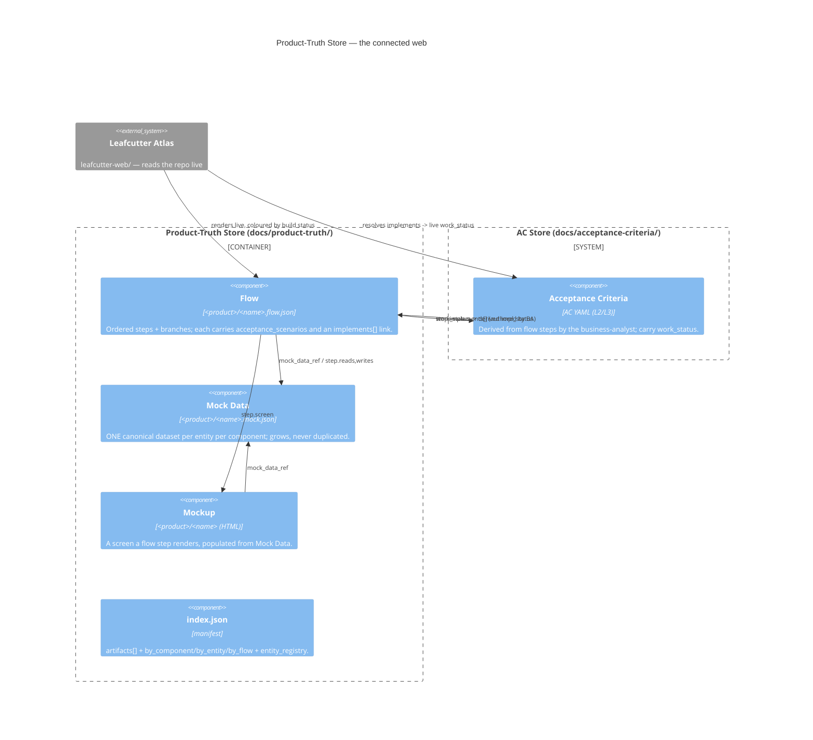

# UX Prototyping — The Product-Truth Store

## Overview

**UX Prototyping** is the component that owns the **product-truth store**
(`docs/product-truth/`): the flow-first upstream layer that sits beside the AC
store. It captures the *baseline business information* every product rests on —
the things that exist (**Mock Data**), the journeys people take (**Flows**), and
the screens they see (**Mockups**) — as schema-validated, cross-referenced JSON.

Agents read the JSON; personas review the rendered picture; they are the same
artifact. The store is the surface on which product intent is authored and
reviewed *before* acceptance criteria exist, and it is the source from which the
`business-analyst` derives those criteria. Its authority and its relationship to
the AC store are recorded in
[ADR-020](../adrs/ADR-020-product-truth-flow-first-upstream-layer.md).

## What it is (and is not)

- **It is** authoritative for **product intent** — journeys, screens, and the one
  canonical dataset per entity per component.
- **It is not** the backlog. It carries no `work_status` and queues no work; the
  AC store remains the single authoritative backlog (ADR-010). The product-truth
  store reads `work_status` *from* the AC store to derive its own status; it never
  writes a competing status.

## Store Layout

```
docs/product-truth/
  README.md                     operational README (layout, linkage, seeds)
  index.json                    the SEARCHABLE manifest (artifacts[] + derived indexes)
  schemas/
    flow.schema.json            shape of a Flow artifact
    mock-data.schema.json       shape of a Mock Data artifact
    mockup.schema.json          shape of a Mockup artifact
    classifier-eval.schema.json shape of one classifier eval row
  classifier/
    eval.jsonl                  labelled examples: request -> which artifacts are needed
  flows/<product>/<name>.flow.json   machine-readable flow (source of truth)
  flows/<product>/<name>.md          human-readable rendering (GENERATED — do not edit)
  mock-data/<product>/<name>.mock.json
  mockups/<product>/…                (HTML; the Atlas is the current renderer)
  scripts/
    validate_product_truth.py   schema + cross-ref + impl-rollup + eval validator
```

Artifact ids are **path-stable**: `<product>/<name>` (e.g. `fern-and-fig/catalog`).
The id never changes when an artifact is extended — only its `version` and
contents grow.

### The manifest (`index.json`)

`artifacts[]` is the authoritative list of every artifact. `by_component`,
`by_entity`, and `by_flow` are **derived indexes** for fast lookup, and the
`entity_registry` is the shared entity vocabulary — every entity name a Flow,
Mockup, or Mock Data artifact uses must be a member (a typo is a hard failure,
not a duplicate dataset). Any agent authoring an artifact MUST search this
manifest first (see the add-vs-create protocol below).

## Flows ↔ Mockups ↔ Mock Data ↔ ACs ↔ Atlas

The whole point is **one connected web keyed on stable ids**:



The four link kinds, precisely:

- **Flow step → ACs** — each step/branch carries `implements: [<AC ids>]`,
  authored by the `business-analyst` from that step's `acceptance_scenarios`.
  This is the source-of-truth link for flow↔AC linkage.
- **Flow step → implementation status** — `impl_status`
  (`not_started | in_progress | done`) is **DERIVED** from the `work_status` of
  every AC in `implements` (which bottoms out on ticket `status: done`), or —
  when a step has `expands_to` — from the child flow's rollup. `impl_summary`
  rolls the whole flow up. **Never hand-edited**; the validator/generator
  recompute it and flag drift.
- **Flow → Mock Data** — `mock_data_ref` points at the one canonical dataset;
  each step's `reads`/`writes` name the entities it touches.
- **Mockup → Flow** — a Mockup's `screen` is the bare id that a flow step
  references via `step.screen`; the Mockup's `mock_data_ref` names the dataset
  that populates it.

## Connection to the Build Pipeline

The product-truth store is **upstream** of the ADR-010 backlog and feeds it by
generation, not replacement:

1. **Classify.** `ac-triage` / the classifier (gold eval: `classifier/eval.jsonl`)
   decides whether a request needs a Flow, Mock Data, and/or a Mockup, and names
   the building agent.
2. **Author flow-first.** The journey is authored as a Flow (with Mockups and
   Mock Data alongside) following the add-vs-create protocol.
3. **Derive ACs.** The `business-analyst` decomposes each flow step's
   `acceptance_scenarios` into L2/L3 AC YAML files in the AC store, and records
   the resulting ids in the step's `implements[]`.
4. **Queue work.** From here the ADR-010 pipeline runs unchanged:
   `scan_ac_store.py` finds ready ACs and `generate_ticket_from_ac.py` produces
   tickets.
5. **Build against the reviewed truth.** `test-writer` builds fixtures from Mock
   Data `records`; `frontend-coder` builds each screen to match its Mockup,
   populated from the same Mock Data; `user-surface-smoker` asserts the built
   screen matches the approved Mockup.
6. **Status flows back.** As ACs reach `work_status: done`, each step's derived
   `impl_status` updates, and the Atlas colours the journey accordingly.

## The Leafcutter Atlas (read surface)

`leafcutter-web/` is a Next.js app that reads both stores **live from the repo on
each request** (`lib/data/repo.ts` resolves the repo root; `lib/data/flows.ts`
loads every `*.flow.json`). It resolves each step's `implements` ids to their
**live** AC `work_status` via `acById(id)` and rolls them up into the displayed
`impl_status` — the stored `impl_status` in the JSON is used only as a fallback
for AC ids that do not resolve. The Atlas and the generated `.md` rendering of a
flow are **read-only views**; the `.flow.json` stays the single source of truth.

## Lifecycle & Validation

- Every artifact carries `readiness: draft → reviewed → approved` (reviewed by a
  persona — for now, the Product Owner) — a separate axis from `status: active |
  deprecated` (is the journey/screen live vs retired).
- `docs/product-truth/scripts/validate_product_truth.py` checks schema
  conformance, `index.json` mirroring, entity-registry membership, step/branch id
  uniqueness, `acceptance_scenarios.for` resolution, `impl_summary` correctness,
  mock-data invariants, and classifier `outcome` consistency. Unresolved
  `implements` AC ids are warnings (a seed flow may reference not-yet-authored
  ACs). It is wired into the commit gates alongside the AC gates.

## Entry Points

- `docs/product-truth/index.json` — the searchable manifest (start here).
- `docs/product-truth/schemas/` — the four artifact schemas.
- `docs/product-truth/scripts/validate_product_truth.py` — the validator.
- `leafcutter-web/lib/data/flows.ts` — the Atlas loader for flows and mock data.

## Cross-Links

- [ADR-020 — Product-Truth Store as the Flow-First Upstream Layer](../adrs/ADR-020-product-truth-flow-first-upstream-layer.md) — the decision, and the reconciliation with ADR-010.
- [ADR-010 — AC Store as Authoritative Backlog](../adrs/ADR-010-ac-store-as-authoritative-backlog.md) — the downstream backlog this store feeds.
- [How to author product-truth artifacts by hand](../../how-to/authoring-product-truth-artifacts.md) — the search → add-vs-create protocol.
- [Product-truth schema reference](../../how-to/product-truth-schema-reference.md) — field-by-field reference for the four schemas.
- [docs/product-truth/README.md](../../product-truth/README.md) — the store's operational README.

## Legend

| Element | Meaning |
|---|---|
| `Container_Boundary` (product-truth) | The store's three artifact kinds plus the manifest |
| `System_Boundary` (AC store) | The downstream authoritative backlog (ADR-010) |
| `System_Ext` (Atlas) | The live read surface (`leafcutter-web/`) |
| `Rel` `step.implements[]` | Authored flow→AC link (source of truth) |
| `Rel` `work_status -> derived impl_status` | Status read back from the AC store; never hand-edited |
