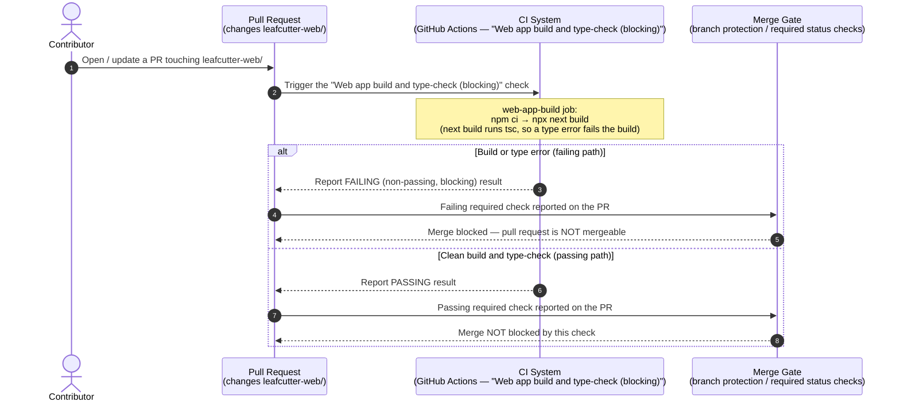

# Web App CI Gate — Pull Request to Merge Decision Sequence

This diagram documents the **web-app CI gate**: the flow from a pull request that
changes the web app (`leafcutter-web/`), through the automated build/type-check
check running in CI, to the pass/fail result being reported on the pull request
and gating the merge decision.

Three participants take part in the flow:

1. **The pull request** — a PR that changes one or more files under
   `leafcutter-web/`.
2. **The CI system running the check** — GitHub Actions running the
   `web-app-build` job, whose stable check name is
   **`Web app build and type-check (blocking)`**. The job runs `npm ci` then
   `npx next build` in `leafcutter-web/`; because `next build` runs the
   TypeScript compiler (`tsc`), a type error fails the build and therefore the
   check.
3. **The merge gate** — branch protection / required-status-checks, which
   consults the reported check result to decide whether the pull request may
   merge.

> **Stable check-name contract.** The check label
> **`Web app build and type-check (blocking)`** is the exact, stable
> `ci.yml` job name that the branch-protection required-status-checks wiring
> (BP-1400a-4) depends on. This diagram uses that same label — a divergent
> label would silently decouple the gate from the check.

> **Blocking, not advisory.** The `web-app-build` job sets **no**
> `continue-on-error`, so a build failure or any type error exits non-zero and
> reports a failing (blocking) result — in contrast to the informational
> `typecheck` (mypy) job, which is advisory.

---

Parent: [Feature to Merged PR — End-to-End Sequence Diagram](../diagrams/c2-006-feature-to-merged-pr.md)

---

## Flow walk-through

1. **A pull request changes the web app.** A contributor opens or updates a
   pull request that touches one or more files under `leafcutter-web/`.

2. **The CI system runs the blocking check.** GitHub Actions runs the
   `web-app-build` job — the **`Web app build and type-check (blocking)`**
   check — which installs dependencies with `npm ci` and builds the web app with
   `npx next build`. Because `next build` invokes the TypeScript compiler, the
   build and the type-check happen in the same step.

3. **The result is reported on the pull request.**
   - **Failing path** — if the build fails or any type error is reported, the
     job exits non-zero and the check reports a **failing (non-passing,
     blocking)** result on the pull request.
   - **Passing path** — only when the web app builds and type-checks with no
     errors does the check report a **passing** result.

4. **The merge gate consults the reported result.** The merge gate (branch
   protection / required status checks) reads the reported result: a failing
   result blocks the merge (the pull request is not mergeable), while a passing
   result means the merge is not blocked by this check.

> This diagram is documentation-only. It depicts exactly the behaviour
> specified by BP-1400a-1 (the blocking build/type-check check) and BP-1400a-4
> (the required-status-checks wiring). It does not assert any retry,
> notification, or other behaviour beyond that shared pull-request-to-merge
> flow.

## Cross-References

- [Feature to Merged PR — End-to-End Sequence Diagram](../diagrams/c2-006-feature-to-merged-pr.md) —
  the parent flow whose merge step this web-app CI check gates.
- [`.github/workflows/ci.yml`](../../../.github/workflows/ci.yml) — the CI
  configuration that defines the `web-app-build` job
  (`Web app build and type-check (blocking)`).
