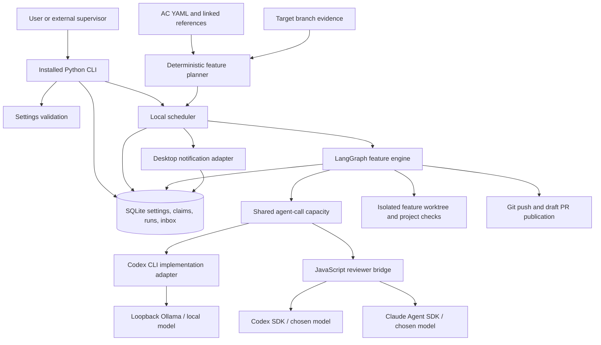

# Background AC worker components

LangGraph controls feature execution transitions. It does not select a model
implicitly, replace the coding harness, or provide the local inference server.
SQLite owns durable admission and recovery data. The existing regular workflow
engine and its model tiers remain separate from this opt-in lane.
