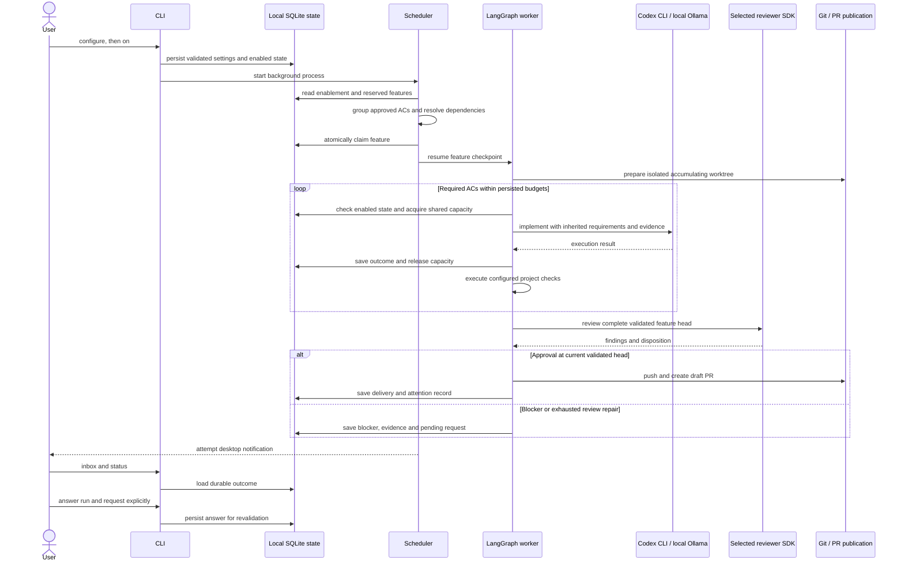

# Background AC worker sequence

Repair returns to the local implementation harness and shared budgets. No phase
is authorized merely by another phase reporting success: validation, review and
publication retain their own evidence and exact revision checks.
