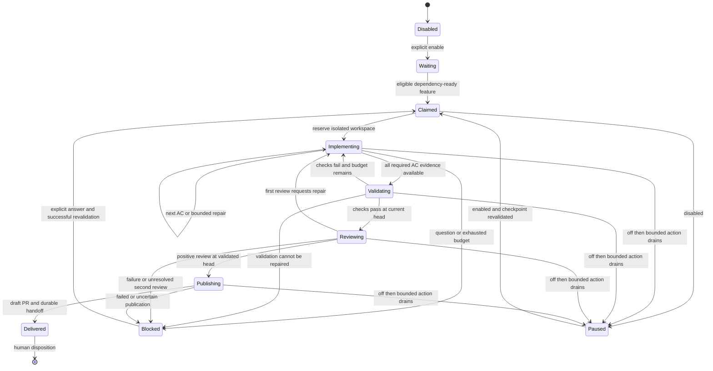

# Background AC worker state transitions

This view describes the worker control policy. Displayed state names may be
more specific in a persisted run; the inbox retains the blocking reason.

Restart does not reset budgets or authorize unresolved blockers. A delivered
reservation remains until explicitly reconciled; reaching a draft PR does not
mark the target branch complete or merge the proposal.
