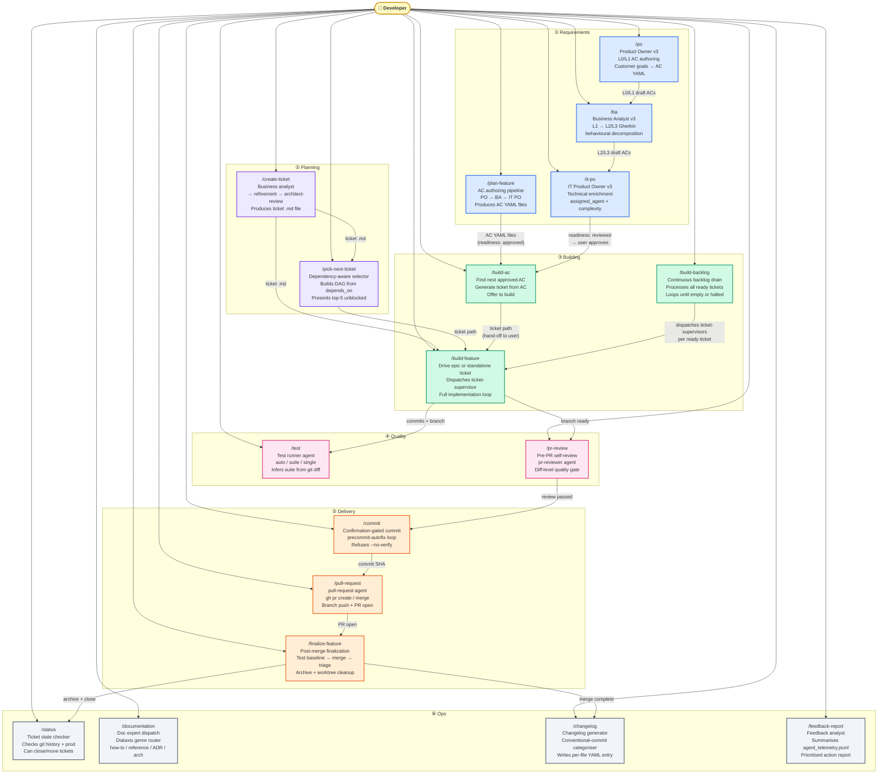

# Leafcutter Command Map — User-Facing Slash Commands

This diagram is the top-level map of every user-facing slash command in
the leafcutter system. Commands are grouped by the workflow stage they
belong to. Arrows show the handoffs a user commonly makes between
commands, and the flows that one command triggers in another.

---

## Diagram Legend

| Symbol | Meaning |
|---|---|
| Person | User / developer invoking the command |
| Rounded rectangle | Slash command (user-facing entry point) |
| Arrow label | Typical invocation sequence or data handoff |
| Dashed border | Grouping by workflow stage |

---

## Command Map

---

## Command Descriptions

### Requirements

| Command | Entry Agent | Primary Output |
|---|---|---|
| `/plan-feature` | Full PO→BA→IT PO pipeline | L0–L3 AC YAML files in `docs/acceptance-criteria/` |
| `/po` | `product-owner` | L0 (goal) and L1 (feature) AC YAML files |
| `/ba` | `business-analyst` | L2 (behavioural) and L3 (edge-case) AC YAML files |
| `/it-po` | `it-po` | Enriched ACs: `assigned_agent`, `estimated_complexity`, `delivers_to`/`expects_from` |

`/plan-feature` is the pipeline shortcut — it sequences PO → BA → IT PO
in one invocation. `/po`, `/ba`, and `/it-po` are the individual agents invoked
directly when the user wants to run a single pipeline stage.

### Planning

| Command | Entry Agent | Primary Output |
|---|---|---|
| `/create-ticket` | `business-analyst` → `refinement` + `architect-review` | Ticket `.md` file in `tickets/00_inbox/` |
| `/pick-next-ticket` | `ticket-prioritizer` skill | Top-5 unblocked ticket candidates; optionally dispatches `/build-feature` |

### Building

| Command | Entry Agent | Primary Output |
|---|---|---|
| `/build-ac` | `build-ac` agent | Ticket generated from AC; user prompted to build |
| `/build-feature` | `ticket-supervisor` (standalone) or `epic-supervisor` (epics) | Fully implemented feature on a branch |
| `/build-backlog` | `ticket-prioritizer` skill → `ticket-supervisor` per ticket | Continuous drain of all ready tickets |

`/build-ac` generates a ticket from the highest-priority approved AC and
hands the ticket path back to the user to run `/build-feature`. It does NOT
directly dispatch `/build-feature` itself (see ADR-006: flatten supervisor chain).

### Quality

| Command | Entry Agent | Primary Output |
|---|---|---|
| `/test` | `test-runner` | Test run results; `auto` mode infers the suite from `git diff` |
| `/pr-review` | `pr-reviewer` | Self-review report against the working diff |

### Delivery

| Command | Entry Agent | Primary Output |
|---|---|---|
| `/commit` | `commit` agent | Confirmed git commit; `precommit-autofix` loop on hook failure |
| `/pull-request` | `pull-request` agent | GitHub PR opened or merged via `gh pr create/merge` |
| `/finalize-feature` | `finalize-feature.js` workflow | Merged PR; archived epic; cleaned worktree |

`/finalize-feature` is the full delivery sequence: baseline test capture →
PR probe → `origin/main` merge → post-merge test triage → PR merge gate →
local main sync → pre-existing failure tickets → worktree removal.

### Ops

| Command | Entry Agent | Primary Output |
|---|---|---|
| `/status` | `status-checker` | Ticket state report; can close/move tickets |
| `/documentation` | `documentation-expert` | Diataxis-classified doc (how-to / reference / explanation / ADR / architecture) |
| `/changelog` | `changelog-agent` | Per-file YAML changelog entry under `docs/changelog/` |
| `/feedback-report` | `feedback-analyst` | Prioritised action report from `agent_telemetry.jsonl` |

---

## Key Cross-Stage Handoffs

| From | To | What is passed |
|---|---|---|
| `/plan-feature` or `/it-po` | `/build-ac` | AC YAML files with `readiness: approved` |
| `/build-ac` | `/build-feature` | Ticket `.md` path (user hand-off, not automatic dispatch) |
| `/create-ticket` or `/pick-next-ticket` | `/build-feature` | Ticket `.md` path |
| `/build-backlog` | `/build-feature` (internally) | Ordered ticket list from `ticket-prioritizer` skill |
| `/build-feature` | `/test`, `/pr-review` | Feature branch with committed changes |
| `/pr-review` | `/commit` | Green self-review — proceed to commit |
| `/commit` | `/pull-request` | Commit SHA on the feature branch |
| `/pull-request` | `/finalize-feature` | Open PR number and branch ref |
| `/finalize-feature` | `/changelog`, `/status` | Merged commit SHA; epic archive path |

---

## Cross-References

- [AC-Driven Pipeline component diagram](c2-001-ac-driven-pipeline.md) — scripts
  and data flows inside the `/build-ac` → `/build-feature` path.
- [AC Authoring Pipeline sequence diagram](c2-002-ac-authoring-pipeline.md) —
  how ACs move through PO→BA→IT PO before reaching `/build-ac`.
- [/build-ac Execution Flow sequence diagram](c2-004-build-ac-flow.md) — the
  yes/review/skip branch logic inside `/build-ac`.
- [Goal-to-Epic Dispatch sequence diagram](c2-005-goal-to-epic-dispatch.md) —
  `/build-ac` goal detection and AC tree traversal for epic dispatch.
- [Agent Delivery Workflows](../agent_delivery_workflows.md) — supervisor
  dispatch topology that `/build-feature` delegates into.

<!--
====================================================================
DECISION HISTORY
====================================================================
- 2026-06-08 [documentation-expert]: Initial authoring. L1 context diagram
  mapping all 18 user-facing slash commands across 6 workflow stages
  (Requirements, Planning, Building, Quality, Delivery, Ops) with
  cross-stage handoff arrows.
====================================================================
-->
