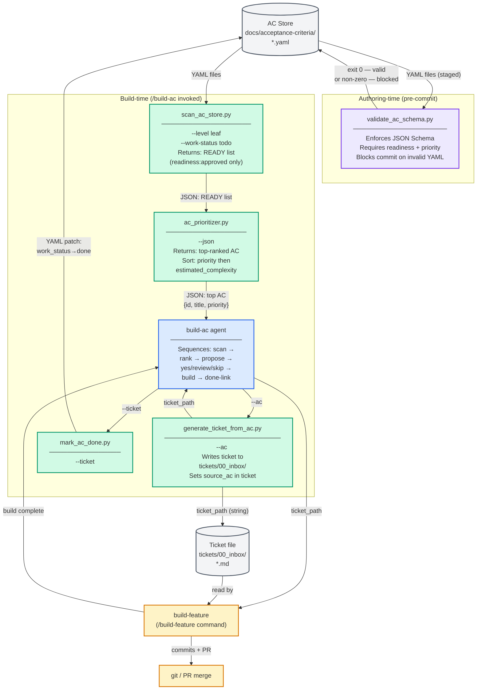

# AC-Driven Pipeline — Component Diagram

This diagram shows all seven components of the AC-driven pipeline, the AC
store data source, and the data flows between them. Components are grouped
by phase: **authoring-time** (run when an AC is committed) and
**build-time** (run when `/build-ac` is invoked). Arrows are labelled with
the data format that flows along each edge.

---

## Diagram Legend

| Color | Role | Description |
|---|---|---|
| Grey | Data store | Persistent YAML files or Markdown tickets |
| Green | Script | Purpose-built scripts that read or transform store data |
| Blue | Agent | Orchestrating agent that sequences script calls and user prompts |
| Purple | Commit-time | Pre-commit hook or git merge step |
| Yellow | External | Existing build pipeline components unchanged by this epic |

---

## Component Diagram

---

## Component Descriptions

| Component | Phase | Purpose |
|---|---|---|
| **AC Store** | Both | YAML files under `docs/acceptance-criteria/`; authoritative backlog. Each AC carries `readiness`, `work_status`, `priority`, `assigned_agent`, and `estimated_complexity`. |
| **validate_ac_schema.py** | Authoring-time | Pre-commit hook. Enforces `config/ac_schema.json` on every staged AC YAML. Requires `readiness` and `priority` fields. Blocks invalid commits. |
| **scan_ac_store.py** | Build-time | Walks the AC store, filters by `readiness: approved` and `work_status: todo`, resolves `depends_on` chains, returns a sorted READY list as JSON. |
| **ac_prioritizer.py** | Build-time | Receives the READY list, ranks by `priority` (critical → high → medium → low) then `estimated_complexity` ascending, returns the top candidate as JSON. |
| **generate_ticket_from_ac.py** | Build-time | Reads an AC by ID, generates a full Markdown ticket file in `tickets/00_inbox/`, and writes `source_ac: <id>` into the ticket frontmatter for traceability. Idempotent: exits non-zero if a ticket for this AC already exists. |
| **mark_ac_done.py** | Build-time | Reads a ticket's `source_ac` field, locates the AC YAML, and sets `work_status: done`. Called after `/build-feature` completes. Idempotent. |
| **build-ac agent** | Build-time | Thin coordinator that sequences `scan → rank → propose → yes/review/skip → build → done-link`. Does not write files itself; all mutations go through the scripts above. |

---

## Data Flow Labels

| Arrow | Data format |
|---|---|
| AC Store → validate_ac_schema.py | YAML files (git-staged) |
| AC Store → scan_ac_store.py | YAML files (directory walk) |
| scan_ac_store.py → ac_prioritizer.py | JSON array of AC objects |
| ac_prioritizer.py → build-ac | JSON: `{id, title, priority, estimated_complexity}` |
| build-ac → generate_ticket_from_ac.py | AC id string (CLI `--ac` argument) |
| generate_ticket_from_ac.py → ticket file | Markdown (`.md`) ticket |
| generate_ticket_from_ac.py → build-ac | ticket_path string |
| build-ac → build-feature | ticket_path string |
| build-ac → mark_ac_done.py | ticket_path string (CLI `--ticket` argument) |
| mark_ac_done.py → AC Store | YAML patch (`work_status: done`) |

---

## Key Design Constraints

1. **AC store is read-only during scan.** `scan_ac_store.py` never modifies
   the store. The only mutation points are `generate_ticket_from_ac.py`
   (writes `source_ac` to the ticket) and `mark_ac_done.py` (writes
   `work_status: done` back to the AC YAML).
2. **Idempotency is mandatory.** Both `generate_ticket_from_ac.py` and
   `mark_ac_done.py` detect and skip re-runs to avoid duplicate tickets or
   double-done writes.
3. **Generated tickets are structurally identical to hand-written tickets.**
   The build pipeline has no awareness of how a ticket was created. No
   special-casing is needed in `epic-supervisor` or `ticket-supervisor`.
4. **Only `readiness: approved` ACs are visible to the pipeline.** ACs at
   `draft` or `reviewed` are excluded by `scan_ac_store.py` before
   `ac_prioritizer.py` sees the list.

---

## Cross-References

- [AC authoring pipeline](ac-authoring-pipeline.md) — sequence view of
  how ACs reach `readiness: approved`.
- [/build-ac execution flow](build-ac-flow.md) — sequence view of the
  build-time flow.
- [AC readiness state machine](ac-readiness-states.md) — five states and
  the transitions exercised by this pipeline.
- [How to use the AC-driven development system](../../how-to/ac-driven-development.md) — task-oriented guide.
- [Agent Delivery Workflows](../agent_delivery_workflows.md) — parent
  diagram; shows how `epic-supervisor` and `ticket-supervisor` execute
  tickets produced by this pipeline.

<!--
====================================================================
DECISION HISTORY
====================================================================
- 2026-06-05 [documentation-expert]: Rewrote to include all 7 components
  (validate_ac_schema.py, scan_ac_store.py, ac_prioritizer.py,
  generate_ticket_from_ac.py, mark_ac_done.py, build-ac agent, AC Store)
  per ticket 07 AC-4. Supersedes the ticket-01-only scope of the prior draft.
====================================================================
-->
