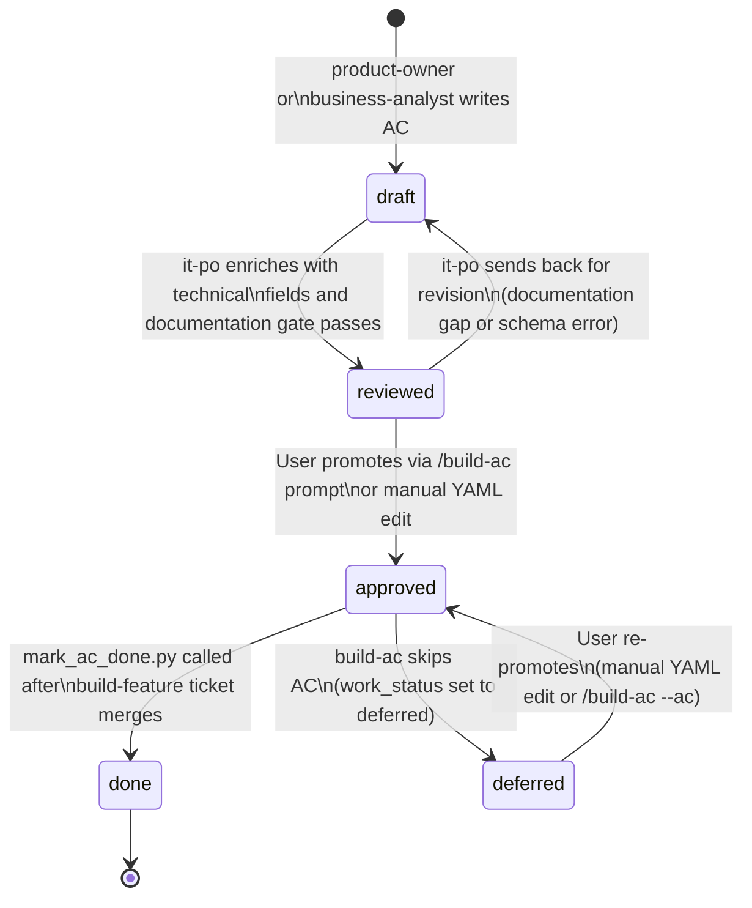

# AC Readiness State Machine

This diagram shows all five states an Acceptance Criterion can occupy in
the AC store, the actor that owns each transition, and the rules that
govern when the scanner may pick an AC up for ticket generation.

---

---

## State Definitions

| State | Field written | Scanner behaviour | Owning actor |
|---|---|---|---|
| `draft` | `readiness: draft` | Excluded — not visible to scanner | `product-owner`, `business-analyst` |
| `reviewed` | `readiness: reviewed` | Excluded — awaiting user approval | `it-po` |
| `approved` | `readiness: approved` | **Eligible for ticket generation** | User |
| `done` | `work_status: done` | Excluded — implementation merged | `mark_ac_done.py` |
| `deferred` | `work_status: deferred` | Excluded — explicitly skipped | `build-ac` agent |

The `readiness` field (`draft` / `reviewed` / `approved`) is set by the
authoring pipeline and controls scanner eligibility. The `work_status`
field (`todo` / `done` / `deferred`) is set by the build pipeline and
controls whether a ticket exists or is outstanding.

An AC is eligible for ticket generation iff:
- `readiness: approved`
- `work_status: todo`

---

## Transition Rules

### draft → reviewed

`it-po` may only promote to `reviewed` when:

1. Technical fields are populated: `assigned_agent`, `estimated_complexity`,
   `delivers_to` / `expects_from`.
2. Documentation gate passes: if the parent L1 AC has `documentation_triggers`
   set, at least one documentation AC exists for each trigger type.

### reviewed → approved

Only the **User** may set `readiness: approved`. Agents may not self-promote
past `reviewed`. This gate ensures no AC is built without explicit human sign-off.

### approved → deferred

The `build-ac` agent sets `work_status: deferred` when the user answers
`skip` at the confirmation prompt. The AC remains `readiness: approved` —
it can be re-activated by re-running `/build-ac --ac <id>` or by editing
`work_status` back to `todo` manually.

---

## Cross-References

- [AC authoring pipeline](ac-authoring-pipeline.md) — sequence view of
  how `draft` → `reviewed` is reached.
- [/build-ac execution flow](build-ac-flow.md) — sequence view of how
  `approved` → `done` or `deferred` is reached.
- [AC-driven pipeline component diagram](ac-driven-pipeline.md) — all
  scripts and data flows end-to-end.
- [How to use the AC-driven development system](../../how-to/ac-driven-development.md) — task-oriented guide.
