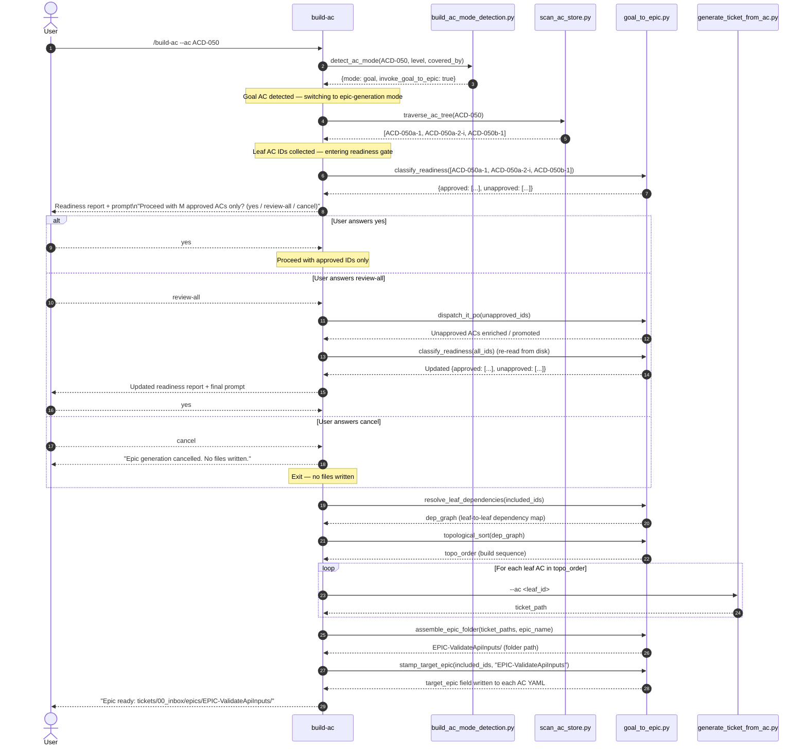

# Goal-to-Epic Dispatch — Sequence Diagram

This diagram shows the full dispatch sequence when a developer invokes
`/build-ac` with a goal-level AC ID (L0 or L1). The flow covers:

1. Mode detection (leaf vs goal classification).
2. Tree traversal — collecting all leaf ACs beneath the goal.
3. Readiness gate — presenting the approval status and prompting the user.
4. Ticket generation — one ticket per approved leaf AC.
5. Dependency wiring and topological sort.
6. EPIC folder assembly and target_epic stamping.

For the single-ticket (leaf AC) path, see the
[/build-ac execution flow](c2-004-build-ac-flow.md).

---

Parent: [Agent Delivery Workflows](../agent_delivery_workflows.md)

---

## Step-by-Step Summary

| Step | Script / Agent | What happens |
|------|---------------|--------------|
| 1 | `build_ac_mode_detection.py` | Reads `level` and `covered_by` from the AC YAML; returns `mode: goal` when L0/L1 has children. |
| 2 | `scan_ac_store.traverse_ac_tree()` | Walks the AC tree depth-first from the goal ID; returns only leaf-level IDs (L2/L3). |
| 3 | `goal_to_epic.classify_readiness()` | Reads `readiness` field from each leaf AC YAML; classifies into `approved` vs `unapproved`. |
| 4 | User prompt | Three-choice gate: `yes` (approved only), `review-all` (dispatch IT PO), or `cancel`. |
| 5 | `goal_to_epic.resolve_leaf_dependencies()` | Builds leaf-to-leaf dep map by resolving `depends_on` chains through composite ACs. |
| 6 | `goal_to_epic.topological_sort()` | Kahn's BFS algorithm; raises `CyclicDependencyError` if a cycle is detected (before any file writes). |
| 7 | `generate_ticket_from_ac.py` | Called once per leaf AC in topological order; writes a ticket to `tickets/00_inbox/`. |
| 8 | `goal_to_epic.assemble_epic_folder()` | Creates `EPIC-<PascalCase>/` folder; copies tickets with `01_`, `02_`, … prefixes. |
| 9 | `goal_to_epic.stamp_target_epic()` | Writes `target_epic: EPIC-<name>` into each included AC YAML. |

---

## Mode Detection Rules

`build_ac_mode_detection.py` applies three rules in order:

| AC level | covered_by | Mode |
|----------|-----------|------|
| L2, L3 | any | `leaf` — single-ticket path |
| L0, L1 | non-empty | `goal` — epic-generation mode (this diagram) |
| L0, L1 | empty / None | `l1_no_children` — error; user must decompose first |

---

## Cross-References

- [/build-ac execution flow](c2-004-build-ac-flow.md) — single-ticket path
  (leaf AC mode).
- [AC authoring pipeline](c2-002-ac-authoring-pipeline.md) — how ACs reach
  `readiness: approved` before this flow starts.
- [AC-driven pipeline component diagram](c2-001-ac-driven-pipeline.md) — all
  scripts and data flows end-to-end.
- [How to use the goal-to-epic workflow](../../how-to/goal-to-epic.md) — task-oriented guide.
- [How to use the approval gate](../../how-to/approval-gate.md) — readiness report + prompt options.
- [Unified /build-ac entry point](../../how-to/build-ac-unified.md) — auto-detection of leaf vs goal.
