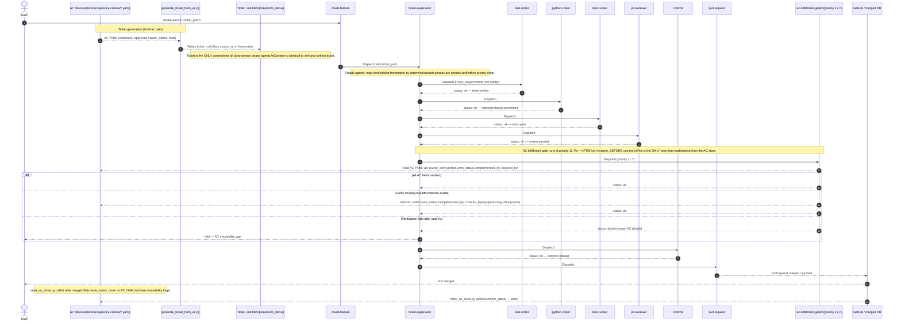

# Feature to Merged PR — End-to-End Sequence Diagram

This L1 diagram shows the complete journey of a single feature from its
representation as an AC YAML file through to a merged pull request. It spans
three distinct stages:

1. **Ticket generation** — `generate_ticket_from_ac.py` turns an approved AC
   into a Markdown ticket that is structurally identical to a hand-written one.
2. **Build-feature dispatch** — `ticket-supervisor` reads the `agents:` map
   from the ticket frontmatter and dispatches phase agents in priority order.
3. **AC fulfillment gate** — the only step that reads back from the AC store
   to verify traceability fields, running at priority 11.7 immediately before
   the `commit` phase.

> **Key invariant:** Phase agents (`test-writer`, `python-coder`,
> `test-runner`, `pr-reviewer`, `commit`, `pull-request`) receive the ticket
> file as their sole context. They never read AC YAML files directly.
> The pipeline is identical whether the ticket was generated from an AC or
> written manually.

---

---

## Stage Summary

| Stage | Participants | What happens |
|---|---|---|
| Ticket generation | `AC Store`, `generate_ticket_from_ac.py`, `Ticket .md` | An approved AC YAML is transformed into a Markdown ticket with `source_ac` in frontmatter. Hand-written tickets skip this stage and enter at `/build-feature`. |
| Supervisor dispatch | `/build-feature`, `ticket-supervisor` | `ticket-supervisor` reads the `agents:` map from the ticket frontmatter to determine which phase agents are needed and in what order. |
| Phase execution | `test-writer`, `python-coder`, `test-runner`, `pr-reviewer` | Each phase agent works from the ticket file. AC YAML files are never read directly. |
| AC fulfillment gate | `ac-fulfillment-gate` (priority 11.7) | The only step that reads back from the AC store. Verifies `work_status`, `implemented_by`, `covered_by`. Auto-fixes when diff evidence exists; blocks on unresolvable gaps. |
| Close-out | `commit`, `pull-request`, `mark_ac_done.py` | Commit and PR are created; after merge `mark_ac_done.py` sets `work_status: done` on the AC YAML, closing the traceability loop. |

---

## Key Design Constraints

1. **Ticket is the sole context for phase agents.** No phase agent reads AC
   YAML files directly. All context — acceptance criteria, test requirements,
   architectural constraints — is embedded in the ticket `.md` file by
   `generate_ticket_from_ac.py` at generation time (or by the author for
   hand-written tickets).

2. **Pipeline is AC-origin-agnostic.** `ticket-supervisor` and all phase
   agents behave identically regardless of whether the ticket was generated
   from an AC or written manually. No special-casing exists in the pipeline
   for AC-derived tickets.

3. **`ticket-supervisor` reads the `agents:` frontmatter map.** This map
   (written by the ticket author or `generate_ticket_from_ac.py`) declares
   which agents are `needed` or `not_needed`. `ticket-supervisor` iterates
   this map in priority order to determine dispatch sequence.

4. **AC fulfillment gate is the only AC-store reader in the build phase.**
   It runs at priority 11.7 — after `pr-reviewer` (11.5-range) and before
   `commit` (12) — so that any traceability gaps are caught before the
   commit is created but after the implementation diff is available for
   auto-fix evidence.

5. **`mark_ac_done.py` closes the loop after merge, not before.** The AC
   `work_status` transitions to `done` only after the PR merges. The
   fulfillment gate verifies fields mid-flight but does not mark the AC done.

---

## Relationship to Adjacent Diagrams

| Diagram | Scope | What this diagram adds |
|---|---|---|
| [c2-001 AC-Driven Pipeline](c2-001-ac-driven-pipeline.md) | Component view of all scripts | This diagram shows the time-ordered sequence, including phase agents and the fulfillment gate that c2-001 omits. |
| [c2-004 /build-ac Execution Flow](c2-004-build-ac-flow.md) | Sequence: ranking → ticket generation → build-ac agent | c2-004 ends at `/build-feature` hand-off. This diagram picks up there and shows the full phase-agent sequence. |
| [Agent Delivery Workflows §4](../agent_delivery_workflows.md) | Flowchart: epic-supervisor + ticket-supervisor internals | That diagram shows the supervisor topology and blocker adjudication. This diagram shows the straight-line happy-path sequence from AC to merged PR. |

---

## Cross-References

- [AC-Driven Pipeline — Component Diagram](c2-001-ac-driven-pipeline.md) —
  all scripts and data flows end-to-end; peer component view.
- [/build-ac Execution Flow](c2-004-build-ac-flow.md) — the sequence leading
  up to the `/build-feature` hand-off shown in step 1 of this diagram.
- [AC Authoring Pipeline](c2-002-ac-authoring-pipeline.md) — how ACs reach
  `readiness: approved` before ticket generation can start.
- [AC Readiness State Machine](c2-003-ac-readiness-states.md) — the five
  readiness states and the transitions this pipeline exercises.
- [Agent Delivery Workflows](../agent_delivery_workflows.md) — parent
  document; supervisor dispatch topology and blocker adjudication flows.
- [How to use the AC-driven development system](../../how-to/ac-driven-development.md) —
  task-oriented guide for the end-to-end workflow.

<!--
====================================================================
DECISION HISTORY
====================================================================
- 2026-06-08 [documentation-expert]: Initial creation. L1 sequence diagram
  showing the full path from AC YAML to merged PR, with explicit annotation
  of the AC fulfillment gate at priority 11.7 as the only AC-store reader
  in the build phase. Positioned as peer to c2-001 through c2-005.
====================================================================
-->
