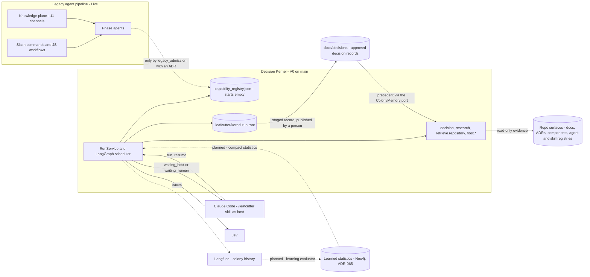
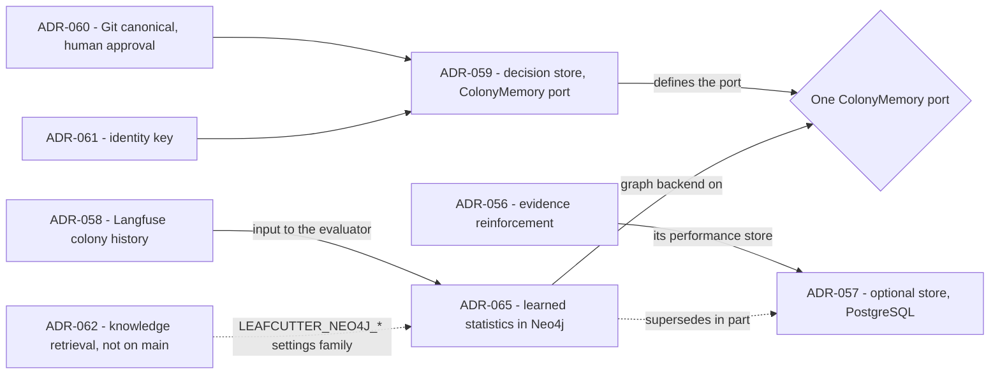

# Decision Kernel and Colony Memory — Design Map

This page is the entry point to the flow and context docs for the Decision Kernel and colony
memory. It lists every design the project has produced so far and gives each one's source and
status. It also shows how the new designs relate to the legacy agent pipeline. The child pages
show the flows, the data paths and where each consumer gets its context.

These pages map what the sources and main's code say as of 2026-10-02. They were first written on
2026-09-30 and re-checked after PRs #973, #977 and #978 merged the kernel and the decision store.
They add no design of their own. Planned elements are marked planned. Where sources are silent or
disagree, the pages point to the [open points](c3-022-decision-kernel-flows-open-points.md) list instead
of choosing an answer.

**Status words used on every page**

| Status | Meaning |
|---|---|
| Live | Runs today in this repository and in adopter installs (the legacy pipeline) |
| V0, on main | Kernel V0 (P1–P10, PR #973), V0.1 (PR #977) and the decision store (PR #978), merged to main. Runs in this repository only; not shipped to adopters. Roadmap `phase_kernel_1_founding` is still `active` |
| Later (Stage n) | Kernel spec §3 stage n and its roadmap phase `phase_kernel_n_*`, status planned. Learned statistics have their own planned track, `phase_colony_1_collect` to `phase_colony_5_evolve` |
| Decided, not scheduled | Accepted by an ADR, but no stage or phase builds it yet |
| In progress, not on main | Accepted on a feature branch that has not merged; named without a link |

## How the designs relate

Parent: none (`root: true`). The kernel's own container view is
[Decision Kernel — Container Overview](../components/decision-kernel.md); the memory layer's is
[Colony Memory — Container Overview](../components/colony-memory.md).

**What the picture says.**

- **The legacy pipeline stays live and runs in parallel.** [ADR-052](../adrs/ADR-052-capabilities-replace-agents-prompts-are-compiled.md)
  admits no agent and "does not migrate, rewrite or retire any existing agent template".
  [ADR-055](../adrs/ADR-055-capability-registry-starts-empty.md) says "two registry families
  coexist". The kernel lives only in leafcutter-ai and is not shipped to adopters. No source sets
  a retirement plan (OP-16).
- **Legacy agents and skills reach the kernel only by recorded admission.** The kernel routes
  only over `config/capability_registry.json`. A legacy asset enters it with
  `admission.kind = legacy_admission`, a `legacy_source {registry, id}` and a `decision_ref` that
  names an ADR. No ADR admits any legacy asset yet; the seven entries (`decision`, `research`,
  `retrieve.repository`, four `host.*`) are all `native_registration`.
- **The kernel reads legacy knowledge as evidence, not as candidates.** The retrieval adapter
  reads repository files and knowledge-map surfaces as read-only evidence. This path conflicts
  with the wording of ADR-055 §2 (OP-11).
- **Claude Code hosts both.** It runs legacy agents, and it is the kernel's host for generative
  and human work through the `/leafcutter` skill. The knowledge-hub command is now
  `/leafcutter-help` (OP-15, settled).
- **Decision memory is live; learned statistics are planned.** A decision a human approved is
  staged in the run root, published to `docs/decisions/` by a person and offered to later
  decisions as precedent. Statistics from Langfuse are later work
  ([learning loop](c3-020-decision-kernel-flows-learning-loop.md)).

## Design inventory

| # | Design | What it decides | Source | Status |
|---|---|---|---|---|
| 1 | Legacy agent pipeline | Slash commands, JS workflows (`build-feature.js`, `build-ticket.js`) and phase agents dispatched at depth 1; the ticket record drives completion | [agentic-runtime-flow](../../agentic-runtime-flow.md), [agent_delivery_workflows](../agent_delivery_workflows.md), [build-orchestration](../components/build-orchestration.md) | Live |
| 2 | Legacy context and learning | 11 injection channels into an agent's context; `route-learning` / `capture-learning` persist learnings | [agent_knowledge_plane](../agent_knowledge_plane.md), [agent_knowledge_system](../agent_knowledge_system.md), [injection-builder](../components/injection-builder.md), [knowledge-system](../components/knowledge-system.md) | Live |
| 3 | Decision Kernel V0 and V0.1 | RunService, fixed LangGraph scheduler, intake intent, Jev routing and decisions, research, read-only retrieval, host and human handoff, resume, gaps, Langfuse | [decision-kernel](../components/decision-kernel.md), [design parts 1–6](../../analysis/2026-09-30-decision-kernel-design.md), [spec Rev 3](../../analysis/2026-09-30-leafcutter-kernel-spec-rev3.md), [run guide](../../how-to/run-the-decision-kernel.md) | V0, on main: P1–P10 (PR #973), V0.1 rounds A–F (PR #977) |
| 4 | Capability lifecycle and invocation compiler | The capability replaces the agent; PREPARE to ESCALATE; prompts are compiled by deterministic code | [ADR-052](../adrs/ADR-052-capabilities-replace-agents-prompts-are-compiled.md) | Accepted. The lifecycle shape is in the V0 graphs; host packets are compiled (P8); a general compiler is not designed (OP-08) |
| 5 | Intelligence selection | Deterministic, Jev, LLM or human per check; the escalation path; executor names | [ADR-053](../adrs/ADR-053-intelligence-selection-deterministic-jev-llm-human.md) | Accepted; V0 applies it |
| 6 | Process maturity and resolution order | Workflow, policy or LLM-guided; levels 0–4; resolution order workflow → policy → LLM-guided → gap | [ADR-054](../adrs/ADR-054-process-representation-and-maturity-model.md) | Accepted. V0 has level 3 (native graphs) and level 1 (`host_handoff`). Level 2 policies are Later (Stage 3) |
| 7 | Empty registry and admission | The kernel routes only over the new registry; legacy assets only via `legacy_admission` plus an ADR | [ADR-055](../adrs/ADR-055-capability-registry-starts-empty.md) | Accepted; V0 |
| 8 | Colony memory loop | Reinforce on verified outcomes; evaporation; negative evidence; exploration; trails rank and propose, never legislate | [ADR-056](../adrs/ADR-056-colony-memory-evidence-reinforcement.md) | Accepted. Recording prerequisites only partly on main (OP-26). Influence on routing: Stage 4 or later |
| 9 | Optional colony memory store | Port with a Null implementation, context dimensions, shared memory, run-root authority, staging ladder; a PostgreSQL store with `LEAFCUTTER_COLONY_DB_URL` | [ADR-057](../adrs/ADR-057-colony-memory-store-optional-postgres.md) | Accepted; **superseded in part by ADR-065** (store technology, Postgres implementation, the URL, relational tables) |
| 10 | Langfuse as colony history | Every important node traced; decisions and routing choices scored; datasets as regression memory | [ADR-058](../adrs/ADR-058-langfuse-colony-history-scores-datasets.md) | Accepted. Node tracing is on main. Scores, datasets and the regression gate are listed under `phase_colony_2_analyze` (Stage 4) |
| 11 | Decision store | Approved decisions as YAML records in `docs/decisions/` with a generated `index.json`, behind the `ColonyMemory` port (`file` or `null`); precedent is evidence from day one | [ADR-059](../adrs/ADR-059-decision-store-reviewable-yaml-records-now-graph-later.md), [colony-memory](../components/colony-memory.md) | Accepted; V0, on main (PR #978) |
| 12 | Source of truth and approval authority | Git is canonical; only a human approval creates a record; the kernel never writes the repository during a run; publication is `python -m kernel decisions publish` | [ADR-060](../adrs/ADR-060-source-of-truth-and-approval-authority.md) | Accepted; V0, on main |
| 13 | Identity | Existing ids stay; decisions get `dec-<16hex>`; records are keyed by `(repository_id, kind, id)` | [ADR-061](../adrs/ADR-061-identity-of-declared-and-learned-records.md) | Accepted; V0, on main |
| 14 | Learned statistics in Neo4j | Statistics are derived aggregates in Neo4j, updated after specific actions, on ADR-059's port; `LEAFCUTTER_NEO4J_*` settings, `LEAFCUTTER_SELF_LEARNING=false` stays the opt-out | [ADR-065](../adrs/ADR-065-colony-learned-statistics-neo4j-aggregates.md), [colony-memory](../components/colony-memory.md) | Accepted (2026-10-02); not built. Statistics start only with COLLECT (`phase_colony_1_collect`); V0 scope unchanged (§6) |
| 15 | Standalone knowledge retrieval | A separate retrieval package over immutable Neo4j projections of Git, injected through the capability mechanism | ADR-062, "Standalone Knowledge Retrieval over Immutable Git Projections" | In progress, not on main (branch `feature/knowledge-retrieval-v01`) |
| 16 | Knowledge and context compiler | Glossary- and component-aware search, progressive disclosure, `ContextBundle`, role-specific views | spec [§17](../../analysis/2026-09-30-leafcutter-kernel-spec-rev3-7-later-stages.md); `phase_kernel_2_knowledge` | Later (Stage 2) |
| 17 | Engineering workflows and executable policies | Discovery, readiness gates, implementation contract with coding, testing and documentation views, component policies | spec §18; `phase_kernel_3_workflows` | Later (Stage 3) |
| 18 | Controlled learning | Research-to-ADR reuse, bug-to-policy proposals, evaluation before activation | spec §19; `phase_kernel_4_trails` | Later (Stage 4). Reuse of approved decisions as precedent came early with ADR-059 |
| 19 | Independent engineering runtime | Direct model and agent executors, more clients, stronger isolation | spec §20; `phase_kernel_5_specialists` | Later (Stage 5) |

## How the colony-memory ADRs relate to ADR-057

- **Superseded in part (ADR-065):** ADR-057 §1's store technology, §2 (plain PostgreSQL), the §3
  PostgreSQL implementation, §4's `LEAFCUTTER_COLONY_DB_URL`, §6's relational tables and the
  PostgreSQL and Supabase side of its Alternatives.
- **Carried over from ADR-057:** optional with a Null default, the hot path reads the store and
  never Langfuse (§5), mandatory context dimensions (§7), shared colony memory (§8), the run root
  stays authoritative (§9), and the staging ladder (§10).
- **Not touched by ADR-057 at all:** decision records. ADR-059 was decided without amending
  ADR-057, and its "no Neo4j yet" stands for decision records (ADR-065 §6).
- **Left to the build by ADR-065 §3:** the statistics operations on the port and how one startup
  choice composes the file and graph backends (OP-27, OP-28).

## Pages in this set

| Page | Shows |
|---|---|
| [Request flow 1: native work](c3-013-decision-kernel-flows-request-native.md) | Skill → CLI → RunService → scheduler → Jev routing → decision with precedent → research → retrieval, up to the first wait |
| [Request flow 2: handoff and resume](c3-014-decision-kernel-flows-request-handoff.md) | Host or human handoff, resume validation, parent continuation, finalize, a staged record |
| [Capability lifecycle](c3-015-decision-kernel-flows-capability-lifecycle.md) | ADR-052 lifecycle with the executor of every step (ADR-053) and the V0 mapping |
| [Context map](c3-016-decision-kernel-context-map.md) | Every kernel consumer and its context sources, contrasted with the legacy knowledge plane |
| [Context: Jev calls](c3-017-decision-kernel-context-jev.md) | Intake intent, routing and decision Jev calls, including precedent |
| [Context: research](c3-018-decision-kernel-context-research.md) | Research capability, the retrieval adapter and planned sources |
| [Context: host, worker, human](c3-019-decision-kernel-context-host-worker-human.md) | Compiled host packets, bounded worker loop, human interactions and publication |
| [Learning loop](c3-020-decision-kernel-flows-learning-loop.md) | Live: approved records → Git → precedent. Planned: Langfuse → evaluator → Neo4j → routing |
| [Regression memory](c3-021-decision-kernel-flows-regression-memory.md) | Confirmed mistakes → Langfuse datasets → regression evaluation before a change |
| [Open points](c3-022-decision-kernel-flows-open-points.md) | Where the sources are silent or disagree, with their 2026-10-02 status |

## Definitions

Terms marked (G) are defined in [the glossary](../../glossary.md). The wording here follows it.

| Term | Meaning here |
|---|---|
| Decision Kernel (G) | The resumable runtime in `kernel/` that routes a goal to a registered capability with Jev, gathers evidence, hands generative or human work out as checkpointed handoffs and ends every run in a typed terminal state |
| Capability (G) | The contract-driven unit of work that replaces the agent: input contract, policies, evidence preparation, decisions, execution strategy, verification, typed result (ADR-052) |
| Jev (G) | TypeSafe's bounded decision model, called through `langchain-typesafe`. It answers typed questions (`noul`, `choice`, `score`) about a supplied state and never invents criteria or content |
| Decision specification (G) | A small Jev instruction that evaluates only supplied criteria and has an explicit insufficient-evidence path (ADR-052 §8) |
| Invocation compiler (G) | Deterministic code that builds a model's instructions from the capability definition, policies, task, evidence, approved decisions and output contract (ADR-052 §3). On main: the host packet compiler |
| Process maturity level (G) | 0 Unknown, 1 LLM-guided, 2 Policy-guided, 3 Workflow-guided, 4 Deterministic (ADR-054) |
| Capability gap (G) | A record that no suitable native capability existed. Types: `unsupported`, `host_only`, `permission`, `ambiguous`, `out_of_domain`, and `provider_failure`, which is defined but never recorded |
| Colony memory (G) | What Leafcutter keeps across runs: approved decision records and learned statistics. Usage alone is never evidence of correctness (ADR-056) |
| Decision record | One YAML file per human-approved decision in `docs/decisions/`, id `dec-<16hex>`, canonical in Git (ADR-059 to ADR-061) |
| Precedent | An earlier approved decision offered to a new decision as `prior_decisions` evidence; Jev judges whether it applies; never authority (ADR-060 §4) |
| `ColonyMemory` port | `kernel/memory/port.py`: `find_decisions`, `get_decision`, `stage_decision`; the one interface to both kinds of memory (ADR-059 §2, ADR-065) |
| `NullColonyMemory` | The backend that remembers nothing: no precedent, nothing staged (`memory.backend: null`) |
| Colony memory store | ADR-057's name for ADR-056's "performance store" (G). ADR-065 keeps it in Neo4j as derived aggregates on the same port |
| Learning evaluator | The planned component that updates learned statistics from completed-run outcomes, after specific actions (ADR-057 §5, ADR-065) |
| Colony history | Langfuse traces and scores: the complete record of what happened (ADR-058) |
| Regression memory | Langfuse datasets of confirmed wrong decisions, run before a change deploys (ADR-058 §4) |
| Pheromone trail (G) | A learned routing preference built from verified outcomes; it may rank and propose, never legislate |
| RunService | The client-independent API: `start_run`, `resume_run`, `get_run`, `cancel_run` (design part 5) |
| RunEnvelope | The JSON the CLI prints: status, output or report reference, pending interaction, limitations, gaps, trace references |
| Work item, continuation | A work item tracks one request's execution; a continuation is the owning capability's saved state for resume (spec §7.4) |
| Evidence bundle | A capability's evidence and findings with coverage per need, unavailable sources and contradictions (`evidence_bundle.v1`) |
| Host handoff | A persisted `HostWorkRequest` that Claude Code performs and returns through `resume` (spec §11.1) |
| Run root | `.leafcutter/kernel/`: checkpoints, run records, `events.jsonl`, artifacts, interaction ledger, staged decision records, gap observations, telemetry spool |
| Knowledge plane | The legacy set of 11 channels through which Claude Code agents receive context at spawn ([agent_knowledge_plane](../agent_knowledge_plane.md)) |
| Context bundle | Later (Stage 2): an immutable, versioned package of task intent, glossary and component references, evidence, constraints and omissions, with role-specific views (spec §17.5) |

## Legend

| Element | Meaning |
|---|---|
| Solid arrow | A path that is live or on main |
| Dotted arrow | A planned path, a supersession, or one that exists only after a recorded decision |
| Cylinder | Stored data: a file, a registry, records, a database |
| Diamond | The one `ColonyMemory` port |
| Subgraph | One system: the legacy pipeline or the kernel |

## Cross-Links

- Child pages: listed in [Pages in this set](#pages-in-this-set).
- [Decision Kernel — Container Overview](../components/decision-kernel.md) — the kernel's containers.
- [Colony Memory — Container Overview](../components/colony-memory.md) — the memory layer's containers.
- Decisions: [ADR-052](../adrs/ADR-052-capabilities-replace-agents-prompts-are-compiled.md),
  [ADR-053](../adrs/ADR-053-intelligence-selection-deterministic-jev-llm-human.md),
  [ADR-054](../adrs/ADR-054-process-representation-and-maturity-model.md),
  [ADR-055](../adrs/ADR-055-capability-registry-starts-empty.md),
  [ADR-056](../adrs/ADR-056-colony-memory-evidence-reinforcement.md),
  [ADR-057](../adrs/ADR-057-colony-memory-store-optional-postgres.md),
  [ADR-058](../adrs/ADR-058-langfuse-colony-history-scores-datasets.md),
  [ADR-059](../adrs/ADR-059-decision-store-reviewable-yaml-records-now-graph-later.md),
  [ADR-060](../adrs/ADR-060-source-of-truth-and-approval-authority.md),
  [ADR-061](../adrs/ADR-061-identity-of-declared-and-learned-records.md),
  [ADR-065](../adrs/ADR-065-colony-learned-statistics-neo4j-aggregates.md).
