# Fast-Lane Build Path — Component Diagram

The fast-lane build path is a lean, **full-arc** alternative to the heavy pipeline,
implemented by `templates/workflows-js/fast-lane-ship.js`. Point it at a single AC id
and it takes the work all the way to an open pull request: it creates its own isolated
worktree off `origin/main`, resolves that AC's **connected build set**, and drives the
lean `test-writer` → `python-coder` loop behind two deterministic Python gates before
review, changelog, commit and PR.

What is lean about it is the **absence of the supervisor chain** — there is **no
per-ticket supervisor and no LLM planner**; the phase order is fixed and code-defined.
It is *not* lean in dispatch count: the file contains **20 `agent()` call sites** — 11 on
the happy path (worktree, resolve, producibility, claim, context-bundle, test-writer,
coder, review, changelog, commit, pull-request) and 9 `release`-on-failure dispatches
that roll the AC claim back to `todo` when a post-claim phase halts.

Two claims that were true of an earlier, now-deleted runner are **no longer true** and
have been corrected here: the lane dispatches a **`pr-reviewer`** before commit, and it
**does** isolate — every run gets a fresh worktree of its own.

---

## Diagram Legend

| Color | Role | Description |
|---|---|---|
| Grey | Data store | Persistent YAML files (AC store) |
| Green | Deterministic gate | Python script in the critical path; no LLM calls |
| Blue | LLM agent | One flat dispatch; produces test stubs or production code |
| Purple | Workflow runner | JS workflow entry point that sequences the fixed, code-defined phase order |
| Red | Telemetry | Append-only event sink per agent invocation |
| Yellow | Heavy pipeline | Existing supervisor-based path shown for contrast |

---

## Component Diagram

```mermaid
flowchart TD
    classDef store fill:#f3f4f6,stroke:#4b5563,stroke-width:2px;
    classDef gate fill:#d1fae5,stroke:#059669,stroke-width:2px;
    classDef llm fill:#dbeafe,stroke:#2563eb,stroke-width:2px;
    classDef runner fill:#ede9fe,stroke:#7c3aed,stroke-width:2px;
    classDef telemetry fill:#fee2e2,stroke:#dc2626,stroke-width:2px;
    classDef heavy fill:#fef3c7,stroke:#d97706,stroke-width:2px;

    %% ── Shared input ─────────────────────────────────────────────────────────
    ACS[("AC YAML Store\ndocs/acceptance-criteria/\nreadiness: approved\nwork_status: todo")]:::store

    %% ─────────────────────────────────────────────────────────────────────────
    %% FAST LANE — full arc: one AC id in, an open PR out.
    %% 20 agent() sites (11 happy path + 9 release-on-failure), no supervisor,
    %% no planner, fresh isolated worktree per run.
    %% ─────────────────────────────────────────────────────────────────────────
    subgraph FastLane ["Fast Lane — fast-lane-ship.js — one AC id in, an open PR out — no supervisor — no planner — fresh isolated worktree per run"]
        direction TB

        WR["fast-lane-ship.js\n──────────────────────────────────\nWorkflow Runner\nFixed, code-defined phase order\nNo planner. No supervisor.\nInput: a single AC id (args.ac)"]:::runner

        WT["worktree-agent\n──────────────────────────────────\nPhase 1 — Worktree\nsetup_ticket_worktree.py create-fastlane-worktree\nFresh isolated worktree on fast-lane/SLUG\nrooted at the latest origin/main"]:::llm

        SC["select_connected gate\n──────────────────────────────────\nfast_lane.py :: select_connected\nDeterministic Python — no LLM\nSubtree of the aimed-at AC plus its unmet\ndependency closure, in dependency order,\nreadiness-agnostic; --exclude-structural-parent\nEmpty set is a clean no-op"]:::gate

        PG["check_producibility guard\n──────────────────────────────────\nfast_lane.py :: check_producibility\nRuns on every non-empty set, before any claim\nRefuses when a member declares a deliverable or\nproof no phase in this roster produces\nFail-closed: unreadable verdict also refuses"]:::gate

        CL["claim / release lifecycle\n──────────────────────────────────\nfast_lane.py :: claim | release\nFlips the set todo to in_progress; a concurrent\nclaim halts the run. Nine release-on-failure\ndispatches roll this run's claims back to todo"]:::gate

        CB["context bundle\n──────────────────────────────────\ninjection_builders.py assemble-bundle\nAssembled ONCE per run and threaded verbatim\nas the prefix of the test-writer and coder prompts\nFour-state check: usable / reference /\nincomplete / not_obtained"]:::llm

        TW["test-writer agent\n──────────────────────────────────\nWrites minimal failing stubs for every AC\nin the connected set, tagged '# covers: ID'\nNo production code written\nReturns: status, tests_written, gate_passed"]:::llm

        RB["verify_red_baseline gate\n──────────────────────────────────\nfast_lane.py :: verify_red_baseline\nDeterministic Python — no LLM\nScans test root for covers: tags\nPartitions newly-added vs pre-existing via git\n(merge-base with origin/main, or --base-ref)\nAt least one NEWLY-ADDED test must be RED\n(FAILED or XFAIL) before coder runs"]:::gate

        PC["python-coder agent\n──────────────────────────────────\nImplements minimum production code\nto make every failing stub GREEN,\nbuilding the set in dependency order\nReturns: status, files_modified, green, coverage_ok"]:::llm

        GC["verify_green_and_coverage gate\n──────────────────────────────────\nfast_lane.py :: verify_green_and_coverage\nDeterministic Python — no LLM\nAll tests GREEN + every AC id has\nat least one covers: tag\nDelegates to done_proof.verify_done_eligible()"]:::gate

        RV["pr-reviewer agent\n──────────────────────────────────\nPhase 4.5 — Review, BEFORE commit\nReviews the run's own UNCOMMITTED 'git diff'\nAny high-confidence finding halts the run\nFail-closed: no verdict is never a clean pass"]:::llm

        CH["changelog agent (conditional)\n──────────────────────────────────\nRuns only when a non-exempt file was modified\nfast_lane.py changelog_payload,\nthen changelog/emit_entry.py\nEntry must be re-read from disk to count"]:::llm

        CM["commit agent\n──────────────────────────────────\nPhase 5 — fast_lane.py mark_done (coverage-gated),\nthen git add -A and COMMIT_AGENT_MODE=1 git commit\non the worktree branch"]:::llm

        PRQ["pull-request agent\n──────────────────────────────────\nPhase 6 — push the branch, then\ngh pr create with a gh api REST fallback\nfor EMU accounts\nReturns the PR url"]:::llm
    end

    TEL["agent_telemetry.py sink\n──────────────────────────\nscripts/agent-health/agent_telemetry.py\ndebugging/logs/agent_telemetry.jsonl\nOne record per agent invocation"]:::telemetry

    %% ─────────────────────────────────────────────────────────────────────────
    %% HEAVY PIPELINE — shown simplified for contrast
    %% N supervisors, LLM planner, per-ticket worktrees, LLM review + validator
    %% ─────────────────────────────────────────────────────────────────────────
    subgraph HeavyPipeline ["Heavy Pipeline (contrast) — 1 supervisor per ticket — LLM planner — per-ticket worktrees — LLM review and validator gates"]
        direction LR

        TS["ticket-supervisor\n────────────────────────\n1 supervisor per ticket\nN dispatches for N tickets\nPhase-by-phase orchestration"]:::heavy

        LP["LLM Planner\n────────────────────────\nReads ticket frontmatter\nReturns ordered phase list\nto ticket-supervisor"]:::heavy

        PTC["Per-ticket worktrees\n────────────────────────\nIsolated git checkout\nper ticket"]:::heavy

        PRR["pr-reviewer agent\n────────────────────────\nLLM code review"]:::heavy

        ACV["ac-validator agent\n────────────────────────\nLLM AC coverage gate\nat priority 11"]:::heavy

        ACF["ac-fulfillment-gate agent\n────────────────────────\nLLM fulfillment check\nat priority 11.7"]:::heavy

        CA["commit agent\n────────────────────────\nConfirmation-gated\ngit commit"]:::heavy

        PRA["pull-request agent\n────────────────────────\nPR creation\nper ticket"]:::heavy

        TS --> LP
        LP -->|"ordered phase list"| PTC
        PTC --> PRR
        PRR --> ACV
        ACV --> ACF
        ACF --> CA
        CA --> PRA
    end

    %% ── Fast lane data flows ──────────────────────────────────────────────────
    ACS -->|"YAML files\n(directory walk)"| SC
    WR -->|"args.ac — a single AC id"| WT
    WT -->|"worktree_path, branch"| SC
    SC -->|"connected build set\n(dependency order)"| PG
    PG -->|"producible: true"| CL
    CL -->|"claimed: todo to in_progress"| CB
    CB -->|"bundle text, verbatim"| TW
    TW -->|"stubs written\ngate_passed: true"| RB
    RB -->|"gate_passed: true\ncoder dispatched"| PC
    PC -->|"tests green\nstatus: ok"| GC
    GC -->|"green + coverage_ok"| RV
    RV -->|"verdict obtained\nno high findings"| CH
    CH -->|"entry verified on disk\n(or not required)"| CM
    CM -->|"committed on the branch"| PRQ
    TW -.->|"telemetry event"| TEL
    PC -.->|"telemetry event"| TEL

    %% ── Heavy pipeline also reads AC store (via ticket ac_traceability) ───────
    ACS -.->|"via ticket ac_traceability"| TS
```

Parent: [Agent Code Delivery Workflows](../agent_delivery_workflows.md)

---

## Fast-Lane vs Heavy Pipeline: Key Distinctions

| Axis | Fast Lane | Heavy Pipeline |
|---|---|---|
| LLM dispatches | **11 on the happy path** (+9 release-on-failure) — one flat sequence for the whole connected set | N per ticket: supervisor, planner, reviewer, validator, fulfillment, commit, PR agent |
| Correctness enforcement | 2 deterministic Python gates in the build loop (`verify_red_baseline`, `verify_green_and_coverage`) plus the `check_producibility` guard, **and** one LLM review (`pr-reviewer`) before commit | LLM review gates: pr-reviewer, ac-validator, ac-fulfillment-gate |
| Supervisor | **None** — no per-ticket supervisor | 1 `ticket-supervisor` per ticket |
| Planner | **None** — code-defined phase order in fast-lane-ship.js | LLM planner reads ticket and returns ordered phase list |
| Worktree strategy | **Fresh isolated worktree per run**, cut off the latest `origin/main` by the lane itself | Isolated per-ticket worktree |
| Unit of work | The **connected build set** of one AC id — its subtree plus its unmet dependency closure | 1 ticket per supervisor (may span multiple ACs) |
| Terminal state | **Open pull request** — the lane commits and opens the PR itself | Open pull request, per ticket |
| Telemetry | agent_telemetry.py — 1 record per dispatch | agent_telemetry.py — 1 record per dispatch |

> **`pr-reviewer` is no longer a heavy-pipeline-only agent.** It appears in the
> contrast column above and in the yellow subgraph because it is a heavy-pipeline
> phase, but the fast lane dispatches it too, at Phase 4.5. The distinction between
> the lanes is *not* "mechanical gates versus LLM review" — the fast lane has both.
> What it still lacks, relative to the heavy pipeline, is `ac-validator` and
> `ac-fulfillment-gate`.

---

## Gate Function Contracts

| Gate | Script function | Guard condition |
|---|---|---|
| **select_connected** | `fast_lane.py::resolve_connected_build_set(ac_id, ac_root, exclude_structural_parent)` — CLI subcommand `select_connected` | Deterministic. Returns `subtree(ac_id) ∪ transitive_unmet_depends_on_closure(ac_id)` in dependency order (a prerequisite always precedes its dependent; cycles broken deterministically). Only L2/L3 leaves with `work_status != done`. **Readiness is not a filter** — pointing at the AC is the operator's go-ahead. The lane always passes `--exclude-structural-parent`, which prunes structural-parent entries from the `depends_on` walk only, never from the subtree. An empty result is a clean no-op; a non-empty stderr diagnostic alongside an empty list is treated as a resolution *failure*, not an empty set. |
| **check_producibility** | `fast_lane.py::compute_producibility_verdict(ac_ids, ac_root)` — CLI subcommand `check_producibility` | Consulted on **every** non-empty resolved set, before any claim or build-agent dispatch, so the guard is provably reached even when it never blocks. Positive-declaration-only: an AC is unproducible only when it explicitly declares a producer or proof no phase in this run's roster can satisfy; absent fields default to producible. Fail-closed — an unreadable verdict refuses. Refusal here precedes the claim, so nothing is released. |
| **claim / release** | `fast_lane.py::claim_build_set()` / `release_claim()` | `claim` flips the resolved set `todo → in_progress`; `target_refused` means a concurrent run owns the set and this run halts. Only ids **this** run flipped are eligible for `release`, so a rollback can never reset a concurrent run's claims. |
| **verify_red_baseline** | `fast_lane.py::verify_red_baseline(ac_ids, test_root, base_ref=None)` | Partitions the batch's covering tests into newly-added vs pre-existing using git at test-function granularity (merge-base with `origin/main`, or an explicit `base_ref`). Passes iff at least one **newly-added** covering test is red (`FAILED` or `XFAIL`). A newly-added test that is green is reported as `green_at_baseline` — surfaced, non-fatal. Pre-existing tests are reported but never affect the verdict. Blocks coder dispatch with exactly one named `reason`: `no_new_covering_tests`, `all_new_tests_green_at_baseline`, `no_red_outcome_among_new_tests`, or `baseline_partition_unavailable` (fail-closed when git metadata is unresolvable). |
| **verify_green_and_coverage** | `fast_lane.py::verify_green_and_coverage(ac_ids, test_root, ac_root)` | Blocks the review, commit and PR phases if any test FAILS or any AC id has zero `# covers: <id>` tags. Delegates per-AC to `done_proof.verify_done_eligible()`. |

---

## Component Descriptions

| Component | Type | Role |
|---|---|---|
| **AC YAML Store** (`docs/acceptance-criteria/`) | Data store | Source of truth for the AC records. `select_connected` resolves the build set from it; `claim`/`release`/`mark_done` mutate `work_status` in it; `verify_green_and_coverage` reads it for active-status resolution. |
| **fast-lane-ship.js** | Workflow Runner | Orchestrates the full arc from a single AC id to an open PR. Fixed, code-defined phase order — no planner, no supervisor. Halts on the first phase that does not return a usable result, releasing the claim if one was taken. |
| **worktree-agent** | LLM dispatch — Phase 1 | Runs `setup_ticket_worktree.py create-fastlane-worktree <slug>` to cut a fresh worktree on `fast-lane/<slug>` off the latest `origin/main`. The AC store root is then **derived** from the returned worktree path rather than trusted from the agent's reply. |
| **select_connected gate** | Deterministic Python | Resolves the connected build set (subtree ∪ unmet-dependency closure) in dependency order. `select_batch` — the readiness-filtered batch selector used by the earlier, now-deleted runner — still exists in `fast_lane.py` but **no lane invokes it**. |
| **check_producibility guard** | Deterministic Python | Refuses the whole set before any claim when a member declares an obligation this roster cannot produce. |
| **context bundle** | LLM dispatch (`python-coder`) | Runs `injection_builders.py assemble-bundle` over a pinned architecture doc, the covering L0/L1 parents, and prior tests. Assembled once and threaded verbatim as the prompt prefix for test-writer and coder, so the cache anchor is stable across the run. Classified four ways — `usable`, `reference`, `incomplete`, `not_obtained` — and only `usable` proceeds. |
| **test-writer agent** | LLM dispatch | Writes minimal failing test stubs tagged `# covers: <AC-id>` for every AC in the connected set, then runs the red-baseline gate. Returns `{status, tests_written, gate_passed, reason, green_at_baseline}`. |
| **verify_red_baseline gate** | Deterministic Python | Scans test root for `# covers: <id>` tags, partitions the linked tests into newly-added vs pre-existing via git, runs them via pytest, and verifies at least one newly-added test is red before coder is dispatched. Outcome classification is three-way: `FAILED`/`XFAIL` = red, `PASSED`/`XPASS` = green, `SKIPPED`/`ERROR`/unknown = inconclusive (XFAIL counts as red because every AC in a fast-lane batch is not-yet-done, so the AC enforcement plugin rewrites its assertion failures to xfail). Requiring *all* covering tests to be red made every partially-implemented AC unbuildable — observed live on two unrelated ACs. |
| **python-coder agent** | LLM dispatch | Reads the failing stubs and the AC YAML, implements the minimum production code in dependency order. Returns `{status, files_modified, green, coverage_ok, uncovered_ac_ids}`. |
| **verify_green_and_coverage gate** | Deterministic Python | Both `green: true` AND `coverage_ok: true` required. No commit and no PR until both pass. |
| **pr-reviewer agent** | LLM dispatch — Phase 4.5 | Reviews the run's own **uncommitted** `git diff` before anything is committed, so a finding corrects the change about to be delivered rather than landing as a follow-up on a defect already in history. Any high-confidence finding halts the run. Fail-closed: `verdict_obtained` is the only positive signal — a missing or unparseable verdict is never read as a clean review. |
| **changelog agent** | LLM dispatch — Phase 4.6, conditional | Dispatched only when `files_modified` contains a path outside the exempt prefixes (`changelogs/`, `tickets/`, `docs/acceptance-criteria/`, `docs/known-issues/`). Builds the payload via `fast_lane.py changelog_payload` and writes it through `changelog/emit_entry.py`, then re-reads the working tree to confirm the entry exists. Runs **before** Commit so the entry lands inside the PR's own diff. |
| **commit agent** | LLM dispatch — Phase 5 | Runs `fast_lane.py mark_done` (coverage-gated), stages with `git add -A`, and commits on the worktree branch under `COMMIT_AGENT_MODE=1`. A failure here rolls every claim back to `todo`, including ACs `mark_done` had already flipped. |
| **pull-request agent** | LLM dispatch — Phase 6 | Pushes the branch and opens the PR against `main` via `gh pr create`, falling back to the `gh api` REST endpoint when the GraphQL path is EMU-blocked. |
| **agent_telemetry.py sink** | Telemetry | Receives one append-only JSON event per agent invocation. Written to `debugging/logs/agent_telemetry.jsonl`. |

---

## Cross-Links

- [Agent Code Delivery Workflows](../agent_delivery_workflows.md) — parent; covers overall supervisor dispatch topology
- [AC-Driven Pipeline — Component Diagram](c2-001-ac-driven-pipeline.md) — sibling; shows how ACs reach `readiness: approved` before fast-lane picks them up
- [Build Orchestration — Component Reference](../components/build-orchestration.md) — component reference for the `build_orchestration` graph node
- [Architecture README](../README.md)

<!--
====================================================================
DECISION HISTORY
====================================================================
- 2026-07-21 [architecture-diagram-author]: Created for AC BO-2400a-8. Documents the
  fast-lane two-agent batch build path and its three deterministic Python gates alongside
  a simplified heavy-pipeline contrast view. Makes explicit that the fast lane uses no
  per-ticket supervisor and no LLM planner — exactly 2 LLM dispatches, 3 Python gates,
  single worktree. Scaffold script (scripts/scaffold/new_arch_doc.py) is not yet deployed;
  file hand-authored to match c2-001 model per task spec.
- 2026-09-01 [architecture-diagram-author]: Re-pointed from the orphaned second
  fast-lane runner (deleted under AC BO-2400c-1-v) to the lane that actually runs,
  `templates/workflows-js/fast-lane-ship.js`. The rename was the
  smaller half of the change: the orphaned runner had 2 agent() dispatches, no review
  step, no worktree isolation, no commit and no PR, and selected work via `select_batch`.
  The live lane has 20 agent() call sites (11 happy-path + 9 release-on-failure), cuts
  its own worktree off origin/main, resolves via `select_connected`, claims/releases the
  AC lifecycle, threads a once-assembled context bundle, dispatches `pr-reviewer` at
  Phase 4.5, emits a changelog entry when owed, commits, and opens the PR. The
  "exactly two LLM dispatches", "single shared worktree", "no per-ticket worktree
  isolation", "three deterministic gates" and "commit is external to the workflow"
  claims were all false of the live lane and have been replaced, not reworded.
  `select_batch` still exists in `fast_lane.py` but no lane calls it.
====================================================================
-->
