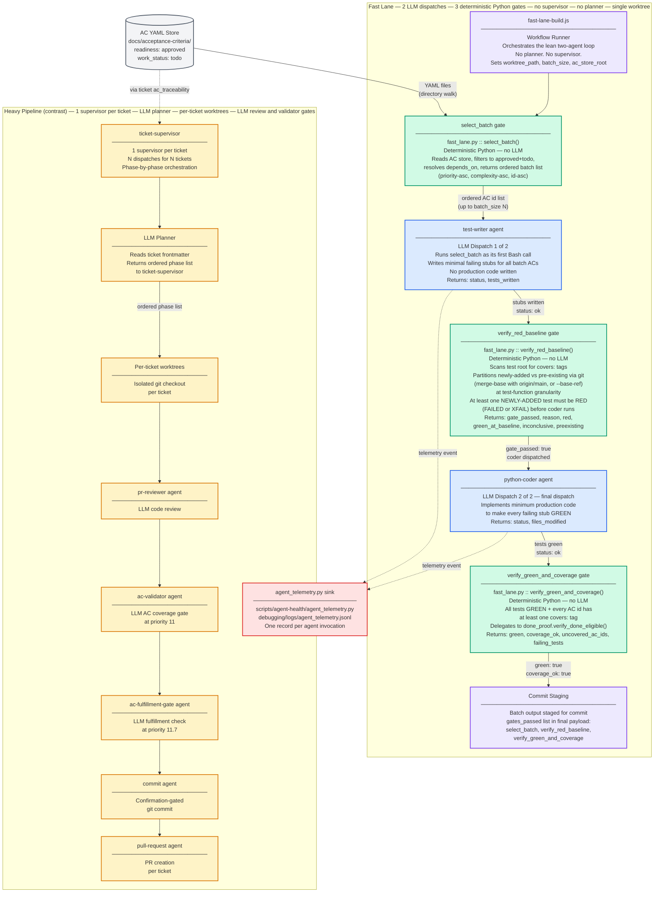

# Fast-Lane Build Path — Component Diagram

The fast-lane build path is a lean, batch-oriented alternative to the heavy pipeline.
It dispatches **exactly two LLM agents** — test-writer and python-coder — regardless of
batch size N, and enforces correctness via **three deterministic Python gate scripts** with
no LLM calls in the critical path. There is **no per-ticket supervisor, no LLM planner,
and no per-ticket worktree isolation**.

---

## Diagram Legend

| Color | Role | Description |
|---|---|---|
| Grey | Data store | Persistent YAML files (AC store) |
| Green | Deterministic gate | Python script in the critical path; no LLM calls |
| Blue | LLM agent | One flat dispatch; produces test stubs or production code |
| Purple | Workflow runner | JS workflow entry point that sequences the two-agent loop |
| Red | Telemetry | Append-only event sink per agent invocation |
| Yellow | Heavy pipeline | Existing supervisor-based path shown for contrast |

---

## Component Diagram

Parent: [Agent Code Delivery Workflows](../agent_delivery_workflows.md)

---

## Fast-Lane vs Heavy Pipeline: Key Distinctions

| Axis | Fast Lane | Heavy Pipeline |
|---|---|---|
| LLM dispatches | **2 total** — test-writer + python-coder | N per ticket: supervisor, planner, reviewer, validator, fulfillment, commit, PR agent |
| Correctness enforcement | 3 deterministic Python gate scripts (no LLM in critical path) | LLM review gates: pr-reviewer, ac-validator, ac-fulfillment-gate |
| Supervisor | **None** — no per-ticket supervisor | 1 `ticket-supervisor` per ticket |
| Planner | **None** — code-defined phase order in fast-lane-build.js | LLM planner reads ticket and returns ordered phase list |
| Worktree strategy | **Single** shared worktree for the whole batch | Isolated per-ticket worktree |
| Batch size | N ACs in one pair of dispatches | 1 ticket per supervisor (may span multiple ACs) |
| Telemetry | agent_telemetry.py — 1 record per dispatch | agent_telemetry.py — 1 record per dispatch |

---

## Gate Function Contracts

| Gate | Script function | Guard condition |
|---|---|---|
| **select_batch** | `fast_lane.py::select_batch(ac_root, limit)` | Deterministic. Filters: `level L2/L3`, `status active`, `readiness approved`, `work_status todo`, `depends_on` resolved. Returns `[]` on empty store. |
| **verify_red_baseline** | `fast_lane.py::verify_red_baseline(ac_ids, test_root, base_ref=None)` | Partitions the batch's covering tests into newly-added vs pre-existing using git at test-function granularity (merge-base with `origin/main`, or an explicit `base_ref`). Passes iff at least one **newly-added** covering test is red (`FAILED` or `XFAIL`). A newly-added test that is green is reported as `green_at_baseline` — surfaced, non-fatal. Pre-existing tests are reported but never affect the verdict. Blocks coder dispatch with exactly one named `reason`: `no_new_covering_tests`, `all_new_tests_green_at_baseline`, `no_red_outcome_among_new_tests`, or `baseline_partition_unavailable` (fail-closed when git metadata is unresolvable). |
| **verify_green_and_coverage** | `fast_lane.py::verify_green_and_coverage(ac_ids, test_root, ac_root)` | Blocks commit staging if any test FAILS or any AC id has zero `# covers: <id>` tags. Delegates per-AC to `done_proof.verify_done_eligible()`. |

---

## Component Descriptions

| Component | Type | Role |
|---|---|---|
| **AC YAML Store** (`docs/acceptance-criteria/`) | Data store | Source of truth for approved+unimplemented ACs. `select_batch` reads from it; `verify_green_and_coverage` reads it for active-status resolution. |
| **fast-lane-build.js** | Workflow Runner | Orchestrates the two-agent loop. Halts immediately on `status: blocked` from either agent. |
| **select_batch gate** | Deterministic Python | Mirrors `scan_ac_store` filter/sort helpers so readiness semantics track the scanner exactly. |
| **test-writer agent** | LLM dispatch 1 | Runs `select_batch` as its first Bash call, then writes minimal failing test stubs. Returns `{status, tests_written}`. |
| **verify_red_baseline gate** | Deterministic Python | Scans test root for `# covers: <id>` tags, partitions the linked tests into newly-added vs pre-existing via git, runs them via pytest, and verifies at least one newly-added test is red before coder is dispatched. Outcome classification is three-way: `FAILED`/`XFAIL` = red, `PASSED`/`XPASS` = green, `SKIPPED`/`ERROR`/unknown = inconclusive (XFAIL counts as red because every AC in a fast-lane batch is not-yet-done, so the AC enforcement plugin rewrites its assertion failures to xfail). Requiring *all* covering tests to be red made every partially-implemented AC unbuildable — observed live on two unrelated ACs. |
| **python-coder agent** | LLM dispatch 2 | Reads the failing stubs, implements minimum production code. Returns `{status, files_modified}`. |
| **verify_green_and_coverage gate** | Deterministic Python | Both `green: true` AND `coverage_ok: true` required. Commit staging is blocked until both pass. |
| **Commit Staging** | Workflow output | Final state of fast-lane-build.js. The actual `git commit` is external to the fast-lane workflow. |
| **agent_telemetry.py sink** | Telemetry | Receives one append-only JSON event per agent invocation. Written to `debugging/logs/agent_telemetry.jsonl`. |

---

## Cross-Links

- [Agent Code Delivery Workflows](../agent_delivery_workflows.md) — parent; covers overall supervisor dispatch topology
- [AC-Driven Pipeline — Component Diagram](c2-001-ac-driven-pipeline.md) — sibling; shows how ACs reach `readiness: approved` before fast-lane picks them up
- [Build Orchestration — Component Reference](../components/build-orchestration.md) — component reference for the `build_orchestration` graph node
- [Architecture README](../README.md)

<!--
====================================================================
DECISION HISTORY
====================================================================
- 2026-07-21 [architecture-diagram-author]: Created for AC BO-2400a-8. Documents the
  fast-lane two-agent batch build path and its three deterministic Python gates alongside
  a simplified heavy-pipeline contrast view. Makes explicit that the fast lane uses no
  per-ticket supervisor and no LLM planner — exactly 2 LLM dispatches, 3 Python gates,
  single worktree. Scaffold script (scripts/scaffold/new_arch_doc.py) is not yet deployed;
  file hand-authored to match c2-001 model per task spec.
====================================================================
-->
