# Fast-Lane vs Heavy-Pipeline Phase Order — Component Diagram

This diagram shows the two build paths in leafcutter-ai side by side, making
the completion-arbiter distinction explicit.

The **fast lane** (`fast-lane-ship.js`) leads with deterministic Python gates:
`verify_red_baseline` and `verify_green_and_coverage` are the arbiters of whether
the code is correct enough to deliver, and no LLM can talk its way past them. It then
adds **one** LLM review — a `pr-reviewer` dispatch at Phase 4.5, over the uncommitted
working diff — before it commits and opens its own pull request.

The **heavy pipeline** dispatches three LLM review agents at successive quality
checkpoints behind a per-ticket supervisor, with no enforced red or green gate.

So the distinction is *not* "mechanical gates versus LLM review": the fast lane has
both. It is that the fast lane's **mechanical gates come first and are unconditional**,
its review is a single pre-commit pass rather than a stack of three, and it carries no
supervisor and no planner.

---

## Diagram Legend

| Style | Role | Description |
|---|---|---|
| Green | Mechanical Gate (Python) | Deterministic script invoked via Bash — exit code is the sole pass/fail signal |
| Blue | LLM Agent | Claude agent dispatched via the `agent()` call site — returns a structured JSON verdict |
| Grey | Terminal | Start or end state of the build path |

---

## Component Diagram

```mermaid
flowchart LR
    classDef gate fill:#d1fae5,stroke:#059669,stroke-width:2px
    classDef llm fill:#dbeafe,stroke:#2563eb,stroke-width:2px
    classDef terminal fill:#f3f4f6,stroke:#4b5563,stroke-width:2px

    subgraph FastLane ["FAST LANE  (fast-lane-ship.js)"]
        direction TB
        FL_IN([One AC id]):::terminal
        FL_WT["Worktree — worktree-agent\nLLM Agent\n(fresh worktree off origin/main)"]:::llm
        FL_RES["Resolve\nMechanical Gates (Python)\nselect_connected, check_producibility, claim\n+ context bundle assembled once"]:::gate
        FL_TW["test-writer\nLLM Agent"]:::llm
        FL_RED["verify_red_baseline\nMechanical Gate (Python)"]:::gate
        FL_COD["python-coder\nLLM Agent"]:::llm
        FL_GRN["verify_green_and_coverage\nMechanical Gate (Python)"]:::gate
        FL_REV["pr-reviewer — Phase 4.5\nLLM Agent\n(uncommitted working diff)"]:::llm
        FL_CHG["changelog — conditional\nLLM Agent"]:::llm
        FL_CMT["commit\nLLM Agent"]:::llm
        FL_PR["pull-request\nLLM Agent"]:::llm
        FL_OUT([PR Opened]):::terminal

        FL_IN --> FL_WT --> FL_RES --> FL_TW --> FL_RED --> FL_COD --> FL_GRN --> FL_REV --> FL_CHG --> FL_CMT --> FL_PR --> FL_OUT
    end

    subgraph HeavyPipeline ["HEAVY PIPELINE  (ticket-supervisor + phase agents)"]
        direction TB
        HP_IN([Single Ticket]):::terminal
        HP_TW["test-writer — priority 5\nLLM Agent"]:::llm
        HP_COD["python-coder — priority 7\nLLM Agent"]:::llm
        HP_REV["pr-reviewer — priority 10\nLLM Agent"]:::llm
        HP_VAL["ac-validator — priority 11.5\nLLM Agent"]:::llm
        HP_FUL["ac-fulfillment-gate — priority 11.7\nLLM Agent"]:::llm
        HP_CMT["commit — priority 12\nLLM Agent"]:::llm
        HP_PR["pull-request — priority 13\nLLM Agent"]:::llm
        HP_OUT([PR Opened]):::terminal

        HP_IN --> HP_TW --> HP_COD --> HP_REV --> HP_VAL --> HP_FUL --> HP_CMT --> HP_PR --> HP_OUT
    end
```

Parent: [Agent Code Delivery Workflows](../agent_delivery_workflows.md)

---

## Phase-by-Phase Comparison

| Phase | Fast Lane | Heavy Pipeline |
|---|---|---|
| Worktree | `worktree-agent` — creates a fresh isolated worktree off `origin/main` | Created once for the epic / ticket, outside this phase order |
| Work selection | `select_connected` — Mechanical Gate (Python): the aimed-at AC's subtree plus its unmet dependency closure, in dependency order | Not applicable — one ticket per run |
| Producibility guard | `check_producibility` — **Mechanical Gate (Python)**, consulted before any claim | _(absent)_ |
| Claim | `claim` — Mechanical Gate (Python): flips the set `todo → in_progress`; a concurrent claim halts the run | _(absent)_ |
| Context assembly | `injection_builders.py assemble-bundle` — assembled once and threaded verbatim into the test-writer and coder prompts | _(absent — each phase composes its own context)_ |
| Write failing stubs | `test-writer` — LLM Agent | `test-writer` — LLM Agent (priority 5) |
| Red baseline check | `verify_red_baseline` — **Mechanical Gate (Python)** | _(absent — no enforced red gate)_ |
| Implement ACs | `python-coder` — LLM Agent | `python-coder` — LLM Agent (priority 7) |
| Green + coverage check | `verify_green_and_coverage` — **Mechanical Gate (Python)** | _(absent — LLM agents arbitrate instead)_ |
| Code review | `pr-reviewer` — **LLM Agent** (Phase 4.5, over the *uncommitted* diff) | `pr-reviewer` — **LLM Agent** (priority 10) |
| AC coverage check | _(absent — `verify_green_and_coverage` + `mark_done` arbitrate mechanically)_ | `ac-validator` — **LLM Agent** (priority 11.5) |
| AC fulfillment check | _(absent — `mark_done` is coverage-gated instead)_ | `ac-fulfillment-gate` — **LLM Agent** (priority 11.7) |
| Changelog | `changelog` — LLM Agent, dispatched only when a non-exempt file changed | Handled outside the per-ticket phase order |
| Commit | `commit` — LLM Agent (pre-authorized; no second confirmation) | `commit` — LLM Agent (priority 12) |
| PR creation | `pull-request` — LLM Agent (`gh pr create` with `gh api` REST fallback) | `pull-request` — LLM Agent (priority 13) |

---

## Key Distinction: Completion Arbiters

### Fast lane

Correctness is arbitrated by deterministic Python scripts, invoked as single
Bash calls whose JSON output the workflow branches on directly:

- **`select_connected`** — resolves the aimed-at AC's connected build set: its
  subtree plus its transitive unmet `depends_on` closure, in dependency order,
  readiness-agnostic, with structural-parent prerequisites pruned from the
  dependency walk. An empty set is a clean no-op; a diagnostic alongside an
  empty list is a resolution *failure*, not an empty set. AC: BO-2400f-1/f-2.
- **`check_producibility`** — refuses the whole set, before any claim, when a
  member declares a deliverable or proof no phase in this roster produces.
  Fail-closed: an unreadable verdict also refuses. AC: BO-2400f-12.
- **`verify_red_baseline`** — at least one newly-added covering test must be RED
  before the coder is dispatched. AC: BO-2400a-3.
- **`verify_green_and_coverage`** — all scoped tests must pass AND every AC id
  must have at least one covering test. Nothing is committed and no PR is opened
  until both hold. AC: BO-2400a-4.
- **`mark_done`** — coverage-gated; a stale id aborts the commit phase.

Delivery is then gated by **one** LLM judgment — a `pr-reviewer` dispatch at
Phase 4.5, over the run's own uncommitted `git diff`. It runs before commit so a
finding corrects the change about to be delivered rather than landing as a
follow-up on a defect already in history, and it fails closed: `verdict_obtained`
is the only positive signal, so an unread or unparseable review is never treated
as a clean pass. AC: BO-2400f-11.

There is no supervisor chain and no LLM planner — the phase order is fixed and
code-defined (AC: BO-2400a-5). The lane **does** isolate: every run cuts its own
worktree off the latest `origin/main` (AC: BO-2400f-3). Any phase that halts
after the claim releases this run's claimed ACs back to `todo`; there are nine
such release dispatches, one per post-claim halt site.

> **Historical note.** A second, orphaned fast-lane runner once sat beside this one
> (deleted under AC BO-2400c-1-v). It did dispatch exactly two agents, select work via
> `select_batch`, share a worktree, and stop at commit staging with no review — but
> nothing ever dispatched it. Descriptions of the fast lane in those terms describe
> that dead file, not this lane.

### Heavy pipeline

Quality is adjudicated by three LLM agents, each of which can return
`status: blocker` and halt the pipeline:

- **`pr-reviewer`** (priority 10) — reviews the implementation diff for
  code quality and structural concerns.
- **`ac-validator`** (priority 11.5) — verifies that every AC listed in
  the ticket has concrete implementation and test-coverage evidence.
- **`ac-fulfillment-gate`** (priority 11.7) — verifies that the AC YAML
  store fields (`work_status`, `implemented_by`, `covered_by`) are accurate.

The commit and pull-request phases are also full LLM agent dispatches with
confirmation gates, making the heavy pipeline significantly slower but more
thorough.

### Validity constraints for the fast lane

`fast-lane-ship.js` (`meta.description`) states its own scope as: *"Full-arc fast
lane: point at one AC id and get a PR back … No per-ticket supervisor chain, no
planner."* Note the phrase **"the inlined lean two-agent loop (test-writer then
coder)"** — in the live lane, "two-agent loop" names the *inner build loop only*,
not the lane as a whole.

The live file declares **no** restriction to small, attended, or low-risk work, and
in particular no prohibition on using the lane when independent LLM review of the
implementation diff is required — because the lane now performs that review itself
at Phase 4.5. An earlier version of this document carried such a constraint,
attributed to the orphaned runner that has since been deleted; it is not a property
of this lane and has been removed rather than restated.

---

## Cross-References

- [Agent Code Delivery Workflows](../agent_delivery_workflows.md) — parent
  diagram; shows the full supervisor dispatch topology these lanes sit within.
- [fast-lane-ship.js](../../templates/workflows-js/fast-lane-ship.js) —
  authoritative source of the fast-lane phase order and gate invocations. The
  `/fast-lane-build` **command** is a thin shim that invokes this workflow; only
  the same-named `.js` file was orphaned and deleted.
- [Build Orchestration component doc](../components/build-orchestration.md) —
  reference for the `build_orchestration` component.

<!--
====================================================================
DECISION HISTORY
====================================================================
- 2026-07-21 [architecture-diagram-author]: Created to address AC BO-2500d-4
  (component diagram: fast-lane vs heavy-pipeline phase order after review
  retirement). Shows both lanes side by side with explicit Mechanical Gate /
  LLM Agent labels so the completion-arbiter distinction is machine-scannable.
  Scaffold script (scripts/scaffold/new_arch_doc.py) was not present in the
  repo; frontmatter follows the c2-001-ac-driven-pipeline.md pattern.
- 2026-09-01 [architecture-diagram-author]: Re-pointed from the deleted orphan
  runner to `fast-lane-ship.js` (AC BO-2400c-1-v). The document's
  central thesis — "the fast lane relies exclusively on deterministic Python gates,
  no LLM makes a review judgment" — was falsified by PR #485, which added a
  `pr-reviewer` dispatch at Phase 4.5 on the user's explicit instruction that the
  lane must catch things that should not ship. The thesis has been restated rather
  than patched: mechanical gates come first and are unconditional, and one LLM
  review follows them before commit. Also corrected: `select_batch` → `select_connected`,
  "Commit: staged output (no agent dispatch)" and "PR creation: absent" → the lane
  commits and opens its own PR, and the "small, attended, low-risk only" validity
  constraint (not present in the live file) was removed.
====================================================================
-->
