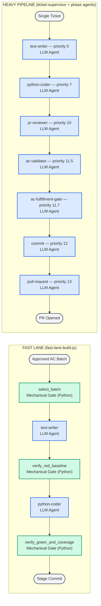

# Fast-Lane vs Heavy-Pipeline Phase Order — Component Diagram

This diagram shows the two build paths in leafcutter-ai side by side, making
the completion-arbiter distinction explicit. The **fast lane** relies
exclusively on deterministic Python gates as quality checkpoints — no LLM
makes a review judgment. The **heavy pipeline** dispatches LLM review agents
at each quality checkpoint and requires a full commit-and-PR cycle per ticket.

---

## Diagram Legend

| Style | Role | Description |
|---|---|---|
| Green | Mechanical Gate (Python) | Deterministic script invoked via Bash — exit code is the sole pass/fail signal |
| Blue | LLM Agent | Claude agent dispatched via the `agent()` call site — returns a structured JSON verdict |
| Grey | Terminal | Start or end state of the build path |

---

## Component Diagram

Parent: [Agent Code Delivery Workflows](../agent_delivery_workflows.md)

---

## Phase-by-Phase Comparison

| Phase | Fast Lane | Heavy Pipeline |
|---|---|---|
| Batch selection | `select_batch` — Mechanical Gate (Python) | Not applicable — one ticket per run |
| Write failing stubs | `test-writer` — LLM Agent | `test-writer` — LLM Agent (priority 5) |
| Red baseline check | `verify_red_baseline` — **Mechanical Gate (Python)** | _(absent — no enforced red gate)_ |
| Implement ACs | `python-coder` — LLM Agent | `python-coder` — LLM Agent (priority 7) |
| Green + coverage check | `verify_green_and_coverage` — **Mechanical Gate (Python)** | _(absent — LLM agents arbitrate instead)_ |
| Code review | _(absent — mechanical gate replaces it)_ | `pr-reviewer` — **LLM Agent** (priority 10) |
| AC coverage check | _(absent — mechanical gate replaces it)_ | `ac-validator` — **LLM Agent** (priority 11.5) |
| AC fulfillment check | _(absent — mechanical gate replaces it)_ | `ac-fulfillment-gate` — **LLM Agent** (priority 11.7) |
| Commit | Staged output (no agent dispatch) | `commit` — LLM Agent (priority 12) |
| PR creation | _(absent)_ | `pull-request` — LLM Agent (priority 13) |

---

## Key Distinction: Completion Arbiters

### Fast lane

The only completion arbiters are three deterministic Python scripts:

- **`select_batch`** — picks the next N approved ACs from the store
  (deterministic priority sort, no LLM judgment). AC: BO-2400a-2.
- **`verify_red_baseline`** — all new test stubs must be RED before the
  coder runs. Non-zero exit halts the pipeline. AC: BO-2400a-3.
- **`verify_green_and_coverage`** — all batch tests must pass AND every
  AC id must have at least one covering test. Non-zero exit blocks the
  commit stage. AC: BO-2400a-4.

The fast lane dispatches exactly **two agents** (test-writer + python-coder)
regardless of batch size N (AC: BO-2400a-1). There is no supervisor chain,
no LLM planner, and no per-ticket worktree (AC: BO-2400a-5).

### Heavy pipeline

Quality is adjudicated by three LLM agents, each of which can return
`status: blocker` and halt the pipeline:

- **`pr-reviewer`** (priority 10) — reviews the implementation diff for
  code quality and structural concerns.
- **`ac-validator`** (priority 11.5) — verifies that every AC listed in
  the ticket has concrete implementation and test-coverage evidence.
- **`ac-fulfillment-gate`** (priority 11.7) — verifies that the AC YAML
  store fields (`work_status`, `implemented_by`, `covered_by`) are accurate.

The commit and pull-request phases are also full LLM agent dispatches with
confirmation gates, making the heavy pipeline significantly slower but more
thorough.

### Validity constraints for the fast lane

From `fast-lane-build.js` (`meta.description`): the fast lane is intended
for **small, attended, low-risk** AC batches. It must not be used when
independent LLM review of the implementation diff is required or when the
batch touches high-risk shared infrastructure.

---

## Cross-References

- [Agent Code Delivery Workflows](../agent_delivery_workflows.md) — parent
  diagram; shows the full supervisor dispatch topology these lanes sit within.
- [fast-lane-build.js](../../templates/workflows-js/fast-lane-build.js) —
  authoritative source of the fast-lane phase order and gate invocations.
- [Build Orchestration component doc](../components/build-orchestration.md) —
  reference for the `build_orchestration` component.

<!--
====================================================================
DECISION HISTORY
====================================================================
- 2026-07-21 [architecture-diagram-author]: Created to address AC BO-2500d-4
  (component diagram: fast-lane vs heavy-pipeline phase order after review
  retirement). Shows both lanes side by side with explicit Mechanical Gate /
  LLM Agent labels so the completion-arbiter distinction is machine-scannable.
  Scaffold script (scripts/scaffold/new_arch_doc.py) was not present in the
  repo; frontmatter follows the c2-001-ac-driven-pipeline.md pattern.
====================================================================
-->
