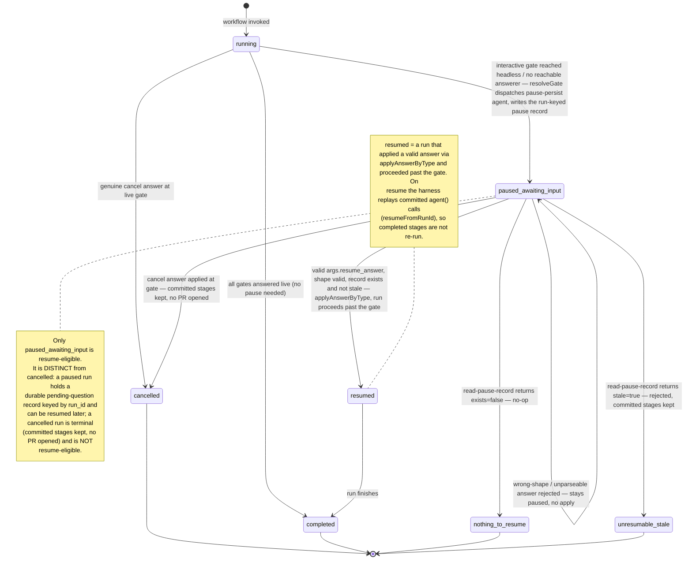

# Interactive Pause/Resume — Run Lifecycle State Diagram

This diagram documents the run lifecycle of the ADR-024 interactive pause/resume
mechanism as implemented by the inline `resolveGate()` in
`templates/workflows-js/plan-feature.js` and `templates/workflows-js/finalize-feature.js`.
It shows how a run moves from `running` into a durable `paused_awaiting_input`
state when an interactive gate is reached headless, and how a subsequent resume
attempt resolves — either applying a valid answer (`resumed`), or reporting one
of the guard outcomes (`nothing_to_resume`, `unresumable_stale`), or applying a
`cancel` answer (`cancelled`).

> **State names are exact.** Every state below matches a status string produced
> by the implemented mechanism: `running`, `paused_awaiting_input`, `resumed`,
> `cancelled`, `completed`, `nothing_to_resume`, `unresumable_stale`.

---

Parent: [Interactive Pause/Resume Substrate — Container Overview](../components/interactive-pause-resume-substrate.md)

See also: [Interactive Pause/Resume — Pause, Ask, Answer, Resume Sequence](c3-002-interactive-pause-resume-sequence.md) — the message-level sequence of the same mechanism.

---

## States

| State | Meaning | Terminal? | Resume-eligible? |
|---|---|---|---|
| `running` | The workflow body is executing; no gate has paused it yet. | No | — |
| `paused_awaiting_input` | An interactive gate was reached headless; a durable pending-question record was persisted and the run terminated cleanly awaiting a human answer. | No | **Yes** |
| `resumed` | A valid `args.resume_answer` was applied by type and the run proceeded past the gate. | No | — |
| `completed` | The run finished. | Yes | No |
| `cancelled` | A `cancel` answer was applied (at a live gate or on resume); committed stages are kept and no PR is opened. | Yes | No |
| `nothing_to_resume` | A resume was attempted but `read-pause-record` reported `exists=false`; treated as a no-op, not an error. | Yes | No |
| `unresumable_stale` | A resume was attempted but `read-pause-record` reported `stale=true`; rejected with a reason, committed stages kept. | Yes | No |

## Key transitions (as implemented)

- **`running -> paused_awaiting_input`** — `resolveGate()` calls the live gate
  function; when it returns `null` (headless / no reachable answerer),
  `pauseAtGate()` dispatches the `pause-persist` agent (`agentType:
  status-checker`) which writes the run-keyed record to
  `.leafcutter/paused_runs/<run_id>.json`, and `resolveGate` returns
  `{ status: "paused_awaiting_input" }`.
- **`paused_awaiting_input -> resumed`** — on re-invocation with
  `args.resume_answer` for this `gate_id`, `validateAnswerShape()` passes,
  `read-pause-record` reports the record present and fresh, and
  `applyAnswerByType()` returns the effective gate decision so execution
  proceeds past the gate.
- **`paused_awaiting_input -> paused_awaiting_input`** — a wrong-shape or
  unparseable `resume_answer` is rejected by `validateAnswerShape()`;
  `resolveGate` returns `paused_awaiting_input` immediately (no
  `read-pause-record`, no apply), so the run stays paused and the same question
  is re-presented on the next attempt.
- **`paused_awaiting_input -> nothing_to_resume`** — `read-pause-record`
  returns `{ exists: false }`; resuming an absent record is a no-op.
- **`paused_awaiting_input -> unresumable_stale`** — `read-pause-record`
  returns `{ stale: true }`; the resume is rejected with `reason` rather than
  corrupting state.
- **`running -> cancelled`** / **`paused_awaiting_input -> cancelled`** — a
  genuine `cancel` decision at a live gate, or a `cancel` answer applied on
  resume, stops the run gracefully while keeping committed stages and opening no
  PR. `cancelled` is a distinct terminal state, never conflated with
  `paused_awaiting_input`.

## Cross-References

- [Build Orchestration — Epic & Ticket Dispatch Sequencing](../components/build-orchestration.md) — the component that owns the three engine workflow files carrying `resolveGate()`.
- [Interactive Pause/Resume — Pause, Ask, Answer, Resume Sequence](c3-002-interactive-pause-resume-sequence.md) — the companion sequence diagram.
- [Interactive Pause/Resume Substrate — Container Overview](../components/interactive-pause-resume-substrate.md) — the parent L2 container.
- [ADR-024 — Interactive Gates Pause and Persist Instead of Cancelling When Headless](../adrs/ADR-024-interactive-pause-resume.md) — the design of record.
