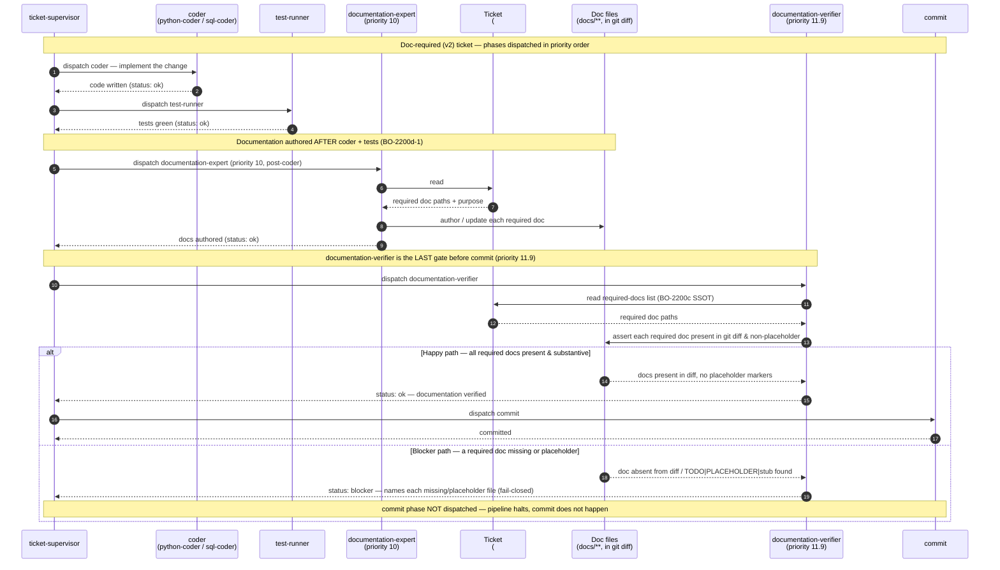

# Documentation Coverage — Runtime Phase Flow Sequence

This diagram documents the runtime interaction of the **documentation-coverage guarantee**
on a doc-required (v2) ticket: the ordered ticket phases that ensure required docs are
authored and then mechanically verified before the ticket is allowed to commit.

The two documentation phases sit inside the larger ticket pipeline shown in the parent
diagram ([Feature to Merged PR](c2-006-feature-to-merged-pr.md)) and are dispatched by
`ticket-supervisor` in priority order:

1. **`documentation-expert` (priority 10)** — runs *after* the coder and the test phases.
   It reads the ticket's `## Agent Contracts` → `### documentation-expert` brief (the
   BO-2200c single source of truth for required docs) and authors or updates each required
   documentation file.
2. **`documentation-verifier` (priority 11.9)** — runs *last, immediately before* the
   `commit` phase (after `pr-reviewer` at 11 and `user-surface-smoker` at 11.5). It reads
   the same `## Agent Contracts` → `### documentation-expert` brief and asserts that every
   required doc is present in the git diff and contains no placeholder content.

> **Fail-closed invariant.** `documentation-verifier` only emits `status: ok` when every
> required doc named in the brief is present in the diff and substantive. If any required
> doc is missing, or contains placeholder markers (`TODO`, `PLACEHOLDER`, `Replace with`,
> `FIXME`, `TBD`, unfilled `{token}` patterns, or an empty / heading-only stub), or the
> brief cannot be parsed, it emits `status: blocker` naming each offending file — and the
> `commit` phase is never dispatched. A blocker halts the pipeline; the commit does not
> happen.

---

Parent: [Feature to Merged PR — End-to-End Sequence Diagram](c2-006-feature-to-merged-pr.md)

---

## Flow walk-through (as shipped)

1. **Coder + tests run first.** `ticket-supervisor` dispatches the coder phase, then
   `test-runner`. Documentation is only authored once the implementation and its tests are
   in place, so the docs describe what actually shipped (BO-2200d-1).

2. **`documentation-expert` writes the docs (priority 10).** It reads the ticket's
   `## Agent Contracts` → `### documentation-expert` subsection — the authoritative,
   machine-readable list of documentation files this ticket must produce — and authors or
   updates each one.

3. **`documentation-verifier` verifies last, before commit (priority 11.9).** It reads the
   same `## Agent Contracts` → `### documentation-expert` brief (the BO-2200c SSOT), then
   checks that every required doc is present in `git diff HEAD` and free of placeholder
   content.

4. **Happy path → commit proceeds.** When every required doc is present and substantive,
   the verifier emits `status: ok` and `ticket-supervisor` dispatches the `commit` phase.

5. **Blocker path → commit is skipped.** When any required doc is missing, or is present but
   only contains placeholder markers, or the Agent Contracts block is absent/malformed on a
   v2 ticket, the verifier emits `status: blocker` naming each offending file. Fail-closed:
   an ambiguous parse or an exception also yields `status: blocker`, never `status: ok`. The
   `commit` phase is not dispatched and the pipeline halts.

> On a **v1 ticket** (no `## Agent Contracts` section at all) `documentation-verifier` is a
> no-op (`status: not_needed`) and the pipeline proceeds to commit unchanged. This diagram
> depicts the v2 doc-required path.

## Cross-References

- [Build Orchestration — Component Overview](../components/build-orchestration.md) — the
  component that owns ticket phase dispatch / sequencing, including the documentation
  phases shown here.
- [Doc Compliance — Documentation Standards Enforcement](../components/doc-compliance.md) —
  the documentation-standards enforcement component whose runtime coverage gate this
  sequence realises.
- [Feature to Merged PR — End-to-End Sequence Diagram](c2-006-feature-to-merged-pr.md) —
  the parent pipeline this diagram zooms into (shows the full phase list and the
  ac-fulfillment-gate at priority 11.7 that precedes documentation-verifier at 11.9).
- [Done-Proof Evaluation — Sequence Diagram](c3-done-proof-evaluation-sequence.md) — a
  sibling fail-closed gate in the same pre-commit band.
