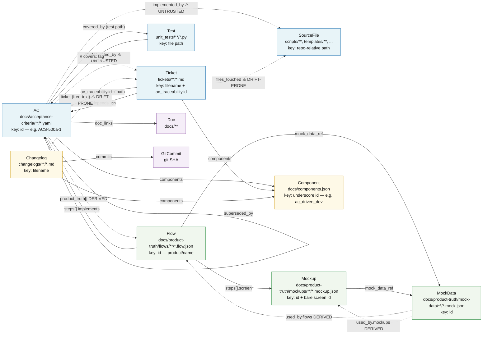

# Artifact Knowledge Graph — Node and Edge Map

> **⚠️ Superseded.** This mermaid diagram is retained for history only. The
> authoritative, corrected model now lives in
> [`docs/reference/artifact-knowledge-graph-data-map.md`](../../reference/artifact-knowledge-graph-data-map.md)
> and its machine-readable JSON
> [`docs/reference/artifact-knowledge-graph.graph.json`](../../reference/artifact-knowledge-graph.graph.json),
> which drives the Atlas Flows view. The trust ratings and gaps in the diagram below
> predate the data-expert review (C1–C9, G8–G11) and should not be relied upon.

This ER-style data map enumerates every artifact **node type** in the
leafcutter-ai knowledge graph and the frontmatter / body **fields** that encode
the directed edges between them. It is the reference model for graph queries over
AC implementation status, test coverage, ticket traceability, and product-truth
linkage — the same relations traversed by `scripts/knowledge_query.py` and read
by `scripts/ac_store/scan_ac_store.py`.

This is a **data map**, not a process or C4 diagram: boxes are artifact *classes*
(keyed on-disk records), and each labelled edge names the field that carries the
reference. Read an edge `A -->|field| B` as "a record of type A carries `field`,
which points at a record of type B."

> **Key caveat — not every edge is trustworthy.** Four edge classes coexist and
> must be read differently: **ENFORCED** (a hook/CI gate validates the link),
> **CONVENTIONAL** (the link exists only by authoring convention), **DRIFT-PRONE**
> (the field has known shape ambiguities or is stale in the live store), and
> **DERIVED** (the field is generated from an authoritative source and must never
> be hand-authored). Dashed arrows below mark the DERIVED and DRIFT-PRONE/UNTRUSTED
> edges; the Legend table classifies every edge.

---

Related upstream diagram: [AC-Driven Pipeline — Component Diagram](c2-001-ac-driven-pipeline.md)

> **Tier placement:** this is a cross-cutting data map, not a node in the C4
> tier tree, so it declares `root: true` rather than a single `parent:`. The
> AC-driven pipeline (above) and ADR-023 (below) are its nearest architectural
> anchors.

> **Arrow styling:** solid arrows are ENFORCED or CONVENTIONAL edges; dashed
> arrows (`-.->`) mark DERIVED edges and DRIFT-PRONE/UNTRUSTED edges. The Legend
> table below gives the authoritative per-edge classification.

---

## Legend — edge trust classes

| Class | Meaning | How to read it |
|---|---|---|
| **ENFORCED** | A pre-commit hook or CI gate validates the link at commit time. | Safe to traverse as ground truth; a broken link would have blocked the commit. |
| **CONVENTIONAL** | The link exists by authoring convention only — no hook checks it. | Usually correct, but treat as a hint; nothing prevents it going stale. |
| **DRIFT-PRONE** | The field has known shape ambiguities or drifts in the live store. | Verify against the real artifact before relying on it. |
| **DERIVED** | Computed / generated from an authoritative source; never hand-authored. | Re-derive rather than trust a hand edit; source of truth is the generator. |

## Legend — per-edge classification

| Edge | Field | Class |
|---|---|---|
| AC → AC | `depends_on` (AC ID) | ENFORCED (AC schema validates the reference resolves) |
| AC → Ticket | `implemented_by` | DRIFT-PRONE / UNTRUSTED (may be a ticket path, a source path, or empty) |
| AC → SourceFile | `implemented_by` | DRIFT-PRONE / UNTRUSTED (three coexisting shapes) |
| AC → Test | `covered_by` (test path) | ENFORCED (done-proof gate requires a covering test) |
| AC → AC | `covered_by` (child AC ID) | ENFORCED (AC schema validates parent↔child back-links) |
| AC → AC | `implements_pattern` | CONVENTIONAL |
| AC → AC | `superseded_by` | CONVENTIONAL |
| AC → Doc | `doc_links` | CONVENTIONAL |
| AC → Flow | `product_truth[]` | DERIVED (generated by the product-truth derivation step, not hand-authored) |
| AC → Component | `components` | ENFORCED (component-vocab CI gate; ids must exist in components.json) |
| Ticket → AC | `ac_traceability.id` + path | ENFORCED (ticket-wiring / ac_coverage) |
| Ticket → SourceFile | `files_touched` | DRIFT-PRONE (wrong entries silently mis-scope the change surface) |
| Ticket → AC | `depends_on` | CONVENTIONAL |
| Ticket → Component | `components` | ENFORCED (check_doc_frontmatter blocks unknown component ids) |
| Test → AC | `# covers:` tag | ENFORCED (AC-enforcement consumes the covers tag) |
| Flow → AC | `steps[].implements` | ENFORCED (flow.schema.json) |
| Flow → Mockup | `steps[].screen` | CONVENTIONAL |
| Flow → MockData | `mock_data_ref` | CONVENTIONAL |
| Mockup → MockData | `mock_data_ref` | CONVENTIONAL |
| MockData → Flow | `used_by.flows` | DERIVED (reverse index generated from flow refs) |
| MockData → Mockup | `used_by.mockups` | DERIVED (reverse index generated from mockup refs) |
| Changelog → Component | `components` | ENFORCED (changelog frontmatter check) |
| Changelog → GitCommit | `commits` | CONVENTIONAL |
| Changelog → Ticket | `ticket` (free-text) | DRIFT-PRONE (free-text, not path-resolved) |

---

## Node type reference

| Node | On-disk location | Primary key |
|---|---|---|
| **AC** | `docs/acceptance-criteria/**/*.yaml` | `id` (e.g. `ACS-500a-1`) |
| **Ticket** | `tickets/**/*.md` | filename + `ac_traceability.id` |
| **Test** | `unit_tests/**/*.py` | file path |
| **SourceFile** | `scripts/**`, `templates/**`, etc. | repo-relative path |
| **Flow** | `docs/product-truth/flows/**/*.flow.json` | `id` (`<product>/<name>`) |
| **Mockup** | `docs/product-truth/mockups/**/*.mockup.json` | `id` and bare `screen` id |
| **MockData** | `docs/product-truth/mock-data/**/*.mock.json` | `id` |
| **Changelog** | `changelogs/**/*.md` | filename |
| **Component** | `docs/components.json` | underscore id (e.g. `ac_driven_dev`) |

---

## Cross-Links

- **Nearest upstream diagram (L2):** [AC-Driven Pipeline — Component Diagram](c2-001-ac-driven-pipeline.md)
- **Governing ADR:** [ADR-023 — Product-Truth Store as the Flow-First Upstream Layer Beside the AC Store](../adrs/ADR-023-product-truth-flow-first-upstream-layer.md)
- **Component doc:** [Knowledge Management — Cross-Surface Knowledge Graph](../components/knowledge-management.md)
- **Query surface:** [`scripts/knowledge_query.py`](../../../scripts/knowledge_query.py) — traverses these edges across all `paths.json` surfaces.
- **Diagram format:** [ADR-015 — Diagram Format and Legends](../adrs/ADR-015-diagram-format-and-legends.md)
- **Architecture index:** [docs/architecture/README.md](../README.md)

<!--
====================================================================
DECISION HISTORY
====================================================================
- 2026-08-12 [architecture-diagram-author]: Initial creation. L3-Component
  data_flow map of the artifact knowledge graph (9 node types + labelled
  field edges). Authored as a plain `graph LR` flowchart (not C4) because the
  content is an ER-style data map; C4 Container/Component/Person primitives do
  not apply. diagram_type corrected from the requested `data-flow` to the
  canonical `data_flow` enum value. Scaffold script scripts/scaffold/new_arch_doc.py
  is not present in this repo, so the file was hand-authored modeled on the
  existing df-001 data_flow diagram. Declared `root: true` (rather than a `parent:`)
  because a cross-cutting artifact data map has no single C4 tier parent; this also
  keeps the check-mermaid-parent-link hook satisfied without editing a grandfathered
  parent doc (every candidate parent — c2-001, ADR-023 — currently carries
  pre-existing frontmatter violations that a bidirectional-link edit would surface).
====================================================================
-->
