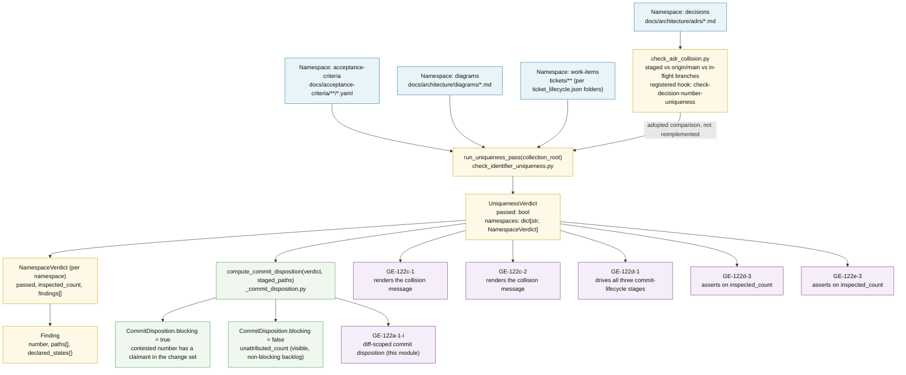

# Whole-Collection Uniqueness Pass — Data Flow

Four numbered artifact namespaces in this repository are each walked in full — never
scoped to a staged diff — by `check_identifier_uniqueness.py`'s single entry point,
`run_uniqueness_pass`. The pass returns one fixed `UniquenessVerdict` object, which a
separate diff-scoped filter (`compute_commit_disposition`) turns into a commit-time
block/report decision without re-walking the collection. Six sibling acceptance
criteria under goal `GE-122` read the verdict object directly; none of them re-walk
the collection or shell out to a CLI. This diagram is the contract map for that
fan-out, recorded by [ADR-037](../adrs/ADR-037-whole-collection-uniqueness-pass.md).

---

---

## Reading the diagram

- **Inspection is whole-collection; disposition is diff-scoped.** `run_uniqueness_pass`
  walks all four namespaces exactly once per invocation, regardless of what is staged.
  `compute_commit_disposition` filters the single resulting verdict against the current
  git change set — it never triggers a second collection walk. This split is
  [ADR-037 §3](../adrs/ADR-037-whole-collection-uniqueness-pass.md#3-inspection-is-whole-collection-disposition-is-diff-scoped).
- **The decision namespace is adopted, not reimplemented.** `check_adr_collision.py`
  already performed the staged-vs-`origin/main`-vs-in-flight-branch comparison before
  this pass existed; it is registered as the `check-decision-number-uniqueness` hook in
  `hooks_manifest.hooks` (`templates/scripts/commit_guardian/commit_guardian.json`) and
  its comparison feeds the decisions namespace rather than a second implementation.
- **One finding per contested number, not per claimant file.** `Finding.paths` lists
  every artifact claiming a number so a reader can see both sides of a collision without
  a second lookup; `declared_states` is populated only for the work-items namespace
  (GE-122a-2), where two lifecycle copies of one identifier can disagree about their own
  state.
- **`inspected_count` is mandatory, not diagnostic.** It is the only signal that
  distinguishes a pass that walked ~2,975 requirement records, 33 decision records, and
  23 diagrams from a pass over an empty or misconfigured root — `GE-122d-3` and
  `GE-122e-3` both assert on it directly.
- **Six downstream consumers read the object, not a CLI.** Per
  [ADR-037 §1](../adrs/ADR-037-whole-collection-uniqueness-pass.md#1-the-pass-will-be-a-library-not-a-hook),
  every consumer imports `run_uniqueness_pass` / `compute_commit_disposition` and reads
  the typed return value; none of them shell out and parse the CLI's printed report.

---

## Cross-Links

- **Governing ADR:** [ADR-037 — Whole-Collection Uniqueness Pass](../adrs/ADR-037-whole-collection-uniqueness-pass.md)
- **Adopted decision-namespace ADR:** [ADR-029 — ADR Number Collision Prevention](../adrs/ADR-029-adr-number-collision-prevention.md) (incl. Amendment 1 — fail-closed-on-read-failure rule this pass also follows)
- **Component doc:** [Commit Guardian](../components/commit-guardian.md)
- **Implementation:** [`templates/scripts/commit_guardian/check_identifier_uniqueness.py`](../../../templates/scripts/commit_guardian/check_identifier_uniqueness.py)
- **Adopted comparator:** [`templates/scripts/commit_guardian/check_adr_collision.py`](../../../templates/scripts/commit_guardian/check_adr_collision.py)
- **Hook registration:** [`templates/scripts/commit_guardian/commit_guardian.json`](../../../templates/scripts/commit_guardian/commit_guardian.json) (`hooks_manifest.hooks` → `check-decision-number-uniqueness`)
- **Documentation index:** [docs/INDEX.md](../../INDEX.md)

<!--
====================================================================
DECISION HISTORY
====================================================================
- 2026-08-18 [documentation-expert/GE-122a-1]: Initial creation, per the
  architect-review handoff on ticket GE-122a-1 (no existing C4 diagram covers
  commit_guardian at any level, so this declares root: true rather than a
  parent:). Modeled as a plain graph TD flowchart (not C4 primitives) because
  the content is a data-flow map, following the c3-005 precedent. Documents
  all FOUR namespaces the shipped module actually scans (acceptance-criteria,
  decisions, diagrams, work-items) rather than only the three named in the
  architect's original suggestion, because the work-items namespace (GE-122a-2)
  landed on this branch before this diagram was authored — the diagram
  describes the as-built module, not the as-suggested scope.
====================================================================
-->
