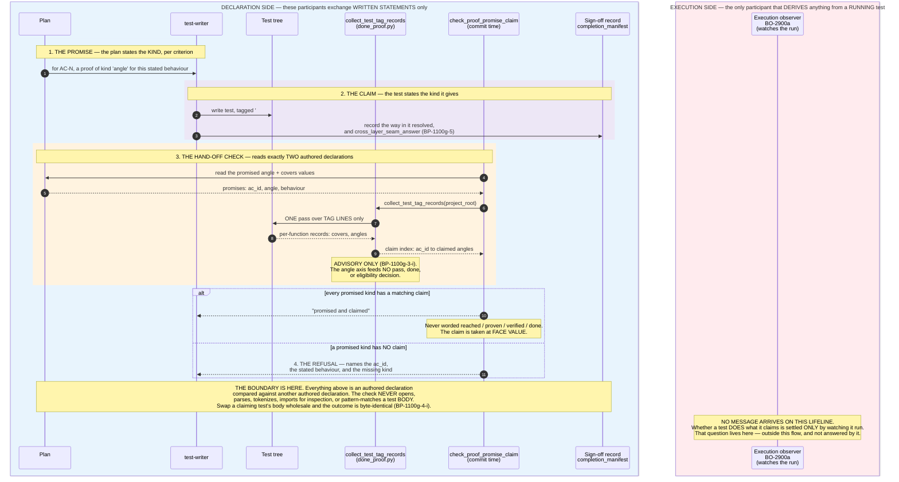

# Promise versus Claim — Where the Boundary to the Execution Observer Lies

A **promised kind of proof** is answered by a **claimed kind of proof**. This diagram shows
that hand-off end to end, and — the reason it exists — shows exactly where it **stops**.

> **Read this first, or the diagram will mislead you.**
> The refusal drawn below does **not** prove the work is wired in. It proves only that a
> *declaration* was made to answer a *declaration*. A claimed kind of proof is a
> **statement about a test**, not evidence from one. The gate never looks at what the test
> actually does. The only thing that can settle that is on the far side of the boundary.

---

Parent: [Phantom-Done Prevention — Real-Effect / Real-Intent Verification (Container Overview)](../components/phantom-done-prevention.md)

---

## How to read the boundary

The diagram is split into two participant boxes, and **that split is the point**:

| | Declaration side (blue box) | Execution side (red box) |
|---|---|---|
| Participants | plan, test-writer, test tree, scanner, hand-off check, sign-off record | execution observer (BO-2900a) |
| What it handles | authored text: `angle` values, `# covers:` / `# angle:` tag lines, manifest keys | the behaviour of a test **while it runs** |
| Arrows touching it | all of them | **none** |
| Can it tell a true claim from a false one? | **No** | Yes — that is the only thing that can |

The observer is drawn **because nothing reaches it**. An absent arrow between two drawn
participants states the limit of the gate more plainly than any paragraph: the correctness
question has somewhere to go, and this flow does not send it there.

## The four steps

1. **The promise.** A plan states, per acceptance criterion, which *kind* of proof it will
   produce — the `angle` value on each `## Test Requirements` descriptor. The seven kinds
   and their triggers are defined once in
   [docs/testing/test-angles.md](../../testing/test-angles.md); the single machine-readable
   source is `config/ac_store_schema.json`'s `test_spec[].angle` enum, taught to
   `test-writer` by **BP-1100g-1**.

2. **The claim.** A test states the kind it gives, via a `# covers: <ac-id>` and
   `# angle: <kind>` tag pair **on the same test function**. Both axes are collected in a
   single pass by `collect_test_tag_records` (**BP-1100g-3**) — one scanner, two axes, never
   a second walk of the test tree. A function carrying only one of the two tags contributes
   no claim for either axis alone.

3. **The record.** Alongside the test, the writer records how the way in resolved and its
   answer to the cross-layer seam rule — `cross_layer_seam_answer`, a sibling declaration on
   the same sign-off hand-off record (**BP-1100g-5**). It is a declaration too, on the same
   side of the boundary.

4. **The refusal.** At commit time `check_proof_promise_claim` (**BP-1100g-4**, registered in
   `commit_guardian.json`, run via `run_hook.py`) compares the promise set against the claim
   set and **blocks** when a promised kind has no matching claim, naming the `ac_id`, the
   stated behaviour, and the missing kind. The promise set is the denominator: a kind never
   promised is never demanded, and a plan that promises nothing is never refused.

## What the refusal does and does not establish

**It establishes:** a kind of proof that was promised for a criterion was also claimed by
some test function tagged against that criterion.

**It does not establish** — and must never be read as establishing:

- that the claiming test exercises the production entry point;
- that the claiming test is anything more than a pre-existing behaviour test that was handed
  a tag and otherwise left untouched;
- that the work is reached, wired in, proven, verified, or done.

**BP-1100g-4-i** pins this deliberately. A claim is taken at **face value**: the outcome is
byte-identical under a wholesale swap of the claiming test's body, and no part of reaching it
reads that body. This is why the success wording is the flat `"promised and claimed"` and
never `reached`, `proven`, `verified`, or `done` — so nothing downstream can quote it as
evidence that the work runs.

Reading a source scan into this gate would not fix that; it would make the gate itself the
failure mode it guards against (**BO-2900a-2**). A source scan inside a phantom-done guard is
phantom-done. The correctness question is therefore routed deliberately *out* of this flow,
to the execution observer that watches tests actually run — **BO-2900a**, which is not part
of this path and is not drawn as receiving anything from it.

## Acceptance criteria realised here

| AC | What it contributes to this diagram |
|---|---|
| `BP-1100g-1` | the seven kinds, taught from the `test_spec[].angle` enum |
| `BP-1100g-3` | the single-pass two-axis scanner, `collect_test_tag_records` |
| `BP-1100g-3-i` | the angle axis is advisory — it feeds no pass/done/eligibility decision |
| `BP-1100g-4` | the hand-off check and the named refusal |
| `BP-1100g-4-i` | the face-value rule: no test body is ever read |
| `BP-1100g-5` | `cross_layer_seam_answer` on the sign-off record |
| `BP-1100g-7` | this diagram |
| `BO-2900a`, `BO-2900a-2` | the execution observer and the prohibition that keeps the gate on the right side of the boundary |

## Cross-References

- [Phantom-Done Prevention — Real-Effect / Real-Intent Verification](../components/phantom-done-prevention.md)
  — the parent container page; owns the surrounding phantom-done guarantees.
- [Test Angles — A Set-Cover Taxonomy for Proof of Done](../../testing/test-angles.md) — the
  single definition of the seven kinds and the vocabulary this diagram labels its messages
  with. States the failure mode this boundary exists to make visible: *"a reachability
  mandate can still quietly be satisfied by a renamed `criterion` test."*
- [Phantom-Done Prevention — Proving a Durable Change by Real Effect and Intent](c3-003-phantom-done-real-effect-intent-verification.md)
  — the sibling L3 sequence for the BP-1100f gates (a different chain: real effect and stated
  intent, not promise versus claim).
- [Done-Proof Evaluation — Sequence Diagram](c3-done-proof-evaluation-sequence.md) — the
  fail-closed `# covers:` evaluation whose scanner BP-1100g-3 extended with the second axis.
