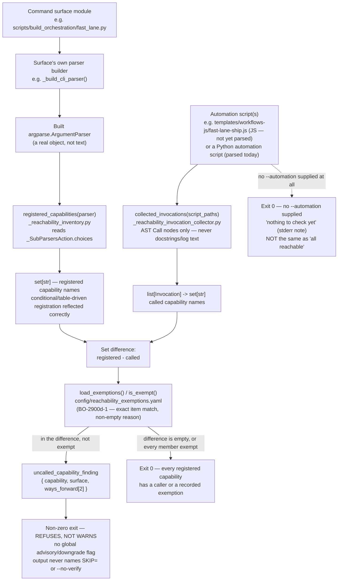

# Runtime Reachability Guard — Data Flow

`check_reachability.py` refuses a change whenever a command surface's **built** argparse
parser registers a capability that no automation invocation names. The inventory side and
the invocation side are two independent reads that meet at a single set-difference
comparison; the diagram below is the contract map for that meeting point, recorded by
this AC's ticket and consumed on the reverse direction by the `BO-2900c` family.

---

---

## Two independent reads, one comparison

The diagram's whole point is that **capability inventory** and **invocation collection**
never touch each other except at the `DIFF` node. `registered_capabilities()` never
reads automation code; `collected_invocations()` never imports or executes a surface
module. This is why a capability registered only under a build-time-false condition is
correctly absent from `CAPSET` (it was never asked of the surface — the built parser
simply does not have that choice), and why a decoy string in an automation script's
docstring or log message is correctly absent from `INVSET` (only genuine AST `Call`
nodes count, never text mentions — the rule BO-2900b-3 states explicitly and this
module's own `collected_invocations()` already follows).

## Both reads are of the current working tree, so same-change adoption passes

`REG` and `COLLECT` are both evaluated against the state of the tree **at check time**,
not against a prior commit. Neither side is diffed against the last commit's parser or
the last commit's invocations before the comparison — `CAPSET` and `INVSET` are each a
fresh read of what exists right now. Consequently a change that registers a capability
on `SURFACE` and adds its first automation invocation to `AUTOMATION` in that same
change produces an empty `DIFF` for that capability and reaches `PASS`, never `FINDING`
(`BO-2900b-1-i`). An implementation that instead compared the new capability against a
previous commit's collected invocations would refuse this ordinary case and make the
guard unusable for exactly the workflow it exists to allow.

## The comparison degrades safely in both directions

- **No exempt survivors reach `FINDING`.** `EXEMPT` consults
  `config/reachability_exemptions.yaml` (BO-2900d-1) before anything is reported; a
  recorded, reasoned exemption is the only sanctioned way to keep a genuinely
  no-runtime-way-in capability from refusing every future commit.
- **No `--automation` supplied is not "everything uncalled".** The `NOTHING` exit exists
  precisely so that an unconfigured or not-yet-wired run reports its own incompleteness
  honestly (a stderr note) instead of manufacturing a fleet of false findings — see the
  [how-to's rollout-status section](../../how-to/resolve-a-reachability-guard-finding.md#current-rollout-status-for-this-repositorys-real-surfaces)
  for why this repository's own `check-reachability` hook/CI job currently takes exactly
  this exit against `fast_lane.py`.

## What this diagram is not

It does not depict the reverse direction (an invocation naming a capability that does
not exist on any surface) — that is `BO-2900c`'s own diagram, sharing this same
`_reachability_inventory.py` seam rather than forking it (`ONE SEAM, TWO VERDICTS`). It
also does not depict JavaScript command-string parsing inside `collected_invocations()`
— that collector currently reads Python `Call` nodes only; hardening it against JS,
decoy text, and rename-invariance is separate follow-on scope.

## Acceptance criteria realised here

| AC | What it contributes to this diagram |
|---|---|
| `BO-2900b-1` | the whole forward flow: built-parser inventory, invocation collection, the comparison, and the refuse-not-warn exit |
| `BO-2900b-1-i` | pins the `PASS` outcome for same-change adoption (registering a capability and wiring its caller in one change) and pins `FINDING`'s `ways_forward` as exactly the two entries shown — no third entry, no skip/bypass mention |
| `BO-2900d-1` | the `EXEMPT` node — exact-match, non-empty-reason exemption relief |

## Cross-References

- [How to resolve a check-reachability guard finding](../../how-to/resolve-a-reachability-guard-finding.md)
  — the operator procedure for what to do with a `FINDING`: wire up the caller, or record
  an exemption.
- [Commit Guardian — Pre-Commit Hook System](../components/commit-guardian.md) — the
  component page this hook is registered under.
- [ADR-038 — Commit Guardian Shared Change-Set Derivation](../adrs/ADR-038-commit-guardian-shared-change-set-derivation.md)
  — the shared-seam precedent this guard's own `_reachability_inventory.py` follows.
- [ADR-001 — Self-Hosting Boundary](../adrs/ADR-001-self-hosting-boundary.md) — governs
  the `templates/scripts/` \<-\> `scripts/` deploy parity this hook's registration respects
  on both sides.
- [ADR-050 — Runtime Reachability Guard Refuses, Never Warns](../adrs/ADR-050-runtime-reachability-guard-refuses-not-warns.md)
  — the decision record covering both the same-change adoption case and the exact
  ways-forward content.
- [BO-2900d — legitimate exceptions are recorded honestly](../../acceptance-criteria/build-orchestration/BO-2900-runtime-reachability-guard/BO-2900d.yaml)
  — the exemption route named as the second way forward.
- [BO-2900e — the guard names exactly what is unreachable](../../acceptance-criteria/build-orchestration/BO-2900-runtime-reachability-guard/BO-2900e.yaml)
  — governs refusal-message quality generally; this AC family only constrains which two
  options the message offers.
