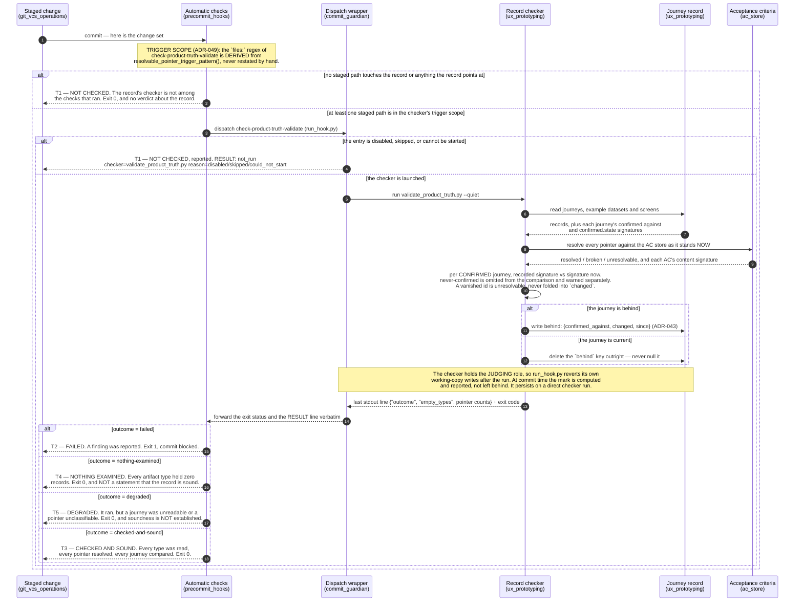

# The Record's Freshness Check — How a Change Reaches a Drift Finding

This is the ordered exchange a change travels to become a **drift finding**: from the
moment it is offered to the project's automatic checks, through the record's checker
resolving its pointers and comparing each journey against **what that journey was last
confirmed against**, to a verdict being reported and a durable `behind` mark being
written into the journey itself.

> **The point of the drawing is where it ends.** The path has **five separate
> terminations**, not one. Three of them are named by
> [`UXP-700c-5`](../../acceptance-criteria/ux-prototyping/UXP-700-truthful-project-record/UXP-700c-5.yaml)
> and are marked **T1**, **T3** and **T4** below: **not checked**, **checked and sound**,
> and **nothing examined**. They are drawn apart because collapsing them into a single
> "the commit went through" is precisely the blindness
> [ADR-042](../adrs/ADR-042-product-truth-checker-outcome-vocabulary.md) and `GE-120`
> ("green means it was checked") exist to forbid. Four of the five exit `0`.

---

See also: [UX Prototyping — The Product-Truth Store](../components/ux-prototyping.md) —
the component page this diagram belongs beside.

---

## The five terminations, side by side

| | What actually happened | Exit | May it be read as "the record is sound"? |
|---|---|---|---|
| **T1 — not checked** | The checker never ran: nothing in scope was staged, or its entry was disabled, skipped, or unstartable. | `0` (`1` when unstartable) | **No.** Nothing was examined and nothing was claimed. |
| **T2 — failed** | The checker ran and found an error — a broken pointer, a schema violation, a derived-data drift. | `1` | No — it is the opposite. |
| **T3 — checked and sound** | Every artifact type was read, every pointer resolved, every confirmed journey compared. | `0` | **Yes.** This is the only value that says so. |
| **T4 — nothing examined** | The checker ran, and every artifact type held zero records. | `0` | **No.** A run that looked at nothing is not a sound one. |
| **T5 — degraded** | The checker ran but did not read everything it was given, or held a pointer it could not classify. | `0` | **No.** It did not establish soundness. |

T1, T3 and T4 are the three `UXP-700c-5` requires be visibly distinct. T2 and T5 are drawn
because the vocabulary is **closed** (ADR-042 §1) — omitting them would invite a reader to
assume anything not sound must be a failure, when three of the five non-failure ends exit
`0` and still refuse to certify the record.

## Reading the ordered exchange

1. **The change is offered.** `git commit` hands the staged change set to the automatic
   checks. Nothing about the record has been decided yet.

2. **Trigger scope decides whether the checker is dispatched at all.** The
   `check-product-truth-validate` entry's `files:` condition is **derived** from
   `resolvable_pointer_trigger_pattern()` rather than hand-restated, so a pointer kind
   becoming resolvable without the gate's scope widening in the same commit is a failing
   test, not a silent drift
   ([ADR-049](../adrs/ADR-049-record-checker-trigger-scope.md)). A change touching
   neither the record nor anything the record points at ends at **T1** — by design
   (`UXP-700c-3`), and without any verdict being produced.

3. **The wrapper can also end the path before the checker starts.**
   `run_hook.py` resolves "disabled / skipped / could-not-start" *before* spawning the
   delegated process and emits
   `RESULT: not_run checker=… reason=…` on the checker's behalf. A gate that did not run
   must never count as a gate that passed — hence the explicit line rather than silence.

4. **Pointers are resolved first.** `_check_pointers` walks every pointer the record makes
   and resolves it against the AC store **as it stands now**, splitting the result three
   ways: resolved, broken (an error — it ends at **T2**), and *unresolvable* (it could not
   be classified — it demotes the run to **T5**). The count of resolved pointers is stated
   on **every** run, zero included, so a run that resolved none is distinguishable from a
   run that held none to resolve (`UXP-700c-1`).

5. **Each journey is compared against what it was last confirmed against.** For every
   journey carrying a `confirmed` block, `_check_freshness` re-derives the content
   signature of each AC named in `confirmed.state` and compares it to the signature
   recorded at confirmation time. Three outcomes, kept apart on purpose:

   | Case | Result |
   |---|---|
   | Some recorded signature has moved | **behind**, naming the journey and every changed thing |
   | No recorded signature has moved | **current** — not reported |
   | The journey carries no `confirmed` block | **never-confirmed** — omitted from the comparison, warned as `[freshness-never-confirmed]` |
   | A named id has vanished from the AC store | **unresolvable** — `[freshness-unresolvable]`, never folded into `changed` |

   The compared count is stated unconditionally, and rises by one when a journey is added.

6. **The behind mark is written into the journey itself.** `_sync_behind_marks` sets one
   optional top-level `behind: {confirmed_against, changed, since}` object on a behind
   journey and **deletes the key outright** when the journey is current — never nulls it
   ([ADR-043](../adrs/ADR-043-journey-record-carries-its-own-behind-mark.md)). `changed`
   is sorted, so re-running against an unchanged store is byte-identical. This is what
   makes the verdict visible to the overwhelming majority of the record's readers, who
   never run the checker.

7. **The verdict is reported on a structured channel.** The last stdout line carries
   `{"outcome", "empty_types", …}` from ADR-042's closed four-value vocabulary. A consumer
   reads `outcome` — **never the exit code alone**, because `nothing-examined` and
   `degraded` both exit `0` by design.

## One thing the diagram deliberately shows

The record's checker is registered at `tier: "judgment"`. `run_hook.py` snapshots the
working tree either side of a judging check's own process and **reverts** whatever that
run altered, so the `behind` mark a pre-commit run computes does not survive the commit it
guarded. The mark is durable when the checker is run directly; at commit time the same
write is performed, reported, and then rolled back so that being looked at leaves an
ordinary commit's working copy exactly as it found it. Reading step 6 without the note in
the diagram would leave the wrong impression that committing silently rewrites journey
files.

## Participants and the component registry

Every participant names a component that exists in `docs/components.json`:

| Participant | Registry id | What it stands for here |
|---|---|---|
| Staged change | `git_vcs_operations` | the change offered at `git commit` |
| Automatic checks | `precommit_hooks` | the `check-product-truth-validate` entry and its trigger scope |
| Dispatch wrapper | `commit_guardian` | `run_hook.py`, the not-run report, and the judging-role revert |
| Record checker | `ux_prototyping` | `validate_product_truth.py` and its outcome derivation |
| Journey record | `ux_prototyping` | `docs/product-truth/flows/**` — read, and written with the `behind` mark |
| Acceptance criteria | `ac_store` | what the record's pointers and confirmation signatures resolve against |

## Acceptance criteria realised here

| AC | What it contributes to this diagram |
|---|---|
| `UXP-700c-1` | pointer resolution, and the resolved count stated on every run |
| `UXP-700c-1-i` | the unresolvable pointer that withholds `checked-and-sound` |
| `UXP-700c-2` | the per-journey comparison against `confirmed.state`, and the compared count |
| `UXP-700c-2-i` | never-confirmed kept distinct from current and from behind |
| `UXP-700c-2-ii` | the durable `behind` mark written into the journey |
| `UXP-700c-3` | the checker runs as one of the automatic checks; its verdict is the reported verdict |
| `UXP-700c-3-ii` | `RESULT: not_run` — the gate that never ran, reported rather than silent |
| `UXP-700b-1` | `nothing-examined` as a termination separate from `checked-and-sound` |
| `UXP-700c-5` | this diagram |

## Cross-References

- [UX Prototyping — The Product-Truth Store](../components/ux-prototyping.md) — the
  component page that owns the record and the checker drawn here.
- [ADR-042 — The Product-Truth Checker Reports a Closed Outcome Vocabulary](../adrs/ADR-042-product-truth-checker-outcome-vocabulary.md)
  — the four values T2–T5 are drawn from, and the rule that consumers read `outcome`
  rather than the exit code.
- [ADR-043 — A Journey Known to Be Behind Carries a Durable `behind` Mark](../adrs/ADR-043-journey-record-carries-its-own-behind-mark.md)
  — the mark's name, shape, and delete-don't-null rule.
- [ADR-049 — Record Checker Trigger Scope](../adrs/ADR-049-record-checker-trigger-scope.md)
  — why the gate's `files:` condition is derived rather than restated.
- [docs/product-truth/README.md](../../product-truth/README.md) — the store's layout and
  the artifacts the checker reads.
- [Managing Pre-Commit Hooks](../../how-to/managing-pre-commit-hooks.md) — how the entry
  drawn at step 2 is registered and enabled.
