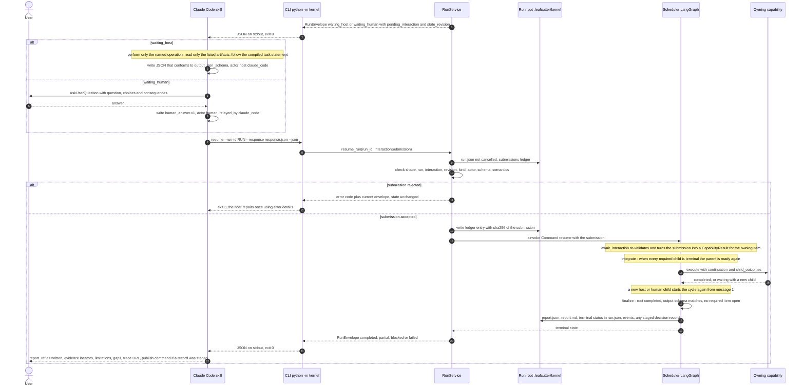

# Decision Kernel Request Flow 2 — Host or Human Handoff, Resume and Finalize

This is the second half of a kernel run. [Request Flow 1](c3-013-decision-kernel-flows-request-native.md)
ended with a `waiting_host` or `waiting_human` envelope and a CLI process that exited normally.
This page shows how Claude Code serves the pending interaction, how `resume` validates the
answer before the graph moves, and how the run reaches a terminal state.

**Status: V0, on main.** Interaction nodes and submission validation (P6), the `RunService`
implementation, CLI and skill (P7), the `host.*` operations (P8) and cancellation hardening (P9)
merged with PR #973 (design part 6).

The cycle repeats: one handoff at a time, because `max_concurrent_host` is 1 and only the queue
head is served (design part 3).

Parent: [Decision Kernel and Colony Memory — Design Map](c2-007-decision-kernel-flows-overview.md)

See also: [Request Flow 1](c3-013-decision-kernel-flows-request-native.md) and
[Context: host, worker, human](c3-019-decision-kernel-context-host-worker-human.md).

## Resume validation, in order

`resume_run` calls `submit_interaction` (`kernel/interaction/ledger.py`), which checks the
submission before it touches the graph; `check_submission` (`kernel/interaction/submissions.py`)
holds the per-field checks. The codes are the stable `RejectionCode` values.

| Check | Rejection code | Effect |
|---|---|---|
| `run.json` carries a cancellation | `cancelled_or_superseded` | Stale resumes after a cancel are refused; cancellation provenance is kept |
| A ledger entry exists for this interaction: the same hash replays, or finishes a resume that died mid-flight; a different hash is refused | `not_pending`, `details.reason=conflicting_duplicate` | An identical duplicate is idempotent |
| The submission's shape | `schema_invalid` | |
| The run id is this run's | `forged_id` | |
| The interaction is the queue head. An id the kernel never issued; an interaction whose item was cancelled, failed or blocked; any other | `forged_id`; `cancelled_or_superseded`; `not_pending` | |
| `expected_state_revision` matches | `stale_revision` | |
| The response schema fits the interaction: `human_answer.v1` for `human`, its `output_schema_id` for `host_work` | `wrong_kind` | A generative result can never answer a human question |
| The actor kind fits: `human` or `host` | `actor_mismatch` | |
| The full submission model, then the payload schema through the catalog, then the semantic checks: cited ids exist, the selected option was supplied, the `choice_id` was offered | `schema_invalid`, `semantic_invalid` | State unchanged; the interaction stays pending; host repairs count against `host.max_repair_attempts` (1) |

Design part 3's resume section still names the earlier codes `run_cancelled`, `stale_submission`
and `kind_mismatch` (OP-30). The ledger entry is written before `Command(resume=…)`, so a restart
finds the entry and resumes the still-pending interaction (spec §13.1, design part 3).

## What a submission becomes

| Submission | Becomes | Source |
|---|---|---|
| Host output (`options.v1`, `findings.v1`, `evidence_bundle.v1`, `human_question_request.v1`) | `CapabilityResult(completed)`. Host evidence carries `verification=host_reported`; options and criteria stay `proposed`; excess options and findings that cite missing evidence are dropped with a limitation; an option that cites no supplied evidence is flagged `not grounded`; usage is `unavailable` unless the host reports it | Each operation's `convert` in `kernel/capabilities/host/`; design part 4 |
| Human answer (`human_answer.v1`) | `Evidence(category=task_context, semantic_type=human_input, source.kind=human)`, with the actor and `relayed_by` in provenance. Structured fields approve or edit proposals, add options, pick a ranked option or answer a precedent reuse question | `kernel/interaction/results.py`, `kernel/capabilities/decision/approvals.py` |

An executed host operation also records a `host_only` gap observation, on an accepted answer or
an exhausted repair budget. That is the scout signal the
[learning loop](c3-020-decision-kernel-flows-learning-loop.md) counts later (design part 3, ADR-056 §6).

## Other ways a run ends

- **Cancel.** `python -m kernel cancel --run-id RUN --actor human:<id>` commits `cancel` and
  `status=cancelled` to `run.json` with `compare_and_update` (the first actor wins), appends
  `run.cancelled` and closes a paused graph thread with `aupdate_state(as_node="finalize")`,
  verified on LangGraph 1.2.12 (design part 3, risk 5). A running process sees the flag through
  `cancel_probe()` between supersteps and before each invocation.
- **Silence.** An unanswered human question keeps the run in `waiting_human` until someone
  cancels it. No answer is inferred from silence (spec §11.6).
- **Guards.** Budget, time, no-progress and depth guards end the run as `partial` or `blocked`
  with the unresolved question. The report names the budget, the config key that raises it and
  the remedies (design part 3).

## A staged decision record

When the decision resolves with a human approval, the record is staged in
`runs/<run_id>/staged/decisions/` and the completed run's limitations name the publish command.
The skill shows that command but never runs it; a person runs
`python -m kernel decisions publish --run-id RUN` to file the record in `docs/decisions/` for git
review ([ADR-060](../adrs/ADR-060-source-of-truth-and-approval-authority.md) §3).

## Tracing across processes

Each CLI process opens a trace segment (`leafcutter.run` or `leafcutter.run.resume`) on the same
`trace_id`, which is derived from `run_id`. A resumed run therefore appends to one trace.
Handoffs appear as `interaction.opened`, `submission.accepted` and `submission.rejected` events.
The host's own work is host-reported, not traced by the kernel (design part 5; ADR-058 §2).

Open points for this flow: OP-04, OP-12, OP-30 in [open points](c3-022-decision-kernel-flows-open-points.md).

## Legend

| Element | Meaning |
|---|---|
| Solid arrow | A call or message |
| Dashed arrow | A return value |
| `alt` block | Mutually exclusive branches |
| Self-arrow | Work done inside one participant |

## Cross-Links

- Parent: [Design Map](c2-007-decision-kernel-flows-overview.md)
- Sibling: [Request Flow 1](c3-013-decision-kernel-flows-request-native.md)
- Client, CLI exit codes and skill body: [design part 5](../../analysis/2026-09-30-decision-kernel-design-5-client-observability.md)
- Host handoff contract: [spec part 5 §11](../../analysis/2026-09-30-leafcutter-kernel-spec-rev3-5-client-observability-safeguards.md)
- Running it: [How to run the decision kernel](../../how-to/run-the-decision-kernel.md)
