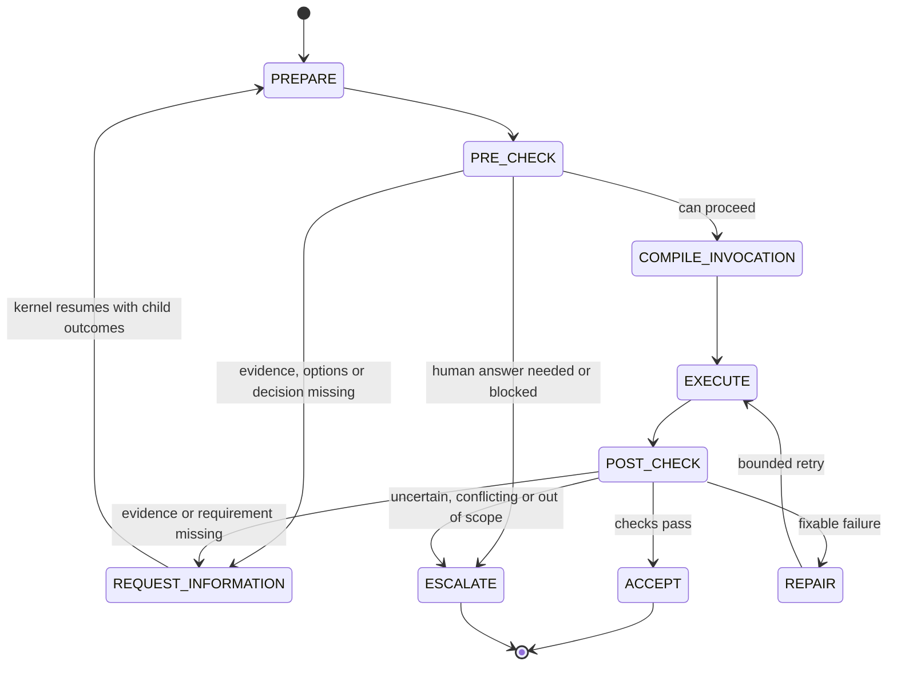

# Capability Lifecycle — Steps, Executors and the V0 Mapping

[ADR-052](../adrs/ADR-052-capabilities-replace-agents-prompts-are-compiled.md) §4 makes one
generic lifecycle the reusable shape of every capability. Checks run as stages before and after
execution, not as instructions inside a prompt.
[ADR-053](../adrs/ADR-053-intelligence-selection-deterministic-jev-llm-human.md) §7 requires every
check to name its executor.

**Status.** Both ADRs are accepted. V0 is on main and has no generic lifecycle graph. Its native
`decision` and `research` graphs and the `host.*` handoffs already follow the shape; the table
below shows where. ADR-052 leaves open whether the V0 graphs are restated in lifecycle terms.

Parent: [Decision Kernel and Colony Memory — Design Map](c2-007-decision-kernel-flows-overview.md)

ADR-052 names the steps and the four outcomes. It does not say which check leads to which
outcome, or where REPAIR re-enters. The transitions above follow ADR-052 §5's illustrative
`on_failure` / `on_uncertain` keys (`request_decision`, `request_evidence`, `request_review`,
`repair_or_escalate`) and what the V0 capabilities do (open point OP-09).

## Executors (ADR-053 §7)

| Executor | Mechanism | Answers |
|---|---|---|
| `deterministic` | Code | Exact facts and structural invariants: a schema validates, a file is in scope, a budget remains |
| `test_runner` | Code | Runs tests and supplies executable evidence. No V0 capability uses it: V0 has no implementation or verification capability (ADR-058 §2) |
| `jev` | Jev | Bounded semantic judgments against supplied criteria; thresholds applied in code |
| `reasoning` | LLM | Synthesis, options, conflicts, open analysis. In V0 this is Claude Code as host |
| `human` | Human | Preference, authority, risk acceptance |

## Each step, its executor, and V0

| Step | ADR-052 meaning | Executor | V0 decision capability | V0 research and retrieval | V0 kernel and host |
|---|---|---|---|---|---|
| PREPARE | Resolve policies, acquire evidence | deterministic; jev for need planning, reranking and precedent applicability | `load`: question, options and criteria from the payload or child outcomes; evidence via `ctx.evidence(ids)`. `precedent`: earlier approved decisions through the `ColonyMemory` port, judged by Jev, applicable ones added as `prior_decisions` evidence (ADR-059 §5) | `plan_needs` (jev only when the request does not name its needs), `resolve_sources` (deterministic) | No policies in V0 (Stage 3) |
| PRE-CHECK | Can this operation proceed? | deterministic first (ADR-053 §5); human for preference | `validate_basis` (deterministic) | — | Eligibility filter and budget reservation before any Jev call (deterministic) |
| COMPILE INVOCATION | Build the operation-specific input | deterministic only (ADR-052 §3) | Jev questions from versioned templates | Same | `open_interactions` builds the `HostWorkRequest`; its task statement is compiled and fingerprinted by `kernel/capabilities/host/compiler.py` (P8). No compiler for worker loops yet (OP-08) |
| EXECUTE | Code, research, synthesis, tools | jev, deterministic, reasoning, human | `assess`: one Jev batch, including criterion-kind and precedent questions | Retrieval children: search (deterministic) and rerank (jev); `host.research` (reasoning) | `host.*` operations performed by Claude Code (reasoning) |
| POST-CHECK | Evaluate the actual result | deterministic, test_runner, jev, reasoning, human | `combine`: pure code over Jev answers and `decision.*` thresholds | `collect` and `evaluate`: one jev batch (`conflict`, `evaluable`, `answers.<need>`) | `integrate` validates every result; `resume_run` validates every submission (deterministic) |
| ACCEPT | Return the typed result | deterministic | `emit` `resolved` → `completed` with `decision_report.v1`; a decision a human approved is also staged as a record in the run root (ADR-060 §2–§3) | `completed` with `evidence_bundle.v1` | Each host operation's `convert` turns host output into a completed result |
| REPAIR | Fix within bounds | deterministic bounds | — | — | Invalid host output: one repair (`host.max_repair_attempts`); retryable failure: same binding, up to `limits.max_retries` |
| REQUEST INFORMATION | Return a typed unresolved result | — | `emit` `needs_evidence`, `needs_options`, `needs_synthesis` → `waiting` with a child request | `waiting` with retrieval, `host.research` or synthesis children | The kernel schedules the children and resumes the parent |
| ESCALATE | Hand to a human or stop | human | `needs_human` → `human_question_request.v1`, including a ranked design choice and a precedent reuse question; `blocked` when the same request already failed or grounding found nothing; `partial` when nothing changed | `partial` when a required need stays unsatisfied | Guards end in `partial` or `blocked`; `no_match` records a gap, then fallback or `blocked` |

A check that ran is not a check that was right. The runtime guarantees that a required check
ran, not that a `jev` or `reasoning` answer is correct (ADR-052 §6, ADR-053 §6).

## Which mechanism answers an unresolved decision (ADR-053 §8)

| Decision outcome | Mechanism | Kernel follow-up |
|---|---|---|
| `resolved` | Jev against a known basis; thresholds in code | `completed` with `decision_report.v1` |
| `needs_evidence` | Retrieval or research, then Jev again | `research_request.v1` child |
| `needs_options` | LLM | `options_request.v1` to `host.generate_options` |
| `needs_synthesis` | LLM | `synthesis_request.v1` to `host.synthesize` |
| `needs_human` | Human | `human_question_request.v1` |
| A design judgement, flat assessments, the research cap or the budget reserve | Human | A ranked question (`design_reason`); the human's choice resolves the decision |
| A precedent applies strongly and the decision has no options yet | Human | Reuse it or decide anew; a reuse resolves with the precedent's option, approved by the current human (ADR-060 §4–§5) |
| Routing `no_match` | — | Capability gap, then approved fallback or `blocked` |

Options but no criteria: an LLM proposes criteria as host work, a human approves a subset, edits
them (`edited_criteria`) or adds options, and only then does Jev assess (design part 4,
criteria-proposal path; OP-04).

## Which representation runs (ADR-054 §4)

The kernel uses the most mature representation available, in this order:

| Rung | Maturity level | V0 |
|---|---|---|
| Known workflow → run it | 3 Workflow-guided | Native graphs `decision` and `research`, dispatched on `selected` |
| Known policy or checklist → apply it with Jev | 2 Policy-guided | None. The nearest V0 analogue is `decision` assessing supplied criteria. Policies are Stage 3 (OP-07) |
| Known capability, process unclear → LLM-guided | 1 LLM-guided | `host_handoff` capabilities under a typed `HostWorkRequest` |
| Nothing fits → capability gap | 0 Unknown | `record_gaps`; fallback only if `host.fallback_on_no_match` and the rules in design part 4 allow it |

Repeated LLM reasoning is promoted to policies, and repeated policies to workflows, only through
review (ADR-054 §3). Evidence from the [learning loop](c3-020-decision-kernel-flows-learning-loop.md)
proposes promotions; it never activates them (ADR-056 §7).

Open points for this page: OP-04, OP-07, OP-08, OP-09, OP-10 in [open points](c3-022-decision-kernel-flows-open-points.md).

## Legend

| Element | Meaning |
|---|---|
| State | One lifecycle step or outcome from ADR-052 §4 |
| Transition label | The condition that moves to the next step |
| `[*]` | Start or end of one capability invocation |

## Cross-Links

- Parent: [Design Map](c2-007-decision-kernel-flows-overview.md)
- Where each step gets its input: [Context map](c3-016-decision-kernel-context-map.md)
- Decisions: [ADR-052](../adrs/ADR-052-capabilities-replace-agents-prompts-are-compiled.md),
  [ADR-053](../adrs/ADR-053-intelligence-selection-deterministic-jev-llm-human.md),
  [ADR-054](../adrs/ADR-054-process-representation-and-maturity-model.md)
