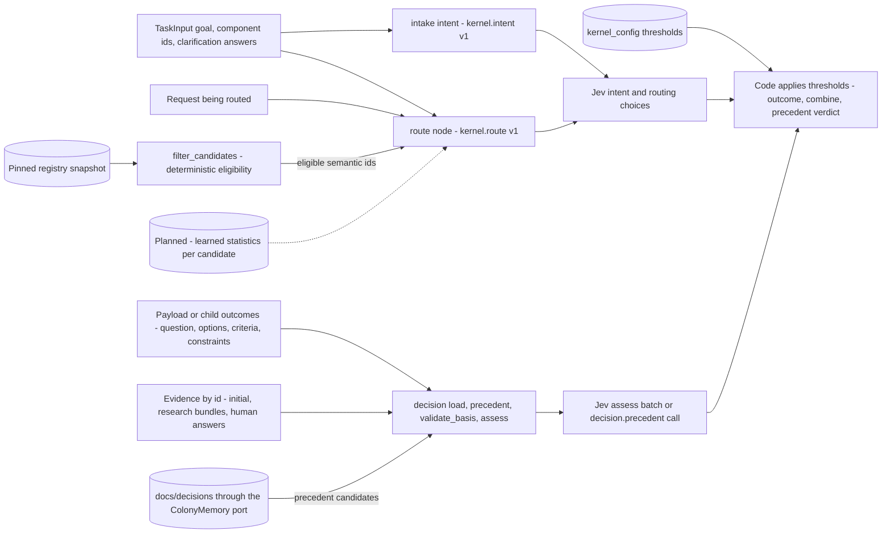

# Decision Kernel Context — The Intent, Routing and Decision Jev Calls

Jev answers typed questions about a supplied state. It never invents options, criteria or
questions (ADR-053 §2). So everything Jev knows in a call is exactly what kernel code puts into
the state and the question templates. This page lists that content for the Jev consumers in the
request flow. The research capability's Jev calls are on the
[research page](c3-018-decision-kernel-context-research.md).

Parent: [Decision Kernel and Colony Memory — Design Map](c2-007-decision-kernel-flows-overview.md)

See also: [Context map](c3-016-decision-kernel-context-map.md) and
[Learning loop](c3-020-decision-kernel-flows-learning-loop.md) (how precedent records come to exist).

## Intake intent Jev call

**When.** On the first `route` pass, only when the root's contract is still open: no
`requested_output_schema` and no typed `input_payload` (either makes the intent `explicit`). A
classified root with exactly one eligible candidate is then selected without the routing question
(reason `intent_bound`). Source: design part 3, As built (intake intent).

| Context piece | Exact source | Assembled by | Available from |
|---|---|---|---|
| Effective goal | `TaskInput.goal`; after a clarification, the human's answer first, then the original request | `kernel/intent/classify.py` (`build_batch`) | V0 |
| Component ids | `TaskInput.scope.component_ids` | Same | V0 |
| Clarifications | Answers to the intent clarification question, at most `intent.max_clarifications` (2) | Same | V0 |
| Choices | `decision`, `evidence`, `ideas`, `change`, `out_of_domain` and `__NEEDS_CONTEXT__`, each with a one-line criterion | Template `kernel.intent`, version 1 | V0 |
| Thresholds (kept away from Jev) | `intent.min_selected_probability` 0.7, `min_confidence` 0.5 | Code | V0 |

`change` is declined (`out_of_scope_write`) and `out_of_domain` is declined and recorded as a gap.

## Routing Jev call

**When Jev is called at all.** Only for items that need semantic routing: a request of kind
`capability` (the root goal and free-form requests) or a request with more than one eligible
candidate, unless `intent_bound` applies. All other items bind deterministically: a
`research_request.v1` child binds to `research`, retrieval children bind by `operation` (design
parts 2 and 3). One batched call covers all such items in a superstep.

| Context piece | Exact source | Assembled by | Available from |
|---|---|---|---|
| Task goal | `TaskInput.goal`. The skill writes the user's words verbatim; `Task.original_goal` is never rewritten | `intake`, then the routing template | V0 |
| Component ids | `TaskInput.scope.component_ids`, validated against `docs/components.json` | `intake`, routing template | V0 |
| The request being routed | The root `Request` or a child request a capability proposed. Code: `kind, goal, question, payload_schema, payload_keys, clarifications`, batched under `requests.<work_item_id>`. Design part 4 still shows `request: {kind, goal, question, payload_summary}` (OP-01) | Routing template (`kernel/scheduler/routing.py`) | V0 |
| Choices | The `description` of each eligible descriptor with `routing: semantic` in `config/capability_registry.json`, taken from the snapshot pinned at intake ("the trusted Jev routing criterion text", at most 400 characters). V0 semantic entries: `decision`, `research` | `filter_candidates`, then the routing template | V0 |
| Sentinel choices | `__NONE__` (becomes `no_match`) and `__NEEDS_CONTEXT__` (becomes `insufficient_context`) | Template `kernel.route`, version 1 | V0 |
| Clarifications | Human answers to an earlier `insufficient_context` clarification | `route` node (`RouteEntry.clarifications`) | V0 |
| Learned statistics per candidate. ILLUSTRATIVE: success for similar requests, average cost, average latency | Derived aggregates through the `ColonyMemory` port's planned graph backend ([ADR-065](../adrs/ADR-065-colony-learned-statistics-neo4j-aggregates.md)), scoped by capability, task_type, component, repository and policy_version | Not designed | Later: INFLUENCE ROUTING, only after calibration and held-out evaluation (ADR-056 §9). OP-03 |

**Kept away from Jev.**

| Input | Source | Used by | Available from |
|---|---|---|---|
| Eligibility: 10 ordered exclusion checks with reason codes (disabled, unavailable, binding missing, kind, payload schema, output schema, scope, permission, side effect, budget) | Registry snapshot, `BindingTable`, run permissions, budgets, configuration | `filter_candidates` (`kernel/registry/eligibility.py`) | V0 |
| Thresholds: `min_selected_probability` 0.8, `min_confidence` 0.5, `on_insufficient_context` "human" | `config/kernel_config.default.json` → `routing` | `route` | V0 |
| Secret masking of the state | `kernel/observability/redaction.py` | Before sending | V0 |

Never offered: `fixed` descriptors, legacy registry entries (ADR-055), raw Langfuse data (ADR-056
§8) and precedent: a decision record never reaches the routing call or changes a routing score
([ADR-060](../adrs/ADR-060-source-of-truth-and-approval-authority.md) §4). Statistics MUST NOT
override the eligibility exclusions (ADR-057 §5).

## Decision Jev calls

The decision graph is `load`, `precedent`, `validate_basis`, `assess`, `combine`, `emit`.
`precedent` looks up earlier approved decisions once. With no options yet it judges them in one
`decision.precedent` call; otherwise their questions ride the single `assess` batch. `assess`
runs only when options exist and every criterion is approved (design part 4).

| Context piece | Exact source | Assembled by | Available from |
|---|---|---|---|
| Question | `decision_request.v1.question` in the caller's `input_payload`, or the root goal | Decision `load` | V0 |
| Options | The caller's payload, options named in the goal, `options.v1` from `host.generate_options` (`proposal_status=proposed`), or options a human added at approval | `load`, from the payload or from child outcomes | V0 |
| Criteria | The caller's payload, or criteria an LLM proposed and a human approved or edited (`approval_status=approved`, `approved_by` set). Unapproved proposals never reach `assess` | `load`, `validate_basis` | V0 (edits: OP-04) |
| Evidence excerpts | Resolved by id through `ctx.evidence(ids)`: `TaskInput.initial_evidence` (`task_context`), research bundles (`host.research` evidence is `host_reported`), human answers (`human_input`), precedent evidence (below) | `load` via `ExecutionContext` | V0 |
| Findings | Synthesis findings kept in the continuation | `assess` state | V0 |
| Constraints | `TaskInput.constraints`, each with origin and severity, quoted first in the `constraints` state | `load` | V0 |
| **Precedent candidates** | Earlier human-approved records from `docs/decisions/`, found through `ctx.memory.find_decisions` (file backend over `index.json`): question, scope component ids, roadmap phase from constraints; at most `memory.max_precedents` (3). Each is quoted as one text of at most 900 characters under `precedents.<dec-id>` (question, chosen option, type, context, rationale, approver and date, supersession, corrections) | `precedent` node (`kernel/memory/precedent.py`) | V0, decision store (PR #978); [ADR-059](../adrs/ADR-059-decision-store-reviewable-yaml-records-now-graph-later.md) §5 |
| **Precedent evidence** | Each precedent Jev judged applicable (`memory.applies_threshold` 0.5) becomes a `prior_decisions` evidence item: source `memory.decisions`, locator = record path, title with approver and date, excerpt of at most 2000 characters, no `provenance.actor` | `precedent` node, then every later assessment | V0, decision store |
| Questions | `kind.<crit>`, `sufficient.<crit>`, `satisfies.<crit>.<opt>`, `missing` (the missing-knowledge list plus `none`), `preference`, `conflict`, and `precedent.<dec-id>` per candidate. Each template has an id and a version | `assess`; `precedent` | V0 |
| Thresholds (kept away from Jev) | `decision.*`: sufficiency 0.8, satisfies 0.8, preference 0.7, conflict 0.7, missing 0.4, design judgement 0.7. `memory.*`: applies 0.5, reuse 0.8 | `combine` and the precedent verdict (pure code) | V0 |
| Prior decisions and ADRs from research | Category `prior_decisions` from `repo.decisions` (`docs/architecture/adrs`), `knowledge.decisions` (surface `adrs`), `repo.analysis`, `repo.components`, `repo.roadmap`, `repo.tickets`. `docs/decisions/` is not a research source (OP-31) | Research and retrieval | V0. Research reused as decision knowledge: Stage 4 (spec §19.1) |
| Component policies (decision rules) | A policy catalog whose storage is undecided (ADR-054 open question 2) | Not designed | Stage 3 (spec §18.4). OP-07 |
| Glossary-aware terms and component descriptors | `docs/glossary.md` as canonical terminology, the component directory | Context compiler | Stage 2 (spec §17.1). OP-05 |
| Calibration per decision type | Decision outcomes in the learned statistics (ADR-065). The sources say calibration is read against the decision basis and thresholds; they do not say it enters Jev's state | Learning evaluator | ANALYZE (Stage 4). Automatic threshold changes: ADR-056 open question 6 |

A precedent is evidence, never authority. It does not stand in for option-grounding research, and
a strongly applicable one only produces a reuse-or-decide-anew question to the current human
(ADR-060 §4). A low-calibration decision type is first read as a weak decision basis, not as a
Jev fault (ADR-056 §4).

Open points for this page: OP-01, OP-03, OP-04, OP-05, OP-07, OP-31 in [open points](c3-022-decision-kernel-flows-open-points.md).

## Legend

| Element | Meaning |
|---|---|
| Solid arrow | A context path live on main |
| Dotted arrow | A planned context path |
| Cylinder | Stored data |
| "Kept away from Jev" | Inputs code uses to decide whether Jev is asked, or what its answer means |

## Cross-Links

- Parent: [Design Map](c2-007-decision-kernel-flows-overview.md)
- Sibling pages: [Context map](c3-016-decision-kernel-context-map.md), [Research](c3-018-decision-kernel-context-research.md)
- Templates and thresholds: [design part 4](../../analysis/2026-09-30-decision-kernel-design-4-jev-and-capabilities.md),
  [design part 2](../../analysis/2026-09-30-decision-kernel-design-2-contracts-registry-config.md)
- Intake intent: [design part 3](../../analysis/2026-09-30-decision-kernel-design-3-kernel-scheduler.md)
- Precedent and statistics: [Colony Memory](../components/colony-memory.md),
  [ADR-059](../adrs/ADR-059-decision-store-reviewable-yaml-records-now-graph-later.md),
  [ADR-065](../adrs/ADR-065-colony-learned-statistics-neo4j-aggregates.md)
