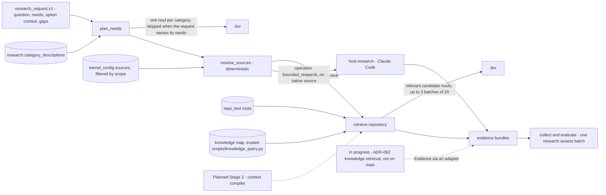

# Decision Kernel Context — The Research Capability and Repository Retrieval

The research graph is domain-agnostic. Evidence categories are stable, and source bindings carry
the specifics (spec §10.2). Task names such as "LangGraph" live in request data and source
metadata, never in the graph. This page shows which repository files and knowledge surfaces feed
each category on main, and what is planned.

Parent: [Decision Kernel and Colony Memory — Design Map](c2-007-decision-kernel-flows-overview.md)

See also: [Context map](c3-016-decision-kernel-context-map.md) and
[Request Flow 1](c3-013-decision-kernel-flows-request-native.md).

## Research graph inputs

The graph is `plan` (`plan_needs`, `resolve_sources`), `collect`, `evaluate`, `finish`.

| Context piece | Exact source | Assembled by | Available from |
|---|---|---|---|
| Question and needs | `research_request.v1`, usually from the decision capability, which names exactly the categories it misses (`evidence_needs_only`). Then `plan_needs` makes no Jev call. A decision with no options and no evidence first asks for `task_context`, `existing_patterns` and `prior_decisions` (`ground:options`) | `plan_needs` | V0 |
| Category descriptions for the need questions | `research.category_descriptions` (6 entries, no vendor names), used only when research plans its own needs | `plan_needs` | V0 |
| Need thresholds (code) | `research.need_required_threshold` 0.8, `need_supporting_threshold` 0.5 | `plan_needs` | V0 |
| Source catalog | `config/kernel_config.default.json` → `sources`, filtered by `scope.source_ids`, `read_roots`, `technologies` and availability | `resolve_sources` | V0 |
| Option context, criteria context, gaps | From the decision: the paths an option cites become explicit locators; criteria questions and option titles become query hints; synthesis gaps and a human-added option's claims become targeted needs (`need.gap.N`, `need.claim.<option>`, at most `research.max_targeted_needs` 2) | `plan` (`targeting.py`) | V0 (V0.1) |
| Jev reserve | `jev_reserve`: calls the decision keeps for its final assessment; research trims its plan to fit | `plan` | V0 (V0.1) |
| Judgement batch | One `research.assess` batch: `conflict`, `evaluable` (threshold 0.7) and one `answers.<need>` per need retrieval called satisfied (`research.answer_threshold` 0.7) | `collect`, `evaluate` | V0 |
| Synthesis | `research.allow_synthesis` true: the host synthesizes when a need is partial, open or unanswered, or `evaluable` is low, if a work item is left | `evaluate` | V0 |

## Sources per evidence category (defaults on main)

| Source id, kind | Categories | Exact roots or surfaces |
|---|---|---|
| `repo.principles`, repo_text | internal_principles, authoritative_guidance | `CLAUDE.md`, `docs/conventions`, `docs/vision.md` |
| `repo.decisions`, repo_text | prior_decisions | `docs/architecture/adrs` |
| `knowledge.decisions`, knowledge_map | prior_decisions | Surface `adrs` |
| `repo.patterns`, repo_text | existing_patterns | `kernel`, `scripts`, `docs/architecture` |
| `repo.docs`, repo_text | internal_principles, task_context, existing_patterns, authoritative_guidance | `README.md`, `docs/how-to`, `docs/explanation`, `docs/reference`, `docs/testing`, `docs/workflows`, `docs/known-issues`, `docs/INDEX.md`, `docs/glossary.md`, `docs/ticket-lifecycle.md`, `docs/build-pipeline.md` |
| `repo.analysis`, repo_text | task_context, prior_decisions, existing_patterns | `docs/analysis` |
| `repo.components`, repo_text | task_context, existing_patterns, prior_decisions | `docs/architecture/components` |
| `repo.acceptance_criteria`, repo_text | task_context, existing_patterns | `docs/acceptance-criteria` |
| `repo.roadmap`, repo_text | task_context, prior_decisions | `docs/roadmap.json`, `docs/roadmap.md`, `docs/vision.md` |
| `repo.registries`, repo_text | task_context, existing_patterns | `docs/components.json`, `docs/build-dataflow.json` |
| `repo.tickets`, repo_text | task_context, prior_decisions | `tickets` |
| `repo.config`, repo_text | task_context, existing_patterns | `config`, with per-source deny globs for secrets |
| `repo.tests`, repo_text | task_context, existing_patterns, internal_principles | `tests/README.md`, `unit_tests/README.md`, `pytest.ini` |
| `knowledge.components`, knowledge_map | existing_patterns, task_context | Surfaces `components`, `skills` (`config/skill_registry.json`), `agents` (`config/agent_registry.json`). Reading the legacy registries conflicts with the wording of ADR-055 §2 (OP-11) |
| `host.research`, host_research | authoritative_guidance, external_practices | No native source. Claude Code researches supplied artifacts, allowed repository paths and web sources; its evidence is `host_reported` |

- **Glossary.** `docs/glossary.md` is read as plain text through `repo.docs`. The knowledge-map
  `glossary` surface is unused, and glossary-aware context is Stage 2 (OP-05).
- **Decision records.** `docs/decisions/` is not a research source. Approved decisions reach a
  decision only as precedent through the `ColonyMemory` port
  ([Jev calls](c3-017-decision-kernel-context-jev.md); OP-31).
- `task_context` also arrives without retrieval: `TaskInput.initial_evidence` and human answers
  enter the run as `task_context` evidence (design parts 3 and 4).

## How `retrieve.repository` builds evidence

| Step | Exact source or rule | Code | Available from |
|---|---|---|---|
| Query terms | Goal first (up to three quarters of `retrieval.max_query_terms`, 48), then the other hints, then the need's wording; lowercase tokens of 3 or more characters, minus stopwords | `terms.py` | V0 |
| Explicit locators | `path`, `path#Lx-Ly`, `path#heading`, `path::Symbol`, at most `retrieval.max_explicit_locators` (12), fetched first under the same read policy | `locators.py` | V0 (V0.1) |
| File walk and sections | Allowlisted roots under `scope.repository_root`; skips `retrieval.deny_globs` (`.env*`, `*.pem`, `*.key`, `.security-allowlist`, `.git`) and files above `max_file_bytes`; Markdown split by heading, code by top-level definition | `repository.py`, `access.py`, `chunking.py` | V0 |
| Pre-filter | A BM25-style score (`bm25_k1` 2.0, `bm25_b` 0.5) plus path and identifier matches; a pool of at most `retrieval.max_candidates` (60) with a fair share per source. A review of the asking run is demoted | `scoring.py`, `pool.py`, `entities.py` | V0 (V0.1) |
| Knowledge-map nodes | `build_knowledge_map` over the `config/paths.json` surfaces, loaded only from the kernel's own installation and cached. A load failure makes the source unavailable, never "no results" | `knowledge_map.py` | V0 |
| Rerank | Batches of `retrieval.rerank_max_per_need` (20) `relevant.<candidate>` nouls, up to `rerank_max_batches` (3) while the need lacks enough on-topic evidence; keeps p ≥ 0.5 and at most `top_k` (6). Explicit locators are kept without judging | `rerank.py` | V0 |
| Coverage | `satisfied` only with `satisfied_min_items` (2) items at ≥ 0.7 or one at ≥ 0.85; weaker items stay as context and leave the need `partial` | `rerank.py` | V0 |
| Excerpt | ±12 lines around hits, at most 2000 characters, with a `truncated` flag | `repository.py`, `evidence_build.py` | V0 |
| Source version | Read-only `git rev-parse HEAD` and `git status --porcelain` (`GIT_OPTIONAL_LOCKS=0`), cached per run | `versioning.py` | V0 |
| Provenance | Strategy, terms, rank, relevance; `content_hash = sha256(excerpt)` | `evidence_build.py` | V0 |

Excerpt text is evidence, not instructions. It enters Jev state only as quoted values
(design part 4). An unavailable source stays visible in `unavailable_sources`, and conflicts stay
as recorded contradictions (spec §10.3, §10.5).

## What is planned

**Stage 2 (spec §17, roadmap `phase_kernel_2_knowledge`).**

| Addition | Source |
|---|---|
| Glossary terms as canonical terminology and compact component descriptors, selected before deeper retrieval | §17.1 |
| Progressive disclosure over a knowledge graph: overview, modules, signatures, docstrings, callers and tests, then source excerpts. Jev judges when the resolution is enough; code controls retrieval and budgets | §17.2 |
| Hybrid search behind one information-need interface: exact lookup, grep, structural, graph, BM25, embeddings, Jev reranking | §17.3 |
| Read location versus write location | §17.4 |
| An immutable, versioned `ContextBundle` with role-specific views, and reusable search memory revalidated against versions | §17.5 |

Stage 2's exit condition: the kernel supplies a compact evidence package before a reasoning or
coding model is called. The V0.1 lexical pre-filter is not that hybrid search: the round F
benchmark in design part 4 lists what a lexical score does not reach.

**ADR-062, "Standalone Knowledge Retrieval over Immutable Git Projections" (in progress, not yet
on main).** Accepted on branch `feature/knowledge-retrieval-v01`. A separate retrieval package
over immutable Neo4j generations projected from Git, with registered bounded queries and optional
embeddings. The composition root injects its port into the capability mechanism and an adapter
converts results into the kernel's `Evidence` and `SourceVersion` contracts. It would be a further
research context source. It introduces no decision or lesson store of its own; whether learned
statistics share its Neo4j database is an ADR-065 open question.

Open points for this page: OP-05, OP-06, OP-11, OP-31 in [open points](c3-022-decision-kernel-flows-open-points.md).

## Legend

| Element | Meaning |
|---|---|
| Solid arrow | A path live on main |
| Dotted arrow | A planned or in-progress path |
| Cylinder | Configuration or repository data read by the adapter |

## Cross-Links

- [Pre-intent enrichment and evals](../../how-to/supply-and-evaluate-kernel-context.md): native
  research Jev batches receive the saved bounded context; caller conversation and observations
  also extend query hints, with recent entries first.
- Parent: [Design Map](c2-007-decision-kernel-flows-overview.md)
- Sibling pages: [Context map](c3-016-decision-kernel-context-map.md), [Jev calls](c3-017-decision-kernel-context-jev.md)
- The knowledge map it reads: [Knowledge System](../components/knowledge-system.md)
- Adapter design and as-built notes: [design part 4](../../analysis/2026-09-30-decision-kernel-design-4-jev-and-capabilities.md)
