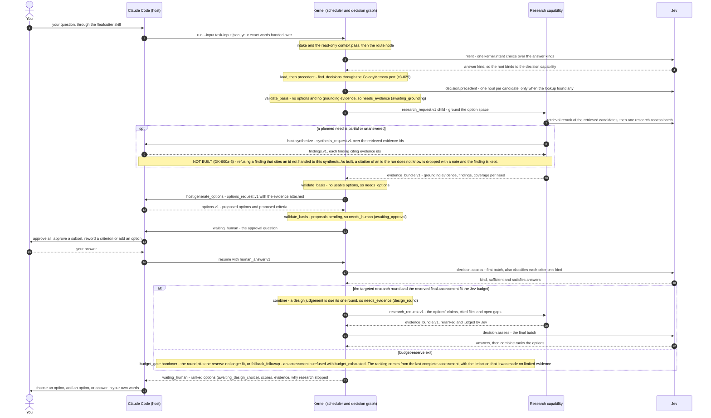

# Decision Forming Round — From Your Question to the Ranked Options

This page shows one forming round as the code on main runs it. It starts with the question you
give Claude Code and ends when the kernel hands back the options, ranked, for you to choose from.
It covers DK-600a-1 to DK-600a-4.

[Request Flow 1](c3-013-decision-kernel-flows-request-native.md) and
[Request Flow 2](c3-014-decision-kernel-flows-request-handoff.md) already draw the machinery
underneath: the CLI, `RunService`, the scheduler, routing, the retrieval workers, and every
handoff and resume. This page does not redraw those messages. It folds them into one **Kernel**
participant and shows the order in which a decision gathers what it needs.

**Status: built on main**, except for one check marked "not built" below (DK-600a-3).

The order follows the decision graph in `kernel/capabilities/decision/executor.py`: `load`,
`precedent`, `validate_basis`, `assess`, `combine`, `emit`. Each pause ends the graph run with
a child request. When the child finishes, the graph runs again from `load`. `validate_basis`
asks for what is missing in a fixed order: approval of pending proposals, grounding research,
options, then criteria (`kernel/capabilities/decision/basis.py`).

Parent: [Decision Kernel and Colony Memory — Design Map](c2-007-decision-kernel-flows-overview.md)

See also: [Decision states](c3-025-decision-kernel-flows-decision-states.md) (what your answers
do next), [Precedent and reuse](c3-029-decision-kernel-flows-precedent-reuse.md) (the precedent
step in full) and [Record staging](c3-026-decision-kernel-flows-record-staging.md) (what happens
after you choose).

## Notes per step

Step numbers are the diagram's message numbers.

| Step | What the code does | Where |
|---|---|---|
| 1–2 | The skill writes your goal into a JSON file and runs `run --input`. The goal is never put into a shell command | `kernel/adapters/claude_code/SKILL.md` |
| 3–4 | A bare goal has no output contract, so the route node asks Jev one `kernel.intent` choice over `decision`, `evidence`, `ideas`, `change` and `out_of_domain`. A typed `decision_request.v1` skips this step. An unclear intent can become a clarification question to you | `kernel/intent/step.py` (`resolve_intent`) |
| 5 | `precedent` runs once per decision. With no options yet, Jev judges every candidate in one `decision.precedent` call. A strong match can stop the round here with the reuse question ([c3-029](c3-029-decision-kernel-flows-precedent-reuse.md)) | `kernel/capabilities/decision/executor.py` (`_precedent`) |
| 6–7 | Grounding comes first, because the host that proposes options cannot read the repository. Research plans the needs, the scheduler runs the `retrieve.repository` children, and each child reranks its candidates with Jev (drawn in full in [c3-013](c3-013-decision-kernel-flows-request-native.md)) | `kernel/capabilities/decision/basis.py` (`needs_grounding`) |
| 8–9 | Research asks the host to synthesize only when a planned need is partial, open or unanswered, or no need is satisfied, and only while the work-item budget allows | `kernel/capabilities/research/results.py` |
| 11–12 | Claude Code proposes options and criteria. They stay `proposed` until you approve them | `kernel/capabilities/host/generate_options.py` |
| 13–16 | Your answer is checked by `resume` before the graph moves ([c3-014](c3-014-decision-kernel-flows-request-handoff.md)). Free text alone approves nothing | `kernel/capabilities/decision/approvals.py` (`_apply_approval`) |
| 17–18 | The first assessment also asks Jev which criteria are design judgements (`kind.<criterion>`) | `kernel/capabilities/decision/design_ending.py` (`apply_kinds`) |
| 19–22 | One targeted research round looks at what the approved options claim. Then the final assessment runs, and `combine` ranks the options because a design judgement cannot be settled by evidence | `kernel/capabilities/decision/combine.py` (`_design_research`, `_hand_to_human`) |
| 23–24 | The ranked question names each option's rank, its per-criterion reading and the evidence it cites | `kernel/capabilities/decision/design_ending.py` (`design_followup`) |

**The budget-reserve exit.** The kernel keeps enough Jev calls in reserve for one final
assessment (`reserve_for`). `handover` runs after `combine`. If the next research round plus that
reserve no longer fit, it hands you the ranked question at once, with reason `budget_reserve`.
`fallback_followup` runs when an assessment is refused with `budget_exhausted`. It builds the
ranking from the last complete assessment, and only when that assessment scored every option and
criterion. Otherwise the stop stands. Both add the limitation "ranking made on limited evidence
because the Jev call budget (limits.max_jev_calls) was reached".

**Not drawn here.** Other assessment endings are not drawn: more research, a synthesis, a tie, a
conflict or an unsettled preference. Each becomes another child request or a direct question to
you ([Capability lifecycle](c3-015-decision-kernel-flows-capability-lifecycle.md)). The forming
flow's split steps (DK-400) and criteria-reuse steps (DK-500) are not built on main and are left out.

## Legend

| Element | Meaning |
|---|---|
| `actor` | You, the person who asks and answers |
| `participant` | A part of the system that takes part in the round |
| Solid arrow | A call, a request or a question |
| Dashed arrow | An answer or a returned result |
| `autonumber` | The message numbers used in "Notes per step" |
| `Note` | What the kernel decides between two messages, or a part marked NOT BUILT |
| `opt` block | A step that runs only when its condition holds |
| `alt` block | Mutually exclusive branches: the normal path and the budget-reserve exit |

## Cross-Links

- Parent: [Decision Kernel and Colony Memory — Design Map](c2-007-decision-kernel-flows-overview.md)
- Containers: [Decision Kernel — Container Overview](../components/decision-kernel.md)
- Machinery underneath: [Request Flow 1](c3-013-decision-kernel-flows-request-native.md),
  [Request Flow 2](c3-014-decision-kernel-flows-request-handoff.md)
- What Jev receives at each call: [Context: Jev calls](c3-017-decision-kernel-context-jev.md)
- Siblings: [Decision states](c3-025-decision-kernel-flows-decision-states.md),
  [Precedent and reuse](c3-029-decision-kernel-flows-precedent-reuse.md)
- Product truth: [decision-forming flow](../../product-truth/flows/leafcutter/decision-forming.flow.json)
- Running it: [How to run the decision kernel](../../how-to/run-the-decision-kernel.md)

<!--
====================================================================
DECISION HISTORY
====================================================================
- 2026-10-10 [architecture-diagram-author, TICKET-20261010-DecisionLifecycleDocs]:
  Initial creation (DK-600a-5). Scaffold-free pass authorised by the user in
  decision dec-b10271ebb40b9eaa (approved 2026-10-10, the standing pass for
  every blocked diagram until a scaffold exists). The scaffold
  scripts/scaffold/new_arch_doc.py that write-c4-diagram step 4 requires is
  missing from this repository, so the frontmatter and the Legend were
  authored by hand under that authorisation. The frontmatter takes the shape
  of the sibling L3 sequence diagram c3-014. The Legend has one entry per
  notation element used here. No skill text was edited. DK-600a-3 (finding
  citation check) is drawn as not built: it is on branch fast-lane/dk-600a-3,
  not merged to main on 2026-10-10.
====================================================================
-->
